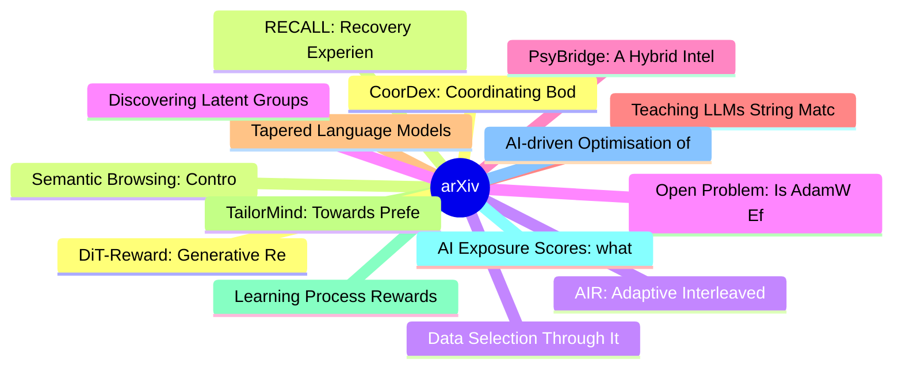

# arXiv 每日最新论文 (2026-06-23)

## 思维导图

## 列表（20 条）

### 1. CoorDex: Coordinating Body and Hand Priors for Continuous Dexterous Humanoid Loco-Manipulation
- **作者**: Sikai Li
- **日期**: 2026-06-22
- **链接**: [http://arxiv.org/abs/2606.23680v1](http://arxiv.org/abs/2606.23680v1)
- **摘要**: Humanoid loco-manipulation is often simplified into a stop-and-go process: walking to an object, stopping to manipulate it, and then resuming locomotion. It also commonly relies on low degree-of-freedom (DoF) end effectors that behave like an open-close grasp primitive. We introduce CoorDex, a learn...

### 2. Semantic Browsing: Controllable Diversity for Image Generation
- **作者**: Sara Dorfman
- **日期**: 2026-06-22
- **链接**: [http://arxiv.org/abs/2606.23679v1](http://arxiv.org/abs/2606.23679v1)
- **摘要**: Modern text-to-image models excel in visual fidelity and prompt adherence. However, this strict adherence comes at the cost of diversity: generated samples tend to collapse into a single visual interpretation. Existing methods to improve diversity produce outputs driven by incidental variations rath...

### 3. AIR: Adaptive Interleaved Reasoning with Code in MLLMs
- **作者**: Cong Han
- **日期**: 2026-06-22
- **链接**: [http://arxiv.org/abs/2606.23678v1](http://arxiv.org/abs/2606.23678v1)
- **摘要**: Following the paradigm shift initiated by OpenAI o3, interleaved reasoning with code to enhance multimodal large language models (MLLMs) has become a pivotal research frontier. The existing literature focuses primarily on tool-use within vision-perception tasks. However, such approaches typically re...

### 4. Open Problem: Is AdamW Effective Under Heavy-Tailed Noise?
- **作者**: Dingzhi Yu
- **日期**: 2026-06-22
- **链接**: [http://arxiv.org/abs/2606.23676v1](http://arxiv.org/abs/2606.23676v1)
- **摘要**: AdamW is the de facto optimizer for training large language models (LLMs), yet the theory behind it still lives mostly in finite-variance regimes. This is increasingly unsatisfying, as empirical evidence indicates that stochastic gradient noise in LLM pretraining is typically heavy-tailed. Recent wo...

### 5. PsyBridge: A Hybrid Intelligent Framework for Multi-Dimensional Mental Health Assessment and Decision Support
- **作者**: Sunil Wanjari
- **日期**: 2026-06-22
- **链接**: [http://arxiv.org/abs/2606.23673v1](http://arxiv.org/abs/2606.23673v1)
- **摘要**: Mental health assessment commonly relies on isolated screening instruments or data-driven models that often lack interpretability and multi-dimensional integration. Existing approaches frequently focus on individual indicators such as depression or anxiety while providing limited support for compreh...

### 6. Teaching LLMs String Matching, Backtracking, and Error Recovery to Deduce Bases and Truth Tables for the Combinatorially Exploding Bit Manipulation Puzzles
- **作者**: Prateek Agnihotri
- **日期**: 2026-06-22
- **链接**: [http://arxiv.org/abs/2606.23672v1](http://arxiv.org/abs/2606.23672v1)
- **摘要**: This paper presents our algorithmic innovations for the NVIDIA Nemotron Model Reasoning Challenge, focusing on Bit Manipulation Puzzles. In this task, the objective is to discover a hidden logical rule transforming input binary strings to outputs, then apply it to unseen inputs. Large Language Model...

### 7. Tapered Language Models
- **作者**: Reza Bayat
- **日期**: 2026-06-22
- **链接**: [http://arxiv.org/abs/2606.23670v1](http://arxiv.org/abs/2606.23670v1)
- **摘要**: Modern language models, including transformer, recurrent, and memory-based variants, share a common chassis: a stack of identical layers in which parameters are allocated uniformly across depth. This is a default inherited from the original transformer and largely unchanged since, yet a growing body...

### 8. TailorMind: Towards Preference-Aligned Multimodal Content Generation
- **作者**: Hengji Zhou
- **日期**: 2026-06-22
- **链接**: [http://arxiv.org/abs/2606.23643v1](http://arxiv.org/abs/2606.23643v1)
- **摘要**: Personalized content systems depend on available UGC and struggle when suitable content is absent, delayed, or costly to create. Although multimodal generators can synthesize content on demand, how to translate behavioral traces into generation-ready preferences remains underexplored. We study perso...

### 9. Learning Process Rewards via Success Visitation Matching for Efficient RL
- **作者**: Raymond Tsao
- **日期**: 2026-06-22
- **链接**: [http://arxiv.org/abs/2606.23640v1](http://arxiv.org/abs/2606.23640v1)
- **摘要**: In many modern applications of reinforcement learning (RL), the natural reward for a task of interest is inherently sparse: a reward of 0 is given everywhere except when the task is completed, when a reward of +1 is given. Training a policy to maximize such a sparse reward requires solving a challen...

### 10. AI Exposure Scores: what they measure, what they miss, and what comes next
- **作者**: Campbell Lund
- **日期**: 2026-06-22
- **链接**: [http://arxiv.org/abs/2606.23633v1](http://arxiv.org/abs/2606.23633v1)
- **摘要**: A set of exposure scores calculated in 2023 has become a central empirical input to the future of work debate. Produced by Eloundou et al. (2023) and referred to here as the GPTs are GPTs scores, they define exposure as the share of occupational tasks a large language model can assist with. This wor...

### 11. AI-driven Optimisation of Quality of Recovery (QoR) in Remote Patient Monitoring
- **作者**: Yansong Liu
- **日期**: 2026-06-22
- **链接**: [http://arxiv.org/abs/2606.23631v1](http://arxiv.org/abs/2606.23631v1)
- **摘要**: Remote patient monitoring depends on patient-reported data to capture the subjective dimension of recovery that devices cannot measure. The Quality of Recovery (QoR-15) survey is the gold-standard instrument for this purpose. It was designed and validated for occasional in-hospital assessment, yet r...

### 12. DiT-Reward: Generative Representations for Text-to-Image Reward Modeling
- **作者**: Yuanming Yang
- **日期**: 2026-06-22
- **链接**: [http://arxiv.org/abs/2606.23626v1](http://arxiv.org/abs/2606.23626v1)
- **摘要**: Can representations learned for image generation also support the evaluation of generated images? We study text-to-image reward prediction as a downstream task of generative representation learning. To this end, we introduce DiT-Reward, which converts a pretrained text-to-image Diffusion Transformer...

### 13. RECALL: Recovery Experience Collection for Active Lifelong Learning in Vision-Language-Action Models
- **作者**: Ulas Berk Karli
- **日期**: 2026-06-22
- **链接**: [http://arxiv.org/abs/2606.23617v1](http://arxiv.org/abs/2606.23617v1)
- **摘要**: Vision-Language-Action (VLA) models are commonly fine-tuned through passive imitation learning, where additional demonstrations are collected for tasks where the policy performs poorly. This approach incurs several downsides: it requires the robot to fail before data collection is triggered, provide...

### 14. Data Selection Through Iterative Self-Filtering for Vision-Language Settings
- **作者**: Andrei Liviu Nicolicioiu
- **日期**: 2026-06-22
- **链接**: [http://arxiv.org/abs/2606.23611v1](http://arxiv.org/abs/2606.23611v1)
- **摘要**: The availability of large amounts of clean data is paramount to training neural networks. However, at large scales, manual oversight is impractical, resulting in sizeable datasets that can be very noisy. Attempts to mitigate this obstacle to producing performant vision-language models have so far in...

### 15. Discovering Latent Groups for Robust Classification
- **作者**: Ankur Garg
- **日期**: 2026-06-22
- **链接**: [http://arxiv.org/abs/2606.23609v1](http://arxiv.org/abs/2606.23609v1)
- **摘要**: Machine learning models exploit spurious correlations, achieving high average accuracy but failing disproportionately on underrepresented subgroups. Existing methods address this by adjusting network parameters, guided either by subgroup annotations or inferred pseudo-group labels. Yet at inference,...

### 16. Causal Discovery in the Era of Agents
- **作者**: Yujia Zheng
- **日期**: 2026-06-22
- **链接**: [http://arxiv.org/abs/2606.23608v1](http://arxiv.org/abs/2606.23608v1)
- **摘要**: Recent attempts to combine large language models (LLMs) with causal discovery ask models to infer pairwise directions, propose graph structures, or inject language-model outputs as priors and constraints. These approaches promise faster analysis, but they also obscure whether a causal evidence is su...

### 17. Scaling Linear Mode Connectivity and Merging to Billion Parameter Pretrained Transformers
- **作者**: Tianyi Li
- **日期**: 2026-06-22
- **链接**: [http://arxiv.org/abs/2606.23607v1](http://arxiv.org/abs/2606.23607v1)
- **摘要**: Linear mode connectivity (LMC) provides a promising foundation for understanding and merging independently trained neural networks, but existing methods typically optimize the interpolation path from only one model endpoint, limiting their scalability and effectiveness for large pretrained transform...

### 18. Polycepta: Object-Centric Appearance Estimation for Multi-Object Tracking
- **作者**: Mohamed Nagy
- **日期**: 2026-06-22
- **链接**: [http://arxiv.org/abs/2606.23604v1](http://arxiv.org/abs/2606.23604v1)
- **摘要**: The tracking-by-detection paradigm in multi-object tracking (MOT) typically relies on static appearance descriptors to complement motion estimation. However, these descriptors are frame-independent, limiting their robustness as visual cues. Since such descriptors are often obtained from computationa...

### 19. Against Proxy Optimization
- **作者**: Sven Neth
- **日期**: 2026-06-22
- **链接**: [http://arxiv.org/abs/2606.23597v1](http://arxiv.org/abs/2606.23597v1)
- **摘要**: I discuss conditions under which maximizing a proxy utility function is harmful and suggest this poses problems for applying decision theory....

### 20. SPIRAL: Learning to Search and Aggregate
- **作者**: Jubayer Ibn Hamid
- **日期**: 2026-06-22
- **链接**: [http://arxiv.org/abs/2606.23595v1](http://arxiv.org/abs/2606.23595v1)
- **摘要**: Language model reasoning can be substantially improved at test time via scaffolds that scale inference compute across different primitives -- sequential reasoning within a trace, independently sampled parallel traces, and aggregation of multiple reasoning traces into a final response. During post-tr...
