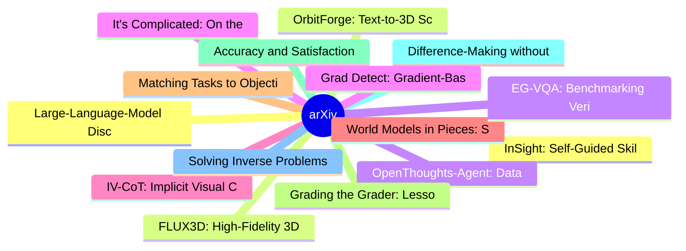

# arXiv 每日最新论文 (2026-06-24)

## 思维导图

## 列表（20 条）

### 1. InSight: Self-Guided Skill Acquisition via Steerable VLAs
- **作者**: Maggie Wang
- **日期**: 2026-06-23
- **链接**: [http://arxiv.org/abs/2606.24884v1](http://arxiv.org/abs/2606.24884v1)
- **摘要**: Vision-language-action (VLA) models can learn manipulation skills from demonstrations, but their capabilities are bounded by the skills in the training data. We present InSight, a framework that unlocks autonomous skill acquisition by rendering VLAs steerable at the primitive-action level (e.g., "mo...

### 2. FLUX3D: High-Fidelity 3D Gaussian Generation with Diffusion-Aligned Sparse Representation
- **作者**: Haorui Ji
- **日期**: 2026-06-23
- **链接**: [http://arxiv.org/abs/2606.24874v1](http://arxiv.org/abs/2606.24874v1)
- **摘要**: Sparse voxel representation has emerged as a scalable foundation for image-to-3D Gaussian Splatting (3DGS) generation, yet current methods struggle to preserve high-frequency visual details of input images due to two structural bottlenecks. First, they adopt discriminative 2D features optimized for ...

### 3. OpenThoughts-Agent: Data Recipes for Agentic Models
- **作者**: Negin Raoof
- **日期**: 2026-06-23
- **链接**: [http://arxiv.org/abs/2606.24855v1](http://arxiv.org/abs/2606.24855v1)
- **摘要**: Agentic language models dramatically expand the applications of AI yet little is publicly known about how to curate training data for broadly capable agents. Existing open efforts such as SWE-Smith, SERA, and Nemotron-Terminal typically target a single benchmark, leaving open the question of how to ...

### 4. It's Complicated: On the Design and Evaluation of AI-Powered AAC Interfaces
- **作者**: Blade Frisch
- **日期**: 2026-06-23
- **链接**: [http://arxiv.org/abs/2606.24854v1](http://arxiv.org/abs/2606.24854v1)
- **摘要**: Artificial intelligence (AI) can enhance what people who use augmentative and alternative communication (AAC) are able to do with their systems. However, evaluating AI-powered AAC interfaces can be difficult. People are intersectional beings and current evaluation metrics can struggle to capture the...

### 5. IV-CoT: Implicit Visual Chain-of-Thought for Structure-Aware Text-to-Image Generation
- **作者**: Zixuan Li
- **日期**: 2026-06-23
- **链接**: [http://arxiv.org/abs/2606.24849v1](http://arxiv.org/abs/2606.24849v1)
- **摘要**: Unified multi-modal large language models (MLLMs) have achieved strong text-to-image generation quality, but still struggle with structure-aware prompt following, where object counts, spatial relations, attribute bindings, and coarse layouts must be preserved. We attribute this limitation in part to...

### 6. World Models in Pieces: Structural Certification for General Agents
- **作者**: Yikai Lu
- **日期**: 2026-06-23
- **链接**: [http://arxiv.org/abs/2606.24842v1](http://arxiv.org/abs/2606.24842v1)
- **摘要**: In the big-world regime, agents cannot be universally capable and their ability is inevitably specialized across a world model in pieces. Consequently, standard uniform guarantees fail to distinguish between the understanding of critical bottlenecks and irrelevant failures. We first formalize this l...

### 7. Matching Tasks to Objectives: Fine-Tuning and Prompt-Tuning Strategies for Encoder-Decoder Pre-trained Language Models
- **作者**: Ahmad Pouramini
- **日期**: 2026-06-23
- **链接**: [http://arxiv.org/abs/2606.24841v1](http://arxiv.org/abs/2606.24841v1)
- **摘要**: Prompt-based learning has emerged as a dominant paradigm in natural language processing. This study explores the impact of diverse pre-training objectives on the performance of encoder-decoder pre-trained language models across generation and question answering tasks, with a focus on commonsense kno...

### 8. Grading the Grader: Lessons from Evaluating an Agentic Data Analysis System
- **作者**: Tian Zheng
- **日期**: 2026-06-23
- **链接**: [http://arxiv.org/abs/2606.24839v1](http://arxiv.org/abs/2606.24839v1)
- **摘要**: Agentic data analysis systems produce rich outputs, including code, numerical results, and verbal diagnostics. This makes them more challenging to evaluate than single-turn LLM responses. It is therefore necessary to distinguish genuine disagreement between an agent's output and a ground-truth answe...

### 9. Accuracy and Satisfaction in Multi-Turn LLM Dialogues for NFR Assessment
- **作者**: Ali Pourghasemi Fatideh
- **日期**: 2026-06-23
- **链接**: [http://arxiv.org/abs/2606.24834v1](http://arxiv.org/abs/2606.24834v1)
- **摘要**: LLM-based dialogue assistants have become mainstream tools for software developers, yet current evaluation benchmarks focus exclusively on functional correctness. This leaves a critical gap in assessing the quality and accuracy of these conversations when handling Non-Functional Requirements (NFRs),...

### 10. Difference-Making without Making a Difference
- **作者**: Sander Beckers
- **日期**: 2026-06-23
- **链接**: [http://arxiv.org/abs/2606.24832v1](http://arxiv.org/abs/2606.24832v1)
- **摘要**: Over a series of seven papers, Andreas & Günther have introduced seven definitions of actual causation and have classified them as belonging to three different, competing, types of accounts: factual difference-making, counterfactual difference-making, and regularity-based. I show that their most rec...

### 11. Solving Inverse Problems of Chaotic Systems with Bidirectional Conditional Flow Matching
- **作者**: Peiyan Hu
- **日期**: 2026-06-23
- **链接**: [http://arxiv.org/abs/2606.24824v1](http://arxiv.org/abs/2606.24824v1)
- **摘要**: Modeling chaotic systems is crucial yet challenging. Inverse problems in chaotic dynamics, namely inferring initial conditions from final states, remain largely unsolved because of ill-posedness, non-uniqueness, instability, and potentially chaotic time-reverse dynamics. We address this open problem...

### 12. Large-Language-Model Discovery of Quantum LDPC Codes through Structured Concept Evolution
- **作者**: Zidu Liu
- **日期**: 2026-06-23
- **链接**: [http://arxiv.org/abs/2606.24808v1](http://arxiv.org/abs/2606.24808v1)
- **摘要**: Quantum computers could outperform classical machines on important problems, but only if the errors that pervade quantum hardware can be corrected at scale. Quantum low-density parity-check (qLDPC) codes offer a promising route to this goal by combining sparse parity checks with finite encoding rate...

### 13. OrbitForge: Text-to-3D Scene Generation via Reconstruction-Anchored Video Synthesis
- **作者**: Chenrui Fan
- **日期**: 2026-06-23
- **链接**: [http://arxiv.org/abs/2606.24799v1](http://arxiv.org/abs/2606.24799v1)
- **摘要**: Generic text-to-video models can be used as rich open-world scene priors. Despite the high quality of today's generated videos, they do not directly yield reliable 3D assets: camera motion is difficult to control, view coverage is partial, and frames often contain inconsistencies across time. We int...

### 14. EG-VQA: Benchmarking Verifiable Video Question Answering with Grounded Temporal Evidence
- **作者**: Linpeng Huang
- **日期**: 2026-06-23
- **链接**: [http://arxiv.org/abs/2606.24797v1](http://arxiv.org/abs/2606.24797v1)
- **摘要**: Recent advances in Video Large Language Models (Video-LLMs) have yielded promising performance on video question answering (VideoQA). Nevertheless, existing benchmarks are predominantly evaluated through answer correctness, while the grounding of predictions in relevant video evidence remains largel...

### 15. Grad Detect: Gradient-Based Hallucination Detection in LLMs
- **作者**: Anand Kamat
- **日期**: 2026-06-23
- **链接**: [http://arxiv.org/abs/2606.24790v1](http://arxiv.org/abs/2606.24790v1)
- **摘要**: Large Language Models (LLMs) have demonstrated remarkable capabilities across diverse tasks, yet they remain prone to generating hallucinations. Detecting these hallucinations is critical for deploying LLMs reliably in high-stakes applications. We present Grad Detect, a gradient-based approach for p...

### 16. Paying to Know: Micro-Transaction Markets for Verified Product Information in Agentic E-Commerce
- **作者**: Filippos Ventirozos
- **日期**: 2026-06-23
- **链接**: [http://arxiv.org/abs/2606.24783v1](http://arxiv.org/abs/2606.24783v1)
- **摘要**: Commercial NLP treats the shopping chatbot as a recommender or a conversion tool: its job is to match a user to a catalogue entry and close a sale. We argue that the arrival of agent-native micro-payment rails (e.g., x402, AP2) changes what is scarce. When the buyer is an autonomous agent that can i...

### 17. Assessing Distribution Shift in Human Activity Recognition for Domain Generalization
- **作者**: Rebecca Adaimi
- **日期**: 2026-06-23
- **链接**: [http://arxiv.org/abs/2606.24781v1](http://arxiv.org/abs/2606.24781v1)
- **摘要**: While the field of Human Activity Recognition (HAR) continues to draw interest from researchers and advance in important ways, some key challenges remain. One of the most difficult aspects of building HAR models that show good performance in real-world settings is dealing with data diversity from de...

### 18. BluTrain: A C++/CUDA Framework for AI Systems
- **作者**: Adhitya Charan
- **日期**: 2026-06-23
- **链接**: [http://arxiv.org/abs/2606.24780v1](http://arxiv.org/abs/2606.24780v1)
- **摘要**: Progress in deep learning is, at scale, more a matter of systems engineering than of modelling: the behaviour of a model in training (its throughput, its memory footprint, and the numerical fidelity of the result) is determined less by the architecture itself than by how that architecture is express...

### 19. DeepBD: A Grounded Agentic Workflow for Variant Prioritization and Diagnosis of Genetic Birth Defects
- **作者**: Shiyu Li
- **日期**: 2026-06-23
- **链接**: [http://arxiv.org/abs/2606.24779v1](http://arxiv.org/abs/2606.24779v1)
- **摘要**: Birth defects are a major cause of fetal loss, neonatal morbidity and long-term disability. In the subset with suspected genetic etiologies, exome and genome sequencing have moved many cases from variant detection to post-sequencing interpretation: clinicians must rank patient-specific candidate var...

### 20. UniDrive: A Unified Vision-Language and Grounding Framework for Interpretable Risk Understanding in Autonomous Driving
- **作者**: Xiaowei Gao
- **日期**: 2026-06-23
- **链接**: [http://arxiv.org/abs/2606.24759v1](http://arxiv.org/abs/2606.24759v1)
- **摘要**: Recent multimodal large language models (MLLMs) have shown strong potential for autonomous driving scene understanding, yet existing methods still face a fundamental trade-off between temporal reasoning and spatial precision. Models that rely on single-frame or low-resolution inputs often miss small...
