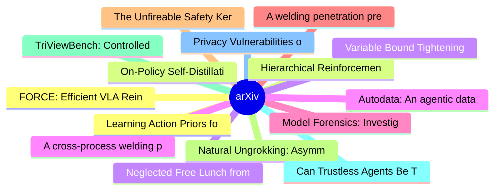

# arXiv 每日最新论文 (2026-06-25)

## 思维导图

## 列表（20 条）

### 1. Learning Action Priors for Cross-embodiment Robot Manipulation
- **作者**: Dong Jing
- **日期**: 2026-06-24
- **链接**: [http://arxiv.org/abs/2606.26095v1](http://arxiv.org/abs/2606.26095v1)
- **摘要**: Most Vision-Language-Action (VLA) models build on a Vision-Language Model (VLM) backbone by attaching an action module and optimizing the full policy jointly. This design inherits strong visual and linguistic priors from the VLM, but leaves the action module to learn physical motion almost from scra...

### 2. On-Policy Self-Distillation with Sampled Demonstrations Reduces Output Diversity
- **作者**: Andrei Liviu Nicolicioiu
- **日期**: 2026-06-24
- **链接**: [http://arxiv.org/abs/2606.26091v1](http://arxiv.org/abs/2606.26091v1)
- **摘要**: On-policy self-distillation achieves strong pass@1 accuracy by using a single model as both teacher and student, with the teacher conditioned on a correct demonstration to provide dense token-level feedback. We show that this could come at a hidden cost: rollout diversity decreases and pass@k curves...

### 3. Neglected Free Lunch from Post-training: Progress Advantage for LLM Agents
- **作者**: Changdae Oh
- **日期**: 2026-06-24
- **链接**: [http://arxiv.org/abs/2606.26080v1](http://arxiv.org/abs/2606.26080v1)
- **摘要**: Process reward models enable fine-grained, step-level evaluation of LLMs, yet building them for agentic settings remains prohibitively difficult: long-horizon interactions, irreversible actions, and stochastic environment feedback make both human annotation and Monte Carlo estimation infeasible at s...

### 4. A cross-process welding penetration status prediction algorithm based on unsupervised domain adaptation in laser and TIG welding
- **作者**: Sen Li
- **日期**: 2026-06-24
- **链接**: [http://arxiv.org/abs/2606.26078v1](http://arxiv.org/abs/2606.26078v1)
- **摘要**: Supervised deep learning has been widely used for weld penetration state classification; however, its performance often degrades significantly under domain shift, such as when transferring models between welding processes with distinct physical mechanisms:for instance, from arc-dominated tungsten in...

### 5. Model Forensics: Investigating Whether Concerning Behavior Reflects Misalignment
- **作者**: Aditya Singh
- **日期**: 2026-06-24
- **链接**: [http://arxiv.org/abs/2606.26071v1](http://arxiv.org/abs/2606.26071v1)
- **摘要**: A central goal of safety research is determining whether a model is misaligned. Prior work has largely focused on detecting concerning behavior. But behavior alone does not establish misalignment: a concerning action can arise from benign causes such as confusion. This motivates model forensics: inv...

### 6. A welding penetration prediction model for laser welding process based on self-supervised learning using physics-informed neural networks
- **作者**: Sen Li
- **日期**: 2026-06-24
- **链接**: [http://arxiv.org/abs/2606.26059v1](http://arxiv.org/abs/2606.26059v1)
- **摘要**: The laser welding full-penetration is of critical importance, as it constitutes one of the fundamental factors in achieving defect-free welded joints. Accurate prediction of the penetration state is therefore essential for ensuring weld quality. To this end, this paper introduces SimPhysNet, a novel...

### 7. The Unfireable Safety Kernel: Execution-Time AI Alignment for AI Agents and Other Escapable AI Systems
- **作者**: Seth Dobrin
- **日期**: 2026-06-24
- **链接**: [http://arxiv.org/abs/2606.26057v1](http://arxiv.org/abs/2606.26057v1)
- **摘要**: AI agents are granted access to tools, APIs, and other infrastructure, making them active principals in those systems. The dominant approach places controls inside the agent's own runtime: system prompts, output filters, and guardrail libraries. Any control in the agent's address space is reachable ...

### 8. Natural Ungrokking: Asymmetric Control of Which Rules Survive Pretraining
- **作者**: Juliana Li
- **日期**: 2026-06-24
- **链接**: [http://arxiv.org/abs/2606.26050v1](http://arxiv.org/abs/2606.26050v1)
- **摘要**: Midway through an ordinary pretraining run, a small language model learns the pronoun-gender rule: cued with a girl's name ("Sue cried because"), it resolves the next pronoun to she, generalizing to held-out probes (0.94 by step 925). By step 3,500 the same model scores near zero on the same probes,...

### 9. TriViewBench: Controlled Complexity Scaling for Multi-View Structural Reasoning in MLLMs
- **作者**: Yu-Yang Chen
- **日期**: 2026-06-24
- **链接**: [http://arxiv.org/abs/2606.26029v1](http://arxiv.org/abs/2606.26029v1)
- **摘要**: Multimodal Large Language Models (MLLMs) demonstrate strong performance on standard visual question answering benchmarks, yet their scalability under controlled structural complexity remains poorly understood. We introduce TriViewBench, a controlled three-view visual reasoning benchmark constructed ...

### 10. Can Trustless Agents Be Trusted? An Empirical Study of the ERC-8004 Decentralized AI Agent Ecosystem
- **作者**: Xihan Xiong
- **日期**: 2026-06-24
- **链接**: [http://arxiv.org/abs/2606.26028v1](http://arxiv.org/abs/2606.26028v1)
- **摘要**: As autonomous AI agents increasingly transact across organizational boundaries, a fundamental trust challenge emerges: how can an agent assess whether an unknown counterpart is trustworthy? The ERC-8004 protocol addresses this challenge with the first permissionless trust layer for AI agent economie...

### 11. Privacy Vulnerabilities of Attention Layers in Tabular Foundation Models and Protection of High-Risk Queries
- **作者**: Tânia Carvalho
- **日期**: 2026-06-24
- **链接**: [http://arxiv.org/abs/2606.26021v1](http://arxiv.org/abs/2606.26021v1)
- **摘要**: Tabular foundation models are commonly assumed to present limited privacy concerns as they are often pre-trained on large collections of synthetic data. However, these models leverage in-context learning, where sensitive records may be provided directly at inference time as labelled context examples...

### 12. FORCE: Efficient VLA Reinforcement Fine-Tuning via Value-Calibrated Warm-up and Self-Distillation
- **作者**: Shuyi Zhang
- **日期**: 2026-06-24
- **链接**: [http://arxiv.org/abs/2606.26006v1](http://arxiv.org/abs/2606.26006v1)
- **摘要**: Vision-Language-Action (VLA) models are often constrained by the imitation ceiling imposed by sub-optimal data. While Reinforcement Learning (RL) fine-tuning can surpass this limit, it is notoriously sample inefficient. This challenge arises from two core issues: (1) catastrophic initial unlearning ...

### 13. Hierarchical Reinforcement Learning for Neural Network Compression (HiReLC): Pruning and Quantization
- **作者**: Kamar Hibatallah Baghdadi
- **日期**: 2026-06-24
- **链接**: [http://arxiv.org/abs/2606.26002v1](http://arxiv.org/abs/2606.26002v1)
- **摘要**: We present HiReLC, a hierarchical ensemble-reinforcement learning framework for automated joint quantization and structured pruning of deep neural networks. The framework decomposes the compression search across two levels of abstraction: low-level agents (LLAs) operate independently per block, sele...

### 14. Variable Bound Tightening for Nash Equilibrium Computation in Multiplayer Imperfect-Information Games
- **作者**: Sam Ganzfried
- **日期**: 2026-06-24
- **链接**: [http://arxiv.org/abs/2606.25997v1](http://arxiv.org/abs/2606.25997v1)
- **摘要**: There has been significant recent progress in algorithms for approximation of Nash equilibrium in large two-player zero-sum imperfect-information games and exact computation of Nash equilibrium in multiplayer strategic-form games. While counterfactual regret minimization and fictitious play are scal...

### 15. Autodata: An agentic data scientist to create high quality synthetic data
- **作者**: Ilia Kulikov
- **日期**: 2026-06-24
- **链接**: [http://arxiv.org/abs/2606.25996v1](http://arxiv.org/abs/2606.25996v1)
- **摘要**: We introduce Autodata, a general method that enables AI agents to act as data scientists who build high quality training and evaluation data. We show how to train (meta-optimize) such a data scientist agent, so that it learns to create even stronger data. We describe the overall formulation, and a s...

### 16. SpeechEQ: Benchmarking Emotional Intelligence Quotient in Socially Aware Voice Conversational Models
- **作者**: Liang-Yuan Wu
- **日期**: 2026-06-24
- **链接**: [http://arxiv.org/abs/2606.25990v1](http://arxiv.org/abs/2606.25990v1)
- **摘要**: As multimodal conversational systems increasingly engage in spoken interaction, their ability to navigate paralinguistic social cues has become a critical bottleneck for natural human-AI communication. However, existing evaluations of machine emotional intelligence assess reasoning exclusively throu...

### 17. Weave of Formal Thought
- **作者**: Alexandre Bouayad
- **日期**: 2026-06-24
- **链接**: [http://arxiv.org/abs/2606.25987v1](http://arxiv.org/abs/2606.25987v1)
- **摘要**: Large language models (LLMs) attain remarkable surface fluency on code, yet they neither formally guarantee the syntactic validity of their output nor leverage the hierarchical structure defining the target language. While existing constrained-decoding frameworks address the former, they operate und...

### 18. InvestPhilBench: A Multi-Layer Dynamic Benchmark for Evaluating Large Language Model Procedural Reasoning in Expert Investment Philosophy
- **作者**: Mingguang Chen
- **日期**: 2026-06-24
- **链接**: [http://arxiv.org/abs/2606.25984v1](http://arxiv.org/abs/2606.25984v1)
- **摘要**: Large language models are increasingly deployed as investment research assistants, yet no benchmark tests whether they can accurately reconstruct and apply the specific procedural decision frameworks of expert investors. We introduce InvestPhilBench, a multi-layer dynamic benchmark spanning eight co...

### 19. Multi-Agent Goal Recognition with Team- and Goal-Conditioned Reinforcement Learning and Factorized Branch-and-Bound
- **作者**: Thiago Thomas
- **日期**: 2026-06-24
- **链接**: [http://arxiv.org/abs/2606.25978v1](http://arxiv.org/abs/2606.25978v1)
- **摘要**: Multi-agent goal recognition asks an observer to jointly infer which agents act together and what each team is trying to achieve, so the hypothesis space grows combinatorially with the number of team partitions and goals per team. Real applications such as drone surveillance and collaborative roboti...

### 20. Helpful or Harmful? Evaluating LLM-Assisted Vulnerability Patching via a Human Study
- **作者**: Giulian Biolo
- **日期**: 2026-06-24
- **链接**: [http://arxiv.org/abs/2606.25973v1](http://arxiv.org/abs/2606.25973v1)
- **摘要**: Software vulnerability remediation is a cognitively demanding task that requires specialized security expertise often lacking in general developers. In the meantime, Large Language Models (LLMs) assisted tools show potential in vulnerability detection, location, and repair tasks. [Hypothesis:] While...
