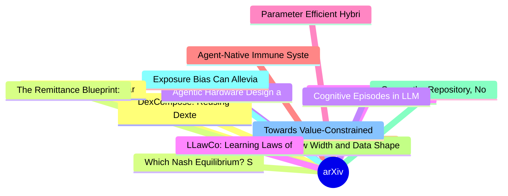

# arXiv 每日最新论文 (2026-06-29)

## 思维导图

## 列表（20 条）

### 1. DexCompose: Reusing Dexterous Policies for Multi-Task Manipulation with a Single Hand
- **作者**: Dihong Huang
- **日期**: 2026-06-26
- **链接**: [http://arxiv.org/abs/2606.28323v1](http://arxiv.org/abs/2606.28323v1)
- **摘要**: Dexterous manipulation policies can solve individual skills, but composing them to perform multiple tasks with a single hand remains challenging. Adding a new task on top of an existing manipulation skill often imposes conflicting demands on overlapping fingers and contact modes, causing destructive...

### 2. Which Nash Equilibrium? Solver-Dependent Selection on Zero-Sum Nash Polytopes
- **作者**: Luis Leal
- **日期**: 2026-06-26
- **链接**: [http://arxiv.org/abs/2606.28308v1](http://arxiv.org/abs/2606.28308v1)
- **摘要**: Many two-player zero-sum games admit not a unique Nash equilibrium but a convex set of them: a polytope of profiles that all share the minimax value V* yet prescribe different behaviour. Standard solvers each converge to some equilibrium and are treated as interchangeable. We ask whether they instea...

### 3. Agentic Hardware Design as Repository-Level Code Evolution
- **作者**: Cunxi Yu
- **日期**: 2026-06-26
- **链接**: [http://arxiv.org/abs/2606.28279v1](http://arxiv.org/abs/2606.28279v1)
- **摘要**: We present HORIZON, a self-evolving agent framework that treats hardware design as repository-level code evolution. A Markdown harness is compiled into a project pack containing domain knowledge, an executable evaluator, an acceptance predicate, and a git/runtime policy; a hands-free agent loop then...

### 4. Towards Automating Scientific Review with Google's Paper Assistant Tool
- **作者**: Rajesh Jayaram
- **日期**: 2026-06-26
- **链接**: [http://arxiv.org/abs/2606.28277v1](http://arxiv.org/abs/2606.28277v1)
- **摘要**: Artificial intelligence is driving a revolution in scientific discovery, accelerating everything from hypothesis generation to mathematical theorem proving. However, this rapid acceleration is creating a systemic challenge: traditional human peer review cannot scale to match the influx of AI-assiste...

### 5. Parameter Efficient Hybrid Transformer (PEHT) for Network Traffic Prediction via Dynamic Urban Congestion Integration
- **作者**: Abdolazim Rezaei
- **日期**: 2026-06-26
- **链接**: [http://arxiv.org/abs/2606.28274v1](http://arxiv.org/abs/2606.28274v1)
- **摘要**: Accurate network traffic prediction is a critical element for efficient resource allocation in dynamic urban cellular networks. However, prediction remains challenging because network demand is influenced by complex mobility patterns, congestion dynamics, and heterogeneous user behavior. This paper ...

### 6. Agent-Native Immune System: Architecture, Taxonomy, and Engineering
- **作者**: Bo Shen
- **日期**: 2026-06-26
- **链接**: [http://arxiv.org/abs/2606.28270v1](http://arxiv.org/abs/2606.28270v1)
- **摘要**: The transition from static chat bots to autonomous agents--equipped with persistent memory, tool-use protocols, and multi-agent collaboration--has fundamentally expanded the AI threat landscape. Current defense mechanisms, such as perimeter security and training-time alignment, remain external to th...

### 7. Learning Topology-Aware Representations via Test-Time Adaptation for Anomaly Segmentation
- **作者**: Ali Zia
- **日期**: 2026-06-26
- **链接**: [http://arxiv.org/abs/2606.28268v1](http://arxiv.org/abs/2606.28268v1)
- **摘要**: Test-time adaptation (TTA) has emerged as a promising paradigm for mitigating distribution shifts in deep models. However, existing TTA approaches for anomaly segmentation remain limited by their reliance on pixel-level heuristics, such as confidence thresholding or entropy minimisation, which fail ...

### 8. How Width and Data Shape Generalization Scaling Laws in Quadratic Neural Networks
- **作者**: Julius Girardin
- **日期**: 2026-06-26
- **链接**: [http://arxiv.org/abs/2606.28242v1](http://arxiv.org/abs/2606.28242v1)
- **摘要**: Understanding how performance scales jointly with model size and data is a central problem in modern machine learning. Existing theoretical works on scaling laws typically describe generalization as a function of data or compute, often in fixed-feature or infinite-width regimes and for online SGD. H...

### 9. Govern the Repository, Not the Agent: Measuring Ecosystem-Level Risk in AI-Native Software
- **作者**: Daniel Russo
- **日期**: 2026-06-26
- **链接**: [http://arxiv.org/abs/2606.28235v1](http://arxiv.org/abs/2606.28235v1)
- **摘要**: Autonomous coding agents now open and merge pull requests in shared repositories at scale, and the field evaluates them the way it has always evaluated components, one agent at a time, on isolated benchmark tasks. Yet agents that each pass their own tests still leave repositories that accumulate pro...

### 10. Exposure Bias Can Alleviate Itself via Directional and Frequency Rectification in Flow Matching
- **作者**: Guanbo Huang
- **日期**: 2026-06-26
- **链接**: [http://arxiv.org/abs/2606.28226v1](http://arxiv.org/abs/2606.28226v1)
- **摘要**: Flow Matching (FM) has achieved remarkable generative performance, yet it suffers from exposure bias due to discrepancies between training and inference. Existing mitigation strategies typically rely on static constraints or external heuristics. In this work, we propose that exposure bias itself inh...

### 11. Towards Value-Constrained Credit Assignment in Fully Delegated AI Cooperatives
- **作者**: Young Yoon
- **日期**: 2026-06-26
- **链接**: [http://arxiv.org/abs/2606.28217v1](http://arxiv.org/abs/2606.28217v1)
- **摘要**: We propose a framework for reward allocation in fully delegated AI cooperatives where humans are represented by agents that contribute data and participate in model updates under heterogeneous value constraints. The key idea is to credit only those updates that remain admissible after screening them...

### 12. HAT-4D: Lifting Monocular Video for 4D Multi-Object Interactions via Human-Agent Collaboration
- **作者**: Jiaxin Li
- **日期**: 2026-06-26
- **链接**: [http://arxiv.org/abs/2606.28215v1](http://arxiv.org/abs/2606.28215v1)
- **摘要**: Extracting dynamic 4D object interactions from massive, in-the-wild monocular videos offers a highly efficient data collection pathway for scaling Embodied AI and training VLAs. However, existing monocular 4D reconstruction methods primarily focus on isolated objects, often failing under the severe ...

### 13. The Remittance Blueprint: Data-driven Intelligence for Sri Lanka
- **作者**: Dhinanjaya Fernando
- **日期**: 2026-06-26
- **链接**: [http://arxiv.org/abs/2606.28190v1](http://arxiv.org/abs/2606.28190v1)
- **摘要**: This study analyzes Sri Lankan migration and remittances over 32 years (1994-2025). Using a 384-month harmonized dataset, we apply exploratory data analysis, stationarity corrected time-series modeling (ADF, Johansen, VAR/VECM), and supervised learning. Results reveal remittance inflows are primaril...

### 14. Cognitive Episodes in LLM Reasoning Traces Enable Interpretable Human Item Difficulty Prediction
- **作者**: Chenguang Wang
- **日期**: 2026-06-26
- **链接**: [http://arxiv.org/abs/2606.28186v1](http://arxiv.org/abs/2606.28186v1)
- **摘要**: Predicting human item difficulty is central to educational assessment, where reliable estimates support fairness and effective test construction. Existing methods often depend on costly human calibration or item-level textual representations, providing limited evidence about the cognitive processes ...

### 15. LLawCo: Learning Laws of Cooperation for Modeling Embodied Multi-Agent Behavior
- **作者**: Qinhong Zhou
- **日期**: 2026-06-26
- **链接**: [http://arxiv.org/abs/2606.28182v1](http://arxiv.org/abs/2606.28182v1)
- **摘要**: Embodied agents operating in decentralized and partially observable environments have attracted growing attention in recent years. However, existing large language model (LLM)-based agents often exhibit behaviors that are misaligned with their partners or inconsistent with the environment state, lea...

### 16. CPAgents: Agentic Composite Phenotype Generation for Cardiac Disease Association
- **作者**: Zuoou Li
- **日期**: 2026-06-26
- **链接**: [http://arxiv.org/abs/2606.28179v1](http://arxiv.org/abs/2606.28179v1)
- **摘要**: Identifying robust associations between cardiac imaging phenotypes and clinical diseases is fundamental to population-scale cardiovascular research and reliable risk stratification. However, current phenome-wide association studies rely on pre-defined, single-variable phenotypes or expert-crafted fe...

### 17. Tandem Reinforcement Learning with Verifiable Rewards
- **作者**: Difan Jiao
- **日期**: 2026-06-26
- **链接**: [http://arxiv.org/abs/2606.28166v1](http://arxiv.org/abs/2606.28166v1)
- **摘要**: Reinforcement learning with verifiable rewards (RLVR) has significantly improved the reasoning capability of large language models, reaching expert or even superhuman performance in domains such as competition math. However, whether weaker agents and humans can actually harness this capability is fa...

### 18. Robust Harmful Features Under Jailbreak Attacks: Mechanistic Evidence from Attention Head Specialization in Large Language Models
- **作者**: Yanchen Yin
- **日期**: 2026-06-26
- **链接**: [http://arxiv.org/abs/2606.28153v1](http://arxiv.org/abs/2606.28153v1)
- **摘要**: Jailbreak attacks bypass LLM safety alignment, yet their mechanisms remain poorly understood. We provide evidence that attacks do not comprehensively eliminate safety features, but instead selectively suppress specific attention heads. We identify two functionally differentiated types: Adversarially...

### 19. Toward Robust In-Context Segmentation via Concept Guidance
- **作者**: Zhigang Chen
- **日期**: 2026-06-26
- **链接**: [http://arxiv.org/abs/2606.28149v1](http://arxiv.org/abs/2606.28149v1)
- **摘要**: In-context segmentation (ICS) requires a model to segment target regions in a query image using only a few reference images and their corresponding masks, without updating any parameters. Despite recent progress, prior ICS studies have largely overlooked a critical aspect: system robustness, ie, whe...

### 20. Beyond Sparse Supervision: Diffusion-Guided Learning for Few-Shot Graph Fraud Detection
- **作者**: Liming Liu
- **日期**: 2026-06-26
- **链接**: [http://arxiv.org/abs/2606.28134v1](http://arxiv.org/abs/2606.28134v1)
- **摘要**: Graph-based fraud detection is essential for safeguarding large-scale transaction systems, where undetected anomalies may lead to substantial financial losses and security risks. Real-world fraud graphs pose two coupled challenges: sparse and imbalanced supervision, where verified fraudulent labels ...
