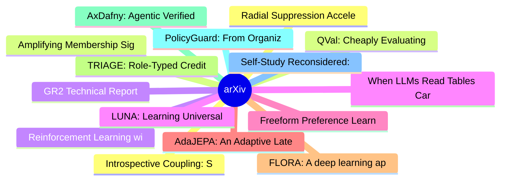

# arXiv 每日最新论文 (2026-07-01)

## 思维导图

## 列表（20 条）

### 1. Introspective Coupling: Self-Explanation Training Tracks Behavioral Change Despite Fixed Supervision
- **作者**: Zifan Carl Guo
- **日期**: 2026-06-30
- **链接**: [http://arxiv.org/abs/2606.32038v1](http://arxiv.org/abs/2606.32038v1)
- **摘要**: When does training language models (LMs) to generate explanations of their predictions yield faithful introspection, rather than superficial imitation? We study LMs trained to explain which features of their inputs influenced their behavior, using models' counterfactual behavior on modified inputs a...

### 2. QVal: Cheaply Evaluating Dense Supervision Signals for Long-Horizon LLM Agents
- **作者**: Sergio Hernández-Gutiérrez
- **日期**: 2026-06-30
- **链接**: [http://arxiv.org/abs/2606.32034v1](http://arxiv.org/abs/2606.32034v1)
- **摘要**: LLM agents increasingly act over long horizons, where a single trajectory can contain hundreds or thousands of actions. In these settings, outcome-only rewards provide too sparse guidance, failing to inform the model about the goodness of intermediate actions. Dense supervision methods aim to solve ...

### 3. Reinforcement Learning with Metacognitive Feedback Elicits Faithful Uncertainty Expression in LLMs
- **作者**: Gabrielle Kaili-May Liu
- **日期**: 2026-06-30
- **链接**: [http://arxiv.org/abs/2606.32032v1](http://arxiv.org/abs/2606.32032v1)
- **摘要**: Metacognition is a critical component of intelligence that describes the ability to monitor and regulate one's own cognitive processes. Yet LLMs exhibit systemic deficiencies in key metacognitive faculties: they hallucinate with high confidence, fail to recognize knowledge boundaries, and misreprese...

### 4. When LLMs Read Tables Carelessly: Measuring and Reducing Data Referencing Errors
- **作者**: Yuqing Yang
- **日期**: 2026-06-30
- **链接**: [http://arxiv.org/abs/2606.32029v1](http://arxiv.org/abs/2606.32029v1)
- **摘要**: While large language models (LLMs) perform well on table tasks, they still make data referencing errors (DREs), i.e., incorrectly citing or omitting table values, despite understanding the table structure. Beyond final-answer accuracy, DREs directly compromise the correctness and reliability of inte...

### 5. Freeform Preference Learning for Robotic Manipulation
- **作者**: Marcel Torne
- **日期**: 2026-06-30
- **链接**: [http://arxiv.org/abs/2606.32027v1](http://arxiv.org/abs/2606.32027v1)
- **摘要**: Reward design remains a central bottleneck for autonomous robot policy improvement, especially in long-horizon manipulation tasks where sparse success labels provide too little signal and binary preferences collapse many competing notions of quality into one ambiguous signal. We introduce Freeform P...

### 6. AdaJEPA: An Adaptive Latent World Model
- **作者**: Ying Wang
- **日期**: 2026-06-30
- **链接**: [http://arxiv.org/abs/2606.32026v1](http://arxiv.org/abs/2606.32026v1)
- **摘要**: Latent world models enable planning from high-dimensional observations by predicting future states in a compact latent space. However, these models are typically kept frozen at test time: when their predictions become inaccurate, planning can fail, especially under test-time distribution shift. To a...

### 7. FLORA: A deep learning approach to predict forest attributes from heterogeneous LiDAR data
- **作者**: Emilie Vautier
- **日期**: 2026-06-30
- **链接**: [http://arxiv.org/abs/2606.32023v1](http://arxiv.org/abs/2606.32023v1)
- **摘要**: Forest attributes are essential for national-scale resource monitoring. Airborne LiDAR metrics are among the auxiliary variables most strongly correlated with forest attributes used in National Forest Inventory (NFI) estimates. However, producing wall-to-wall predictions remains challenging when LiD...

### 8. TRIAGE: Role-Typed Credit Assignment for Agentic Reinforcement Learning
- **作者**: Yuanda Xu
- **日期**: 2026-06-30
- **链接**: [http://arxiv.org/abs/2606.32017v1](http://arxiv.org/abs/2606.32017v1)
- **摘要**: Agentic reinforcement learning requires assigning credit to environment-facing actions such as searches, clicks, edits, navigation commands, and object interactions. Standard GRPO uses the final verifier outcome as a uniform advantage over all action tokens. This outcome signal is useful but structu...

### 9. AxDafny: Agentic Verified Code Generation in Dafny
- **作者**: Benjamin Breen
- **日期**: 2026-06-30
- **链接**: [http://arxiv.org/abs/2606.32007v1](http://arxiv.org/abs/2606.32007v1)
- **摘要**: We study agentic code generation in Dafny, where a model must generate both executable code and the proof artifacts for verification. We present AxDafny, a verifier-guided repair framework that iteratively generates implementations, invariants, assertions, and termination arguments. We also introduc...

### 10. PolicyGuard: From Organizational Policies to Neuro-SymbolicCompliance Review Engines
- **作者**: Sameer Malik
- **日期**: 2026-06-30
- **链接**: [http://arxiv.org/abs/2606.32004v1](http://arxiv.org/abs/2606.32004v1)
- **摘要**: Policy-grounded document review requires determining whether a target document complies with organization-specific policies, guidelines, or playbooks. While large language models can assist with policy interpretation and document analysis, end-to-end prompting leaves the applied policy logic implici...

### 11. Self-Study Reconsidered: The Hidden Fragility of Learning from Self-Generated QA
- **作者**: Ekaterina Alimaskina
- **日期**: 2026-06-30
- **链接**: [http://arxiv.org/abs/2606.32002v1](http://arxiv.org/abs/2606.32002v1)
- **摘要**: Language models are increasingly taught from synthetic question--answer (QA) supervision: a model generates questions about a document, answers them from the same text, and the resulting pairs are used to fine-tune, distill, or compress knowledge into another model. We show that this generation step...

### 12. Radial Suppression Accelerates Algorithmic Generalization: A Geometric Analysis of Delayed Generalization
- **作者**: Srijan Tiwari
- **日期**: 2026-06-30
- **链接**: [http://arxiv.org/abs/2606.32000v1](http://arxiv.org/abs/2606.32000v1)
- **摘要**: Why do neural networks memorize algorithmic training data long before they generalize? We present a geometric case study demonstrating that, on tasks where generalization requires discovering structured low-dimensional circuits, the memorization-generalization delay is driven by radial inflation of ...

### 13. Amplifying Membership Signal Through Chained Regeneration
- **作者**: Wojciech Łapacz
- **日期**: 2026-06-30
- **链接**: [http://arxiv.org/abs/2606.31991v1](http://arxiv.org/abs/2606.31991v1)
- **摘要**: The tendency of large generative models to memorize training data makes sample verification critical for privacy auditing and copyright enforcement. Current membership (MIA) and dataset inference (DI) attacks often rely on one-shot generations, which yield weak signals and limited sensitivity across...

### 14. GR2 Technical Report
- **作者**: Yufei Li
- **日期**: 2026-06-30
- **链接**: [http://arxiv.org/abs/2606.31984v1](http://arxiv.org/abs/2606.31984v1)
- **摘要**: Industrial recommendation systems serve billions of users through a multi-stage funnel -- retrieval, early-stage ranking, and re-ranking -- where the final re-ranking step disproportionately shapes user engagement and downstream performance, particularly for carousel and grid display formats. Despit...

### 15. LUNA: Learning Universal 3D Human Animation Beyond Skinning
- **作者**: Peng Li
- **日期**: 2026-06-30
- **链接**: [http://arxiv.org/abs/2606.31981v1](http://arxiv.org/abs/2606.31981v1)
- **摘要**: Creating photorealistic, animatable 3D human avatars from monocular images still largely depends on Linear Blend Skinning (LBS) and parametric body models, which constrain expressivity and often introduce artifacts due to imperfect fitting. We propose LUNA, an LBS-free universal neural animation mod...

### 16. TreeAgent: A Generalizable Multi-Agent Framework for Automated Bias Labeling in Forestry via Compiled Expert Rules and Vision-Language Models
- **作者**: Shiyi Chen
- **日期**: 2026-06-30
- **链接**: [http://arxiv.org/abs/2606.31976v1](http://arxiv.org/abs/2606.31976v1)
- **摘要**: Human-labeled data are widely used as reference annotations in ML, despite known variability across annotators in many expert-driven domains. In addition, expert annotation is slow, inconsistent, and remains a major bottleneck for scaling tasks like tree height bias classification in forestry remote...

### 17. MECoBench: A Systematic Study of Multimodal Agent Collaboration in Embodied Environments
- **作者**: Qingyun Liu
- **日期**: 2026-06-30
- **链接**: [http://arxiv.org/abs/2606.31966v1](http://arxiv.org/abs/2606.31966v1)
- **摘要**: Recent multimodal large language models (MLLMs) have strong potential as embodied agents, but their ability to collaborate in visually grounded environments remains underexplored. To address this gap, we introduce MECoBench, a multimodal embodied cooperation benchmark with an evaluation platform spa...

### 18. LeCropFollow: Latent Space Planning for Navigation in Unstructured Crop Fields
- **作者**: Felipe Tommaselli
- **日期**: 2026-06-30
- **链接**: [http://arxiv.org/abs/2606.31941v1](http://arxiv.org/abs/2606.31941v1)
- **摘要**: Unstructured navigational features, such as irregular planting or discontinuities, remain the primary failure mode for under-canopy agricultural robots. Existing geometric approaches often fail in these scenarios because they compress high-dimensional visual data into deterministic spatial reference...

### 19. MVP-Nav: Multi-layer Value Map Planner Navigator
- **作者**: Wenyuan Xie
- **日期**: 2026-06-30
- **链接**: [http://arxiv.org/abs/2606.31919v1](http://arxiv.org/abs/2606.31919v1)
- **摘要**: Zero-shot Object Goal Navigation (ZSON) with RGB-only perception poses a fundamental challenge for embodied agents, as the absence of explicit depth information introduces severe physical uncertainty and semantic-physical misalignment. Existing approaches either rely on high-level semantic reasoning...

### 20. Attend, Transform, or Silence: Operator-Level Visual Skipping for Efficient Multimodal LLM Inference
- **作者**: Zhaoyang Luo
- **日期**: 2026-06-30
- **链接**: [http://arxiv.org/abs/2606.31903v1](http://arxiv.org/abs/2606.31903v1)
- **摘要**: Multimodal large language models (MLLMs) increasingly process long visual-token sequences, increasing the overall inference computation. Existing acceleration methods usually remove visual tokens or skip visual-token updates in entire layers, but these coarse strategies may discard fine-grained evid...
