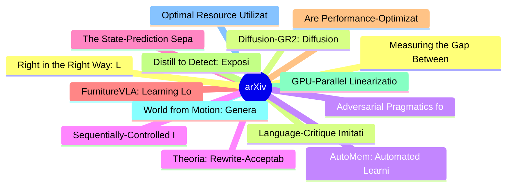

# arXiv 每日最新论文 (2026-07-02)

## 思维导图

## 列表（20 条）

### 1. Measuring the Gap Between Human and LLM Research Ideas
- **作者**: Ziyu Chen
- **日期**: 2026-07-01
- **链接**: [http://arxiv.org/abs/2607.01233v1](http://arxiv.org/abs/2607.01233v1)
- **摘要**: LLMs are increasingly used to brainstorm research ideas, but existing evaluations mostly judge individual ideas by novelty, feasibility, or expert preference. We instead ask: how far are current LLM-generated ideas from human researchers? To characterize this gap, we build a large-scale evaluation f...

### 2. Language-Critique Imitation Learning from Suboptimal Demonstrations
- **作者**: Chih-Han Yang
- **日期**: 2026-07-01
- **链接**: [http://arxiv.org/abs/2607.01225v1](http://arxiv.org/abs/2607.01225v1)
- **摘要**: Prior work on imitation learning from suboptimal demonstrations typically relies on compressed supervision signals such as confidence estimates, discriminator scores, or importance weights. These scalar signals are inherently limited, as they cannot explicitly express intermediate reasoning about ta...

### 3. AutoMem: Automated Learning of Memory as a Cognitive Skill
- **作者**: Shengguang Wu
- **日期**: 2026-07-01
- **链接**: [http://arxiv.org/abs/2607.01224v1](http://arxiv.org/abs/2607.01224v1)
- **摘要**: Memory expertise is a learned skill: knowing what to encode, when to retrieve, and how to organize knowledge--a capacity known in cognitive science as metamemory. We bring this perspective to LLMs by treating memory management as a trainable skill. We promote file-system operations to first-class me...

### 4. Theoria: Rewrite-Acceptability Verification over Informal Reasoning States
- **作者**: Ben Slivinski
- **日期**: 2026-07-01
- **链接**: [http://arxiv.org/abs/2607.01223v1](http://arxiv.org/abs/2607.01223v1)
- **摘要**: When should an AI system's answer be trusted? Formal proof assistants offer certainty but cannot reach most of the problem distribution; scalar LLM judges offer coverage but produce opaque scores that cannot be audited after the fact and are subject to the same coherence issues as any LLM. We presen...

### 5. The State-Prediction Separation Hypothesis
- **作者**: Giovanni Monea
- **日期**: 2026-07-01
- **链接**: [http://arxiv.org/abs/2607.01218v1](http://arxiv.org/abs/2607.01218v1)
- **摘要**: Transformers use the same forward computation stream to both predict the next token and store useful state for future token predictions. We formulate the \emph{state-prediction separation hypothesis}: disentangling the two roles yields better language modeling performance. We design a Transformer va...

### 6. FurnitureVLA: Learning Long-Horizon Bimanual Furniture Assembly with Vision-Language-Action Model
- **作者**: Chenyang Ma
- **日期**: 2026-07-01
- **链接**: [http://arxiv.org/abs/2607.01212v1](http://arxiv.org/abs/2607.01212v1)
- **摘要**: Current work on robot furniture assembly mostly focuses on toy-scale settings or single-arm manipulation. We introduce FurnitureVLA, the first systematic study of real-scale bimanual furniture assembly using Vision-Language-Action models (VLAs). We formalize the task, develop a scalable simulation p...

### 7. Are Performance-Optimization Benchmarks Reliably Measuring Coding Agents?
- **作者**: Zhi Chen
- **日期**: 2026-07-01
- **链接**: [http://arxiv.org/abs/2607.01211v1](http://arxiv.org/abs/2607.01211v1)
- **摘要**: Repository-level performance-optimization benchmarks such as GSO, SWE-Perf and SWE-fficiency evaluate coding agents by applying patches to real repositories and comparing runtime against unoptimized baselines and official reference patches. Their leaderboard scores are increasingly used as evidence ...

### 8. Distill to Detect: Exposing Stealth Biases in LLMs through Cartridge Distillation
- **作者**: Shayan Talaei
- **日期**: 2026-07-01
- **链接**: [http://arxiv.org/abs/2607.01208v1](http://arxiv.org/abs/2607.01208v1)
- **摘要**: Language models deployed in high-stakes roles can potentially favor certain entities, brands, or viewpoints, steering user decisions at scale. Such preferential biases can be introduced by any actor in the model's supply chain and are most dangerous when the model reveals its preference only on the ...

### 9. GPU-Parallel Linearization Error Bounds for Real-Time Robust Optimal Control of Nonlinear and Neural Network Dynamics
- **作者**: Jeffrey Fang
- **日期**: 2026-07-01
- **链接**: [http://arxiv.org/abs/2607.01203v1](http://arxiv.org/abs/2607.01203v1)
- **摘要**: This paper studies real-time robust optimal control for uncertain nonlinear systems, where linear time-varying (LTV) approximations make planning tractable but require sound linearization error bounds (LEBs) to guarantee robust constraint satisfaction. We develop tight, differentiable, GPU-parallel ...

### 10. World from Motion: Generative Dynamic Gaussian Reconstruction from Monocular Video
- **作者**: Liyuan Zhu
- **日期**: 2026-07-01
- **链接**: [http://arxiv.org/abs/2607.01202v1](http://arxiv.org/abs/2607.01202v1)
- **摘要**: We present World from Motion, a method for generating freely renderable dynamic 3D Gaussian representations from monocular videos. Our approach conditions a video model on dense, pixel-aligned renderings that encode appearance, geometry, and 3D scene motion along both input and target camera traject...

### 11. Optimal Resource Utilization for Autonomous Laboratory Orchestrators
- **作者**: Austin McDannald
- **日期**: 2026-07-01
- **链接**: [http://arxiv.org/abs/2607.01188v1](http://arxiv.org/abs/2607.01188v1)
- **摘要**: In autonomous laboratories, AI agents suggest the next batch of experiments to do. However, planning and executing those tasks taking full advantage of the available resources is a completely different question. This can be challenging when dealing with real-world hardware constraints, especially so...

### 12. Right in the Right Way: LM Training with Verifiable Rewards and Human Demonstrations
- **作者**: Mehul Damani
- **日期**: 2026-07-01
- **链接**: [http://arxiv.org/abs/2607.01181v1](http://arxiv.org/abs/2607.01181v1)
- **摘要**: RL with verifiable rewards (RLVR) has emerged as a powerful paradigm for training LMs on tasks with well-defined success metrics, such as code generation and mathematical reasoning. However, current RLVR methods optimize only what can be objectively scored, often neglecting subjective, non-verifiabl...

### 13. Diffusion-GR2: Diffusion Generative Reasoning Re-ranker
- **作者**: Zhuoxuan Zhang
- **日期**: 2026-07-01
- **链接**: [http://arxiv.org/abs/2607.01170v1](http://arxiv.org/abs/2607.01170v1)
- **摘要**: Generative reasoning re-rankers achieve strong recommendation accuracy by emitting a chain-of-thought before re-ordering a candidate list, but they are slow at inference: an autoregressive (AR) decoder spends one sequential forward pass per reasoning token, and the reasoning trace far exceeds the ra...

### 14. Adversarial Pragmatics for AI Safety Evaluation: A Benchmark for Instruction Conflict, Embedded Commands, and Policy Ambiguity
- **作者**: Brett Reynolds
- **日期**: 2026-07-01
- **链接**: [http://arxiv.org/abs/2607.01153v1](http://arxiv.org/abs/2607.01153v1)
- **摘要**: Safety evaluations for language models increasingly depend on judgments about ambiguous natural-language behaviour: whether a model has followed an instruction, refused appropriately, complied with a policy, resisted an embedded command, or misreported progress in an agentic task. Existing benchmark...

### 15. Sequentially-Controlled Interactive Multi-Particle Flow-Maps for Online Feedback-Driven Search
- **作者**: Binglin Ji
- **日期**: 2026-07-01
- **链接**: [http://arxiv.org/abs/2607.01144v1](http://arxiv.org/abs/2607.01144v1)
- **摘要**: While generative models have enabled training-free reward alignment, current methods typically excel in local exploration within narrow regions of the underlying distribution. These approaches struggle when preferences are unknown a priori and only revealed through sequential feedback-a scenario dem...

### 16. Skills Are Not Islands: Measuring Dependency and Risk in Agent Skill Supply Chains
- **作者**: Changguo Jia
- **日期**: 2026-07-01
- **链接**: [http://arxiv.org/abs/2607.01136v1](http://arxiv.org/abs/2607.01136v1)
- **摘要**: Agent skills package reusable operational knowledge for Large Language Model (LLM) agents, yet as they grow in scope, they become dependency-bearing artifacts whose identities, versions, and provenance remain implicit. This opacity already causes duplicated dependencies and inconsistent installation...

### 17. Autonomous Scientific Discovery via Iterative Meta-Reflection
- **作者**: Bingchen Zhao
- **日期**: 2026-07-01
- **链接**: [http://arxiv.org/abs/2607.01131v1](http://arxiv.org/abs/2607.01131v1)
- **摘要**: Autonomous scientific discovery systems offer the potential to accelerate research by automating the process of hypothesis generation and validation. However, current systems operate within constrained search spaces or require predefined research questions, limiting their capacity for true open-ende...

### 18. Muon as a Residual Connection
- **作者**: Hao Huang
- **日期**: 2026-07-01
- **链接**: [http://arxiv.org/abs/2607.01124v1](http://arxiv.org/abs/2607.01124v1)
- **摘要**: Muon has recently emerged as one of the most effective optimizers for training large neural networks, yet its empirical success has been explained from several different perspectives. In this paper, we propose a simple mechanistic interpretation: Muon can be understood as an implicit residual connec...

### 19. Towards Developing a Multimodal Chat Assistant for University Stakeholders: RAG-based Approach
- **作者**: Md Abu Hanif Shaikh
- **日期**: 2026-07-01
- **链接**: [http://arxiv.org/abs/2607.01115v1](http://arxiv.org/abs/2607.01115v1)
- **摘要**: University stakeholders often face difficulties in accessing timely and reliable information, especially in developing countries, where there are very few intelligent support systems. Existing rule-based chatbots are unable to handle complex, domain-specific queries and are not well-equipped to adap...

### 20. FAR: Failure-Aware Retry for Test-Time Recovery and Continual Policy Improvement
- **作者**: Haoran Hao
- **日期**: 2026-07-01
- **链接**: [http://arxiv.org/abs/2607.01111v1](http://arxiv.org/abs/2607.01111v1)
- **摘要**: Robot policies inevitably encounter failures when deployed in real environments. Naive retries often repeat the same mistakes, while many existing recovery methods rely on human intervention. In this paper, we propose Failure-Aware Retry (FAR), a framework that enables robots to learn from previous ...
