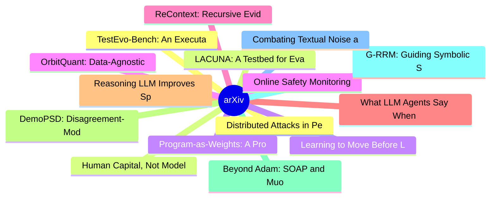

# arXiv 每日最新论文 (2026-07-06)

## 思维导图

## 列表（20 条）

### 1. Distributed Attacks in Persistent-State AI Control
- **作者**: Josh Hills
- **日期**: 2026-07-02
- **链接**: [http://arxiv.org/abs/2607.02514v1](http://arxiv.org/abs/2607.02514v1)
- **摘要**: As AI coding agents become more autonomous, they increasingly ship code iteratively, with the codebase persisting across sessions. This persistence creates a new attack surface: a misaligned or prompt-injected agent can distribute attacks across pull requests (PRs) and time its payload for the PR wi...

### 2. LACUNA: A Testbed for Evaluating Localization Precision for LLM Unlearning
- **作者**: Matteo Boglioni
- **日期**: 2026-07-02
- **链接**: [http://arxiv.org/abs/2607.02513v1](http://arxiv.org/abs/2607.02513v1)
- **摘要**: LLMs memorize sensitive training data, including personally identifiable information (PII), creating a pressing need for reliable post hoc removal methods. Unlearning has emerged as a promising solution, with state-of-the-art(SOTA) methods often following a localize-first, unlearn-second paradigm th...

### 3. Program-as-Weights: A Programming Paradigm for Fuzzy Functions
- **作者**: Wentao Zhang
- **日期**: 2026-07-02
- **链接**: [http://arxiv.org/abs/2607.02512v1](http://arxiv.org/abs/2607.02512v1)
- **摘要**: Many everyday programming tasks resist clean rule-based implementation, such as alerting on important log lines, repairing malformed JSON, or ranking search results by intent, and are increasingly outsourced to large language model APIs at the cost of locality, reproducibility, and price. We propose...

### 4. Online Safety Monitoring for LLMs
- **作者**: Mona Schirmer
- **日期**: 2026-07-02
- **链接**: [http://arxiv.org/abs/2607.02510v1](http://arxiv.org/abs/2607.02510v1)
- **摘要**: Despite alignment training, LLMs remain prone to generating unsafe outputs at deployment time. Monitoring outputs online and raising an alarm when safety can no longer be assumed is therefore critical. We study a simple real-time monitor that turns a verifier signal from an external model into an al...

### 5. ReContext: Recursive Evidence Replay as LLM Harness for Long-Context Reasoning
- **作者**: Yanjun Zhao
- **日期**: 2026-07-02
- **链接**: [http://arxiv.org/abs/2607.02509v1](http://arxiv.org/abs/2607.02509v1)
- **摘要**: Understanding and reasoning over long contexts has become a key requirement for deploying large language models (LLMs) in realistic applications. Although recent LLMs support increasingly long context windows, they often fail to use relevant evidence that is already present in the input, revealing a...

### 6. What LLM Agents Say When No One Is Watching: Social Structure and Latent Objective Emergence in Multi-Agent Debates
- **作者**: Arman Ghaffarizadeh
- **日期**: 2026-07-02
- **链接**: [http://arxiv.org/abs/2607.02507v1](http://arxiv.org/abs/2607.02507v1)
- **摘要**: LLM agents will increasingly act in socially structured settings where role, audience, and relational context can shape what is advantageous or costly to say. We study whether such social structure, without any explicit objective in the prompt, changes what an agent expresses publicly relative to an...

### 7. Reasoning LLM Improves Speaker Recognition in Long-form TV Dramas
- **作者**: Yuxuan Li
- **日期**: 2026-07-02
- **链接**: [http://arxiv.org/abs/2607.02504v1](http://arxiv.org/abs/2607.02504v1)
- **摘要**: Long-form TV dramas present a formidable challenge for comprehensive video understanding, where deciphering complex storyline often relies on \textbf{speaker recognition}, the task of accurately attributing each spoken utterance to its respective character. In this paper, we advance this field throu...

### 8. DemoPSD: Disagreement-Modulated Policy Self-Distillation
- **作者**: Yunhe Li
- **日期**: 2026-07-02
- **链接**: [http://arxiv.org/abs/2607.02502v1](http://arxiv.org/abs/2607.02502v1)
- **摘要**: On-policy self-distillation (OPSD) has emerged as a practical method for training large language models (LLMs) to reason, where a single model acts as both the teacher and the student with different levels of information access. However, recent studies have found that the teacher's dense token-level...

### 9. Beyond Adam: SOAP and Muon for Faster, Label-Efficient Training of Machine Learning Interatomic Potentials
- **作者**: Gil Harari
- **日期**: 2026-07-02
- **链接**: [http://arxiv.org/abs/2607.02499v1](http://arxiv.org/abs/2607.02499v1)
- **摘要**: Machine learning interatomic potentials (MLIPs) have become a hallmark of AI for scientific simulation. While efforts on new architectures and datasets have led to increasingly accurate and general models, the choice of optimizer for training has largely remained unexplored, defaulting to Adam and i...

### 10. G-RRM: Guiding Symbolic Solvers with Recurrent Reasoning Models
- **作者**: Timo Bertram
- **日期**: 2026-07-02
- **链接**: [http://arxiv.org/abs/2607.02491v1](http://arxiv.org/abs/2607.02491v1)
- **摘要**: In this work, we focus on SE-RRMs, a symbol-equivariant instantiation of RRMs that exhibits improved extrapolation to larger problem sizes. We propose a neuro-symbolic approach, ``Guiding with Recurrent Reasoning Models'' (G-RRM), which integrates SE-RRMs with symbolic solvers for constraint satisfa...

### 11. Combating Textual Noise and Redundancy: Entropy-Aware Dense Visual Token Pruning
- **作者**: Xuehui Wang
- **日期**: 2026-07-02
- **链接**: [http://arxiv.org/abs/2607.02484v1](http://arxiv.org/abs/2607.02484v1)
- **摘要**: Visual token pruning is a crucial strategy for accelerating VLMs by compressing redundant image patches, yet existing methods often fail to preserve critical cues under dense instructions and fine-grained queries. In this paper, we investigate this failure and identify two underlying bottlenecks: th...

### 12. TestEvo-Bench: An Executable and Live Benchmark for Test and Code Co-Evolution
- **作者**: Jiale Amber Wang
- **日期**: 2026-07-02
- **链接**: [http://arxiv.org/abs/2607.02469v1](http://arxiv.org/abs/2607.02469v1)
- **摘要**: Software tests and code evolve together: a code change should be followed by new or updated tests that record the new software behavior. Yet existing test generation and update benchmarks often isolate the test from the code change, and rely on static metadata that does not verify whether a test is ...

### 13. Human Capital, Not Model Benchmarks, Predicts Hybrid Intelligence in Forecasting
- **作者**: Vivienne Ming
- **日期**: 2026-07-02
- **链接**: [http://arxiv.org/abs/2607.02467v1](http://arxiv.org/abs/2607.02467v1)
- **摘要**: Whether pairing people with AI helps or hurts is usually reported as a single average effect. Using a real-money prediction market (Polymarket) as an objective, externally resolved benchmark, this pilot shows that the value of human-AI collaboration depends on a specific, measurable form of human ca...

### 14. Learning to Move Before Learning to Do: Task-Agnostic pretraining for VLAs
- **作者**: Junhao Shi
- **日期**: 2026-07-02
- **链接**: [http://arxiv.org/abs/2607.02466v1](http://arxiv.org/abs/2607.02466v1)
- **摘要**: Vision-Language-Action (VLA) models are fundamentally bottlenecked by the scarcity of expert demonstrations -- triplets of observations, instructions, and actions that are costly to collect at scale. We argue that this bottleneck stems from conflating two distinct learning objectives: acquiring phys...

### 15. OrbitQuant: Data-Agnostic Quantization for Image and Video Diffusion Transformers
- **作者**: Donghyun Lee
- **日期**: 2026-07-02
- **链接**: [http://arxiv.org/abs/2607.02461v1](http://arxiv.org/abs/2607.02461v1)
- **摘要**: Diffusion transformers (DiTs) achieve state-of-the-art image and video generation, but their multi-step sampling and growing parameter count make inference expensive. Post-training quantization (PTQ) is the natural remedy, yet DiT activations shift across timesteps, prompts, and guidance branches, f...

### 16. Neuron-Aware Data Selection for Annotation-Free LLM Self-Distillation
- **作者**: Zhuowei Chen
- **日期**: 2026-07-02
- **链接**: [http://arxiv.org/abs/2607.02460v1](http://arxiv.org/abs/2607.02460v1)
- **摘要**: Post-training large language models (LLMs) without real-world interaction feedback or human-labeled supervision remains challenging, particularly in specialized domains where expert annotations are costly to obtain. Recent annotation-free self-evolution methods address this by using the model's own ...

### 17. EvoPolicyGym: Evaluating Autonomous Policy Evolution in Interactive Environments
- **作者**: Zhilin Wang
- **日期**: 2026-07-02
- **链接**: [http://arxiv.org/abs/2607.02440v1](http://arxiv.org/abs/2607.02440v1)
- **摘要**: Autonomous agents are increasingly expected to improve executable policies through feedback, yet existing evaluations often collapse this process into a final score or confound it with open-ended software-engineering progress. We introduce Autonomous Policy Evolution, a controlled evaluation setting...

### 18. Reasoning effort, not tool access, buys first-try reliability in agentic code generation: an observational study
- **作者**: Achint Mehta
- **日期**: 2026-07-02
- **链接**: [http://arxiv.org/abs/2607.02436v1](http://arxiv.org/abs/2607.02436v1)
- **摘要**: Agentic coding assistants are increasingly given extra capabilities, such as browser based testing tools and design oriented system prompts, on the assumption that more capability yields better software. This study tested that assumption directly. Ninety independent agent runs built the same applica...

### 19. Automated grading of Linux/bash examinations using large language models: a four-level cognitive taxonomy approach
- **作者**: Manuel Alonso-Carracedo
- **日期**: 2026-07-02
- **链接**: [http://arxiv.org/abs/2607.02432v1](http://arxiv.org/abs/2607.02432v1)
- **摘要**: Scalable and reliable grading of command-line examinations remains a challenge in computing education, where rising enrolments make manual marking difficult and rule-based autograders cannot handle partial credit, equivalent solutions, or syntactic variation. This paper evaluates whether four fronti...

### 20. WorldSample: Closed-loop Real-robot RL with World Modelling
- **作者**: Yuquan Xue
- **日期**: 2026-07-02
- **链接**: [http://arxiv.org/abs/2607.02431v1](http://arxiv.org/abs/2607.02431v1)
- **摘要**: Reinforcement learning (RL) can overcome the demonstration-coverage limitation of imitation learning (IL) by allowing robots to improve through trial-and-error interaction beyond the states observed in demonstrations. However, deploying RL on real robots remains constrained by high interaction costs...
