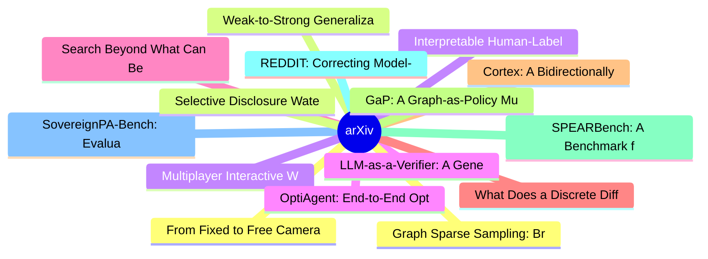

# arXiv 每日最新论文 (2026-07-07)

## 思维导图

## 列表（20 条）

### 1. From Fixed to Free Cameras: Calibration-Free View-Robust Vision-Language-Action Model
- **作者**: Wenhao Li
- **日期**: 2026-07-06
- **链接**: [http://arxiv.org/abs/2607.05396v1](http://arxiv.org/abs/2607.05396v1)
- **摘要**: Real-world robot deployment rarely maintains the training-stage camera setup, where cameras often experience repositioning or remounting depending on actual scenarios. Existing view-robust Vision-Language-Action (VLA) policies tolerate such camera variations only when the camera extrinsics are expli...

### 2. Weak-to-Strong Generalization via Direct On-Policy Distillation
- **作者**: Shiyuan Feng
- **日期**: 2026-07-06
- **链接**: [http://arxiv.org/abs/2607.05394v1](http://arxiv.org/abs/2607.05394v1)
- **摘要**: Reinforcement learning with verifiable rewards (RLVR) is a powerful recipe for improving language-model reasoning, but it is expensive to repeat on every new strong model because the target model must generate many rollouts during training. As models scale, post-training itself becomes a bottleneck....

### 3. Interpretable Human-Label-Free Deep Learning for Real-Bogus Classification with Uncertainty Quantification
- **作者**: Raphaël Bonnet-Guerrini
- **日期**: 2026-07-06
- **链接**: [http://arxiv.org/abs/2607.05393v1](http://arxiv.org/abs/2607.05393v1)
- **摘要**: Time-domain surveys generate many transient candidates, making Real-Bogus classification a critical step in automated discovery pipelines. Reliable labels are costly, while community labels can be noisy and survey-dependent. We aim to develop a Real-Bogus classification framework that can be trained...

### 4. LLM-as-a-Verifier: A General-Purpose Verification Framework
- **作者**: Jacky Kwok
- **日期**: 2026-07-06
- **链接**: [http://arxiv.org/abs/2607.05391v1](http://arxiv.org/abs/2607.05391v1)
- **摘要**: Scaling pre-training, post-training, and test-time compute have become the central paradigms for improving the capabilities of LLMs. In this work, we identify verification, the ability to determine the correctness of a solution, as a new scaling axis. To unlock this and demonstrate its effectiveness...

### 5. Search Beyond What Can Be Taught: Evolving the Knowledge Boundary in Agentic Visual Generation
- **作者**: Haozhe Wang
- **日期**: 2026-07-06
- **链接**: [http://arxiv.org/abs/2607.05382v1](http://arxiv.org/abs/2607.05382v1)
- **摘要**: Visual generators excel at rendering, but they confidently fabricate what they do not know. User requests are unbounded, evolving, and deeply long-tailed: new characters, trending entities, post-cutoff events, and more. This world-knowledge bottleneck is structural: generators are trained on fixed c...

### 6. What Does a Discrete Diffusion Model Learn?
- **作者**: Rodrigo Casado Noguerales
- **日期**: 2026-07-06
- **链接**: [http://arxiv.org/abs/2607.05381v1](http://arxiv.org/abs/2607.05381v1)
- **摘要**: What does a discrete diffusion model learn: a denoiser, a score ratio, or a bridge plug-in predictor? At the level of jump rates, these are one object in different coordinates, and reading a neural network in the wrong coordinate changes the process being trained and sampled. Starting with a rigorou...

### 7. Cortex: A Bidirectionally Aligned Embodied Agent Framework for Long-horizon Manipulation
- **作者**: Jiaqi Peng
- **日期**: 2026-07-06
- **链接**: [http://arxiv.org/abs/2607.05377v1](http://arxiv.org/abs/2607.05377v1)
- **摘要**: While recent Vision-Language-Action (VLA) models show promise toward generalist manipulation policies, they struggle with long-horizon tasks due to their Markovian nature-relying solely on current observations. Hierarchical dual-system methods address this but suffer from a gap between high-level pl...

### 8. GaP: A Graph-as-Policy Multi-Agent Self-Learning Harness For Variational Automation Tasks
- **作者**: Kaiyuan Chen
- **日期**: 2026-07-06
- **链接**: [http://arxiv.org/abs/2607.05369v1](http://arxiv.org/abs/2607.05369v1)
- **摘要**: For robots to work reliably in commercial and industrial applications, can recent advances in agentic coding systems combine interpretable robot programming with the open-world adaptability of model-free policies? We focus on "Variational Automation" (VA), a class of tasks that have larger variation...

### 9. SPEARBench: A Benchmark for Naturalness Evaluation in Streaming Speech-to-Speech Language Models
- **作者**: Thomas Thebaud
- **日期**: 2026-07-06
- **链接**: [http://arxiv.org/abs/2607.05365v1](http://arxiv.org/abs/2607.05365v1)
- **摘要**: Streaming speech-to-speech language models aim to answer spoken queries directly with synthetic speech. However, standard speech and text benchmarks do not capture whether these systems behave naturally in conversations, where timing, turn-taking, prosody, interpersonal stance, language and dialect ...

### 10. REDDIT: Correcting Model-Generated Timestamp Drift in ASR without Forgetting via Replay-Based Distribution Editing
- **作者**: Cheng-Kang Chou
- **日期**: 2026-07-06
- **链接**: [http://arxiv.org/abs/2607.05364v1](http://arxiv.org/abs/2607.05364v1)
- **摘要**: Modern autoregressive ASR systems can emit timestamps as decoded tokens, enabling timestamped transcription without frame-level aligners or inference-time post-processing. We show that these generated timestamps can drift across long non-speech spans: the transcript may remain plausible, but the dec...

### 11. SovereignPA-Bench: Evaluating User-Owned Personal Agents under Evolving Intent, Platform Mediation, and Consent Constraints
- **作者**: Dylan Zongmin Liu
- **日期**: 2026-07-06
- **链接**: [http://arxiv.org/abs/2607.05363v1](http://arxiv.org/abs/2607.05363v1)
- **摘要**: Personal agents are becoming persistent user-owned intermediaries: they remember preferences, filter platform-mediated information, use tools, and negotiate with services. Existing benchmarks evaluate tool use, web navigation, desktop control, personalization, recommendation, and evolving context, b...

### 12. Graph Sparse Sampling: Breaking the Curse of the Horizon in Continuous MDP Planning
- **作者**: Idan Lev-Yehudi
- **日期**: 2026-07-06
- **链接**: [http://arxiv.org/abs/2607.05359v1](http://arxiv.org/abs/2607.05359v1)
- **摘要**: Planning under uncertainty in continuous domains is essential for autonomous systems, yet computationally demanding. Tree-based search methods such as Monte Carlo Tree Search (MCTS) remain popular, but their branching structure can require sampling budgets that grow exponentially with lookahead dept...

### 13. Selective Disclosure Watermarking for Large Language Models
- **作者**: Xuyang Chen
- **日期**: 2026-07-06
- **链接**: [http://arxiv.org/abs/2607.05353v1](http://arxiv.org/abs/2607.05353v1)
- **摘要**: Watermarking methods embed imperceptible and verifiable signals into text generated by large language models (LLMs). Existing approaches include zero-bit schemes for distinguishing synthetic text from human writing and multi-bit schemes for embedding metadata. However, current multi-bit watermarking...

### 14. Multiplayer Interactive World Models with Representation Autoencoders
- **作者**: Anthony Hu
- **日期**: 2026-07-06
- **链接**: [http://arxiv.org/abs/2607.05352v1](http://arxiv.org/abs/2607.05352v1)
- **摘要**: We introduce the first multiplayer world model for highly dynamic environments governed by complex physical interactions. Whereas single-player world models treat the other agents as part of the environment, ours conditions on the action streams of multiple agents, learning to attribute changes in t...

### 15. OptiAgent: End-to-End Optimization Modeling via Multi-Agent Iterative Refinement
- **作者**: Adriana Laurindo Monteiro
- **日期**: 2026-07-06
- **链接**: [http://arxiv.org/abs/2607.05346v1](http://arxiv.org/abs/2607.05346v1)
- **摘要**: We propose OptiAgent, a multi-agent framework that, given a natural language description of an Operations Research problem, is able to output a solver-ready mathematical formulation as well as executable code. Our architecture prioritizes the mathematical modeling step, where dedicated agents extrac...

### 16. TREK: Distill to Explore, Reinforce to Refine
- **作者**: Yuanda Xu
- **日期**: 2026-07-06
- **链接**: [http://arxiv.org/abs/2607.05339v1](http://arxiv.org/abs/2607.05339v1)
- **摘要**: Group Relative Policy Optimization (GRPO) is effective when the current policy already samples useful reasoning trajectories, but it stalls on hard prompts whose correct solution modes lie outside the student's on-policy support. We propose TREK (Teacher-Routed Exploration via Forward KL), a simple ...

### 17. Steering Optimisation Trajectories in Diffusion Representation Learning
- **作者**: Rajat Rasal
- **日期**: 2026-07-06
- **链接**: [http://arxiv.org/abs/2607.05319v1](http://arxiv.org/abs/2607.05319v1)
- **摘要**: We study why diffusion autoencoders can achieve similar image quality while learning substantially different latent structures. We trace this behaviour to optimisation dynamics; we analyse curves of image reconstruction against latent representation quality, revealing trajectories that organise arou...

### 18. Topological Shape Representation for Aneurysm -- Bifurcation Detection
- **作者**: Akshay Gokhale
- **日期**: 2026-07-06
- **链接**: [http://arxiv.org/abs/2607.05317v1](http://arxiv.org/abs/2607.05317v1)
- **摘要**: Automated detection of intracranial aneurysms (IAs) from CT angiography (CTA) is severely hindered by high false-positive rates. Convolutional neural networks (CNNs) rely on local pixel intensities, causing systematic confusion between saccular aneurysms and vascular bifurcations -- a problem especi...

### 19. Evaluating and Understanding Model Editing for Medical Vision Language Models
- **作者**: Guli Zhu
- **日期**: 2026-07-06
- **链接**: [http://arxiv.org/abs/2607.05310v1](http://arxiv.org/abs/2607.05310v1)
- **摘要**: Model editing promises a fast, targeted way to correct post-deployment mistakes in medical vision-language models (VLMs) without costly retraining. However, existing multimodal model editing benchmarks focus on general-purpose tasks and do not reflect realistic clinical domain requirements and varia...

### 20. MetaSkill-Evolve: Recursive Self-Improvement of LLM Agents via Two-Timescale Meta-Skill Evolution
- **作者**: Zefeng Wang
- **日期**: 2026-07-06
- **链接**: [http://arxiv.org/abs/2607.05297v1](http://arxiv.org/abs/2607.05297v1)
- **摘要**: Recent LLM agents tackle increasingly long-horizon, open-ended tasks, and external skills, reusable procedural knowledge supplied to the agent, further extend this capability. However, a fixed, hand-authored skill is rarely optimal, and cannot adapt to the diversity of tasks an agent encounters. Sel...
