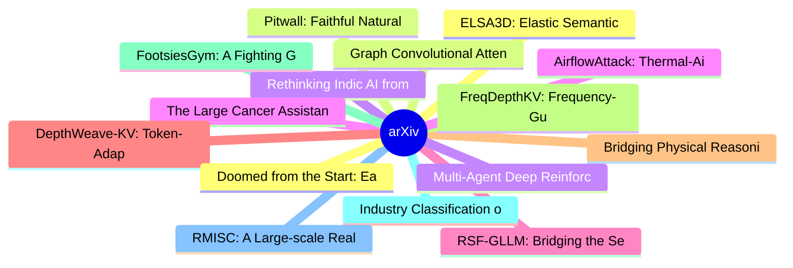

# arXiv 每日最新论文 (2026-07-08)

## 思维导图

## 列表（20 条）

### 1. ELSA3D: Elastic Semantic Anchoring for Unified 3D Understanding and Generation
- **作者**: Tianjiao Yu
- **日期**: 2026-07-07
- **链接**: [http://arxiv.org/abs/2607.06565v1](http://arxiv.org/abs/2607.06565v1)
- **摘要**: Unified 3D foundation models aspire to generate 3D assets and reason about them in language within a single backbone, but their text-3D interaction remains largely implicit. Existing methods concatenate text and 3D tokens into a flat sequence and rely on self-attention, collapsing coarse structural ...

### 2. Graph Convolutional Attention: A Spectral Perspective on Graph Denoising and Diffusion
- **作者**: Shervin Khalafi
- **日期**: 2026-07-07
- **链接**: [http://arxiv.org/abs/2607.06546v1](http://arxiv.org/abs/2607.06546v1)
- **摘要**: Denoising graphs is a fundamental problem in graph learning and the core operation of graph diffusion models. Attention-based architectures like graph transformers have recently shown promise in denoising graphs. However, our principled understanding of attention-based graph denoising remains limite...

### 3. Rethinking Indic AI from a Lens of Cultural Heritage Preservation
- **作者**: Aparna Madva
- **日期**: 2026-07-07
- **链接**: [http://arxiv.org/abs/2607.06544v1](http://arxiv.org/abs/2607.06544v1)
- **摘要**: As Artificial Intelligence (AI) makes inroads into different parts of the Indian subcontinent, there is significant interest in studying how AI impacts the linguistic and cultural foundations of this civilization. AI is seen as a ''double-edged sword'' where on the one hand, it can enable access and...

### 4. The Large Cancer Assistant (LCA): A Model-Agnostic Orchestration Framework for Scalable Clinical Decision Support in Oncology
- **作者**: Ghassen Marrakchi
- **日期**: 2026-07-07
- **链接**: [http://arxiv.org/abs/2607.06531v1](http://arxiv.org/abs/2607.06531v1)
- **摘要**: - Objective: Multimodal deep learning models in oncology are currently limited by monolithic designs that rigidly couple data ingestion, clinical routing, and artificial intelligence (AI) inference. To address this inflexibility, we propose the Large Cancer Assistant (LCA), a model-agnostic, post-ho...

### 5. RSF-GLLM: Bridging the Semantic Gap in Multi-Hop Knowledge Graph QA via Recurrent Soft-Flow and Decoupled LLM Generation
- **作者**: Sambaran Bandyopadhyay
- **日期**: 2026-07-07
- **链接**: [http://arxiv.org/abs/2607.06527v1](http://arxiv.org/abs/2607.06527v1)
- **摘要**: Multi-hop Question Answering over Knowledge Graphs faces a critical challenge: traditional retrieve-then-read pipelines break differentiability, preventing the retriever from learning to bridge the semantic gap where intermediate nodes lack lexical overlap with the query. To address this, we propose...

### 6. DepthWeave-KV: Token-Adaptive Cross-Layer Residual Factorization for Long-Context KV Cache Compression
- **作者**: Anna Cordoba
- **日期**: 2026-07-07
- **链接**: [http://arxiv.org/abs/2607.06523v1](http://arxiv.org/abs/2607.06523v1)
- **摘要**: Long-context language model inference is increasingly limited by the memory bandwidth and capacity required to store key-value caches, yet existing compression methods often apply uniform budgets across layers or tokens and degrade retrieval when lexical cues and semantic states require different pr...

### 7. Bridging Physical Reasoning and Task Generalization via Visual Action Outcome Reasoning Alignment
- **作者**: Han-Jun Ko
- **日期**: 2026-07-07
- **链接**: [http://arxiv.org/abs/2607.06522v1](http://arxiv.org/abs/2607.06522v1)
- **摘要**: Vision-language models (VLMs) struggle to generalize in interactive physical reasoning, particularly under unseen tasks and environments. Two key failure modes are prominent: hallucinated chain-of-thought (CoT) reasoning that contradicts physical reality, and misalignment between the model's reasoni...

### 8. FreqDepthKV: Frequency-Guided Depth Sharing for Robust KV Cache Compression in Long-Context LLM Inference
- **作者**: Anna Córdoba
- **日期**: 2026-07-07
- **链接**: [http://arxiv.org/abs/2607.06519v1](http://arxiv.org/abs/2607.06519v1)
- **摘要**: Long-context LLM inference is increasingly limited by the memory and bandwidth cost of KV caches, yet aggressive compression can remove the layer-specific evidence needed for retrieval and multi-step reasoning. We introduce FreqDepthKV, an inference-time cache compression method that factorizes adja...

### 9. FootsiesGym: A Fighting Game Benchmark for Two-Player Zero-Sum Imperfect-Information Games
- **作者**: Chase McDonald
- **日期**: 2026-07-07
- **链接**: [http://arxiv.org/abs/2607.06514v1](http://arxiv.org/abs/2607.06514v1)
- **摘要**: We present FootsiesGym, an open-source environment for learning in a non-trivial two-player, zero-sum, imperfect-information game. Built on HiFight's minimalist 2D fighting game Footsies, it isolates the cyclic, non-transitive strategic interactions of fighting game neutral play while remaining simp...

### 10. Industry Classification of GitHub Repositories Using the North American Industry Classification System (NAICS)
- **作者**: Kevin Xu
- **日期**: 2026-07-07
- **链接**: [http://arxiv.org/abs/2607.06505v1](http://arxiv.org/abs/2607.06505v1)
- **摘要**: GitHub hosts hundreds of millions of public repositories, but the platform exposes no native mapping from repositories to standardized industry sectors. This gap limits empirical work on the geography of innovation, the industrial composition of open-source production, and the diffusion of new techn...

### 11. RMISC: A Large-scale Real-world Multivariate Corpus for Time Series Foundation Models
- **作者**: Qian Sun
- **日期**: 2026-07-07
- **链接**: [http://arxiv.org/abs/2607.06504v1](http://arxiv.org/abs/2607.06504v1)
- **摘要**: Recent years have witnessed the emergence of multivariate modeling using time series foundation models (TSFMs), which achieve advanced zero-shot generalization. Modern multivariate TSFMs are predominantly pretrained on multivariate synthetic data, which is easier to scale but may fail to capture the...

### 12. Doomed from the Start: Early Abort of LLM Agent Episodes via a Recall-Controlled Probe Cascade
- **作者**: Kai Ruan
- **日期**: 2026-07-07
- **链接**: [http://arxiv.org/abs/2607.06503v1](http://arxiv.org/abs/2607.06503v1)
- **摘要**: Large language model (LLM) agents solving multi-step tasks frequently commit to trajectories that are doomed to fail, yet continue to consume substantial inference compute before the failure becomes observable. We show that failure is predictable early from the agent's internal representations: ligh...

### 13. Pitwall: Faithful Natural-Language Race-Strategy Briefings from a Calibrated Real-Time Monte Carlo Engine
- **作者**: Juan S. Santillana
- **日期**: 2026-07-07
- **链接**: [http://arxiv.org/abs/2607.06495v1](http://arxiv.org/abs/2607.06495v1)
- **摘要**: Live sports commentary is grounded generation under a deadline: statements concern real, named athletes, the grounding state changes every few seconds, and no reference text exists at generation time. We present Pitwall, a production system that generates natural-language Formula 1 strategy briefing...

### 14. Multi-Agent Deep Reinforcement Learning for Multi Objective Battery Management in Dairy Farms
- **作者**: Marcos Eduardo Cruz Victorio
- **日期**: 2026-07-07
- **链接**: [http://arxiv.org/abs/2607.06489v1](http://arxiv.org/abs/2607.06489v1)
- **摘要**: The dairy industry in Ireland has a large potential for the integration of renewable energy and the reduction of carbon emissions. However, researchers of distributed generation control are mainly focused on residential and commercial applications. To contribute to the effective integration of renew...

### 15. AirflowAttack: Thermal-Airflow Adversarial Perturbations against Infrared Remote-Sensing Vision-Language Models
- **作者**: Cong Su
- **日期**: 2026-07-07
- **链接**: [http://arxiv.org/abs/2607.06485v1](http://arxiv.org/abs/2607.06485v1)
- **摘要**: Vision-language models (VLMs) are increasingly deployed on infrared (IR) remote sensing imagery in security-critical settings, yet their adversarial robustness remains unexamined. We present AirflowAttack, to our knowledge the first adversarial attack for IR remote-sensing VLMs and the first to weap...

### 16. Data Analysis in the Wild: Benchmarking Large Language Models Against Real-World Data Complexities
- **作者**: So Hasegawa
- **日期**: 2026-07-07
- **链接**: [http://arxiv.org/abs/2607.06482v1](http://arxiv.org/abs/2607.06482v1)
- **摘要**: Current benchmarks for evaluating Large Language Models (LLMs) in data analysis often fail to reflect real-world settings. They typically focus on fact retrieval from small tables and overlook the challenges of large multi-tabular datasets, external knowledge integration, and exploratory insight dis...

### 17. Prompt-Adapter Context Routing for Parameter-Efficient Multi-Shot Long Video Extrapolation
- **作者**: Anna Córdoba
- **日期**: 2026-07-07
- **链接**: [http://arxiv.org/abs/2607.06481v1](http://arxiv.org/abs/2607.06481v1)
- **摘要**: We present PACR-Video, a parameter-efficient framework for multi-shot long video extrapolation that preserves recurring entities, scene structure, visual style, and causal progression without full generator fine-tuning. PACR-Video keeps a text-to-video diffusion transformer frozen and augments it wi...

### 18. A Physics-Informed Neural Network Framework for Elastodynamic Wave Propagation in Bimaterial Systems
- **作者**: Sonal Ankush Chibire
- **日期**: 2026-07-07
- **链接**: [http://arxiv.org/abs/2607.06479v1](http://arxiv.org/abs/2607.06479v1)
- **摘要**: Physics-informed neural networks (PINNs) provide a promising framework for solving partial differential equations while embedding the underlying physical laws directly into the learning process. This study presents a PINN-based framework for modeling transient elastodynamic wave propagation in bimat...

### 19. Provable learning separation for predicting time-evolution of quantum many-body systems
- **作者**: Rahul Bandyopadhyay
- **日期**: 2026-07-07
- **链接**: [http://arxiv.org/abs/2607.06472v1](http://arxiv.org/abs/2607.06472v1)
- **摘要**: Given that quantum computers are naturally suited to simulate the behavior of quantum many-body systems, an immediate question arises: can one formulate physically motivated quantum machine learning (QML) tasks that exhibit learning separations? We address this problem by studying the learnability o...

### 20. From Voting to Agent Collaboration: Answer-Type-Aware LLM Pipelines for BioASQ 14b
- **作者**: Taeyun Roh
- **日期**: 2026-07-07
- **链接**: [http://arxiv.org/abs/2607.06452v1](http://arxiv.org/abs/2607.06452v1)
- **摘要**: Biomedical question answering requires not only accurate extraction of information from scientific literature but also reliable integration of evidence across multiple documents. This study presents a question-type-specific large language model (LLM) framework for BioASQ 14b Task B, designed to impr...
