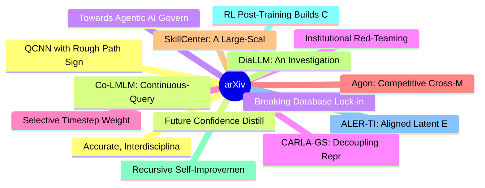

# arXiv 每日最新论文 (2026-07-09)

## 思维导图

## 列表（20 条）

### 1. Accurate, Interdisciplinary and Transparent Structure-property Understanding with Deep Native Structural Reasoning
- **作者**: Chen Tang
- **日期**: 2026-07-08
- **链接**: [http://arxiv.org/abs/2607.07708v1](http://arxiv.org/abs/2607.07708v1)
- **摘要**: Structure-property relationships are foundational to biology, chemistry and materials science, where function, reactivity and physical response emerge from spatial, chemical and periodic organization. Mechanistically explaining these relationships requires interpreting structural evidence through sc...

### 2. Co-LMLM: Continuous-Query Limited Memory Language Models
- **作者**: Yair Feldman
- **日期**: 2026-07-08
- **链接**: [http://arxiv.org/abs/2607.07707v1](http://arxiv.org/abs/2607.07707v1)
- **摘要**: Limited memory language models (LMLMs) externalize factual knowledge during pretraining to a knowledge base (KB), rather than memorizing it in their weights. During generation, the model then fetches knowledge from the KB as needed. This recently introduced paradigm provides multiple advantages, inc...

### 3. Breaking Database Lock-in: Agentic Regeneration of High Performance Storage Readers for Database Bypass
- **作者**: Victor Giannakouris
- **日期**: 2026-07-08
- **链接**: [http://arxiv.org/abs/2607.07696v1](http://arxiv.org/abs/2607.07696v1)
- **摘要**: Analytical workloads operating on data stored in external database systems face a fundamental bottleneck: data access is guarded entirely by the database driver, like JDBC or ODBC, forcing all reads through query execution and other driver layers that are not designed for bulk columnar analytics. We...

### 4. Institutional Red-Teaming: Deployment Rules, Not Just Models, Causally Shape Multi-Agent AI Safety
- **作者**: Yujiao Chen
- **日期**: 2026-07-08
- **链接**: [http://arxiv.org/abs/2607.07695v1](http://arxiv.org/abs/2607.07695v1)
- **摘要**: We introduce institutional red-teaming, an evaluation methodology for testing deployment rules in multi-agent AI: hold the agents, objectives, and task state fixed, vary only one rule, and attribute the resulting change in collective behavior to that rule. We instantiate the methodology in IABench-C...

### 5. Selective Timestep Weighting and Advantage-Based Replay for Sample-Efficient Diffusion RLHF
- **作者**: Eric Zhu
- **日期**: 2026-07-08
- **链接**: [http://arxiv.org/abs/2607.07693v1](http://arxiv.org/abs/2607.07693v1)
- **摘要**: Reinforcement learning from human feedback (RLHF) has emerged as a powerful paradigm for aligning generative models with human preferences. However, applying RLHF to diffusion models remains highly feedback inefficient, as existing approaches typically require large amounts of human or reward model ...

### 6. Agon: Competitive Cross-Model RL with Implicit Rival Grading of Reasoning
- **作者**: Vladislav Beliaev
- **日期**: 2026-07-08
- **链接**: [http://arxiv.org/abs/2607.07690v1](http://arxiv.org/abs/2607.07690v1)
- **摘要**: Reinforcement learning from verifiable rewards (e.g. GRPO) is the engine behind today's reasoning models, yet it grades only the final answer. On hard problems this trains models to write more rather than to think better, since the trace itself is never graded and no label for good thinking exists. ...

### 7. SkillCenter: A Large-Scale Source-Grounded Skill Library for Autonomous AI Agents
- **作者**: Tianming Sha
- **日期**: 2026-07-08
- **链接**: [http://arxiv.org/abs/2607.07676v1](http://arxiv.org/abs/2607.07676v1)
- **摘要**: Autonomous AI agents can execute complex tasks with limited human review, yet they often lack the grounded operational knowledge to make their outputs not just executable but correct, secure, and maintainable. We introduce SkillCenter, to our knowledge the largest open skill library for agents by to...

### 8. DiaLLM: An Investigation into the Robustness-Generation Gap in English Dialect Adaptation
- **作者**: Jordan Painter
- **日期**: 2026-07-08
- **链接**: [http://arxiv.org/abs/2607.07669v1](http://arxiv.org/abs/2607.07669v1)
- **摘要**: Large language models increasingly \emph{understand} dialectal English, yet still \emph{produce} only standard, US-leaning English, leaving dialectal generation, the harder half of the problem, largely unaddressed. We introduce \textbf{DiaLLM}, which continually pretrains three open-weight language ...

### 9. Recursive Self-Improvement in AI: From Bounded Self-Refinement to Autonomous Research Loops
- **作者**: Mingguang Chen
- **日期**: 2026-07-08
- **链接**: [http://arxiv.org/abs/2607.07663v1](http://arxiv.org/abs/2607.07663v1)
- **摘要**: AI systems increasingly participate in their own improvement: revising their outputs, adapting their own harnesses during deployment, training on data they generate, and, increasingly, conducting AI research itself. This literature is described under a vocabulary ("self-refine," "self-reward," "self...

### 10. RL Post-Training Builds Compositional Reasoning Strategies
- **作者**: Azwar Abdulsalam
- **日期**: 2026-07-08
- **链接**: [http://arxiv.org/abs/2607.07646v1](http://arxiv.org/abs/2607.07646v1)
- **摘要**: Does RL post-training merely amplify primitive skills already latent in a base model, or can it compose primitive skills into new higher-level strategies? We study this question in a fully observable rewrite-grammar environment where the pretraining distribution is known and every generated rewrite ...

### 11. ALER-TI: Aligned Latent Embedding Retrieval for Time Series Imputation
- **作者**: Xuan-Thong Truong
- **日期**: 2026-07-08
- **链接**: [http://arxiv.org/abs/2607.07640v1](http://arxiv.org/abs/2607.07640v1)
- **摘要**: Deep learning has significantly advanced time series imputation, yet most existing architectures primarily rely on localized temporal context within the corrupted input sequence. This reliance can be limiting in real-world scenarios, where time series often exhibit non-stationary dynamics, weak temp...

### 12. QCNN with Rough Path Signature Kernels
- **作者**: Leonardo Nogueira Falabella
- **日期**: 2026-07-08
- **链接**: [http://arxiv.org/abs/2607.07634v1](http://arxiv.org/abs/2607.07634v1)
- **摘要**: Time series analysis plays a vital role across a wide range of scientific and engineering domains but poses substantial computational challenges. A major difficulty arises from the time reparameterization invariance of time series data, which complicates the extraction of meaningful temporal feature...

### 13. Future Confidence Distillation in Large Language Models
- **作者**: Sahil Kale
- **日期**: 2026-07-08
- **链接**: [http://arxiv.org/abs/2607.07626v1](http://arxiv.org/abs/2607.07626v1)
- **摘要**: Reliable confidence estimation is essential for deploying large language models (LLMs) in confidence-aware systems, where downstream decisions such as retrieval, tool use, and adaptive computation depend on accurately estimating answer reliability. Existing approaches, however, largely treat confide...

### 14. Towards Agentic AI Governance: A Preliminary Assessment
- **作者**: Mubarak Raji
- **日期**: 2026-07-08
- **链接**: [http://arxiv.org/abs/2607.07612v1](http://arxiv.org/abs/2607.07612v1)
- **摘要**: Artificial intelligence is rapidly evolving from generative systems to agentic AI capable of autonomously planning and executing tasks. Widely characterized as the Year of Agentic AI, 2025 marked accelerated development and deployment, introducing new ethical and governance challenges. This paper pr...

### 15. CARLA-GS: Decoupling Representation, Reasoning, and Physics Simulation for Autonomous Driving Corner-Case Synthesis
- **作者**: Kaicong Huang
- **日期**: 2026-07-08
- **链接**: [http://arxiv.org/abs/2607.07601v1](http://arxiv.org/abs/2607.07601v1)
- **摘要**: Safety evaluation for autonomous driving is dominated by rare, safety-critical interactions, motivating simulators that can deliberately synthesize corner cases with photorealistic observations. Corner-case generation is inherently a multi-source problem spanning visual representation, scene reasoni...

### 16. Collaborative Synthetic Data Generation for Knowledge Transfer in Federated Learning
- **作者**: Maximilian Andreas Hoefler
- **日期**: 2026-07-08
- **链接**: [http://arxiv.org/abs/2607.07565v1](http://arxiv.org/abs/2607.07565v1)
- **摘要**: One-shot federated learning (OSFL) addresses the communication overhead of federated learning by limiting training to a single round, but doing so without sacrificing model quality is non-trivial, particularly when client data distributions diverge. Recent work has addressed this challenge by aggreg...

### 17. Creativity from Friction: Human-AI Interaction for Exploratory Structural Design
- **作者**: Ricardo Maia Avelino
- **日期**: 2026-07-08
- **链接**: [http://arxiv.org/abs/2607.07521v1](http://arxiv.org/abs/2607.07521v1)
- **摘要**: AI agents that generate final answers based on user input often do not meet the needs of creative fields. Fields such as structural design and architecture need interactive systems that help users externalise and develop ideas, explore alternatives, and refine partial solutions. The final product of...

### 18. Stability of Flow Models for Graph Signals
- **作者**: Martin Schmidt
- **日期**: 2026-07-08
- **链接**: [http://arxiv.org/abs/2607.07510v1](http://arxiv.org/abs/2607.07510v1)
- **摘要**: Generating signals on graphs requires permutation-equivariant models that exhibit stability with respect to relative structural perturbations. While favorable stability properties of Graph Neural Networks (GNNs) have been well documented, it is unclear how structural errors propagate through the dyn...

### 19. Single-Rollout Asynchronous Optimization for Agentic Reinforcement Learning
- **作者**: Zhenyu Hou
- **日期**: 2026-07-08
- **链接**: [http://arxiv.org/abs/2607.07508v1](http://arxiv.org/abs/2607.07508v1)
- **摘要**: Reinforcement learning (RL) is becoming increasingly important for post-training large language models (LLMs). Previous RL pipelines for LLMs were mostly synchronous and batch-interleaved, which is inefficient for long-horizon agentic tasks. Recently, asynchronous RL has emerged as a more efficient ...

### 20. HIVE: Understanding Post-Hallucination Reasoning in Vision Language Models
- **作者**: Feng He
- **日期**: 2026-07-08
- **链接**: [http://arxiv.org/abs/2607.07507v1](http://arxiv.org/abs/2607.07507v1)
- **摘要**: Hallucinations in vision language models (VLMs) are commonly treated as semantic errors, yet they often arise from partial or ambiguous visual evidence. Prior work mainly focuses on detecting or suppressing hallucinations at generation time, leaving the subsequent reasoning stage largely unexplored....
