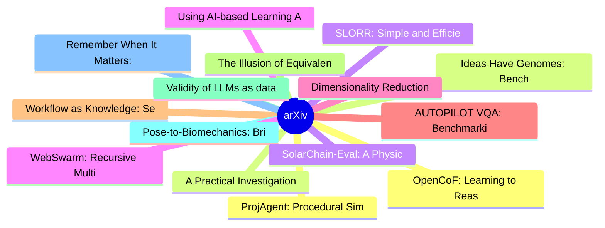

# arXiv 每日最新论文 (2026-07-11)

## 思维导图

## 列表（20 条）

### 1. OpenCoF: Learning to Reason Through Video Generation
- **作者**: Xinyan Chen
- **日期**: 2026-07-09
- **链接**: [http://arxiv.org/abs/2607.08763v1](http://arxiv.org/abs/2607.08763v1)
- **摘要**: Reasoning has become a core capability for large models, especially when reliable decisions require understanding logical consequences. Recent video generation models offer a reasoning path distinct from previous Chain-of-Thought (CoT): reasoning can unfold through temporally connected frames, known...

### 2. Ideas Have Genomes: Benchmarking Scientific Lineage Reasoning and Lineage-Grounded Idea Generation
- **作者**: Yifan Zhou
- **日期**: 2026-07-09
- **链接**: [http://arxiv.org/abs/2607.08758v1](http://arxiv.org/abs/2607.08758v1)
- **摘要**: Scientific ideas rarely start from a blank page. They inherit mechanisms, repair known limitations, and recombine pieces of earlier work, much like biological genomes. Current benchmarks still say little about whether AI systems can follow this inheritance structure. We present IdeaGene-Bench (IG-Be...

### 3. SLORR: Simple and Efficient In-Training Low-Rank Regularization
- **作者**: David González-Martínez
- **日期**: 2026-07-09
- **链接**: [http://arxiv.org/abs/2607.08754v1](http://arxiv.org/abs/2607.08754v1)
- **摘要**: Low-rank factorization is widely used to compress neural networks, but modern models are often not naturally amenable to aggressive factorization without significant accuracy loss. Existing training-time low-rank regularizers can improve compressibility, but they often require SVDs of large weight m...

### 4. Using AI-based Learning Assistants in Higher Education: A Large-Scale Descriptive Analysis
- **作者**: Kristina Schaaff
- **日期**: 2026-07-09
- **链接**: [http://arxiv.org/abs/2607.08748v1](http://arxiv.org/abs/2607.08748v1)
- **摘要**: In this study, we present a large-scale descriptive analysis of the use of an AI-based learning assistant (Syntea) in higher education. Based on objective log data from 77,543 students enrolled in distance studies, we examine usage patterns across gender, age group, study cluster, degree, and study ...

### 5. Dimensionality Reduction Meets Network Science: Sensemaking on UMAP's kNN Graph
- **作者**: Duen Horng Chau
- **日期**: 2026-07-09
- **链接**: [http://arxiv.org/abs/2607.08746v1](http://arxiv.org/abs/2607.08746v1)
- **摘要**: While UMAP is widely used for exploring high-dimensional data, typical workflows focus on its lower-dimensional embedding, largely overlooking the rich k-nearest-neighbor (kNN) graph that UMAP constructs internally. This graph encodes the data manifold in its original high-dimensional space, before ...

### 6. AUTOPILOT VQA: Benchmarking Vision-Language Models for Incident-Centric Dashcam Understanding
- **作者**: Siddharth Damodharan
- **日期**: 2026-07-09
- **链接**: [http://arxiv.org/abs/2607.08745v1](http://arxiv.org/abs/2607.08745v1)
- **摘要**: Recent advances in Vision-Language Models, Large Language Models, and Multimodal Large Language Models have improved autonomous driving tasks such as scene understanding, decision making, trajectory prediction, and visual question answering. However, evaluating whether these models can reliably reas...

### 7. Workflow as Knowledge: Semantic Persistence for LLM-Mediated Workflows
- **作者**: Emanuele Quinto
- **日期**: 2026-07-09
- **链接**: [http://arxiv.org/abs/2607.08740v1](http://arxiv.org/abs/2607.08740v1)
- **摘要**: Large language model (LLM) applications increasingly use explicit workflows for tool use, retrieval, branching, checkpointing, and human approval. Existing workflow systems already address many execution concerns. This paper proposes a Lisp-inspired but language-independent conceptual model: symboli...

### 8. The Illusion of Equivalency: Statistical Characterization of Quantization Effects in LLMs
- **作者**: Baha Rababah
- **日期**: 2026-07-09
- **链接**: [http://arxiv.org/abs/2607.08734v1](http://arxiv.org/abs/2607.08734v1)
- **摘要**: Post-training quantization is widely used to deploy large language models in resource-constrained settings, yet its evaluation relies almost exclusively on accuracy and perplexity. We show that these metrics fail to capture behavioral changes induced by quantization. We introduce correctness agreeme...

### 9. Validity of LLMs as data annotators: AMALIA on authority
- **作者**: Manuel Pita
- **日期**: 2026-07-09
- **链接**: [http://arxiv.org/abs/2607.08731v1](http://arxiv.org/abs/2607.08731v1)
- **摘要**: A national language model offers a linguistic community its own instrument for measuring what its citizens say and value. Portugal's AMALIA, a publicly funded 9B-parameter model for European Portuguese, appears competitive on agreement alone: asked to code the moral foundation of authority, it agree...

### 10. Pose-to-Biomechanics: Bridging 3D Human Pose Estimation and Biomechanical Attribute Prediction
- **作者**: Ayda Eghbalian
- **日期**: 2026-07-09
- **链接**: [http://arxiv.org/abs/2607.08725v1](http://arxiv.org/abs/2607.08725v1)
- **摘要**: Recent progress in 3D human pose estimation has made markerless recovery of skeletal motion increasingly accurate and scalable. However, most pose estimators remain optimized for geometric keypoint accuracy, while many real-world applications in rehabilitation, sports science, ergonomics, and clinic...

### 11. Remember When It Matters: Proactive Memory Agent for Long-Horizon Agents
- **作者**: Yifan Wu
- **日期**: 2026-07-09
- **链接**: [http://arxiv.org/abs/2607.08716v1](http://arxiv.org/abs/2607.08716v1)
- **摘要**: In long-horizon tasks, decision-relevant state is often scattered across an expanding trajectory, while the action agent must surface it and act. As trajectories grow, task requirements, environment facts, prior attempts, diagnoses, and open subgoals can be buried in the context window or pushed bey...

### 12. ProjAgent: Procedural Similarity Retrieval for Repository-Level Code Generation
- **作者**: QiHong Chen
- **日期**: 2026-07-09
- **链接**: [http://arxiv.org/abs/2607.08691v1](http://arxiv.org/abs/2607.08691v1)
- **摘要**: Repository-level code generation requires implementing target functions while accounting for complex cross-file dependencies and project-specific conventions. Existing retrieval methods predominantly rely on lexical, structural, or semantic similarity, often overlooking repository functions that imp...

### 13. A Practical Investigation of Training-free Relaxed Speculative Decoding
- **作者**: Guoxuan Xia
- **日期**: 2026-07-09
- **链接**: [http://arxiv.org/abs/2607.08690v1](http://arxiv.org/abs/2607.08690v1)
- **摘要**: Speculative decoding accelerates sampling from an autoregressive LLM by using a faster auxiliary model to draft tokens which are then verified in parallel by the LLM. Standard speculative decoding is lossless: its rejection and resampling steps exactly preserve the LLM's sampling distribution. Recen...

### 14. SolarChain-Eval: A Physics-Constrained Benchmark for Trustworthy Economic Agents in Decentralized Energy Markets
- **作者**: Shilin Ou
- **日期**: 2026-07-09
- **链接**: [http://arxiv.org/abs/2607.08681v1](http://arxiv.org/abs/2607.08681v1)
- **摘要**: As agentic AI systems are increasingly applied to cyber-physical environments, their evaluation requires assessment of both task performance and trustworthiness. In decentralized energy markets, autonomous agents may improve market utility, but may also exploit invalid physical data, create artifici...

### 15. WebSwarm: Recursive Multi-Agent Orchestration for Deep-and-Wide Web Search
- **作者**: Xiaoshuai Song
- **日期**: 2026-07-09
- **链接**: [http://arxiv.org/abs/2607.08662v1](http://arxiv.org/abs/2607.08662v1)
- **摘要**: Large language model (LLM)-based web search agents are transforming information seeking from simple factoid question answering into complex, deep-and-wide search and research-oriented tasks. A single ReAct-style agent is constrained by one long trajectory and limited context, making it difficult to ...

### 16. Formal Mechanisms for Market Stability in Self-Interested Agent Societies: A Marketplace Simulation Study
- **作者**: Eugene Ng Yi Sheng
- **日期**: 2026-07-09
- **链接**: [http://arxiv.org/abs/2607.08652v1](http://arxiv.org/abs/2607.08652v1)
- **摘要**: Self-interested agents, left unconstrained, tend toward defection in repeated social dilemmas, causing cooperative gains from trade to collapse. This paper investigates what formal mechanisms, layered on top of unrestricted communication, are sufficient for a society of such agents to maintain marke...

### 17. Multi-Modal, Multi-Environment Machine Teaching for Robust Reward Learning
- **作者**: Ali Larian
- **日期**: 2026-07-09
- **链接**: [http://arxiv.org/abs/2607.08647v1](http://arxiv.org/abs/2607.08647v1)
- **摘要**: As autonomous agents are increasingly deployed across diverse operational contexts, aligning their behavior with human intent demands reward functions that remain robust to such changes rather than overfitting to any single environment. Inverse reinforcement learning (IRL) provides a principled way ...

### 18. UltraX: Refining Pre-Training Data at Scale with Adaptive Programmatic Editing
- **作者**: Xinlong Zhao
- **日期**: 2026-07-09
- **链接**: [http://arxiv.org/abs/2607.08646v1](http://arxiv.org/abs/2607.08646v1)
- **摘要**: As available training data approaches its physical limit, gains from Scaling Laws have begun to diminish. Consequently, improving Large Language Models (LLMs) now depends less on data expansion and more on higher-quality data utilization. However, in the context of large-scale corpora, existing refi...

### 19. The complexities of patient-centred conversational artificial intelligence
- **作者**: João Matos
- **日期**: 2026-07-09
- **链接**: [http://arxiv.org/abs/2607.08625v1](http://arxiv.org/abs/2607.08625v1)
- **摘要**: Consumer-facing health chatbots powered by large language models (LLMs) are increasingly used for symptom assessment. However, chatbot development and evaluation often rely on cooperative, articulate, simulated patients. We analysed 2,053 real patient-chatbot conversations and found that communicati...

### 20. When Structured Sparse Autoencoders Learn Consistent Concepts Across Modalities
- **作者**: Weiduo Liao
- **日期**: 2026-07-09
- **链接**: [http://arxiv.org/abs/2607.08605v1](http://arxiv.org/abs/2607.08605v1)
- **摘要**: Sparse autoencoders (SAEs) have emerged as a promising technique for mechanistic interpretability by learning a set of sparse latent features in large models, each of which encodes a distinct concept. However, in vision-language models (VLMs), vanilla SAEs struggle to learn modality-consistent conce...
