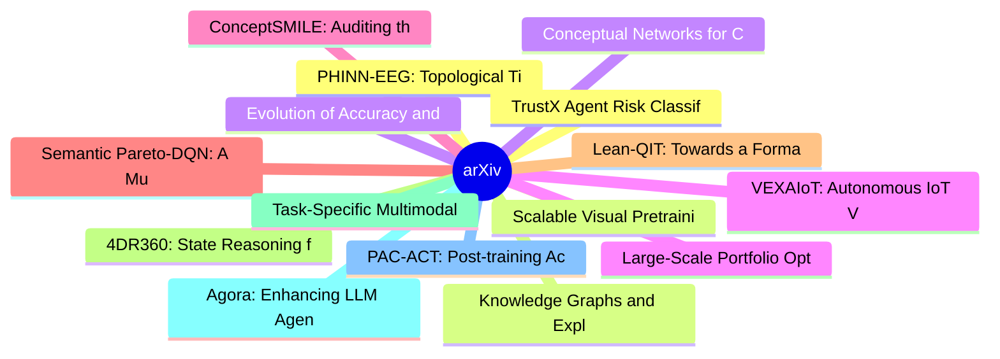

# arXiv 每日最新论文 (2026-07-13)

## 思维导图

## 列表（20 条）

### 1. PHINN-EEG: Topological Time-Series Analysis of Dream-State EEG -- Dynamic Betti Curves for Dream Content Classification and Topology-Conditioned Neural Signal Synthesis
- **作者**: Ren Takahashi
- **日期**: 2026-07-10
- **链接**: [http://arxiv.org/abs/2607.09662v1](http://arxiv.org/abs/2607.09662v1)
- **摘要**: Current electroencephalography (EEG)-based dream detection relies on power spectral density (PSD) and statistical moment features, achieving a state-of-the-art area under the receiver operating characteristic curve (AUC) of approximately 0.70 on the DREAM database (Wong et al., 2025, Nature Communic...

### 2. Scalable Visual Pretraining for Language Intelligence
- **作者**: Yiming Zhang
- **日期**: 2026-07-10
- **链接**: [http://arxiv.org/abs/2607.09657v1](http://arxiv.org/abs/2607.09657v1)
- **摘要**: The rapid progress of large foundation models has been driven predominantly by pretraining on large-scale text corpora. However, many forms of knowledge are conveyed through visual representations, where figures, typeset equations, and page layouts carry rich information that cannot be faithfully or...

### 3. Evolution of Accuracy and Visual-Cognitive Errors in a Decade of Vision-Language AI Models
- **作者**: Shravan Murlidaran
- **日期**: 2026-07-10
- **链接**: [http://arxiv.org/abs/2607.09654v1](http://arxiv.org/abs/2607.09654v1)
- **摘要**: Vision language models (VLMs) have made remarkable progress in visual reasoning during the last decade. Most evaluations have used simple scenes (MS-COCO) that do not showcase complex human interactions or behaviors, only a handful of non-curated human descriptions as a benchmark, and have not focus...

### 4. VEXAIoT: Autonomous IoT Vulnerability EXploitation using AI Agents
- **作者**: Katherine Swinea
- **日期**: 2026-07-10
- **链接**: [http://arxiv.org/abs/2607.09653v1](http://arxiv.org/abs/2607.09653v1)
- **摘要**: Internet of Things (IoT) systems are inherently vulnerable due to constrained hardware, outdated firmware, and insecure default configurations, creating a need for scalable and adaptive security testing approaches. While recent adoptions of Large Language Model (LLM) agents have demonstrated promise...

### 5. ConceptSMILE: Auditing the Trustworthiness of Concept-Based Explainable AI
- **作者**: Mohadeseh Mollapour
- **日期**: 2026-07-10
- **链接**: [http://arxiv.org/abs/2607.09649v1](http://arxiv.org/abs/2607.09649v1)
- **摘要**: Concept-based explainable artificial intelligence (AI) can make model reasoning more human-understandable, but concept-level outputs are not automatically trustworthy. We introduce ConceptSMILE, a model-agnostic perturbation-based auditing framework for evaluating the reliability of concept-based ex...

### 6. Semantic Pareto-DQN: A Multi-Objective Reinforcement Learning Framework for Financial Anomaly Detection
- **作者**: Cláudio Lúcio do Val Lopes
- **日期**: 2026-07-10
- **链接**: [http://arxiv.org/abs/2607.09641v1](http://arxiv.org/abs/2607.09641v1)
- **摘要**: Financial anomaly detection suffers from extreme class imbalance, causing traditional single-objective algorithms to exhibit ``fraud collapse'', defaulting to the majority class and failing to balance anomaly interdiction with customer friction. To overcome this without distortive data resampling, w...

### 7. Lean-QIT: Towards a Formal Infrastructure for Quantum Information Theory
- **作者**: Chengkai Zhu
- **日期**: 2026-07-10
- **链接**: [http://arxiv.org/abs/2607.09632v1](http://arxiv.org/abs/2607.09632v1)
- **摘要**: Quantum information theory (QIT) characterizes the capabilities and fundamental limits of quantum information processing, underpinning quantum communication, computation, and error correction. Formalizing its coding theorems requires connecting finite-block protocols, analytic inequalities, and asym...

### 8. 4DR360: State Reasoning for Joint 3D Detection and Occupancy Prediction in 4D Radar-Camera Full-Scene Perception
- **作者**: Xiaokai Bai
- **日期**: 2026-07-10
- **链接**: [http://arxiv.org/abs/2607.09629v1](http://arxiv.org/abs/2607.09629v1)
- **摘要**: Reliable autonomous driving requires full-scene perception that couples foreground objects with dense semantic layout. Recently, 4D millimeter-wave radar has emerged as a robust and affordable sensor, yet its sparse returns make radar-camera fusion necessary for comprehensive scene understanding. Ex...

### 9. Task-Specific Multimodal Question Answering Agents via Confidence Calibration and Incremental Reasoning for QANTA 2026
- **作者**: Nirjhar Das
- **日期**: 2026-07-10
- **链接**: [http://arxiv.org/abs/2607.09623v1](http://arxiv.org/abs/2607.09623v1)
- **摘要**: We present our submission to the QANTA 2026 shared challenge at the ICML 2026 Workshop on Efficient Multimodal Question Answering (EMM-QA). Quanta evaluates multimodal quizbowl systems that answer pyramid-style questions from incrementally revealed text and accompanying images while operating under ...

### 10. Agora: Enhancing LLM Agent Reasoning Via Auction-Based Task Allocation
- **作者**: Kaiji Zhou
- **日期**: 2026-07-10
- **链接**: [http://arxiv.org/abs/2607.09600v1](http://arxiv.org/abs/2607.09600v1)
- **摘要**: Enhancing the reasoning capabilities of large language model (LLM) agents requires effective orchestration of diverse expert models and tools. However, existing frameworks typically call APIs based on coarse-grained matching between tasks and the functions of expert models or tools, while overlookin...

### 11. PAC-ACT: Post-training Actor-Critic for Action Chunking Transformers
- **作者**: Yujie Pang
- **日期**: 2026-07-10
- **链接**: [http://arxiv.org/abs/2607.09590v1](http://arxiv.org/abs/2607.09590v1)
- **摘要**: Precision industrial contact manipulation requires reliable robot policies under pose perturbations and contact-force constraints. Vision-language-action models offer broad generalization but often introduce high inference latency and GPU-memory cost, while vision-action chunking policies are more s...

### 12. TrustX Agent Risk Classification Framework (ARC): Risk-Tiering Internally Created Agentic AI Systems
- **作者**: Hannah M. Liu
- **日期**: 2026-07-10
- **链接**: [http://arxiv.org/abs/2607.09586v1](http://arxiv.org/abs/2607.09586v1)
- **摘要**: The proliferation of agentic AI systems across enterprise and public-sector contexts has outpaced the capacity of general-purpose AI risk frameworks to classify and govern them. In this paper, we introduce the TrustX Agent Risk Classification Framework, a structured, repeatable instrument that can b...

### 13. Knowledge Graphs and Explainable AI as Complementary Resources for Urban Mining
- **作者**: Jan Gronewald
- **日期**: 2026-07-10
- **链接**: [http://arxiv.org/abs/2607.09578v1](http://arxiv.org/abs/2607.09578v1)
- **摘要**: Pre-demolition assessment, the regulated audit process at the heart of urban mining, is an information process in which AI support must serve qualified auditors who remain accountable for the decisions taken. The relevant unit of value is not prediction accuracy alone, but the defensibility of the s...

### 14. Conceptual Networks for Cross-Linguistic Idiomatic Expressions:A Feature-Based Graph Approach
- **作者**: Kiran Pala
- **日期**: 2026-07-10
- **链接**: [http://arxiv.org/abs/2607.09576v1](http://arxiv.org/abs/2607.09576v1)
- **摘要**: We present an interpretable network-based framework for representing idiomatic and figurative meaning across eight typologically diverse languages, totaling 160 conventional expressions, the large majority of which are idiomatic. Each expression is annotated with binary conceptual features (containm...

### 15. Large-Scale Portfolio Optimization Problem Under Cardinality Constraint With Enhanced Multi-Objective Evolutionary Algorithms
- **作者**: Danial Ramezani
- **日期**: 2026-07-10
- **链接**: [http://arxiv.org/abs/2607.09566v1](http://arxiv.org/abs/2607.09566v1)
- **摘要**: Decision-making is posing an increasingly formidable challenge to investors because of the growing number of alternatives available in financial markets. A hot area of research over the past few decades has been portfolio optimization that seeks to determine how much an investor should invest in whi...

### 16. TCLA: Training-Free Class-wise Logit Adaptation for Medical Vision-Language Models
- **作者**: Tianyou Jiang
- **日期**: 2026-07-10
- **链接**: [http://arxiv.org/abs/2607.09562v1](http://arxiv.org/abs/2607.09562v1)
- **摘要**: Medical Vision-Language Models (VLMs) exhibit strong zero-shot performance, yet their effectiveness still declines on out-of-distribution (OOD) data due to domain shifts and class bias inherited from large-scale pretraining. Existing few-shot adaptation methods typically introduce additional trainab...

### 17. Beyond Fixed Representations: The Vocabulary and Verifier Gaps in Open-Ended AI
- **作者**: Yuan Cao
- **日期**: 2026-07-10
- **链接**: [http://arxiv.org/abs/2607.09560v1](http://arxiv.org/abs/2607.09560v1)
- **摘要**: Modern AI systems are increasingly being evaluated for their ability to reason, code, prove theorems, use tools, and long-horizon research tasks. These are powerful capabilities, but they share a structural limitation: the representational frame within which the model operates, including its concept...

### 18. ALICE: Learning a General-Purpose Pathology Foundation Model from Vision, Vision-Language, and Slide-Level Experts
- **作者**: Jiawen Li
- **日期**: 2026-07-10
- **链接**: [http://arxiv.org/abs/2607.09526v1](http://arxiv.org/abs/2607.09526v1)
- **摘要**: Foundation models are reshaping computational pathology, yet their capabilities remain shaped by pretraining objectives, data sources, and spatial scales, fragmenting complementary expertise across separate backbones. Here we present ALICE, a unified foundation model trained through multi-stage aggl...

### 19. SAGEAgent: A Self-Evolving Agent for Cost-Aware Modality Acquisition in Multimodal Survival Prediction
- **作者**: Chongyu Qu
- **日期**: 2026-07-10
- **链接**: [http://arxiv.org/abs/2607.09521v1](http://arxiv.org/abs/2607.09521v1)
- **摘要**: Does every cancer patient truly need a complete diagnostic workup for accurate survival prediction? In multimodal clinical oncology, diagnostic modalities follow a clinically mandated order of escalating burden -- from demographics collected at intake to genomic profiling requiring specialized tissu...

### 20. Seeing is Free, Speaking is Not: Uncovering the True Energy Bottleneck in Edge VLM Inference
- **作者**: Junfei Zhan
- **日期**: 2026-07-10
- **链接**: [http://arxiv.org/abs/2607.09520v1](http://arxiv.org/abs/2607.09520v1)
- **摘要**: Vision-Language Models (VLMs) are the perceptual backbone of embodied AI, but their energy footprint on edge hardware remains poorly understood. Existing efficiency efforts focus predominantly on reducing visual tokens, implicitly treating visual processing as the dominant energy cost. We overturn t...
