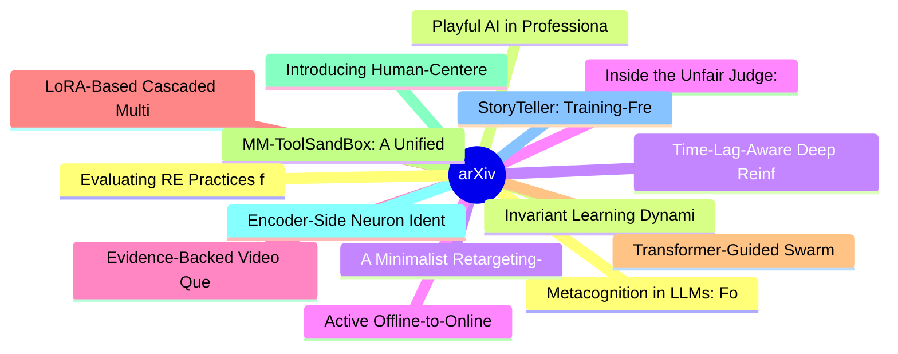

# arXiv 每日最新论文 (2026-07-14)

## 思维导图

## 列表（20 条）

### 1. Metacognition in LLMs: Foundations, Progress, and Opportunities
- **作者**: Gabrielle Kaili-May Liu
- **日期**: 2026-07-13
- **链接**: [http://arxiv.org/abs/2607.11881v1](http://arxiv.org/abs/2607.11881v1)
- **摘要**: Metacognition is a foundational component of intelligence critical to effective learning, problem solving, decision-making, communication, and more. In recent years, it has become increasingly recognized as a cornerstone of capable, transparent AI systems. Yet while LLMs have made significant progre...

### 2. Invariant Learning Dynamics of Transformers in Inductive Reasoning Tasks
- **作者**: Tiberiu Musat
- **日期**: 2026-07-13
- **链接**: [http://arxiv.org/abs/2607.11875v1](http://arxiv.org/abs/2607.11875v1)
- **摘要**: We present a theoretical framework to explain the emergence of inductive reasoning abilities in Transformer language models. While previous works on Transformer learning dynamics have so far been mostly tied to specific tasks, we study a generalized class of inductive tasks that unifies several synt...

### 3. A Minimalist Retargeting-Guided Reinforcement Learning Recipe for Dexterous Manipulation
- **作者**: Yunhai Feng
- **日期**: 2026-07-13
- **链接**: [http://arxiv.org/abs/2607.11874v1](http://arxiv.org/abs/2607.11874v1)
- **摘要**: Recent work in humanoid whole-body control has found success with a simple recipe: retarget human motion to robot kinematic references, then train policies via reinforcement learning (RL) to track them. But how does this recipe transfer to dexterous manipulation? The answer is not obvious, as manipu...

### 4. Inside the Unfair Judge: A Mechanistic Interpretability Account of LLM-as-Judge Bias
- **作者**: Zixiang Xu
- **日期**: 2026-07-13
- **链接**: [http://arxiv.org/abs/2607.11871v1](http://arxiv.org/abs/2607.11871v1)
- **摘要**: Existing studies of LLM-as-judge scoring bias work predominantly at the input-output level: they perturb inputs, measure score deltas, and propose prompt-level mitigations. We argue that the same biases admit a representation-level account in the judge's hidden state, complementary to the input-outp...

### 5. Evidence-Backed Video Question Answering
- **作者**: Shijie Wang
- **日期**: 2026-07-13
- **链接**: [http://arxiv.org/abs/2607.11862v1](http://arxiv.org/abs/2607.11862v1)
- **摘要**: Current Video Large Language Models (Video LLMs) excel in question answering (QA) but largely operate as black boxes, providing textual answers without verifiable visual grounding. Existing explainability efforts rely on textual rationales or sparse bounding boxes, which struggle to capture complex ...

### 6. LoRA-Based Cascaded Multimodal Fusion for Action Recognition in Medical Training Environments
- **作者**: Divya Mereddy
- **日期**: 2026-07-13
- **链接**: [http://arxiv.org/abs/2607.11839v1](http://arxiv.org/abs/2607.11839v1)
- **摘要**: This paper presents a cascaded Low-Rank Adaptation (LoRA)-based multimodal fusion framework for action and activity recognition in healthcare-oriented training environments. The proposed architecture combines parameter-efficient modality-specific adaptation with sequential fusion, enabling modalitie...

### 7. Transformer-Guided Swarm Intelligence for Frugal Neural Architecture Search
- **作者**: Romain Amigon
- **日期**: 2026-07-13
- **链接**: [http://arxiv.org/abs/2607.11826v1](http://arxiv.org/abs/2607.11826v1)
- **摘要**: Neural Architecture Search (NAS) has automated the design of deep learning models but traditionally requires massive computational resources, often measured in thousands of GPU-days. In this paper, we propose a frugal and memetic NAS framework designed to democratize architecture design on consumer-...

### 8. MM-ToolSandBox: A Unified Framework for Evaluating Visual Tool-Calling Agents
- **作者**: Kaixin Ma
- **日期**: 2026-07-13
- **链接**: [http://arxiv.org/abs/2607.11818v1](http://arxiv.org/abs/2607.11818v1)
- **摘要**: We introduce MM-ToolSandBox, a benchmark and evaluation framework for visually grounded tool-calling agents. The framework provides a stateful execution environment spanning 500+ tools across 16 application domains, supporting multi-image, multi-turn tasks where agents must ground progressively arri...

### 9. Introducing Human-Centeredness in AI-Assisted Lexicography
- **作者**: Antonio San Martin
- **日期**: 2026-07-13
- **链接**: [http://arxiv.org/abs/2607.11808v1](http://arxiv.org/abs/2607.11808v1)
- **摘要**: This paper proposes a human-centered artificial intelligence (HCAI) framework for AI-assisted lexicography. While generative AI offers significant opportunities to enhance lexicographic work, it also raises concerns regarding the future role of lexicographers and the preservation of linguistic and c...

### 10. Encoder-Side Neuron Identification and Amplification for Acoustic Perception in Large Audio-Language Models
- **作者**: Yu-Han Huang
- **日期**: 2026-07-13
- **链接**: [http://arxiv.org/abs/2607.11801v1](http://arxiv.org/abs/2607.11801v1)
- **摘要**: Large audio-language models (LALMs) often underperform on fine-grained, non-semantic attributes of speech, such as a speaker's emotion, despite strong performance on speech content. Improving this without the cost of retraining calls for an effective inference-time intervention, yet most existing me...

### 11. StoryTeller: Training-Free Narrative Grounding for Long-Form Audio Description
- **作者**: Seung Hyun Hahm
- **日期**: 2026-07-13
- **链接**: [http://arxiv.org/abs/2607.11798v1](http://arxiv.org/abs/2607.11798v1)
- **摘要**: Long-form audio description (AD) requires more than describing visible actions: it must preserve characters, events, relationships, and story context across scenes so that blind and low-vision (BLV) audiences can follow a film. Modern video-language models (VLMs) are effective on short clips, but th...

### 12. Evaluating RE Practices for Explainability: Synthesizing Insights from Daimler Truck into an Explainable RE Framework Proposal
- **作者**: Umm-e- Habiba
- **日期**: 2026-07-13
- **链接**: [http://arxiv.org/abs/2607.11771v1](http://arxiv.org/abs/2607.11771v1)
- **摘要**: Explainability has emerged as a critical requirement for AI-based systems, particularly in safety-critical and regulated domains. Although prior research has proposed frameworks, patterns, and user-centered approaches to support explainability, there is limited empirical understanding of how existin...

### 13. Playful AI in Professional Email: A Field Experiment on Tone and Recipient Engagement
- **作者**: Ziv Ben-Zion
- **日期**: 2026-07-13
- **链接**: [http://arxiv.org/abs/2607.11749v1](http://arxiv.org/abs/2607.11749v1)
- **摘要**: Large language models (LLMs) are rapidly reshaping workplace communication, yet whether AI-assisted writing changes how recipients actually behave, and through what channel, remains unknown. Here, in a randomized crossover field experiment, 121 employees across six companies sent work emails under t...

### 14. Time-Lag-Aware Deep Reinforcement Learning for Flexible Job-Shop Scheduling in PPVC Module Factories
- **作者**: Ziheng Zhang
- **日期**: 2026-07-13
- **链接**: [http://arxiv.org/abs/2607.11725v1](http://arxiv.org/abs/2607.11725v1)
- **摘要**: Prefabricated prefinished volumetric construction moves most building work into module factories, whose production floor operates as a flexible job shop. A major complication is decisive: long post-operation time-lags caused by concrete curing, watertightness ponding tests, and paint drying, during ...

### 15. Active Offline-to-Online Reinforcement Learning
- **作者**: Alper Kamil Bozkurt
- **日期**: 2026-07-13
- **链接**: [http://arxiv.org/abs/2607.11720v1](http://arxiv.org/abs/2607.11720v1)
- **摘要**: Background: Offline reinforcement learning (RL) enables effective policies to be trained from large, previously collected datasets and subsequently improved through limited online interaction. This offline-to-online RL (O2O-RL) paradigm is particularly promising in nonstationary domains where intera...

### 16. An Explainable Agentic System for Detection of Conversational Scams with Summary-Based Memory
- **作者**: Ahmed Omar Salim Adnan
- **日期**: 2026-07-13
- **链接**: [http://arxiv.org/abs/2607.11707v1](http://arxiv.org/abs/2607.11707v1)
- **摘要**: Following the rapid progress of generative Artificial Intelligence, there is a growing threat posed by conversational scams. These scams often span over multiple weeks or months, gradually build trust and request for money or sensitive information. Existing scam-detection systems mainly focus on iso...

### 17. VoxENES 2026: Benchmarking Generalization of Speech Spoofing Detectors Against LLM-Era TTS and Voice Conversion
- **作者**: Aastha Sharma
- **日期**: 2026-07-13
- **链接**: [http://arxiv.org/abs/2607.11706v1](http://arxiv.org/abs/2607.11706v1)
- **摘要**: Modern LLM-driven text-to-speech (TTS) and voice conversion (VC) systems produce synthetic speech that differs from the generators represented in many legacy spoofing benchmarks. This mismatch creates a temporal generalization gap that can overestimate detector robustness under real-world post-proce...

### 18. Agent Hacks Agent: Autoresearch for Production-Agent Red-Teaming
- **作者**: Xutao Mao
- **日期**: 2026-07-13
- **链接**: [http://arxiv.org/abs/2607.11698v1](http://arxiv.org/abs/2607.11698v1)
- **摘要**: Production LLM agents such as Claude Code and Codex operate over untrusted content, files, commands, and workspace state, making safety failures directly actionable. Red-teaming must therefore keep pace with evolving models and tools. Existing approaches mainly optimize attack success and preserve a...

### 19. Think Through a Bottleneck: Hourglass Reasoning for Rigorous Induction
- **作者**: Huan Zhu
- **日期**: 2026-07-13
- **链接**: [http://arxiv.org/abs/2607.11696v1](http://arxiv.org/abs/2607.11696v1)
- **摘要**: Self-refinement often fails to strengthen few-shot inductive reasoning in large language models. Prompting a model to explicitly state its inferred rule does little on its own. What actually matters is a structurally enforced isolation between reasoning stages, so that information can only pass betw...

### 20. From World Action Models to Embodied Brains: A Roadmap for Open-World Physical Intelligence
- **作者**: Yuanzhi Liang
- **日期**: 2026-07-13
- **链接**: [http://arxiv.org/abs/2607.11689v1](http://arxiv.org/abs/2607.11689v1)
- **摘要**: Artificial general intelligence ultimately requires agents that can reason and act in the physical world. Action models, vision-language-action policies, and world models have advanced this goal, while World Action Models (WAMs) are particularly promising because they connect candidate interventions...
