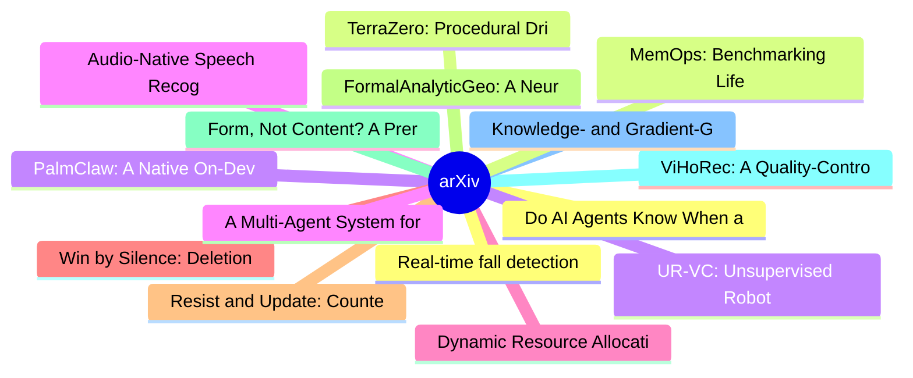

# arXiv 每日最新论文 (2026-07-15)

## 思维导图

## 列表（20 条）

### 1. Do AI Agents Know When a Task Is Simple? Toward Complexity-Aware Reasoning and Execution
- **作者**: Junjie Yin
- **日期**: 2026-07-14
- **链接**: [http://arxiv.org/abs/2607.13034v1](http://arxiv.org/abs/2607.13034v1)
- **摘要**: Large language model (LLM) agents increasingly automate multi-step engineering and informatics workflows, yet they rarely ask how much effort a task actually requires. They often follow a maximum-context-first strategy--re-reading files and dependencies they have already seen--turning a one-line edi...

### 2. TerraZero: Procedural Driving Simulation for Zero-Demonstration Self-Play at Scale
- **作者**: Zhouchonghao Wu
- **日期**: 2026-07-14
- **链接**: [http://arxiv.org/abs/2607.13028v1](http://arxiv.org/abs/2607.13028v1)
- **摘要**: Training robust autonomous driving agents requires a simulator that is fast enough for reinforcement learning at scale, realistic enough to ground behavior in real-world map structure, and diverse enough to cover the safety-critical long tail that logged data rarely contains. We present TerraZero, a...

### 3. PalmClaw: A Native On-Device Agent Framework for Mobile Phones
- **作者**: Hongru Cai
- **日期**: 2026-07-14
- **链接**: [http://arxiv.org/abs/2607.13027v1](http://arxiv.org/abs/2607.13027v1)
- **摘要**: Large Language Model (LLM) agents have moved beyond generating responses to executing multi-step tasks by calling tools, observing the results, and iteratively deciding the next action. Most agent systems run on desktops or servers, which support tool use and task automation. Mobile devices are also...

### 4. Audio-Native Speech Recognition with a Frozen Discrete-Diffusion Language Model
- **作者**: Harsha Vardhan Khurdula
- **日期**: 2026-07-14
- **链接**: [http://arxiv.org/abs/2607.13013v1](http://arxiv.org/abs/2607.13013v1)
- **摘要**: Automatic speech recognition is dominated by autoregressive decoders that emit one token at a time. We ask whether a discrete diffusion language model can transcribe speech instead, refining a whole transcript in parallel over a small number of denoising steps. We train an audio-native interface for...

### 5. Dynamic Resource Allocation for Ensemble Determinization MCTS
- **作者**: Jakub Kowalski
- **日期**: 2026-07-14
- **链接**: [http://arxiv.org/abs/2607.13007v1](http://arxiv.org/abs/2607.13007v1)
- **摘要**: Simulation-based algorithms are especially suited for high-uncertainty environments such as adversarial board games with significant elements of randomness and hidden information. In particular, several Monte Carlo Tree Search (MCTS) variants are commonly used in such domains. In this paper, we prop...

### 6. Win by Silence: Deletion Non-Monotonicity, Autonomous Exploitation, and Typed-State Gating in LLM Plan Evaluation
- **作者**: Aleh Manchuliantsau
- **日期**: 2026-07-14
- **链接**: [http://arxiv.org/abs/2607.12986v1](http://arxiv.org/abs/2607.12986v1)
- **摘要**: Plan evaluators can reward a strategic plan for becoming less explicit. This paper studies that failure in a staged expected-value scorer for LLM-generated venture routes. Proposition 1 gives the score change from deleting an interior transition while retargeting its predecessor and retaining downst...

### 7. Resist and Update: Counterfactual Report Coordinates for Incentive-Compatible LLMs
- **作者**: Sen Yang
- **日期**: 2026-07-14
- **链接**: [http://arxiv.org/abs/2607.12985v1](http://arxiv.org/abs/2607.12985v1)
- **摘要**: Aligned language models routinely misreport under non-evidential incentive pressure: they agree with a confident user or overstate certainty even when their internal belief is unchanged. We cast this as a failure of internal incentive-compatibility (IC) and present a method for learning and certifyi...

### 8. FormalAnalyticGeo: A Neural-Symbolic Based Framework for Multimodal Analytic Geometry Problem Generation
- **作者**: Ruoran Xu
- **日期**: 2026-07-14
- **链接**: [http://arxiv.org/abs/2607.12982v1](http://arxiv.org/abs/2607.12982v1)
- **摘要**: Math reasoning has achieved significant progress with the rapid advancement of Multimodal Large Language Models (MLLMs), however analytic geometry remains largely underexplored, primarily due to the scarcity of annotated samples. Existing diagram generation approaches struggle with analytic geometry...

### 9. Form, Not Content? A Preregistered, Placebo-Controlled Evaluation of Learned Error-Conditioned Self-Repair Through Prompts and Weights in Frozen Small Code Models
- **作者**: Mehmet Iscan
- **日期**: 2026-07-14
- **链接**: [http://arxiv.org/abs/2607.12962v1](http://arxiv.org/abs/2607.12962v1)
- **摘要**: Frozen small code LLMs are deployed locally, yet the information guiding a retry after a failed attempt is still measured without placebo controls in the self-repair literature. We treat a failed program as a conjecture and an execution counterexample as an oracle-relative refutation, and introduce ...

### 10. ViHoRec: A Quality-Controlled Vietnamese Hotel Recommendation Dataset and Cold-Start Benchmark
- **作者**: Minh Hoang Nguyen
- **日期**: 2026-07-14
- **链接**: [http://arxiv.org/abs/2607.12946v1](http://arxiv.org/abs/2607.12946v1)
- **摘要**: Recommender-system research for Vietnamese remains limited by the absence of a public, well-documented hotel interaction resource. Building such a resource is challenging for three reasons: cross-platform hotel names must be reconciled before interactions are comparable; quality must be audited with...

### 11. Knowledge- and Gradient-Guided Reinforcement Learning for Parametrized Action Markov Decision Processes
- **作者**: Jonas Ehrhardt
- **日期**: 2026-07-14
- **链接**: [http://arxiv.org/abs/2607.12924v1](http://arxiv.org/abs/2607.12924v1)
- **摘要**: In this paper, we study Reinforcement Learning in Parametrized Action Markov Decision Processes (PAMDP), where each decision consists of a symbolic action and numerical parameters. In such settings Reinforcement Learning algorithms typically determine parameters with one-shot estimators, which makes...

### 12. Real-time fall detection based on vision for low-power edge platforms
- **作者**: Wenjun Xia
- **日期**: 2026-07-14
- **链接**: [http://arxiv.org/abs/2607.12909v1](http://arxiv.org/abs/2607.12909v1)
- **摘要**: Falling detection is vital for elderly care and intelligent surveillance; however, prevailing vision-based approaches predominantly frame it as static pose classification or discrete temporal pattern matching, fundamentally overlooking the instability dynamics of the human support system. This paper...

### 13. MemOps: Benchmarking Lifecycle Memory Operations in Long-Horizon Conversations
- **作者**: Xixuan Hao
- **日期**: 2026-07-14
- **链接**: [http://arxiv.org/abs/2607.12893v1](http://arxiv.org/abs/2607.12893v1)
- **摘要**: Long-term memory has become a foundational capability for LLM-based agents that accompany users across extended, multi-session interactions. Existing benchmarks, however, evaluate such memory almost exclusively through downstream question answering, scoring only the correctness of a final answer. Th...

### 14. UR-VC: Unsupervised Robotic Value Correction for Time-Derived Progress Proxies
- **作者**: Lirui Zhao
- **日期**: 2026-07-14
- **链接**: [http://arxiv.org/abs/2607.12892v1](http://arxiv.org/abs/2607.12892v1)
- **摘要**: Modern robot learning systems increasingly rely on dense progress or value signals to evaluate intermediate states, guide policy learning, and detect task completion, making the quality of these signals critical. Since such dense labels are rarely available at scale, normalized time within a demonst...

### 15. A Multi-Agent System for Autonomous, Fine-Tuning-Free Clinical Symptom Detection: Development and Validation Study
- **作者**: Cameron Cagan
- **日期**: 2026-07-14
- **链接**: [http://arxiv.org/abs/2607.12886v1](http://arxiv.org/abs/2607.12886v1)
- **摘要**: Clinical notes contain many of the signs and symptoms that bring patients to care, yet this information rarely reaches structured fields. Existing extraction approaches either rely on context-insensitive rules that generate false positives or on supervised models that require substantial fine-tuning...

### 16. Unveiling Complex Collective Behaviors from Simple Rewards
- **作者**: Yize Mi
- **日期**: 2026-07-14
- **链接**: [http://arxiv.org/abs/2607.12861v1](http://arxiv.org/abs/2607.12861v1)
- **摘要**: Multi-agent Reinforcement Learning (MARL) holds great potential for robot swarms, but the black-box nature of neural policies complicates strategic analysis, limiting multi-robot applications. Furthermore, complex swarm behaviors can surprisingly emerge from simple rewards without explicit aggregati...

### 17. ChartGenEval: Corruption-Tested Multi-Dimensional Feedback for Rhythm-Game Chart Generation
- **作者**: Jhen-Ke Lin
- **日期**: 2026-07-14
- **链接**: [http://arxiv.org/abs/2607.12857v1](http://arxiv.org/abs/2607.12857v1)
- **摘要**: A generated rhythm-game chart need not reproduce one official note sequence: many note choices can fit the same song and difficulty. Reference-note agreement therefore measures reconstruction, not the full design problem. We introduce ChartGenEval, a six-question evaluation framework with an automat...

### 18. Reproducible Reservoir Computing with Thermally Driven Superparamagnets: Controlling Temperature Sensitivity
- **作者**: Zhengfei Chen
- **日期**: 2026-07-14
- **链接**: [http://arxiv.org/abs/2607.12840v1](http://arxiv.org/abs/2607.12840v1)
- **摘要**: Unconventional computing systems must demonstrate robust performance under real-world environmental conditions to enable practical deployments. We have recently proposed superparamagnetic nanodot ensembles driven by strain-induced magnetoelectric coupling as exciting candidates for use as ultra-low ...

### 19. Accelerating Masked Diffusion Large Language Models: A Survey of Efficient Inference Techniques
- **作者**: Daehoon Gwak
- **日期**: 2026-07-14
- **链接**: [http://arxiv.org/abs/2607.12829v1](http://arxiv.org/abs/2607.12829v1)
- **摘要**: Diffusion large language models (dLLMs) offer a theoretical advantage in parallel generation over standard autoregressive models. However, parallel generation alone does not guarantee practical speedups. Realizing this efficiency requires specialized inference mechanisms, such as diffusion-aware cac...

### 20. Solution of the Hempel's statistical ambiguity problem and Causal AI
- **作者**: Evgenii Vityaev
- **日期**: 2026-07-14
- **链接**: [http://arxiv.org/abs/2607.12826v1](http://arxiv.org/abs/2607.12826v1)
- **摘要**: This paper addresses Carl Hempel's longstanding problem of statistical ambiguity in inductive-statistical inference, in which contradictory predictions are derived from statistical laws. To avoid such predictions, Carl Hempel proposed the Requirement of Maximal Specificity (RMS) for the statistical ...
