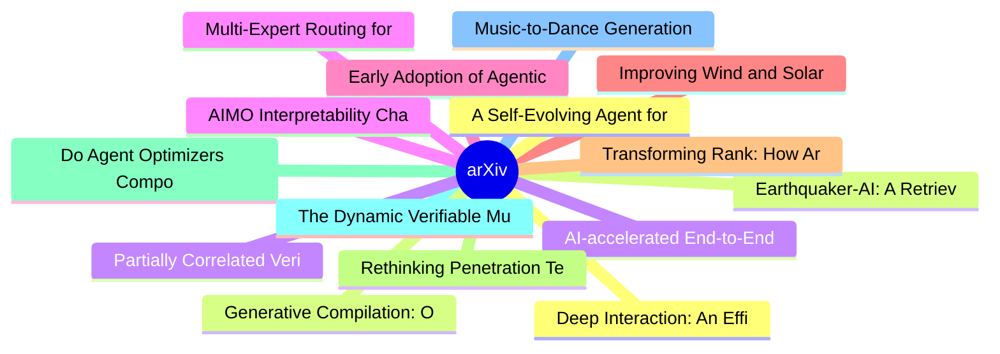

# arXiv 每日最新论文 (2026-07-16)

## 思维导图

## 列表（20 条）

### 1. Deep Interaction: An Efficient Human-AI Interaction Method for Large Reasoning Models
- **作者**: Hefeng Zhou
- **日期**: 2026-07-15
- **链接**: [http://arxiv.org/abs/2607.14049v1](http://arxiv.org/abs/2607.14049v1)
- **摘要**: The emergence of Chain-of-Thought (CoT) reasoning has significantly enhanced the ability of large language models (LLMs) to tackle complex, multi-step tasks. However, when errors occur, current interaction approaches typically involve re-generating another response that may make mistakes again, or u...

### 2. Earthquaker-AI: A Retrieval-Augmented Generation Framework with Rubric-Based Assessment for Primary School Earthquake Education
- **作者**: Xanthi Kokkinou
- **日期**: 2026-07-15
- **链接**: [http://arxiv.org/abs/2607.14046v1](http://arxiv.org/abs/2607.14046v1)
- **摘要**: This paper presents Earthquaker-AI, a hybrid educational framework building upon a previously implemented educational robotics project by integrating a conversational AI assistant based on Retrieval-Augmented Generation. It aims to enhance earthquake preparedness and conscious action among primary-s...

### 3. AI-accelerated End-to-End Framework for Rapid Professional Upskilling
- **作者**: Tam Nguyen
- **日期**: 2026-07-15
- **链接**: [http://arxiv.org/abs/2607.14044v1](http://arxiv.org/abs/2607.14044v1)
- **摘要**: By 2030, 59 of every 100 workers will need reskilling or upskilling, yet the average time to close an enterprise skills gap grew from roughly 3 days in 2014 to 36 days in 2018. Most current frameworks accelerate single stages of upskilling programs and generally lack industry validation. We present ...

### 4. Multi-Expert Routing for Multi-Domain Low-Resource OCR: A Manchu Case Study
- **作者**: Zhan Chen
- **日期**: 2026-07-15
- **链接**: [http://arxiv.org/abs/2607.14041v1](http://arxiv.org/abs/2607.14041v1)
- **摘要**: Historical Manchu OCR must accommodate various visually distinct writing styles, including regular script, running script, and the semi-cursive chancery hand used in palace memorials, despite limited labeled data. We study a multi-expert system that reuses checkpoints from an iterative fine-tuning p...

### 5. Early Adoption of Agentic Coding Tools by GitHub Projects
- **作者**: Maliha Noushin Raida
- **日期**: 2026-07-15
- **链接**: [http://arxiv.org/abs/2607.14037v1](http://arxiv.org/abs/2607.14037v1)
- **摘要**: Agentic coding tools are increasingly capable of generating and submitting pull requests (PRs) to software projects, introducing new forms of human-agent collaboration in software development. While prior studies have examined PR-level outcomes of agent-generated contributions, less is known about h...

### 6. Improving Wind and Solar Power Prediction with Efficient Wrapper-based Feature Selection: An Empirical Study
- **作者**: Daniel Grillmeyer
- **日期**: 2026-07-15
- **链接**: [http://arxiv.org/abs/2607.14024v1](http://arxiv.org/abs/2607.14024v1)
- **摘要**: With rising global energy demand and growing awareness of climate change and its impacts, the share of renewable energies in the global energy mix continues to grow. Unlike conventional power generation, the output of renewable energy sources cannot be controlled as consistently due to their depende...

### 7. Transforming Rank: How Architecture Navigates the Spectral Pathologies of Depth
- **作者**: Katie Everett
- **日期**: 2026-07-15
- **链接**: [http://arxiv.org/abs/2607.14018v1](http://arxiv.org/abs/2607.14018v1)
- **摘要**: We investigate how each component of the Transformer feedforward block architecture design determines how much rank survives across depth at initialization. We reinterpret skip connections and normalization, long understood as controlling magnitude, as mechanisms for preserving gradient rank across ...

### 8. Rethinking Penetration Testing for AI-Enabled Systems: From Resource Compromise to Behavioral Objective Violation
- **作者**: Mohammad Allahbakhsh
- **日期**: 2026-07-15
- **链接**: [http://arxiv.org/abs/2607.14006v1](http://arxiv.org/abs/2607.14006v1)
- **摘要**: Penetration testing traditionally evaluates whether adversaries can exploit weaknesses in software, infrastructure, configurations, or operational controls to achieve security-relevant compromise. This paradigm remains necessary for AI-enabled systems, but it is no longer sufficient. In such systems...

### 9. Do Agent Optimizers Compound? A Continual-Learning Evaluation on Terminal-Bench 2.0
- **作者**: Wenxiao Wang
- **日期**: 2026-07-15
- **链接**: [http://arxiv.org/abs/2607.14004v1](http://arxiv.org/abs/2607.14004v1)
- **摘要**: Most reported gains from agent-optimization methods are one-shot: an agent is optimized against a fixed benchmark and the resulting improvement is reported as if it were a stable property of the method. This does not test the setting that matters for deployed agents, where optimization is applied re...

### 10. The Dynamic Verifiable Multi-Agent Human Agentic Loyalty Loop (DVM-HALL) Model and the Net Human-Agent Score (NHAS) in Autonomous Commerce
- **作者**: Sai Srikanth Madugula
- **日期**: 2026-07-15
- **链接**: [http://arxiv.org/abs/2607.13998v1](http://arxiv.org/abs/2607.13998v1)
- **摘要**: The rapid proliferation of Agentic Artificial Intelligence fundamentally disrupts traditional customer loyalty paradigms. As AI evolves from passive recommendation algorithms to autonomous, goal-directed agents capable of executing purchasing decisions, the conventional understanding of consumer-bra...

### 11. Music-to-Dance Generation via Atomic Movements
- **作者**: Xinhao Cai
- **日期**: 2026-07-15
- **链接**: [http://arxiv.org/abs/2607.13978v1](http://arxiv.org/abs/2607.13978v1)
- **摘要**: Music-driven dance generation aims to produce human motion that is both rhythmically synchronized and semantically consistent with music. While recent neural approaches have achieved impressive visual realism, they typically model motion as a continuous signal and neglect its compositional nature, m...

### 12. A Self-Evolving Agent for Longitudinal Personal Health Management
- **作者**: Haoran Li
- **日期**: 2026-07-15
- **链接**: [http://arxiv.org/abs/2607.13940v1](http://arxiv.org/abs/2607.13940v1)
- **摘要**: Personal health management unfolds over repeated encounters, yet most health AI systems treat each request in isolation. We developed HealthClaw, an open-source agent architecture that updates support as a person's routines, preferences, measurements and risks change. It separates shared safety rule...

### 13. Generative Compilation: On-the-Fly Compiler Feedback as AI Generates Code
- **作者**: Niels Mündler-Sasahara
- **日期**: 2026-07-15
- **链接**: [http://arxiv.org/abs/2607.13921v1](http://arxiv.org/abs/2607.13921v1)
- **摘要**: Languages with rich static semantics, such as Rust, provide stronger guarantees for AI-generated code, but their strictness makes generation more difficult. Off-the-shelf compilers can provide useful feedback post-generation, but does not guide intermediate generation steps, such as those during aut...

### 14. Partially Correlated Verifier Cascades in LLM Harnesses: Concave Log-Odds, Polynomial Reliability, and Blind-Spot Ceilings
- **作者**: Jiangang Han
- **日期**: 2026-07-15
- **链接**: [http://arxiv.org/abs/2607.13918v1](http://arxiv.org/abs/2607.13918v1)
- **摘要**: Serial verification gates are a core reliability primitive in LLM harnesses: a candidate answer is returned only if $k$ verifier calls all accept it. Under conditionally independent gates, the recent Odds Law (arXiv:2606.15712) shows that posterior log-odds grow linearly in $k$, so failure decays ex...

### 15. AIMO Interpretability Challenge
- **作者**: Michal Štefánik
- **日期**: 2026-07-15
- **链接**: [http://arxiv.org/abs/2607.13899v1](http://arxiv.org/abs/2607.13899v1)
- **摘要**: We propose the AIMO Interpretability Challenge, a competition on distinguishing robust from spurious reasoning in frontier mathematical language models based on the models' internal mechanisms. The challenge is motivated by a central limitation of standard reasoning benchmarks: strong final-answer a...

### 16. Experience Memory Graph: One-Shot Error Correction for Agents
- **作者**: Wenjun Wang
- **日期**: 2026-07-15
- **链接**: [http://arxiv.org/abs/2607.13884v1](http://arxiv.org/abs/2607.13884v1)
- **摘要**: Large Language Model (LLM) agents have shown remarkable capabilities in autonomous decision-making by generating sequential trajectories of states, actions, and observations. However, in complex, long-horizon tasks, these agents frequently suffer from compounding errors and struggle to recover from ...

### 17. Verifying formulas for interventional distributions
- **作者**: Francesco Freni
- **日期**: 2026-07-15
- **链接**: [http://arxiv.org/abs/2607.13883v1](http://arxiv.org/abs/2607.13883v1)
- **摘要**: We formalize verification in causal graphical models: deciding whether a given observational formula identifies a target interventional distribution. This opens a problem complementary to identification, asking not whether any identifying formula exists, but whether the given formula is identifying....

### 18. Unleashing Multimodal Large Language Models for Training-free HOI Detection in the Wild
- **作者**: Ting Lei
- **日期**: 2026-07-15
- **链接**: [http://arxiv.org/abs/2607.13881v1](http://arxiv.org/abs/2607.13881v1)
- **摘要**: Human-object interaction detection (HOID) has traditionally been formulated as a supervised detection problem over predefined interaction categories. While such paradigms achieve strong performance on closed-set benchmarks, they fundamentally entangle interaction understanding with dataset-specific ...

### 19. AI-Augmented Human Resource Management? Insights from German companies
- **作者**: Yannick Kalff
- **日期**: 2026-07-15
- **链接**: [http://arxiv.org/abs/2607.13839v1](http://arxiv.org/abs/2607.13839v1)
- **摘要**: This study examines the integration of AI into Human Resource Management in German companies. We ask if and how AI-based technologies are \enquote{augmenting} human resource management. Organisations employ generative AI or predictive analytics to transform traditional human resource functions, to s...

### 20. NodeImport: Imbalanced Node Classification with Node Importance Assessment
- **作者**: Nan Chen
- **日期**: 2026-07-15
- **链接**: [http://arxiv.org/abs/2607.13837v1](http://arxiv.org/abs/2607.13837v1)
- **摘要**: In real-world applications, node classification on graphs often faces the challenge of class imbalance, where majority classes dominate training, resulting in biased model performance. Traditional GNNs often struggle in such scenarios, as they tend to overfit to majority classes while underrepresent...
