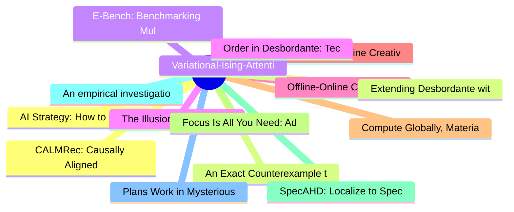

# arXiv 每日最新论文 (2026-07-28)

## 思维导图

## 列表（20 条）

### 1. AI Strategy: How to Choose What AI Product to Implement
- **作者**: Foster Provost
- **日期**: 2026-07-26
- **链接**: [http://arxiv.org/abs/2607.23733v1](http://arxiv.org/abs/2607.23733v1)
- **摘要**: Firms struggle to choose AI projects that pay off: two projects can look equally promising to smart, motivated stakeholders and yet deserve opposite decisions. At the residential real-estate brokerage Compass, one AI product (Likely-to-Sell recommendations) flagged sales outreach opportunities and w...

### 2. An Exact Counterexample to Carlson's Associated-Prime Depth Conjecture from a Group of Order 128
- **作者**: Xinan Dai
- **日期**: 2026-07-26
- **链接**: [http://arxiv.org/abs/2607.23732v1](http://arxiv.org/abs/2607.23732v1)
- **摘要**: In Question~3.1 of his 1995 paper on depth and transfer, Carlson asked whether the depth of a finite-group cohomology ring is always realized by the dimension of one of its associated primes. We give a negative answer. Let \[
  G=\SG{128}{859},\qquad k=\kbar. \] An exact presentation certificate pro...

### 3. E-Bench: Benchmarking Multi-Step Tool-Use Agents in Real-World Product Scenarios
- **作者**: Weihuang Zheng
- **日期**: 2026-07-26
- **链接**: [http://arxiv.org/abs/2607.23722v1](http://arxiv.org/abs/2607.23722v1)
- **摘要**: Large Language Models (LLMs) are increasingly deployed as agents that interact with stateful environments over multiple steps: gathering hidden information, composing tool calls, and committing state changes. We refer to this capability as multi-step tool use. Existing benchmarks have advanced tool-...

### 4. The Illusion of Secure LLM Code: Closing the Security Gap via Iterative Reprompting
- **作者**: Ishpuneet Singh
- **日期**: 2026-07-26
- **链接**: [http://arxiv.org/abs/2607.23710v1](http://arxiv.org/abs/2607.23710v1)
- **摘要**: Large Language Models (LLMs) are increasingly integrated into software development workflows, yet their ability to autonomously generate secure authentication code remains uncertain. This paper evaluates the security architecture of authentication systems generated by five prominent AI coding assist...

### 5. Offline-Online Curriculum RL for Multimodal Reasoning
- **作者**: Wendi Deng
- **日期**: 2026-07-26
- **链接**: [http://arxiv.org/abs/2607.23700v1](http://arxiv.org/abs/2607.23700v1)
- **摘要**: Multimodal large language models exhibit capabilities on reasoning tasks, yet often produce flawed intermediate steps while yielding correct final answers. This behavior undermines interpretability and reliability, suggesting reliance on spurious shortcuts rather than faithful reasoning. Although ef...

### 6. Offline-to-Online Creative Optimization with Generative Models and Adaptive Testing
- **作者**: Kevin Lee
- **日期**: 2026-07-26
- **链接**: [http://arxiv.org/abs/2607.23696v1](http://arxiv.org/abs/2607.23696v1)
- **摘要**: Ad creative optimization is increasingly constrained by evaluation rather than generation. Generative models can produce many plausible creatives, but reliable evaluation requires online experiments, in which only a limited slate can be tested. We study how to use data from historical A/B tests to g...

### 7. Compute Globally, Materialize Locally: The Memory Contract of Sparse Event-KV
- **作者**: Zefeng Cai
- **日期**: 2026-07-26
- **链接**: [http://arxiv.org/abs/2607.23693v1](http://arxiv.org/abs/2607.23693v1)
- **摘要**: Long-horizon agents increasingly reuse their KV cache as memory: a serving system keeps a subset of cached entries and drops the rest. Eviction and episodic-memory schemes therefore rest on a premise rarely tested directly, that a retained event is still informative once the observations that produc...

### 8. Focus Is All You Need: Adaptive Goal-aware Attention Orchestration for Multi-Agent Graph Systems
- **作者**: Mingzhou Fan
- **日期**: 2026-07-26
- **链接**: [http://arxiv.org/abs/2607.23678v1](http://arxiv.org/abs/2607.23678v1)
- **摘要**: Large language models (LLMs) enable autonomous agents for reasoning, planning, and tool use. Recent systems increasingly organize these agents as graphs of specialized, interconnected nodes. Although graph-based orchestration supports flexible decomposition and coordination, it creates a key challen...

### 9. SpecAHD: Localize to Specialize for Automated Heuristic Design in Large-Scale Routing Problems
- **作者**: Kezhao Lai
- **日期**: 2026-07-26
- **链接**: [http://arxiv.org/abs/2607.23676v1](http://arxiv.org/abs/2607.23676v1)
- **摘要**: LLM-based automated heuristic design (AHD) typically scores executable programs on complete instances or within fixed solver components. In large-scale routing problems, localized reconstruction reduces the size of each optimization task, but repair regions within the same incumbent can exhibit subs...

### 10. An empirical investigation into the properties of standard word embeddings
- **作者**: Salomon Kabongo
- **日期**: 2026-07-26
- **链接**: [http://arxiv.org/abs/2607.23675v1](http://arxiv.org/abs/2607.23675v1)
- **摘要**: The embedding of word sequences into continuous vector spaces has been one of the most important developments in Natural Language Processing in the recent past. Such embeddings have found application in areas such as Automatic Speech Recognition, Machine Translation, Sentiment Analysis and many more...

### 11. Plans Work in Mysterious Ways: Evaluating a Plan Mode for Spreadsheet Agents
- **作者**: Aayush Kumar
- **日期**: 2026-07-26
- **链接**: [http://arxiv.org/abs/2607.23670v1](http://arxiv.org/abs/2607.23670v1)
- **摘要**: Plan Modes have become standard features in agentic programming tools, allowing users to gain transparency and control by working with the agent to develop a plan before task execution. However, it remains unclear whether the benefits of this feature translate to end-user programming environments su...

### 12. CALMRec: Causally Aligned Language Memory for Long-Horizon Recommendation
- **作者**: Gengyu Zhan
- **日期**: 2026-07-26
- **链接**: [http://arxiv.org/abs/2607.23647v1](http://arxiv.org/abs/2607.23647v1)
- **摘要**: Large language models (LLMs) can summarize heterogeneous user evidence in natural language, but current LLM recommenders often collapse enduring preferences, transient intent, and exposure-induced behavior into one profile. This makes recommendation vulnerable to feedback loops: repeated exposure is...

### 13. Extending Desbordante with Probabilistic Functional Dependency Discovery Support
- **作者**: Ilia Barutkin
- **日期**: 2026-07-26
- **链接**: [http://arxiv.org/abs/2607.23636v1](http://arxiv.org/abs/2607.23636v1)
- **摘要**: Data profiling aims to extract complex patterns from data for further analysis and use that data in domains such as data cleaning, data deduplication, anomaly detection, and many more.
  Functional dependencies (FDs) are one of the most well-known patterns. However, they are poorly suited for these ...

### 14. Variational-Ising-Attention (VIA):TailoredAttentionMattersfor Science
- **作者**: Rui Wang
- **日期**: 2026-07-26
- **链接**: [http://arxiv.org/abs/2607.23634v1](http://arxiv.org/abs/2607.23634v1)
- **摘要**: Attention enables context modeling via query-key scoring with softmax normalization. Driven by industrial long-context demands, mainstream research has converged toward sparsity and efficiency--yet softmax's independence assumption persists. For scientific tasks unburdened by long-token constraints,...

### 15. Order in Desbordante: Techniques for Efficient Implementation of Order Dependency Discovery Algorithms
- **作者**: Yakov Kuzin
- **日期**: 2026-07-26
- **链接**: [http://arxiv.org/abs/2607.23632v1](http://arxiv.org/abs/2607.23632v1)
- **摘要**: Science-intensive data profiling focuses on discovery and validation of various patterns in datasets. This study considers discovery of one such pattern - order dependency (OD). Simply put, OD states that some list of columns is ordered according to another one. It is of use for database query optim...

### 16. Where Is the Cost of Third-Party API Routers in Agentic Software Development?
- **作者**: Donghao Fu
- **日期**: 2026-07-26
- **链接**: [http://arxiv.org/abs/2607.23624v1](http://arxiv.org/abs/2607.23624v1)
- **摘要**: Third-party API routers have become a common layer that unifies access across increasingly diverse LLM providers. In coding-agent workflows, high-autonomy operation is widely adopted because it reduces interaction overhead. As a result, a third-party API router, which sits between the agent and the ...

### 17. DualityCert: Verifier-Gated Language-Model Repair of Broken Duality Claims in Quantum Field Theory
- **作者**: Xingyang Yu
- **日期**: 2026-07-26
- **链接**: [http://arxiv.org/abs/2607.23614v1](http://arxiv.org/abs/2607.23614v1)
- **摘要**: We present DualityCert, a symbolic verifier for candidate Seiberg-duality claims in four-dimensional N=1 quiver gauge theories. The verifier evaluates 't Hooft anomaly matching, superpotential R-charge consistency, central-charge matching, and a bounded chiral-ring proxy. A claim that passes receive...

### 18. Hybrid Advantage Estimation with Unified Critic for VLM Agentic Reinforcement Learning
- **作者**: Wenxuan Zhang
- **日期**: 2026-07-26
- **链接**: [http://arxiv.org/abs/2607.23605v1](http://arxiv.org/abs/2607.23605v1)
- **摘要**: Large Vision-Language Models (VLMs) now act as agents in interactive environments, where success requires coherent reasoning and decision-making across turns. Although end-to-end training in agentic environments can improve such multi-turn decision-making abilities, current methods mainly rely on ei...

### 19. Action from Adjacent Set in Physical Space Outperforms the Best Prediction in World Models
- **作者**: Liangyu Li
- **日期**: 2026-07-26
- **链接**: [http://arxiv.org/abs/2607.23602v1](http://arxiv.org/abs/2607.23602v1)
- **摘要**: Controllers based on sampling and latent world models assign a predicted terminal cost to each candidate action sequence, choose the minimum, execute its first action block, and replan. This rule can fail even when the terminal cost perfectly and accurately reflects the true task objective in the ph...

### 20. Are You Still the Agent I Authorized? Earned Authority under a Fixed Ceiling for Evolving Agents
- **作者**: Zhaoxi Zhang
- **日期**: 2026-07-26
- **链接**: [http://arxiv.org/abs/2607.23586v1](http://arxiv.org/abs/2607.23586v1)
- **摘要**: Long-lived AI agents increasingly evolve after deployment by retaining experience, acquiring skills and tools, revising workflows, delegating work, and moving across task phases. This improves adaptation but creates a distinct authorization problem. Tool-enabled agents can turn model errors and prom...
