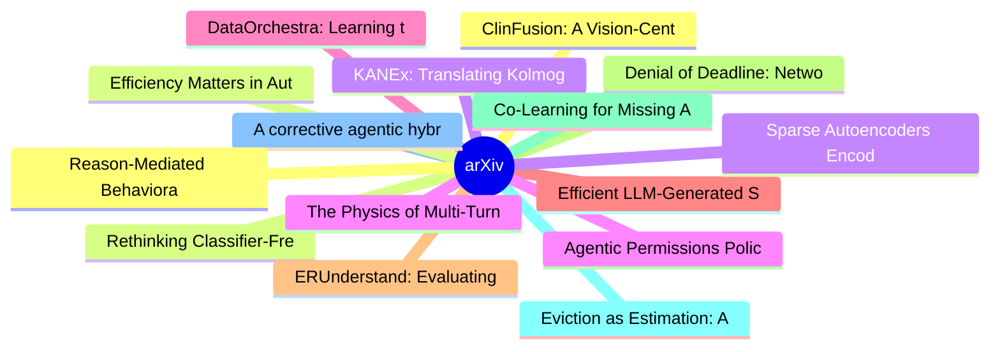

# arXiv 每日最新论文 (2026-07-29)

## 思维导图

## 列表（20 条）

### 1. ClinFusion: A Vision-Centric Multimodal LLM System for Holistic Medical Understanding
- **作者**: Hangjie Yuan
- **日期**: 2026-07-27
- **链接**: [http://arxiv.org/abs/2607.24743v1](http://arxiv.org/abs/2607.24743v1)
- **摘要**: Multimodal large language models (MLLMs) hold immense potential to revolutionize clinical practice, yet deploying them in the medical domain is fundamentally a vision-centric challenge: models must absorb knowledge from heterogeneous 2D and 3D medical images, and evaluation protocols must align with...

### 2. Rethinking Classifier-Free Guidance in On-Policy Diffusion Distillation
- **作者**: Bingnan Li
- **日期**: 2026-07-27
- **链接**: [http://arxiv.org/abs/2607.24731v1](http://arxiv.org/abs/2607.24731v1)
- **摘要**: On-policy distillation (OPD) adapts diffusion models by querying a teacher along trajectories generated by the current student, but how it should behave under classifier-free guidance (CFG), a default component of modern diffusion systems, remains poorly understood. Existing OPD methods naturally ex...

### 3. KANEx: Translating Kolmogorov-Arnold Networks' Interpretability to Medical Explainability
- **作者**: Krithi Shailya
- **日期**: 2026-07-27
- **链接**: [http://arxiv.org/abs/2607.24730v1](http://arxiv.org/abs/2607.24730v1)
- **摘要**: Computer vision models have become highly effective for medical applications, yet their black-box nature continues to undermine clinician trust. In clinical workflows, chest X-ray classifiers are increasingly paired with Vision-Language Models (VLMs) to generate natural-language explanations. Howeve...

### 4. The Physics of Multi-Turn Long-Horizon Planning: From Pre-training to Post-training via Single- and Multi-Teacher On-Policy Agentic Distillation
- **作者**: Tianyi Men
- **日期**: 2026-07-27
- **链接**: [http://arxiv.org/abs/2607.24720v1](http://arxiv.org/abs/2607.24720v1)
- **摘要**: Multi-turn long-horizon planning is critical for foundation model agents, yet how to fundamentally improve it remains unclear. Existing models are trained on uncontrollable and opaque Internet data, making it difficult to identify how planning ability is acquired, shaped, and integrated. To address ...

### 5. DataOrchestra: Learning to Orchestrate Per-Example Curation of Pretraining Data
- **作者**: Zhen Huang
- **日期**: 2026-07-27
- **链接**: [http://arxiv.org/abs/2607.24717v1](http://arxiv.org/abs/2607.24717v1)
- **摘要**: Pretraining data processing is critical to the downstream performance of Large Language Models (LLMs). However, many existing approaches define a fixed processing strategy at the corpus or domain level and apply it uniformly to many examples, without adapting to the needs of each example. We propose...

### 6. Efficient LLM-Generated Shuttling Compilers for Complex Trapped-Ion Architectures
- **作者**: Fabian Kreppel
- **日期**: 2026-07-27
- **链接**: [http://arxiv.org/abs/2607.24714v1](http://arxiv.org/abs/2607.24714v1)
- **摘要**: Trapped-ion quantum computers rely on shuttling compilers, which cast an input algorithm into a sequence of ion-qubit movements within a given architecture. We present the first study in which a single frontier large language model (LLM), Claude Opus 4.7, generates and iteratively refines the full P...

### 7. ERUnderstand: Evaluating Vision-Language Models on Structured ER Diagrams
- **作者**: Ali Ansari
- **日期**: 2026-07-27
- **链接**: [http://arxiv.org/abs/2607.24707v1](http://arxiv.org/abs/2607.24707v1)
- **摘要**: Entity-Relationship Diagrams (ERDs) are central to conceptual database design, yet they are typically available only as rendered images rather than machine-readable schemas, limiting AI-assisted database engineering. We introduce ERUnderstand, the first large-scale benchmark for structured understan...

### 8. Denial of Deadline: Network-Driven Accuracy Collapse in Distributed Inference Pipelines
- **作者**: Jhonatan Tavori
- **日期**: 2026-07-27
- **链接**: [http://arxiv.org/abs/2607.24692v1](http://arxiv.org/abs/2607.24692v1)
- **摘要**: Inference systems increasingly combine a fast path that returns predictions within the application's latency deadline together with a higher-accuracy slow path that runs higher-compute methods on stronger, remote hardware, so its results can be returned on time and combined with the fast path predic...

### 9. Co-Learning for Missing Arbitrary Modalities in Multi-modal Classification
- **作者**: Francisco Mena
- **日期**: 2026-07-27
- **链接**: [http://arxiv.org/abs/2607.24683v1](http://arxiv.org/abs/2607.24683v1)
- **摘要**: Multi-modal classification leverages complementary information across diverse data sources to enhance predictive performance. However, real-world scenarios subject to operational constraints, such as sensor failures or privacy restrictions, lead to inconsistent modality availability between training...

### 10. Eviction as Estimation: A Fixed-Lag Smoothing View of Test-Time Memory, and When Measuring Beats Accumulating
- **作者**: Maruthi Vemula
- **日期**: 2026-07-27
- **链接**: [http://arxiv.org/abs/2607.24667v1](http://arxiv.org/abs/2607.24667v1)
- **摘要**: A language model with a bounded working memory must repeatedly decide which stored items to keep. Every deployed method decides the moment an item arrives, from the past (StreamingLLM, H2O) or from a guess about the future (SnapKV). We recast the choice as an estimation problem on a hidden signal, w...

### 11. A corrective agentic hybrid RAG and an operations-grounded evaluation for a scientific facility
- **作者**: Rajat Sainju
- **日期**: 2026-07-27
- **链接**: [http://arxiv.org/abs/2607.24663v1](http://arxiv.org/abs/2607.24663v1)
- **摘要**: Scientific user facilities accumulate decades of operational knowledge that no single search index covers: electronic logbooks, technical documents, internal wikis, operations chat messages, maintenance records, and live control-system data. We present APS-RAG, Advanced Photon Source Retrieval Augme...

### 12. Reason-Mediated Behavioral Models for Auditing LLM Social Simulators
- **作者**: Atharva Pandey
- **日期**: 2026-07-27
- **链接**: [http://arxiv.org/abs/2607.24649v1](http://arxiv.org/abs/2607.24649v1)
- **摘要**: Large language models are increasingly used as social simulators, including as synthetic survey respondents. Most evaluations ask whether simulated outcomes resemble human outcomes. We argue that this is necessary but too weak: a simulator can match the final answer while using the wrong rationale-d...

### 13. Efficiency Matters in Autonomous Research
- **作者**: Haiqian Yang
- **日期**: 2026-07-27
- **链接**: [http://arxiv.org/abs/2607.24647v1](http://arxiv.org/abs/2607.24647v1)
- **摘要**: AI-driven autonomous research (AR) systems are becoming increasingly effective across a broad range of tasks. Their performance, however, is still evaluated primarily by the quality of the final outcome. In this paper, we argue that the efficiency of the solution-search process is an equally importa...

### 14. Sparse Autoencoders Encode Both Concepts and Functions: The Downstream Geometry of Feature Effects
- **作者**: Phu Gia Hoang
- **日期**: 2026-07-27
- **链接**: [http://arxiv.org/abs/2607.24645v1](http://arxiv.org/abs/2607.24645v1)
- **摘要**: The wide-scale use of sparse autoencoders (SAEs) as interpretability tools is limited by inconsistent links between SAE features and model behavior. Features with clear activation descriptions may have weak or unexpected causal effects; steering can vary across prompts or oppose the intended directi...

### 15. Agentic Permissions Policy Algebra for Taint Confinement in LLM Agents
- **作者**: Arseny Kravchenko
- **日期**: 2026-07-27
- **链接**: [http://arxiv.org/abs/2607.24625v1](http://arxiv.org/abs/2607.24625v1)
- **摘要**: Autonomous LLM agents processing mixed-confidentiality data face severe security risks from prompt injection attacks and reasoning errors. While dynamic Information Flow Control (IFC) provides structural security guarantees, traditional taint tracking permanently taints an agent's context upon readi...

### 16. Looping Is Not Reliability: State-Bound Evidence and Typed Revision Contracts for Agentic Code Repair
- **作者**: Xueping Gao
- **日期**: 2026-07-27
- **链接**: [http://arxiv.org/abs/2607.24604v1](http://arxiv.org/abs/2607.24604v1)
- **摘要**: Generate--test--revise loops are common in coding agents, but repetition alone provides no reliability guarantee. We study the gap between finding a correct patch and retaining, verifying, and submitting it. A sealed five-seed study over 30 HumanEval repairs produces 900 three-revision trajectories....

### 17. Evaluating the Impact of Explainable AI on Trust in AI-Assisted Code Review
- **作者**: Zhenhan Gao
- **日期**: 2026-07-27
- **链接**: [http://arxiv.org/abs/2607.24601v1](http://arxiv.org/abs/2607.24601v1)
- **摘要**: Background: Large language models (LLMs) are increasingly used to automate code review, but the reasoning behind their decisions remains hard to understand. Developers struggle to assess the validity of LLM-generated reviews, making it difficult to gauge how much trust to place in them. The role of ...

### 18. Artificial Intelligence and Innovation Ecosystem: Evolutionary Developments, Challenges, and Future Directions
- **作者**: Zhimin Zhang
- **日期**: 2026-07-27
- **链接**: [http://arxiv.org/abs/2607.24589v1](http://arxiv.org/abs/2607.24589v1)
- **摘要**: The development of the Innovative Ecosystem (IE) presents a new paradigm for economic integration, collaborative advancement, and shared achievements. The rise of Artificial Intelligence (AI) has significantly accelerated the global processes of digitization, informatization, and intelligence. Explo...

### 19. SIREN: Towards End-to-End Extreme-Weather Early Warning with Experience-Grounded LLM Agents
- **作者**: Hang Ni
- **日期**: 2026-07-27
- **链接**: [http://arxiv.org/abs/2607.24588v1](http://arxiv.org/abs/2607.24588v1)
- **摘要**: Early warning of extreme weather is essential for mitigating the societal, economic, and environmental risks posed by hazardous weather events. However, expert-centered warning workflows are costly, labor-intensive, and difficult to scale throughout the warning-to-action process. Although recent adv...

### 20. D-Score: A Spectral Hidden-State Signal for Hallucination Detection in Large Language Models
- **作者**: Bianca Raimondi
- **日期**: 2026-07-27
- **链接**: [http://arxiv.org/abs/2607.24586v1](http://arxiv.org/abs/2607.24586v1)
- **摘要**: Large Language Models can produce fluent text that is false, unsupported by the available evidence, or inconsistent with information that appears to be internally represented by the model. We study hallucination detection from the geometry of hidden activations and introduce the D-Score, a simple sp...
