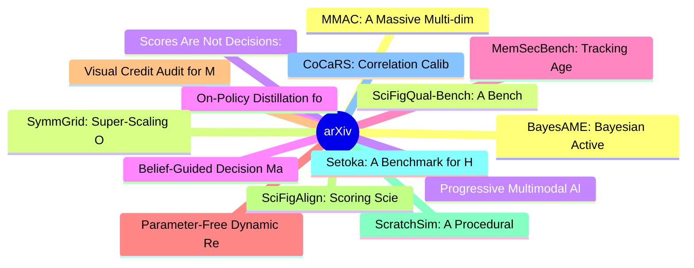

# arXiv 每日最新论文 (2026-07-30)

## 思维导图

## 列表（20 条）

### 1. MMAC: A Massive Multi-dimensional Benchmark for Audio Captioning
- **作者**: Weijie Wu
- **日期**: 2026-07-29
- **链接**: [http://arxiv.org/abs/2607.27109v1](http://arxiv.org/abs/2607.27109v1)
- **摘要**: With the development of audio large language models (AudioLLMs), audio captioning needs to move from brief descriptions toward open-ended and fine-grained free-form descriptions. Existing evaluations often focus on generation quality or task performance, making it difficult to diagnose information c...

### 2. SciFigQual-Bench: A Benchmark for Scientific Figure Quality Assessment with Full-Manuscript Context
- **作者**: Zihan Deng
- **日期**: 2026-07-29
- **链接**: [http://arxiv.org/abs/2607.27084v1](http://arxiv.org/abs/2607.27084v1)
- **摘要**: Scientific images are the core elements of presenting experimental conclusions, elaborating system architecture, and supporting comparative arguments in scientific papers. However, existing image quality assessment (IQA) methods are predominantly designed for natural photographs or AI-generated cont...

### 3. Scores Are Not Decisions: Cost-Aware Stopping for Tool Acquisition in LLM Agents
- **作者**: Yicheng Feng
- **日期**: 2026-07-29
- **链接**: [http://arxiv.org/abs/2607.27083v1](http://arxiv.org/abs/2607.27083v1)
- **摘要**: As LLM agents increasingly depend on diverse external services such as search engines, databases, and connectors, agent harnesses face a fundamental tool-selection challenge: acquiring too few tools leaves the task under-informed, while too many adds cost, context load, and privacy exposure. Routers...

### 4. On-Policy Distillation for LLM Safety: A Routing Approach to Template-Robust Realignment
- **作者**: Yongjian Guo
- **日期**: 2026-07-29
- **链接**: [http://arxiv.org/abs/2607.27081v1](http://arxiv.org/abs/2607.27081v1)
- **摘要**: Fine-tuning is the dominant paradigm for specializing large language models (LLMs), yet it exposes a critical vulnerability: malicious data providers can embed harmful behaviors into downstream corpora, creating models that retain professional skills while violating human values on demand. Existing ...

### 5. MemSecBench: Tracking Agent Memory Poisoning from Persistence to Consequence and Repair
- **作者**: Xuanze Chen
- **日期**: 2026-07-29
- **链接**: [http://arxiv.org/abs/2607.27080v1](http://arxiv.org/abs/2607.27080v1)
- **摘要**: Memory systems allow agents to retain and reuse information from past interactions, but they can also let malicious content persist. A malicious instruction crafted by an attacker may be stored in long-term memory, recalled much later, and quietly shape a real action. Recent benchmarks increasingly ...

### 6. Parameter-Free Dynamic Regret for Online Convex Optimization under Heavy-Tailed Noise
- **作者**: Vaneet Aggarwal
- **日期**: 2026-07-29
- **链接**: [http://arxiv.org/abs/2607.27073v1](http://arxiv.org/abs/2607.27073v1)
- **摘要**: We study online convex optimization (OCO) in non-stationary environments under heavy-tailed noise, where the stochastic gradient oracle admits only a finite $p$-th central moment for some $p \in (1, 2]$. While static regret is well-understood, achieving universal dynamic regret in a parameter-free m...

### 7. Visual Credit Audit for Multimodal Spatial Reasoning
- **作者**: Feixiang Liu
- **日期**: 2026-07-29
- **链接**: [http://arxiv.org/abs/2607.27069v1](http://arxiv.org/abs/2607.27069v1)
- **摘要**: Closed yes/no spatial benchmarks can reward a correct answer even when the image adds little support beyond no-image contexts. Under a fixed forced-choice interface, Visual Credit Audit (VCA) separates two estimands: whether the benchmark image gives the model's declared decision more support than t...

### 8. SciFigAlign: Scoring Scientific Figures by Fine-tuned Alignment of Visuals with Manuscript Evidence
- **作者**: Chuanzhi Xu
- **日期**: 2026-07-29
- **链接**: [http://arxiv.org/abs/2607.27066v1](http://arxiv.org/abs/2607.27066v1)
- **摘要**: Scientific figure assessment in peer review differs fundamentally from general image quality evaluation: a figure must be visually legible, faithfully support the manuscript's claims, and communicate evidence with a clear visual hierarchy. However, if we apply traditional image assessment methods to...

### 9. ScratchSim: A Procedural Synthetic Data Pipeline for Surface Scratch Detection
- **作者**: Paul Julius Kühn
- **日期**: 2026-07-29
- **链接**: [http://arxiv.org/abs/2607.27065v1](http://arxiv.org/abs/2607.27065v1)
- **摘要**: While automated defect detection such as the detection of surface scratched is an important aspect in industrial quality control, the scarcity of annotated defect data make this task challenging. This paper presents a procedural rendering pipeline that generates large-scale annotated synthetic train...

### 10. Setoka: A Benchmark for Hierarchical User Understanding in Personalized Agents over Heterogeneous Data
- **作者**: Lingyang Zeng
- **日期**: 2026-07-29
- **链接**: [http://arxiv.org/abs/2607.27056v1](http://arxiv.org/abs/2607.27056v1)
- **摘要**: Personalized agents are increasingly applied to assist users across a wide range of tasks. Effective personalized assistance requires not only retrieving explicit facts from past interactions stored in agent memory, but also inferring abstract personal characteristics. However, existing memory bench...

### 11. CoCaRS: Correlation Calibration-Based Redundancy Suppression for Heterogeneous Knowledge Distillation
- **作者**: Fengming Yu
- **日期**: 2026-07-29
- **链接**: [http://arxiv.org/abs/2607.27054v1](http://arxiv.org/abs/2607.27054v1)
- **摘要**: Knowledge distillation (KD) enables a compact student model to learn from a powerful teacher and has become an effective paradigm for model compression. The emergence of diverse model architectures has extended KD from homogeneous to heterogeneous settings. However, differences in architectural indu...

### 12. BayesAME: Bayesian Active Model Evaluation
- **作者**: Paula Cordero Encinar
- **日期**: 2026-07-29
- **链接**: [http://arxiv.org/abs/2607.27023v1](http://arxiv.org/abs/2607.27023v1)
- **摘要**: Evaluating large generative models across benchmarks is time-consuming and computationally expensive. This drives the need for methods that can estimate full benchmark performance by evaluating models on only a subset of items, known as a coreset. Current literature mostly requires the practitioner ...

### 13. SymmGrid: Super-Scaling On-Robot Learning with Parallelized Symmetries and Egocentric-Exocentric Visual Perception
- **作者**: Gabe Everett
- **日期**: 2026-07-29
- **链接**: [http://arxiv.org/abs/2607.26985v1](http://arxiv.org/abs/2607.26985v1)
- **摘要**: Deep reinforcement policy learning directly in physical robots (on-robot learning) remains bottlenecked by slow wall-clock training times. We present SymmGrid, a trajectory level augmentation framework inspired by parallelized symmetries that super-scales group transformations to significantly accel...

### 14. Progressive Multimodal Alignment for Continual Instruction Tuning
- **作者**: Duzhen Zhang
- **日期**: 2026-07-29
- **链接**: [http://arxiv.org/abs/2607.26947v1](http://arxiv.org/abs/2607.26947v1)
- **摘要**: Multimodal Large Language Models (MLLMs) rely on a projector to align visual representations with the language embedding space, making it central to cross-modal understanding. In Multimodal Continual Instruction Tuning (MCIT), however, shifting visual distributions and evolving instruction semantics...

### 15. Belief-Guided Decision Making with Uncertainty Gating in the Game of Go
- **作者**: Mehrad Yaghoubi
- **日期**: 2026-07-29
- **链接**: [http://arxiv.org/abs/2607.26946v1](http://arxiv.org/abs/2607.26946v1)
- **摘要**: Recent advancements in Computer Go, driven by AlphaZero and MuZero, rely heavily on Monte Carlo Tree Search (MCTS) to correct the errors of the neural network policy. While effective on massive computational clusters, this dependence creates a critical bottleneck on consumer-grade hardware, where th...

### 16. What Does It Take to Detect an AI Agent? Minimal Feature Sets for Behavioral Detection under Browser Automation
- **作者**: Vishisht Choudhary
- **日期**: 2026-07-29
- **链接**: [http://arxiv.org/abs/2607.26935v1](http://arxiv.org/abs/2607.26935v1)
- **摘要**: Bot detectors deployed at scale treat traffic as binary: human or bot. This assumption breaks when AI agents browse the web through browser automation, a traffic class that is neither and that binary classifiers structurally cannot represent. We present a three-class detection framework distinguishi...

### 17. Defending Against Backdoor Attacks via Alignment Checking in Model-Contrastive Federated Learning
- **作者**: Hongliang Zhang
- **日期**: 2026-07-29
- **链接**: [http://arxiv.org/abs/2607.26933v1](http://arxiv.org/abs/2607.26933v1)
- **摘要**: Federated Learning (FL) is vulnerable to backdoor attacks because of its distributed nature in edge computing scenarios. Existing defense methods show limited efficacy as they overlook the deviations among benign local updates caused by statistical heterogeneity and the stealthiness of backdoor atta...

### 18. BioVLN: A Simulation Platform for Visual Language Navigation in Biomedical Laboratories
- **作者**: Zhe Liu
- **日期**: 2026-07-29
- **链接**: [http://arxiv.org/abs/2607.26914v1](http://arxiv.org/abs/2607.26914v1)
- **摘要**: Biomedical laboratory robots must navigate to instruments before performing experimental procedures. Existing embodied navigation platforms are designed for household environments and treat a target as an object center or an arbitrary nearby position. This representation is inadequate for laboratory...

### 19. Actions Have Consequences: Detecting Outcome Performativity using Intervention Testing
- **作者**: Brandon Gower-Winter
- **日期**: 2026-07-29
- **链接**: [http://arxiv.org/abs/2607.26908v1](http://arxiv.org/abs/2607.26908v1)
- **摘要**: In many domains such as Palliative Care, Credit Assignment and Recommender Systems, predictions may causally influence the outcomes they predict. This phenomena is known as Outcome Performativity. This paper formalises an approach for detecting Outcome Performativity using prediction intervention ca...

### 20. From Passive Video to Editable Experience: Physically Grounded Experience Synthesis for Embodied Intelligence
- **作者**: Jia Luo
- **日期**: 2026-07-29
- **链接**: [http://arxiv.org/abs/2607.26903v1](http://arxiv.org/abs/2607.26903v1)
- **摘要**: The key bottleneck in embodied AI is not model architecture but data. Although billions of human manipulation videos exist online, robots cannot directly learn from them due to the embodiment gap between human morphology and robot hardware. We introduce Pegasus, a low-resource framework that bridges...
