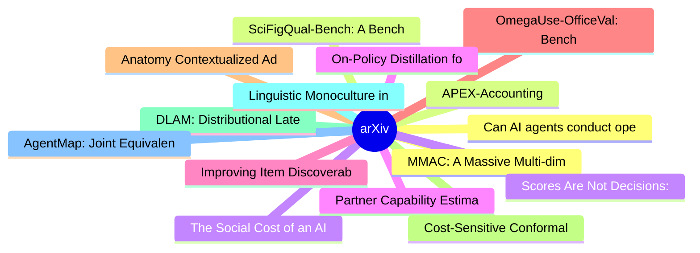

# arXiv 每日最新论文 (2026-07-31)

## 思维导图

## 列表（20 条）

### 1. Can AI agents conduct open-ended AI research? Early evidence from two case studies
- **作者**: Peter Kirgis
- **日期**: 2026-07-29
- **链接**: [http://arxiv.org/abs/2607.27191v1](http://arxiv.org/abs/2607.27191v1)
- **摘要**: Forecasts of explosive AI progress hinge on AI agents automating AI research. But evidence on whether agents can carry out open-ended AI research is thin. Current evaluations either test agents on narrow, verifiable tasks, which excludes open-ended research, or submit AI-generated papers to blind pe...

### 2. APEX-Accounting
- **作者**: Julien Benchek
- **日期**: 2026-07-29
- **链接**: [http://arxiv.org/abs/2607.27189v1](http://arxiv.org/abs/2607.27189v1)
- **摘要**: We introduce APEX-Accounting, a benchmark built by Mercor in partnership with Ramp, to assess whether frontier models can do the real work of accountants. Tasks include reconciling accounts, accruing expenses, posting transactions, and producing reports. The private eval set comprises 160 tasks, spl...

### 3. The Social Cost of an AI Teammate: How an Artificial Teammate Reshapes Human-Human Communication in Small-Team Decision-Making
- **作者**: Nia Nixon
- **日期**: 2026-07-29
- **链接**: [http://arxiv.org/abs/2607.27179v1](http://arxiv.org/abs/2607.27179v1)
- **摘要**: Conversational AI is increasingly positioned as a teammate rather than a tool, yet we know little about how its presence reshapes communication among the humans on the team. We examined sociocognitive communication dynamics in team decision-making using Group Communication Analysis (GCA), team surve...

### 4. Partner Capability Estimation for Task-Agnostic Adaptation in Ad-Hoc Teamwork
- **作者**: Peter Tisnikar
- **日期**: 2026-07-29
- **链接**: [http://arxiv.org/abs/2607.27177v1](http://arxiv.org/abs/2607.27177v1)
- **摘要**: Effective collaboration with novel and diverse partners is a crucial skill for autonomous agents. Most current ad-hoc teamwork (AHT) approaches assume that agents will collaborate on a single, fixed task and that the partner's capabilities, their ability to successfully execute the desired action, a...

### 5. Improving Item Discoverability in e-Commerce Search via Related Intent Generation
- **作者**: Ji Xin
- **日期**: 2026-07-29
- **链接**: [http://arxiv.org/abs/2607.27172v1](http://arxiv.org/abs/2607.27172v1)
- **摘要**: Traditional search systems are optimized to retrieve items that strictly match a query, often prioritizing precision over recall. In e-commerce marketplaces and particularly grocery, this paradigm is limiting, as user satisfaction and commercial outcomes depend heavily on the discoverability of subs...

### 6. OmegaUse-OfficeVal: Benchmarking LLM Agents on Long-Horizon Office-Suite Tasks with Economic Grounding
- **作者**: Jingbo Zhou
- **日期**: 2026-07-29
- **链接**: [http://arxiv.org/abs/2607.27155v1](http://arxiv.org/abs/2607.27155v1)
- **摘要**: Large language model (LLM) agents are increasingly expected to assist users in completing tasks. However, existing benchmarks provide limited support for evaluating whether agents can carry out office-suite workflows at a reasonable cost. We introduce OmegaUse-OfficeVal, a benchmark for evaluating L...

### 7. Anatomy Contextualized Adaption of CT Foundation Models
- **作者**: Roshan Kenia
- **日期**: 2026-07-29
- **链接**: [http://arxiv.org/abs/2607.27154v1](http://arxiv.org/abs/2607.27154v1)
- **摘要**: CT vision-language foundation models have demonstrated promising performance across downstream tasks, but are typically trained with whole-volume representations that dilute fine-grained anatomical signals. Fine-grained vision-language pre-training addresses this by aligning anatomy-level visual fea...

### 8. Cost-Sensitive Conformal Prediction and Human-in-the-Loop Abstention for Imbalanced High-Stakes Decision Support: A Multi-Domain Benchmark
- **作者**: Manpreet Singh
- **日期**: 2026-07-29
- **链接**: [http://arxiv.org/abs/2607.27143v1](http://arxiv.org/abs/2607.27143v1)
- **摘要**: High-stakes decision systems in credit scoring, fraud detection, healthcare, and industrial safety require reliable uncertainty quantification under severe class imbalance and asymmetric error costs. Standard marginal conformal prediction (CP) provides valid overall coverage guarantees; however, we ...

### 9. DLAM: Distributional Latent Actions with Temporal Constraints
- **作者**: Zuojin Tang
- **日期**: 2026-07-29
- **链接**: [http://arxiv.org/abs/2607.27138v1](http://arxiv.org/abs/2607.27138v1)
- **摘要**: Vision-language-action (VLA) models remain constrained by scarce action-labeled robot data, whereas action-free videos offer abundant observations of physical change. Latent action models can extract such priors, but reconstruction-trained codes may predict future observations without the structure ...

### 10. Linguistic Monoculture in LLM-Assisted Language Use
- **作者**: Suhas Thejaswi
- **日期**: 2026-07-29
- **链接**: [http://arxiv.org/abs/2607.27134v1](http://arxiv.org/abs/2607.27134v1)
- **摘要**: Writing and communication are increasingly mediated by large language models (LLMs) that are being used to draft, revise and polish text. Although such assistance can improve clarity and help authors meet institutional expectations, widespread reliance on shared models may reduce population-level va...

### 11. AgentMap: Joint Equivalence and Subsumption Discovery for Ontology Matching
- **作者**: Yiping Song
- **日期**: 2026-07-29
- **链接**: [http://arxiv.org/abs/2607.27130v1](http://arxiv.org/abs/2607.27130v1)
- **摘要**: Ontology matching (OM) has traditionally been formulated as either equivalence discovery or subsumption matching. The existing OM systems identify only one type of semantic correspondence and cannot simultaneously discover equivalence and subsumption mappings. In this paper, we introduce Hybrid Onto...

### 12. MMAC: A Massive Multi-dimensional Benchmark for Audio Captioning
- **作者**: Weijie Wu
- **日期**: 2026-07-29
- **链接**: [http://arxiv.org/abs/2607.27109v1](http://arxiv.org/abs/2607.27109v1)
- **摘要**: With the development of audio large language models (AudioLLMs), audio captioning needs to move from brief descriptions toward open-ended and fine-grained free-form descriptions. Existing evaluations often focus on generation quality or task performance, making it difficult to diagnose information c...

### 13. SciFigQual-Bench: A Benchmark for Scientific Figure Quality Assessment with Full-Manuscript Context
- **作者**: Zihan Deng
- **日期**: 2026-07-29
- **链接**: [http://arxiv.org/abs/2607.27084v1](http://arxiv.org/abs/2607.27084v1)
- **摘要**: Scientific images are the core elements of presenting experimental conclusions, elaborating system architecture, and supporting comparative arguments in scientific papers. However, existing image quality assessment (IQA) methods are predominantly designed for natural photographs or AI-generated cont...

### 14. Scores Are Not Decisions: Cost-Aware Stopping for Tool Acquisition in LLM Agents
- **作者**: Yicheng Feng
- **日期**: 2026-07-29
- **链接**: [http://arxiv.org/abs/2607.27083v1](http://arxiv.org/abs/2607.27083v1)
- **摘要**: As LLM agents increasingly depend on diverse external services such as search engines, databases, and connectors, agent harnesses face a fundamental tool-selection challenge: acquiring too few tools leaves the task under-informed, while too many adds cost, context load, and privacy exposure. Routers...

### 15. On-Policy Distillation for LLM Safety: A Routing Approach to Template-Robust Realignment
- **作者**: Yongjian Guo
- **日期**: 2026-07-29
- **链接**: [http://arxiv.org/abs/2607.27081v1](http://arxiv.org/abs/2607.27081v1)
- **摘要**: Fine-tuning is the dominant paradigm for specializing large language models (LLMs), yet it exposes a critical vulnerability: malicious data providers can embed harmful behaviors into downstream corpora, creating models that retain professional skills while violating human values on demand. Existing ...

### 16. MemSecBench: Tracking Agent Memory Poisoning from Persistence to Consequence and Repair
- **作者**: Xuanze Chen
- **日期**: 2026-07-29
- **链接**: [http://arxiv.org/abs/2607.27080v1](http://arxiv.org/abs/2607.27080v1)
- **摘要**: Memory systems allow agents to retain and reuse information from past interactions, but they can also let malicious content persist. A malicious instruction crafted by an attacker may be stored in long-term memory, recalled much later, and quietly shape a real action. Recent benchmarks increasingly ...

### 17. Parameter-Free Dynamic Regret for Online Convex Optimization under Heavy-Tailed Noise
- **作者**: Vaneet Aggarwal
- **日期**: 2026-07-29
- **链接**: [http://arxiv.org/abs/2607.27073v1](http://arxiv.org/abs/2607.27073v1)
- **摘要**: We study online convex optimization (OCO) in non-stationary environments under heavy-tailed noise, where the stochastic gradient oracle admits only a finite $p$-th central moment for some $p \in (1, 2]$. While static regret is well-understood, achieving universal dynamic regret in a parameter-free m...

### 18. Visual Credit Audit for Multimodal Spatial Reasoning
- **作者**: Feixiang Liu
- **日期**: 2026-07-29
- **链接**: [http://arxiv.org/abs/2607.27069v1](http://arxiv.org/abs/2607.27069v1)
- **摘要**: Closed yes/no spatial benchmarks can reward a correct answer even when the image adds little support beyond no-image contexts. Under a fixed forced-choice interface, Visual Credit Audit (VCA) separates two estimands: whether the benchmark image gives the model's declared decision more support than t...

### 19. SciFigAlign: Scoring Scientific Figures by Fine-tuned Alignment of Visuals with Manuscript Evidence
- **作者**: Chuanzhi Xu
- **日期**: 2026-07-29
- **链接**: [http://arxiv.org/abs/2607.27066v1](http://arxiv.org/abs/2607.27066v1)
- **摘要**: Scientific figure assessment in peer review differs fundamentally from general image quality evaluation: a figure must be visually legible, faithfully support the manuscript's claims, and communicate evidence with a clear visual hierarchy. However, if we apply traditional image assessment methods to...

### 20. ScratchSim: A Procedural Synthetic Data Pipeline for Surface Scratch Detection
- **作者**: Paul Julius Kühn
- **日期**: 2026-07-29
- **链接**: [http://arxiv.org/abs/2607.27065v1](http://arxiv.org/abs/2607.27065v1)
- **摘要**: While automated defect detection such as the detection of surface scratched is an important aspect in industrial quality control, the scarcity of annotated defect data make this task challenging. This paper presents a procedural rendering pipeline that generates large-scale annotated synthetic train...
