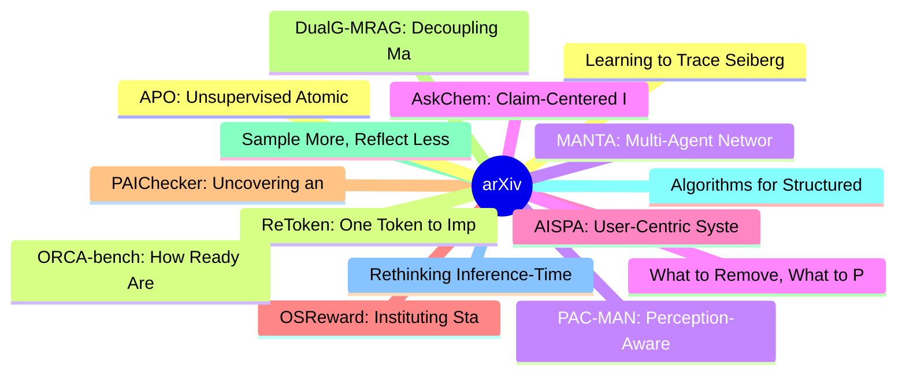

# arXiv 每日最新论文 (2026-08-02)

## 思维导图

## 列表（20 条）

### 1. Learning to Trace Seiberg Dualities
- **作者**: Jonathan J. Heckman
- **日期**: 2026-07-30
- **链接**: [http://arxiv.org/abs/2607.28628v1](http://arxiv.org/abs/2607.28628v1)
- **摘要**: Dualities play an important role in establishing both microscopic and emergent phenomena in a wide range of physical systems. In practice, though, it can often be computationally challenging to establish when two systems are dual, even when all of the "rules of the game" are well-known. Said differe...

### 2. ReToken: One Token to Improve Vision-Language Models for Visual Retrieval
- **作者**: Yao Xiao
- **日期**: 2026-07-30
- **链接**: [http://arxiv.org/abs/2607.28627v1](http://arxiv.org/abs/2607.28627v1)
- **摘要**: Long visual context poses a challenge for vision-language models: performance degrades as the number of distractors grows, and processing all tokens at once is computationally infeasible under GPU memory constraints. We present ReToken, a single learnable embedding trained as an explicit retrieval t...

### 3. PAC-MAN: Perception-Aware CBF-RL for Whole-Body Safety in Humanoid Dodgeball
- **作者**: Lizhi Yang
- **日期**: 2026-07-30
- **链接**: [http://arxiv.org/abs/2607.28623v1](http://arxiv.org/abs/2607.28623v1)
- **摘要**: We present PAC-MAN, a perception-aware CBF-RL framework that couples control-barrier safety with deployment-realistic onboard sensing for whole-body humanoid dodgeball. The deployed policy sees the ball only as segmentation-masked depth from a head-mounted camera, while training-time CBF guidance re...

### 4. AskChem: Claim-Centered Infrastructure for Chemistry Literature Synthesis
- **作者**: Bing Yan
- **日期**: 2026-07-30
- **链接**: [http://arxiv.org/abs/2607.28618v1](http://arxiv.org/abs/2607.28618v1)
- **摘要**: Chemistry literature synthesis often requires assembling specific findings scattered across many publications, yet existing literature-search systems primarily return ranked document lists. As a result, scientists and AI agents need to locate relevant information, verify their provenance, and assemb...

### 5. AISPA: User-Centric System Prompt Auditing for Large Language Model Applications
- **作者**: Xiangning Lin
- **日期**: 2026-07-30
- **链接**: [http://arxiv.org/abs/2607.28617v1](http://arxiv.org/abs/2607.28617v1)
- **摘要**: System prompts are instructions configured by developers to govern the behaviors of foundation models in AI applications. They are used throughout commercial AI products, but are rarely disclosed to the public or regulators, creating a serious trust and accountability gap in the wide deployment of A...

### 6. OSReward: Instituting Standardized Evaluation for Cross-Platform Computer-Use Reward Models
- **作者**: Qiushi Sun
- **日期**: 2026-07-30
- **链接**: [http://arxiv.org/abs/2607.28609v1](http://arxiv.org/abs/2607.28609v1)
- **摘要**: Computer-using agents (CUAs) are advancing rapidly across the digital world. A CUA trajectory records the agent's actions, states, and reasoning. Verifying whether it fulfilled the task instruction is central to CUA evaluation, data curation, and reinforcement learning. Neither human-written verifie...

### 7. PAIChecker: Uncovering and Checking PR-Issue Misalignment in SWE-Bench-Like Benchmarks
- **作者**: Manyi Wang
- **日期**: 2026-07-30
- **链接**: [http://arxiv.org/abs/2607.28587v1](http://arxiv.org/abs/2607.28587v1)
- **摘要**: SWE-bench-like benchmarks are widely used for evaluating LLM's issue resolution capability. They typically follow a common construction pipeline: each PR (Pull Request) is paired with its linked issue by extracting issue references from the PR description; the issue description is used as the proble...

### 8. DualG-MRAG: Decoupling Macro-Reasoning and Micro-Matching for Multimodal Retrieval-Augmented Generation
- **作者**: Jiacheng Tao
- **日期**: 2026-07-30
- **链接**: [http://arxiv.org/abs/2607.28580v1](http://arxiv.org/abs/2607.28580v1)
- **摘要**: While Multimodal Retrieval-Augmented Generation (MM-RAG) has shown promising results, it still struggles with complex multi-hop reasoning tasks. Existing methods primarily focus on independent instance-level matching, which often fails to capture explicit relationships across modalities and document...

### 9. Sample More, Reflect Less: Self-Refine and Reflexion Lose to Repeated Sampling at Equal Token Cost, from 1.5B to 7B
- **作者**: Iliya Mirzaei
- **日期**: 2026-07-30
- **链接**: [http://arxiv.org/abs/2607.28576v1](http://arxiv.org/abs/2607.28576v1)
- **摘要**: Methods that make a language model plan, criticise and rewrite its own answer, reflect on mistakes, pick the best of several attempts, or debate with copies of itself nearly all make it generate far more text than a single chain of thought. Because generating more text raises accuracy by itself, a g...

### 10. Algorithms for Structured Elections under Thiele Voting Rules
- **作者**: Alexandra Lassota
- **日期**: 2026-07-30
- **链接**: [http://arxiv.org/abs/2607.28575v1](http://arxiv.org/abs/2607.28575v1)
- **摘要**: We study the computational complexity of winner determination problems in approval-based committee elections under Thiele voting rules. These form a class of rules parameterized by a fixed weight vector that specifies how a voter's satisfaction depends on the number of approved candidates elected. W...

### 11. Rethinking Inference-Time Scaling in Local Computer-Use Agents: Failure Modes and Compute Tradeoffs
- **作者**: Woongkyu Lee
- **日期**: 2026-07-30
- **链接**: [http://arxiv.org/abs/2607.28573v1](http://arxiv.org/abs/2607.28573v1)
- **摘要**: Deploying autonomous computer-use agents (CUAs) locally is increasingly important for privacy, cost efficiency, and practical usability, yet improving their performance under strict hardware constraints remains challenging. While recent studies show that inference-time scaling can improve frontier c...

### 12. APO: Unsupervised Atomic Policy Optimization for 3D Structure Prediction of Atomic Systems
- **作者**: Shentong Mo
- **日期**: 2026-07-30
- **链接**: [http://arxiv.org/abs/2607.28553v1](http://arxiv.org/abs/2607.28553v1)
- **摘要**: Predicting the 3D structures of atomic systems is fundamental to advancing material science and drug discovery. While flow-matching models (, FlowDPO) have recently shown promise in this domain, their performance relies heavily on alignment with ground-truth coordinates via supervised preference lea...

### 13. ORCA-bench: How Ready Are Language Model Agents for Oncall?
- **作者**: Albert Gong
- **日期**: 2026-07-30
- **链接**: [http://arxiv.org/abs/2607.28545v1](http://arxiv.org/abs/2607.28545v1)
- **摘要**: Large language models can write, patch, and search code, but oncall root cause analysis (RCA) demands something different: reasoning over noisy metrics, logs, traces, and source code, starting from ambiguous user-facing reports, often hours after the incident began. We introduce ORCA-bench, a benchm...

### 14. MANTA: Multi-Agent Network Topology Adaptation for Self-Evolving Multi-Agent Systems
- **作者**: Mao-xun Huang
- **日期**: 2026-07-30
- **链接**: [http://arxiv.org/abs/2607.28527v1](http://arxiv.org/abs/2607.28527v1)
- **摘要**: Large language model-based multi-agent systems improve complex problem solving through task decomposition, agent specialization, information exchange, and intermediate validation. However, existing systems typically treat communication topology as a fixed design choice or an offline optimization tar...

### 15. What to Remove, What to Preserve: Dual-Ambiguity Rectification for All-in-One Image Restoration
- **作者**: Cencen Liu
- **日期**: 2026-07-30
- **链接**: [http://arxiv.org/abs/2607.28526v1](http://arxiv.org/abs/2607.28526v1)
- **摘要**: All-in-one image restoration aims to handle diverse degradations within a unified framework. Existing methods commonly encode heterogeneous degradation conditions in a shared latent space, where degradation-related cues and scene content can remain entangled. We characterize the resulting challenge ...

### 16. Selective Credibility-Limited Belief Update
- **作者**: Theofanis Aravanis
- **日期**: 2026-07-30
- **链接**: [http://arxiv.org/abs/2607.28523v1](http://arxiv.org/abs/2607.28523v1)
- **摘要**: Belief update concerns changes in an agent's beliefs induced by changes in the underlying world. Standard Katsuno-Mendelzon update assumes that an epistemic input can be incorporated from every initially possible world, whereas credibility-limited belief update restricts, for each source world, the ...

### 17. Agents That Certify Their Own Exploits: Confidence-Scheduled Restricted Responses for Safe Opponent Exploitation
- **作者**: Boning Li
- **日期**: 2026-07-30
- **链接**: [http://arxiv.org/abs/2607.28520v1](http://arxiv.org/abs/2607.28520v1)
- **摘要**: An agent playing a Nash-equilibrium strategy in a two-player zero-sum imperfect-information game secures the game value but forfeits the additional value offered by a flawed opponent. Diffuse deviations pose a particular challenge: binary release rules may gather too little evidence to act, while a ...

### 18. InfoOps Bench: A live information operations safety benchmark
- **作者**: Dorian Quelle
- **日期**: 2026-07-30
- **链接**: [http://arxiv.org/abs/2607.28503v1](http://arxiv.org/abs/2607.28503v1)
- **摘要**: In this paper we present an active, constantly updated AI benchmark which measures the integrity of frontier language models against being co-opted for state-backed information operations. We draw on over 2,100 information operations from a live monitoring pipeline which tracks Russian, Chinese and ...

### 19. TCA-SIR: Learning Target-Conditioned Abstractions for Scientific Inspiration Retrieval
- **作者**: Yuto Suzuki
- **日期**: 2026-07-30
- **链接**: [http://arxiv.org/abs/2607.28498v1](http://arxiv.org/abs/2607.28498v1)
- **摘要**: Scientific hypothesis generation for AI for Science typically involves Scientific Inspiration Retrieval (SIR) followed by hypothesis composition. Existing SIR methods rank papers by topical similarity and do not explicitly represent how a candidate inspiration transfers to a target problem. This is ...

### 20. SCOPE: Supply-Chain Operations through Coupled Policies for End-to-End Coordination
- **作者**: Yunhao Liang
- **日期**: 2026-07-30
- **链接**: [http://arxiv.org/abs/2607.28488v1](http://arxiv.org/abs/2607.28488v1)
- **摘要**: Can supply-chain AI move beyond isolated decision modules toward unified operational planning? A complete replenishment plan specifies which products each location carries, which upstream facility supplies it, how often it is replenished, and how deliveries are routed. These decisions are operationa...
