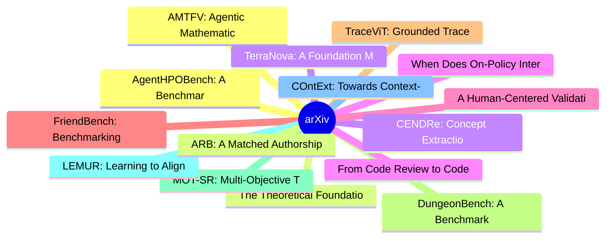

# arXiv 每日最新论文 (2026-08-03)

## 思维导图

## 列表（20 条）

### 1. AgentHPOBench: A Benchmark For Evaluating LLM Agents as Sequential Hyperparameter Optimizers
- **作者**: Tianyu Huai
- **日期**: 2026-07-31
- **链接**: [http://arxiv.org/abs/2607.29626v1](http://arxiv.org/abs/2607.29626v1)
- **摘要**: As LLMs evolve from code completion systems into autonomous scientific agents, evaluating their ability to conduct experiments has become increasingly important. Existing benchmarks typically focus on static code generation, paper replication, or final answer correctness, but do not directly assess ...

### 2. The Theoretical Foundation of Socratic Tests: Dynamic, Multimodal, Conversational Examinations
- **作者**: Ilya Mikhelson
- **日期**: 2026-07-31
- **链接**: [http://arxiv.org/abs/2607.29624v1](http://arxiv.org/abs/2607.29624v1)
- **摘要**: Traditional static assessments rely on a subtractive, deficit-based grading model that often penalizes ambition and obscures diagnostic feedback. Conversely, traditional face-to-face oral examinations introduce severe construct-irrelevant variance by exacerbating performative anxiety and the sociolo...

### 3. CENDRe: Concept Extraction with Natural Domain Representations
- **作者**: Antonia Holzapfel
- **日期**: 2026-07-31
- **链接**: [http://arxiv.org/abs/2607.29621v1](http://arxiv.org/abs/2607.29621v1)
- **摘要**: Convolutional neural networks (CNNs) are widely used for time-series classification, but their deployment in critical domains requires understanding the temporal and spectral patterns that drive their predictions. Concept extraction (CE) methods identify such patterns by analyzing representations wi...

### 4. When Does On-Policy Interaction Help? Representational Tradeoffs in Value-Based Imitation Learning
- **作者**: Luca Viano
- **日期**: 2026-07-31
- **链接**: [http://arxiv.org/abs/2607.29617v1](http://arxiv.org/abs/2607.29617v1)
- **摘要**: Imitation learning (IL)---training an agent to replicate expert behavior from demonstrations---underpins applications from robotics to language model training. Standard approaches such as Behavior Cloning (BC) are known to suffer from compounding errors and performance plateaus, particularly when th...

### 5. A Human-Centered Validation of the Explainability-Performance Coefficient
- **作者**: Christian Oliva
- **日期**: 2026-07-31
- **链接**: [http://arxiv.org/abs/2607.29614v1](http://arxiv.org/abs/2607.29614v1)
- **摘要**: The rapid adoption of deep learning models in high-risk domains has intensified the need for trustworthy Explainable Artificial Intelligence (XAI). However, objectively evaluating explanation fidelity and aligning XAI metrics with human-centered understanding remain critical open challenges. In this...

### 6. FriendBench: Benchmarking Dyadic Familiarity Inference in Humans and Multimodal Large Language Models
- **作者**: Jeffrey M. Girard
- **日期**: 2026-07-31
- **链接**: [http://arxiv.org/abs/2607.29602v1](http://arxiv.org/abs/2607.29602v1)
- **摘要**: Reading a social situation often depends on behavior, not words alone. We introduce FriendBench, a benchmark for inferring whether two people are already familiar or are meeting as strangers, from a 20-second clip of a dyadic ice-breaker conversation. Every pair answers the same type of prompt, so o...

### 7. TraceViT: Grounded Trace Supervision for Visual Abstract Reasoning
- **作者**: Binnan Liu
- **日期**: 2026-07-31
- **链接**: [http://arxiv.org/abs/2607.29586v1](http://arxiv.org/abs/2607.29586v1)
- **摘要**: The Abstraction and Reasoning Corpus (ARC) tests whether a model can infer an unseen transformation from a few input-output examples and apply it to a new grid. Looped visual reasoners refine predictions over multiple iterations, but conventional training constrains only the final output, leaving in...

### 8. DungeonBench: A Benchmark for Rules-Rich Tactical Reasoning in Dungeons & Dragons Combat
- **作者**: Ismayil Ismayilov
- **日期**: 2026-07-31
- **链接**: [http://arxiv.org/abs/2607.29577v1](http://arxiv.org/abs/2607.29577v1)
- **摘要**: Games and simulators make valuable benchmarks by turning decisions into measurable outcomes, but many current suites under-test rules-rich tactical reasoning: the ability to choose well when geometry, timing, resources, objectives, and rule interactions all matter at once. We introduce DungeonBench,...

### 9. MOT-SR: Multi-Objective Tool-Augmented Scientific Equation Discovery with Large Language Models
- **作者**: Boxiao Wang
- **日期**: 2026-07-31
- **链接**: [http://arxiv.org/abs/2607.29561v1](http://arxiv.org/abs/2607.29561v1)
- **摘要**: Symbolic Regression (SR) aims to discover analytical equations from observational data and plays a central role in scientific modeling. While recent Large Language Model (LLM) based approaches show promise, they face two limitations. First, they lack data analysis mechanisms for uncovering variable ...

### 10. LEMUR: Learning to Align with Multi-Objective Reinforcement Learning from Preference Feedback
- **作者**: Manith Adikari
- **日期**: 2026-07-31
- **链接**: [http://arxiv.org/abs/2607.29559v1](http://arxiv.org/abs/2607.29559v1)
- **摘要**: Reinforcement Learning (RL) systems are typically trained using a single, well-specified scalar reward function. However, real-world decision-making tasks often involve multiple, competing objectives, such as performance versus efficiency, where ground-truth reward functions are difficult to specify...

### 11. COntExt: Towards Context-Aware Ontology Extension from Operational Metrics
- **作者**: Hussain Hussain
- **日期**: 2026-07-31
- **链接**: [http://arxiv.org/abs/2607.29553v1](http://arxiv.org/abs/2607.29553v1)
- **摘要**: Organizations increasingly define operational metrics in structured, machine-readable formats to monitor systems, processes, and compliance. These metric definitions implicitly encode domain knowledge, such as referencing concepts, properties, and relationships, that often extends what is captured i...

### 12. AMTFV: Agentic Mathematical Tool-Flow Verification for LLM Self-Correction
- **作者**: Rui Zou
- **日期**: 2026-07-31
- **链接**: [http://arxiv.org/abs/2607.29549v1](http://arxiv.org/abs/2607.29549v1)
- **摘要**: Large language models have demonstrated strong mathematical problem-solving capabilities, yet reliably verifying their candidate answers remains challenging. Existing representative methods mainly revise outputs through natural-language reflection or assist verification by directly generating verifi...

### 13. ARB: A Matched Authorship-Rewriting Benchmark Dataset for AI-Text Detector Evaluation
- **作者**: Gaetano Perrone
- **日期**: 2026-07-31
- **链接**: [http://arxiv.org/abs/2607.29539v1](http://arxiv.org/abs/2607.29539v1)
- **摘要**: Standard AI-text detection benchmarks compare human-written text against text generated directly by large language models (LLMs). While prior work has shown that rewriting and paraphrasing can degrade detector performance, it remains unclear whether performance measured on this conventional benchmar...

### 14. TerraNova: A Foundation Model for the Anthropocene
- **作者**: Carlos Rodriguez-Pardo
- **日期**: 2026-07-31
- **链接**: [http://arxiv.org/abs/2607.29527v1](http://arxiv.org/abs/2607.29527v1)
- **摘要**: A defining problem of the Anthropocene is to model the physical Earth and human societies as one coupled system, yet no learned representation spans their observational breadth. We argue the obstacle is geometric: the physical Earth is measured as continuous fields that ignore political borders, whe...

### 15. From Code Review to Code Critique: Intent, Drift, and Spotlight for AI-Generated Diffs at Scale
- **作者**: Chandra Maddila
- **日期**: 2026-07-31
- **链接**: [http://arxiv.org/abs/2607.29516v1](http://arxiv.org/abs/2607.29516v1)
- **摘要**: AI coding agents are generating code at volumes that exceed the capacity of traditional peer review. At the same time, existing AI code review tools over-index on low-value suggestions such as style and best practices while under-indexing on the concerns human reviewers prioritize most: correctness,...

### 16. DreamQAS: Learning a Decision-Useful World Model for VQE-Efficient Quantum Architecture Search
- **作者**: Jiayang Niu
- **日期**: 2026-07-31
- **链接**: [http://arxiv.org/abs/2607.29491v1](http://arxiv.org/abs/2607.29491v1)
- **摘要**: Reinforcement-learning-based quantum architecture search (RL-QAS) repeatedly optimizes a variational quantum eigensolver (VQE) after extending a circuit, although circuit construction and action legality are deterministic and known. We introduce DreamQAS, a model-based RL framework that preserves th...

### 17. Self-Play Meets Skill Evolution: Self-Evolving Search Agents that Pose, Solve, and Remember
- **作者**: Zenghuang Fu
- **日期**: 2026-07-31
- **链接**: [http://arxiv.org/abs/2607.29468v1](http://arxiv.org/abs/2607.29468v1)
- **摘要**: Self-play agents can generate training problems without questions from target benchmarks, but their curricula lack persistent state: failures affect gradients yet do not explicitly shape future practice. External skill memories preserve procedural experience but are typically learned from fixed task...

### 18. TFGformer: Multivariate Time Series Forecasting via Time-Frequency Graph Learning and Covariate Fusion
- **作者**: Yu Sun
- **日期**: 2026-07-31
- **链接**: [http://arxiv.org/abs/2607.29459v1](http://arxiv.org/abs/2607.29459v1)
- **摘要**: Large-scale multivariate time series from heterogeneous IoT sensors demand accurate long-term forecasting for resource scheduling and predictive maintenance. While recent time series foundation models exhibit strong generalization, they rely on static parametric knowledge and lack dynamic access to ...

### 19. QR-Structured Thermal Triggers for Targeted Semantic Attacks on Infrared Vision-Language Models
- **作者**: Xiang Chen
- **日期**: 2026-07-31
- **链接**: [http://arxiv.org/abs/2607.29445v1](http://arxiv.org/abs/2607.29445v1)
- **摘要**: Infrared vision-language models (IR-VLMs) extend thermal perception to open-vocabulary classification, image captioning, and visual question answering. However, their robustness to structured thermal perturbations and the stability of cross-modal semantic alignment remain insufficiently studied. We ...

### 20. Beyond Retrieval: Analytic Memory for Multimodal Agents
- **作者**: Zhoujin Tian
- **日期**: 2026-07-31
- **链接**: [http://arxiv.org/abs/2607.29440v1](http://arxiv.org/abs/2607.29440v1)
- **摘要**: Long-term multimodal memory must support not only retrieving relevant information but also computing over observations accumulated across interactions. Existing systems largely emphasize \emph{retrieval memory}, organizing interaction histories through summaries and indexes to return query-relevant ...
