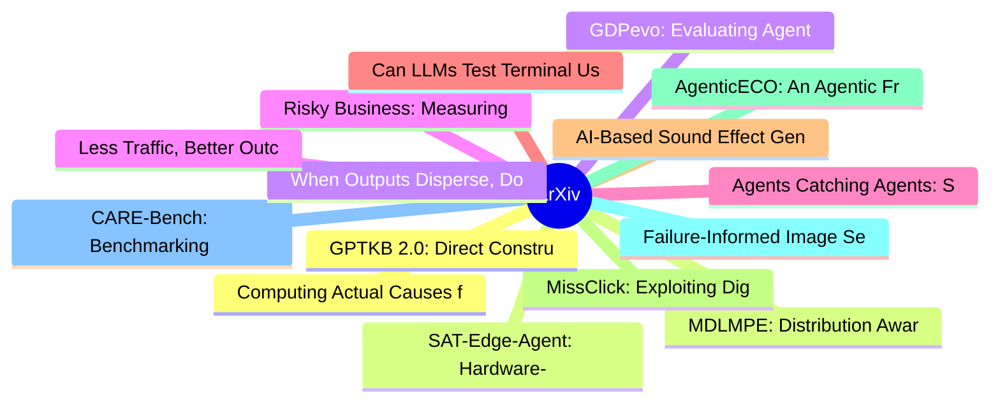

# arXiv 每日最新论文 (2026-08-05)

## 思维导图

## 列表（20 条）

### 1. Computing Actual Causes for Neural Network Predictions under Structured Causal Inputs
- **作者**: Jannick Strobel
- **日期**: 2026-08-04
- **链接**: [http://arxiv.org/abs/2608.03772v1](http://arxiv.org/abs/2608.03772v1)
- **摘要**: Explaining the predictions of neural networks is a central challenge in trustworthy AI. Existing explanation methods, such as those based on feature attribution or minimal sufficient sets, typically treat input features as independent, which can yield misleading explanations when inputs exhibit stru...

### 2. MDLMPE: Distribution Aware Positional Encoding for Masked Diffusion Language Models
- **作者**: Tong Ling
- **日期**: 2026-08-04
- **链接**: [http://arxiv.org/abs/2608.03769v1](http://arxiv.org/abs/2608.03769v1)
- **摘要**: Masked diffusion language models (MDLMs) enable parallel generation and bidirectional context modeling, but their positional context differs fundamentally from that of autoregressive (AR) models. Whereas AR decoding exposes a contiguous prefix, MDLM denoising produces dynamic, non-contiguous configu...

### 3. GDPevo: Evaluating Agent Self-Evolution on Real Business Tasks
- **作者**: Leijun Zhou
- **日期**: 2026-08-04
- **链接**: [http://arxiv.org/abs/2608.03764v1](http://arxiv.org/abs/2608.03764v1)
- **摘要**: Agent self-evolution updates an agent's persistent state from prior experience and reuses it to solve related tasks more effectively. Evaluating self-evolution is difficult: existing benchmarks provide limited coverage of economically valuable task domains, do not always design training and test tas...

### 4. Risky Business: Measuring The Faithfulness-Safety Tension
- **作者**: Dominik Meier
- **日期**: 2026-08-04
- **链接**: [http://arxiv.org/abs/2608.03745v1](http://arxiv.org/abs/2608.03745v1)
- **摘要**: Chain-of-Thought (CoT) reasoning offers a promising window into model monitoring. However, monitoring relies on faithfulness, i.e., the model output strictly derives from its reasoning trace. We identify an alignment tension where a model must be faithful enough to be monitored, yet robust enough to...

### 5. Agents Catching Agents: Shortcut Cascades and Benchmark Gaming in Clinical Multi-Agent Systems
- **作者**: Sebastián Andrés Cajas Ordóñez
- **日期**: 2026-08-04
- **链接**: [http://arxiv.org/abs/2608.03744v1](http://arxiv.org/abs/2608.03744v1)
- **摘要**: Clinical decision support is moving toward committees of language-model agents deliberating on a shared workspace. We ask whether such committees can be gamed by shortcuts, cues a benchmark rewards but a clinician would ignore. Across seven cohorts on six public datasets spanning text (MedQA-USMLE, ...

### 6. Can LLMs Test Terminal User Interfaces?
- **作者**: Chao Peng
- **日期**: 2026-08-04
- **链接**: [http://arxiv.org/abs/2608.03743v1](http://arxiv.org/abs/2608.03743v1)
- **摘要**: Terminal User Interfaces (TUIs) combine the stateful, screen-oriented behaviour of GUIs with terminal deployment and are now common in developer tools. Yet they lack a dedicated testing methodology. We survey 197 real-world TUI applications: only 12% of test code exercises the interface, and 45% of ...

### 7. AI-Based Sound Effect Generation: A Narrative Review of Generative Models Across Input Modalities
- **作者**: Sandy Abdo
- **日期**: 2026-08-04
- **链接**: [http://arxiv.org/abs/2608.03742v1](http://arxiv.org/abs/2608.03742v1)
- **摘要**: Sound effects play a crucial role in conveying actions, events, and environmental cues across digital applications, often requiring a high degree of variation and contextual adaptability. Artificial intelligence (AI)-driven audio generative models are rapidly growing in popularity and have the poten...

### 8. MissClick: Exploiting Digit-Serialized Coordinates to Attack GUI Grounding Models
- **作者**: Yu Ran
- **日期**: 2026-08-04
- **链接**: [http://arxiv.org/abs/2608.03740v1](http://arxiv.org/abs/2608.03740v1)
- **摘要**: Recent GUI visual grounding models generate screen coordinates as sequences of digit tokens that are parsed into numerical values and mapped to executable clicks. The security implications of this coordinate generation process have been largely overlooked. We observe that each coordinate digit is pr...

### 9. AgenticECO: An Agentic Framework for ECO on 3D Integrated Circuits
- **作者**: Shuo Ren
- **日期**: 2026-08-04
- **链接**: [http://arxiv.org/abs/2608.03738v1](http://arxiv.org/abs/2608.03738v1)
- **摘要**: As Moore's law slows, the industry is turning to three-dimensional integration; yet in merged 3D-IC flows, routed designs expose bond-level defects with no 2D analogue, and post-route engineering change orders (ECO) remain manual, expertise-bound work. Worse, the standard edit-then-fully-reroute pra...

### 10. Failure-Informed Image Self-Augmentation for Multimodal Large Language Model Self-Improvement
- **作者**: Chunyang Jiang
- **日期**: 2026-08-04
- **链接**: [http://arxiv.org/abs/2608.03733v1](http://arxiv.org/abs/2608.03733v1)
- **摘要**: Multimodal large language models (MLLMs) have achieved remarkable performance across vision-language tasks, but their progress depends heavily on large-scale, high-quality multimodal data that are costly to annotate. Self-augmentation offers a promising alternative by enabling models to expand their...

### 11. CARE-Bench: Benchmarking Patient-Facing LLM Triage
- **作者**: Yining Hua
- **日期**: 2026-08-04
- **链接**: [http://arxiv.org/abs/2608.03731v1](http://arxiv.org/abs/2608.03731v1)
- **摘要**: Patient-facing medical LLMs and agents increasingly answer symptom questions before clinician contact, where the key safety question is what action the user should take next. We introduce CARE-Bench, a source-grounded benchmark that evaluates sequential patient-facing triage as a four-label per-turn...

### 12. GPTKB 2.0: Direct Construction of Disambiguated Knowledge Bases from Large Language Models
- **作者**: Yujia Hu
- **日期**: 2026-08-04
- **链接**: [http://arxiv.org/abs/2608.03729v1](http://arxiv.org/abs/2608.03729v1)
- **摘要**: Automated Knowledge Base Construction (AKBC) is a core NLP task, and recent work proposes generating knowledge bases directly from large language models (LLMs), treating the model itself as the knowledge source. However, LLMs natively possess no representation of entities, leading to duplicate entri...

### 13. SAT-Edge-Agent: Hardware-in-the-Loop Edge-Agent Orchestration for Onboard Satellite Intelligence
- **作者**: Longji He
- **日期**: 2026-08-04
- **链接**: [http://arxiv.org/abs/2608.03728v1](http://arxiv.org/abs/2608.03728v1)
- **摘要**: Onboard satellite intelligence requires a task layer that translates mission intent into local tool calls, exposes execution state, and returns machine-consumable artifacts under communication and power constraints. We present SAT-Edge-Agent, a hardware-in-the-loop (HIL) edge-agent system deployed o...

### 14. When Outputs Disperse, Does Epistemic Revision Follow? A Black-Box Coupling Diagnostic for Machine Collectives
- **作者**: Molood Arman
- **日期**: 2026-08-04
- **链接**: [http://arxiv.org/abs/2608.03722v1](http://arxiv.org/abs/2608.03722v1)
- **摘要**: Collective intelligence research treats disagreement as evidence of epistemic diversity: if agents express different views, the group should retain capacity to revise. In LLM collectives this proxy can break: agents can produce diverse-looking arguments while preserving the same conclusion. We opera...

### 15. Less Traffic, Better Outcomes: Competition-Aware Request Dispatch in Real-Time Ad Exchanges
- **作者**: Jonaid Shianifar
- **日期**: 2026-08-04
- **链接**: [http://arxiv.org/abs/2608.03705v1](http://arxiv.org/abs/2608.03705v1)
- **摘要**: Real-time bidding (RTB) ad exchanges typically forward nearly all incoming requests to demand-side platforms (DSPs), even though only a small fraction receive bids. This over-distribution weakens auction outcomes: DSPs throttle participation under compute and budget constraints, reducing the effecti...

### 16. LiLa-WAM: Lightweight Latent Reasoning World-Action Model for Robotic Manipulation
- **作者**: Fan Yang
- **日期**: 2026-08-04
- **链接**: [http://arxiv.org/abs/2608.03701v1](http://arxiv.org/abs/2608.03701v1)
- **摘要**: World-action modeling has emerged as a promising paradigm for robotic control, as it empowers models to go beyond reacting to observations and anticipate how a scene will evolve. However, existing WAMs often incur substantial computational overhead. Pixel-space methods often allocate substantial cap...

### 17. TARL: Transaction-Aware Reliable Ledgers for Executable Memory Management in Long-Term Agents
- **作者**: Han Xiao
- **日期**: 2026-08-04
- **链接**: [http://arxiv.org/abs/2608.03699v1](http://arxiv.org/abs/2608.03699v1)
- **摘要**: Persistent memory helps long-term agents retain knowledge, yet a single update error can repeatedly distort future retrieval and reasoning. Most existing systems reduce memory updating to a binary Write/Hold decision, which cannot distinguish whether new information should be added, ignored, used to...

### 18. Pattern over Pixels: Measuring Pattern Completion Bias in Multimodal Code Generation
- **作者**: Khai-Nguyen Nguyen
- **日期**: 2026-08-04
- **链接**: [http://arxiv.org/abs/2608.03691v1](http://arxiv.org/abs/2608.03691v1)
- **摘要**: Multimodal large language models (MLLMs) are increasingly used to translate webpage screenshots into front-end code, but repeated UI patterns may sway them toward visually incorrect yet pattern-consistent outputs. In this work, we test how repeated webpage patterns hurt MLLM accuracy on an objective...

### 19. LiveEvalBench: Toward Open-World Evaluation for Web Generation
- **作者**: Yiyao Wang
- **日期**: 2026-08-04
- **链接**: [http://arxiv.org/abs/2608.03689v1](http://arxiv.org/abs/2608.03689v1)
- **摘要**: Large language models are increasingly capable of synthesizing executable frontend projects, yet existing benchmarks still treat web generation as a static evaluation problem. We argue that frontend artifacts demand a different paradigm: they are interactive rather than static, admit diverse yet equ...

### 20. PhyAI: Real-Time Physical AI at the Edge, Scalable Rollouts in the Cloud
- **作者**: Chenghua Wang
- **日期**: 2026-08-04
- **链接**: [http://arxiv.org/abs/2608.03682v1](http://arxiv.org/abs/2608.03682v1)
- **摘要**: Physical AI policies require inference throughout their lifecycle, including model evaluation, cloud reinforcement learning rollout, edge GPU serving, and onboard deployment. Although these settings share the same checkpoint and action semantics, they often rely on separate inference programs. To un...
