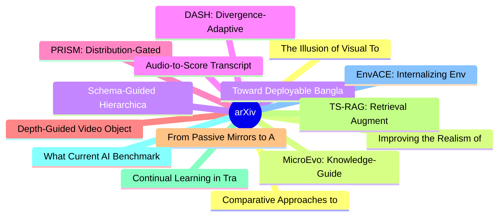

# arXiv 每日最新论文 (2026-08-07)

## 思维导图

## 列表（20 条）

### 1. The Illusion of Visual Tool-Use: A Causal Audit of Thinking with Images
- **作者**: Zhiheng Wang
- **日期**: 2026-08-06
- **链接**: [http://arxiv.org/abs/2608.06270v1](http://arxiv.org/abs/2608.06270v1)
- **摘要**: The "thinking-with-images" paradigm equips multimodal LLMs with active visual operations such as crop-and-zoom. However, models using these operations often achieve only marginal or negative gains over direct inference at substantially higher token cost. They may also repeatedly crop irrelevant regi...

### 2. Improving the Realism of Synthetic Clinical Benchmarks Under Utility Constraints
- **作者**: Omid Bazgir
- **日期**: 2026-08-06
- **链接**: [http://arxiv.org/abs/2608.06265v1](http://arxiv.org/abs/2608.06265v1)
- **摘要**: Synthetic clinical benchmarks for enterprise AI agents can pass existing utility checks and still remain structurally unrealistic, especially in privacy-sensitive healthcare settings where operational data are hard to access. We study how to improve such benchmarks without breaking the downstream ut...

### 3. Toward Deployable Bangla Sign Language Recognition with Expert-Validated Data and a Lightweight Attention-Based Model
- **作者**: Saad Ahmed
- **日期**: 2026-08-06
- **链接**: [http://arxiv.org/abs/2608.06252v1](http://arxiv.org/abs/2608.06252v1)
- **摘要**: Deaf and hard-of-hearing people in Bangladesh communicate mainly through Bangla Sign Language (BdSL). Automatic BdSL recognition on personal devices could widen access to education and services. Existing systems use controlled-setting datasets without expert verification and heavyweight pretrained b...

### 4. DASH: Divergence-Adaptive Supervision Horizons for On-Policy Self-Distillation of Reasoning Models
- **作者**: ZhiYan Hou
- **日期**: 2026-08-06
- **链接**: [http://arxiv.org/abs/2608.06243v1](http://arxiv.org/abs/2608.06243v1)
- **摘要**: Reinforcement learning with verifiable rewards (RLVR) improves the reasoning capabilities of large language models using automatically verifiable outcome signals, but these signals are typically sparse and at the sequence-level. On-policy self-distillation (OPSD) mitigates this sparsity by querying ...

### 5. PRISM: Distribution-Gated Flow Matching for Controllable Unpaired Image Translation
- **作者**: Elad Yoshai
- **日期**: 2026-08-06
- **链接**: [http://arxiv.org/abs/2608.06240v1](http://arxiv.org/abs/2608.06240v1)
- **摘要**: Unpaired image-to-image translation must decide, per image, what to change and what to preserve without paired supervision. Many diffusion-based unpaired translators control preservation through a single global noise or guidance value applied across the image, which cannot separate content to keep f...

### 6. Depth-Guided Video Object Counting in Crowded Scenes
- **作者**: Yuanjing Xu
- **日期**: 2026-08-06
- **链接**: [http://arxiv.org/abs/2608.06236v1](http://arxiv.org/abs/2608.06236v1)
- **摘要**: Our primary objective is to advance video object counting in crowded scenes, aiming to robustly count all instances of a target category based on given text or visual prompts. Existing methods rely on RGB information, limiting their discriminative ability in crowded and occluded conditions. To addre...

### 7. From Passive Mirrors to Active Agents: Holonic Digital Twins for Physical AI over Networks
- **作者**: Christo Kurisummoottil Thomas
- **日期**: 2026-08-06
- **链接**: [http://arxiv.org/abs/2608.06227v1](http://arxiv.org/abs/2608.06227v1)
- **摘要**: Despite advances in artificial intelligence (AI) across multiple sectors, today's AI tools, including deep learning and generative AI, still fail when embedded into physical systems, such as robots and vehicles operating under real-world physical laws. This stems from their inability to maintain rel...

### 8. TS-RAG: Retrieval Augmented Generation for Time Series Forecasting
- **作者**: Yixiong Xiao
- **日期**: 2026-08-06
- **链接**: [http://arxiv.org/abs/2608.06223v1](http://arxiv.org/abs/2608.06223v1)
- **摘要**: While deep learning models, particularly transformer-based architectures, have shown impressive performance in time series forecasting, the application of retrieval-augmented generation (RAG) in this domain remains limited. Since RAG has proven effective in enhancing the capabilities of large langua...

### 9. Continual Learning in Transition
- **作者**: Zhiyan Hou
- **日期**: 2026-08-06
- **链接**: [http://arxiv.org/abs/2608.06216v1](http://arxiv.org/abs/2608.06216v1)
- **摘要**: Classical continual learning (CL) has primarily focused on enabling models to update and retain knowledge through parameter-centric mechanisms, e.g., training strategies, architectural designs, and weight adaptation. However, emerging paradigms are reshaping the scope of CL beyond this traditional m...

### 10. What Current AI Benchmarks Leave Unmeasured: Modality, Search, Citations, and Implications (for Safety Evaluations)
- **作者**: Ro Encarnación
- **日期**: 2026-08-06
- **链接**: [http://arxiv.org/abs/2608.06202v1](http://arxiv.org/abs/2608.06202v1)
- **摘要**: Large language model (LLM) benchmark evaluations are routinely used to support claims about model safety, reliability, and deployment readiness. Yet most evaluations rely on a single access modality (model APIs), perform a single run per prompt, and report accuracy as the primary outcome metric, wit...

### 11. EnvACE: Internalizing Environment Dynamics via World Rehearsal for Agentic Reinforcement Learning
- **作者**: Zishan Xu
- **日期**: 2026-08-06
- **链接**: [http://arxiv.org/abs/2608.06197v1](http://arxiv.org/abs/2608.06197v1)
- **摘要**: Training large language model agents for long-horizon tool use typically relies on interactions with real or synthesized executable environments, whose construction and verification are costly, or on external simulators that are difficult to ground. We introduce EnvACE, an agentic reinforcement lear...

### 12. Comparative Approaches to Agent Retrieval over Large Skill Libraries
- **作者**: Indivara Kolluru
- **日期**: 2026-08-06
- **链接**: [http://arxiv.org/abs/2608.06196v1](http://arxiv.org/abs/2608.06196v1)
- **摘要**: Agents backed by large skill libraries must decide which skills to load and in what order. Loading the entire library into context is expensive and provides no structure for autonomous sequencing. We study two systems for this problem over a corpus of 690 skills: a hybrid ranker combining lexical an...

### 13. MicroEvo: Knowledge-Guided LLM Sampling for Efficient Microarchitecture Design Space Exploration
- **作者**: Jia Xiong
- **日期**: 2026-08-06
- **链接**: [http://arxiv.org/abs/2608.06183v1](http://arxiv.org/abs/2608.06183v1)
- **摘要**: Microarchitecture design space exploration suffers from expansive search spaces and expensive PPA evaluation, leaving only a small simulation budget for design decision-making. Existing methods perform blind search without considering microarchitectural dependencies and fail to learn from the iterat...

### 14. Schema-Guided Hierarchical Information Extraction and Semantic Evaluation Using Generative AI
- **作者**: Modhurita Mitra
- **日期**: 2026-08-06
- **链接**: [http://arxiv.org/abs/2608.06167v1](http://arxiv.org/abs/2608.06167v1)
- **摘要**: We present a schema-based framework for extracting complex, structured information from unstructured text documents using generative AI, followed by automated semantic evaluation of the extracted information against a gold standard. The schema, serving as an information model encoding domain knowled...

### 15. Audio-to-Score Transcription using Pre-trained Features, Data Augmentation, and the New SheetSage-A2S Dataset
- **作者**: Eoin Cummins
- **日期**: 2026-08-06
- **链接**: [http://arxiv.org/abs/2608.06165v1](http://arxiv.org/abs/2608.06165v1)
- **摘要**: Existing audio-to-score (A2S) systems primarily focus on classical music, and the application to popular music remains underexplored. This paper first presents the new SheetSage-A2S Dataset, which includes 61 hours of audio with \texttt{**kern} score encodings for 9,468 clips originating from 6,066 ...

### 16. iARCS: Iterative Agentic RL for Controllable 3D Scene Generation
- **作者**: Saugat Adhikari
- **日期**: 2026-08-06
- **链接**: [http://arxiv.org/abs/2608.06161v1](http://arxiv.org/abs/2608.06161v1)
- **摘要**: Synthetic 3D scene generation is increasingly used as a data source for computer vision and embodied AI, but existing generators often optimize perceptual realism without reliably satisfying task-critical functional constraints. This mismatch limits the usefulness of synthetic data for downstream tr...

### 17. Visual Grounding in Zero-Shot Vision-Language Control
- **作者**: J. de Curtò
- **日期**: 2026-08-06
- **链接**: [http://arxiv.org/abs/2608.06154v1](http://arxiv.org/abs/2608.06154v1)
- **摘要**: Vision-language models (VLMs) are increasingly used as zero-shot controllers, but successful trajectories do not necessarily show that decisions are grounded in visual input: simulator dynamics and conservative action priors can produce favourable scores without meaningful perception. We investigate...

### 18. Learning Globally Reusable Skills for Coding Agents
- **作者**: Chen Yang
- **日期**: 2026-08-06
- **链接**: [http://arxiv.org/abs/2608.06153v1](http://arxiv.org/abs/2608.06153v1)
- **摘要**: Automated skill evolution enables Large Language Model (LLM) agents to continuously improve without expensive retraining. However, existing approaches typically treat skill evolution as a sequence of local updates, overlooking relationships among skills and often producing overfitted skill updates t...

### 19. Reducing belief in conspiracy theories as they unfold using large language models
- **作者**: Thomas H. Costello
- **日期**: 2026-08-06
- **链接**: [http://arxiv.org/abs/2608.06151v1](http://arxiv.org/abs/2608.06151v1)
- **摘要**: The emergence of conspiracy theories in the wake of major events is a significant societal challenge. Here we test whether conversational dialogues with a large language model (LLM) can reduce belief in immediately unfolding conspiracies. In experiments conducted in the days following the July 2024 ...

### 20. CogVis: Must Open-Vocabulary Change Detection Perceive the Scene Anew for Every Query?
- **作者**: Zijie Wang
- **日期**: 2026-08-06
- **链接**: [http://arxiv.org/abs/2608.06150v1](http://arxiv.org/abs/2608.06150v1)
- **摘要**: Earth-surface monitoring requires change detection models capable of recognizing arbitrary semantic categories. Open-Vocabulary Change Detection (OVCD) addresses this need. However, existing methods often entangle temporal perception, semantic discrimination, and region verification, causing unstabl...
