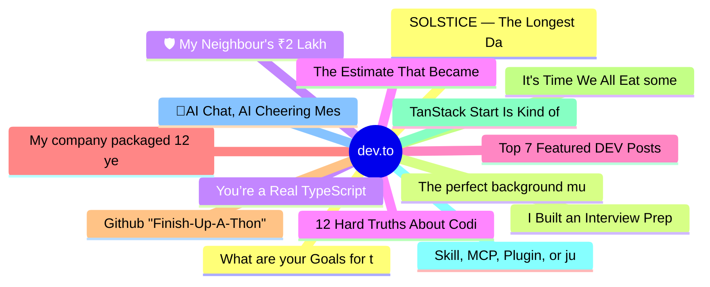

# dev.to Top 15 (2026-06-09)

## 思维导图

## 列表（15 条）

### 1. What are your Goals for the week? #182
- **链接**: [https://dev.to/jarvisscript/what-are-your-goals-for-the-week-182-2f0n](https://dev.to/jarvisscript/what-are-your-goals-for-the-week-182-2f0n)
- **作者**: Chris Jarvis | **阅读**: 2min
- **反应**: 14 | **评论**: 9
- **标签**: `discuss`, `motivation`
- **简介**: Ready for a new week. All that's left from ren faire is packing down some tent walls and floor one...

### 2. I Built an Interview Prep Tool Instead of Grinding LeetCode
- **链接**: [https://dev.to/javz/i-built-an-interview-prep-tool-instead-of-grinding-leetcode-35a0](https://dev.to/javz/i-built-an-interview-prep-tool-instead-of-grinding-leetcode-35a0)
- **作者**: Julien Avezou | **阅读**: 2min
- **反应**: 40 | **评论**: 13
- **标签**: `softwareengineering`, `career`, `learning`, `productivity`
- **简介**: I am currently preparing for Software Engineer interviews.  Like many developers, my first instinct...

### 3. You’re a Real TypeScript Developer Only If...
- **链接**: [https://dev.to/hadil/youre-a-real-typescript-developer-only-if-1d9o](https://dev.to/hadil/youre-a-real-typescript-developer-only-if-1d9o)
- **作者**: Hadil Ben Abdallah | **阅读**: 4min
- **反应**: 57 | **评论**: 26
- **标签**: `webdev`, `typescript`, `bash`, `programming`
- **简介**: A few months ago, I published You're a Real JavaScript Developer Only If...  It was just a post for...

### 4. 12 Hard Truths About Coding I Learned the Hard Way After 10+ Years
- **链接**: [https://dev.to/canro91/12-hard-truths-about-coding-i-learned-the-hard-way-after-10-years-124j](https://dev.to/canro91/12-hard-truths-about-coding-i-learned-the-hard-way-after-10-years-124j)
- **作者**: Cesar Aguirre | **阅读**: 3min
- **反应**: 24 | **评论**: 13
- **标签**: `career`, `careerdevelopment`, `beginners`, `coding`
- **简介**: I got fired from my first job, took down a database server with a badly written query, and was...

### 5. Top 7 Featured DEV Posts of the Week
- **链接**: [https://dev.to/devteam/top-7-featured-dev-posts-of-the-week-14hj](https://dev.to/devteam/top-7-featured-dev-posts-of-the-week-14hj)
- **作者**: Jess Lee | **阅读**: 3min
- **反应**: 22 | **评论**: 7
- **标签**: `top7`, `discuss`
- **简介**: Welcome to this week's Top 7, where the DEV editorial team handpicks their favorite posts from the...

### 6. My company packaged 12 years of my experience into an AI Skill, then laid me off. When it crashed, the CTO called at 5x my salary.
- **链接**: [https://dev.to/xulingfeng/my-company-packaged-12-years-of-my-experience-into-an-ai-skill-then-laid-me-off-when-it-crashed-4b3e](https://dev.to/xulingfeng/my-company-packaged-12-years-of-my-experience-into-an-ai-skill-then-laid-me-off-when-it-crashed-4b3e)
- **作者**: xulingfeng | **阅读**: 7min
- **反应**: 28 | **评论**: 6
- **标签**: `ai`, `career`, `discuss`, `programming`
- **简介**: A story about knowledge extraction, Kafka consumer rebalance, and what happens when a company...

### 7. Github "Finish-Up-A-Thon" Challenge Winner Announcement Delayed & General Challenge Timeline Updates
- **链接**: [https://dev.to/devteam/github-finish-up-a-thon-challenge-winner-announcement-delayed-general-challenge-timeline-updates-ckk](https://dev.to/devteam/github-finish-up-a-thon-challenge-winner-announcement-delayed-general-challenge-timeline-updates-ckk)
- **作者**: Jess Lee | **阅读**: 2min
- **反应**: 13 | **评论**: 1
- **标签**: `devchallenge`, `githubchallenge`, `githubcopilot`
- **简介**: Hey all, we have a quick update for everyone who participated in the GitHub "Finish-Up-A-Thon"...

### 8. It's Time We All Eat some more Cucumber!
- **链接**: [https://dev.to/sebs/its-time-we-all-eat-some-cucumber-16ic](https://dev.to/sebs/its-time-we-all-eat-some-cucumber-16ic)
- **作者**: Sebastian Schürmann | **阅读**: 4min
- **反应**: 11 | **评论**: 1
- **标签**: `ai`, `tdd`, `bdd`, `darkfactory`
- **简介**: Everyone's writing specs for AI now. We hand the model a markdown file, tell it what we want, and...

### 9. TanStack Start Is Kind of a Big Deal
- **链接**: [https://dev.to/erikch/tanstack-start-is-kind-of-a-big-deal-4nec](https://dev.to/erikch/tanstack-start-is-kind-of-a-big-deal-4nec)
- **作者**: Erik Hanchett | **阅读**: 8min
- **反应**: 18 | **评论**: 3
- **标签**: `tanstack`, `react`, `typescript`, `webdev`
- **简介**: Introduction   People keep telling me TanStack Start is kind of a big deal, and I wanted to...

### 10. Skill, MCP, Plugin, or just a CLI: how I pick a Claude Code extension, lightest first
- **链接**: [https://dev.to/rapls/skill-mcp-plugin-or-just-a-cli-how-i-pick-a-claude-code-extension-lightest-first-3hon](https://dev.to/rapls/skill-mcp-plugin-or-just-a-cli-how-i-pick-a-claude-code-extension-lightest-first-3hon)
- **作者**: Rapls | **阅读**: 9min
- **反应**: 10 | **评论**: 3
- **标签**: `claudecode`, `ai`, `productivity`, `mcp`
- **简介**: I was building a plugin release with Claude Code, and the changelog draft came together nicely. Pull...

### 11. 🎥AI Chat, AI Cheering Messages, and Animation Editor Hyper (AI Avatar v10: VS Code and Chrome Extension)
- **链接**: [https://dev.to/webdeveloperhyper/ai-chat-ai-cheering-messages-and-animation-editor-hyper-ai-avatar-v10-vs-code-and-chrome-1noo](https://dev.to/webdeveloperhyper/ai-chat-ai-cheering-messages-and-animation-editor-hyper-ai-avatar-v10-vs-code-and-chrome-1noo)
- **作者**: Web Developer Hyper | **阅读**: 6min
- **反应**: 44 | **评论**: 11
- **标签**: `ai`, `webdev`, `productivity`, `discuss`
- **简介**: Intro   AI Avatar is a completely free app that lets your VRoid (VRM) 3D avatar animate in...

### 12. SOLSTICE — The Longest Day: a platformer where light is your only resource
- **链接**: [https://dev.to/himanshu_748/solstice-the-longest-day-a-platformer-where-light-is-your-only-resource-6d8](https://dev.to/himanshu_748/solstice-the-longest-day-a-platformer-where-light-is-your-only-resource-6d8)
- **作者**: Himanshu Kumar | **阅读**: 3min
- **反应**: 23 | **评论**: 5
- **标签**: `devchallenge`, `gamechallenge`, `gamedev`
- **简介**: This is a submission for the June Solstice Game Jam           What I Built   SOLSTICE — The Longest...

### 13. The perfect background music for Vibecoding...
- **链接**: [https://dev.to/gdg/the-perfect-background-music-for-vibecoding-3edg](https://dev.to/gdg/the-perfect-background-music-for-vibecoding-3edg)
- **作者**: Michael Ramich | **阅读**: 1min
- **反应**: 9 | **评论**: 2
- **标签**: `ai`, `programming`, `productivity`
- **简介**: While vibecoding, you sometimes need some background music. But music can also be a massive...

### 14. 🛡️ My Neighbour's ₹2 Lakh Insurance Claim Was Rejected. I Built an AI to Make Sure It Never Happens Again.
- **链接**: [https://dev.to/sharma-sugurthi/my-neighbours-2-lakh-insurance-claim-was-rejected-i-built-an-ai-to-make-sure-it-never-happens-go4](https://dev.to/sharma-sugurthi/my-neighbours-2-lakh-insurance-claim-was-rejected-i-built-an-ai-to-make-sure-it-never-happens-go4)
- **作者**: sharma-sugurthi | **阅读**: 2min
- **反应**: 6 | **评论**: 1
- **标签**: `devchallenge`, `githubchallenge`, `ai`, `webdev`
- **简介**: This is a submission for the GitHub Finish-Up-A-Thon Challenge           What I Built   SecureShield...

### 15. The Estimate That Became a Quote
- **链接**: [https://dev.to/evanlausier/the-estimate-that-became-a-quote-98m](https://dev.to/evanlausier/the-estimate-that-became-a-quote-98m)
- **作者**: Evan Lausier | **阅读**: 2min
- **反应**: 6 | **评论**: 1
- **标签**: `agile`, `career`, `productivity`, `watercooler`
- **简介**: I said "maybe a couple days" on a call last Tuesday. By Wednesday morning it was in a Jira ticket as...
