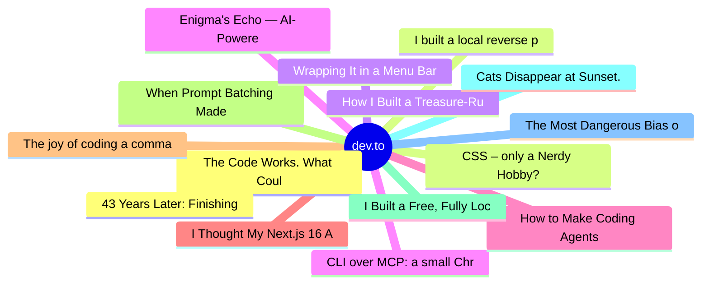

# dev.to Top 15 (2026-06-11)

## 思维导图

## 列表（15 条）

### 1. The Code Works. What Could Possibly Go Wrong?
- **链接**: [https://dev.to/sylwia-lask/the-code-works-what-could-possibly-go-wrong-5hbm](https://dev.to/sylwia-lask/the-code-works-what-could-possibly-go-wrong-5hbm)
- **作者**: Sylwia Laskowska | **阅读**: 5min
- **反应**: 44 | **评论**: 20
- **标签**: `ai`, `webdev`, `discuss`
- **简介**: Would you treat a serious illness without seeing a doctor, relying only on whatever your favorite AI...

### 2. CSS – only a Nerdy Hobby?
- **链接**: [https://dev.to/ingosteinke/css-only-a-nerdy-hobby-17hf](https://dev.to/ingosteinke/css-only-a-nerdy-hobby-17hf)
- **作者**: Ingo Steinke, web developer | **阅读**: 3min
- **反应**: 23 | **评论**: 4
- **标签**: `ai`, `css`, `webdev`, `watercooler`
- **简介**: In times when people believe that "AI can code a website in 2 days" (see: how to leverage AI as a...

### 3. How I Built a Treasure-Run Game Where Australia Saves the Sun
- **链接**: [https://dev.to/ujja/how-i-built-a-treasure-run-game-where-australia-saves-the-sun-kck](https://dev.to/ujja/how-i-built-a-treasure-run-game-where-australia-saves-the-sun-kck)
- **作者**: ujja | **阅读**: 5min
- **反应**: 26 | **评论**: 2
- **标签**: `devchallenge`, `gamechallenge`, `gamedev`, `unity3d`
- **简介**: This is a submission for the June Solstice Game Jam           What I Built   For this game jam, I...

### 4. CLI over MCP: a small Chrome DevTools experiment in Copilot CLI
- **链接**: [https://dev.to/maximsaplin/cli-over-mcp-a-small-chrome-devtools-experiment-in-copilot-cli-5gpi](https://dev.to/maximsaplin/cli-over-mcp-a-small-chrome-devtools-experiment-in-copilot-cli-5gpi)
- **作者**: Maxim Saplin | **阅读**: 8min
- **反应**: 11 | **评论**: 2
- **标签**: `ai`, `programming`, `mcp`, `agents`
- **简介**: I ran the same browser smoke task through two paths: direct Chrome DevTools MCP and a custom CLI...

### 5. How to Make Coding Agents Remember Past Solutions
- **链接**: [https://dev.to/entire/how-to-make-coding-agents-remember-past-solutions-4a71](https://dev.to/entire/how-to-make-coding-agents-remember-past-solutions-4a71)
- **作者**: Rizèl Scarlett | **阅读**: 5min
- **反应**: 3 | **评论**: 1
- **标签**: `ai`, `agents`, `entire`, `agentmemory`
- **简介**: Some engineering problems are only painful because they happen so rarely.  Even with a coding agent,...

### 6. I Thought My Next.js 16 Auth Was Solid. One Afternoon Proved Otherwise.
- **链接**: [https://dev.to/shubhradev/i-thought-my-nextjs-16-auth-was-solid-one-afternoon-proved-otherwise-4dhc](https://dev.to/shubhradev/i-thought-my-nextjs-16-auth-was-solid-one-afternoon-proved-otherwise-4dhc)
- **作者**: Shubhra Pokhariya | **阅读**: 7min
- **反应**: 11 | **评论**: 3
- **标签**: `nextjs`, `webdev`, `javascript`, `security`
- **简介**: A few months ago I was doing a final pre-release review on a client project before handing it...

### 7. The joy of coding a command line english dictionary program in dotnet
- **链接**: [https://dev.to/prahladyeri/the-joy-of-coding-a-command-line-english-dictionary-program-in-dotnet-2pb1](https://dev.to/prahladyeri/the-joy-of-coding-a-command-line-english-dictionary-program-in-dotnet-2pb1)
- **作者**: Prahlad Yeri | **阅读**: 2min
- **反应**: 2 | **评论**: 0
- **标签**: `dotnet`, `csharp`, `windows`
- **简介**: Article about a command line dictionary program for windows

### 8. When Prompt Batching Made My LLM App More Expensive
- **链接**: [https://dev.to/ahikmah/when-prompt-batching-made-my-llm-app-more-expensive-5gf5](https://dev.to/ahikmah/when-prompt-batching-made-my-llm-app-more-expensive-5gf5)
- **作者**: Awaliyatul Hikmah | **阅读**: 4min
- **反应**: 6 | **评论**: 5
- **标签**: `ai`, `llm`, `optimization`, `programming`
- **简介**: I was working on cost optimization for an LLM-based document translation pipeline.  At that point,...

### 9. I Built a Free, Fully Local AI Resume Builder — No Subscriptions, No Cloud, No Catch
- **链接**: [https://dev.to/nithiin7/i-built-a-free-fully-local-ai-resume-builder-no-subscriptions-no-cloud-no-catch-m1h](https://dev.to/nithiin7/i-built-a-free-fully-local-ai-resume-builder-no-subscriptions-no-cloud-no-catch-m1h)
- **作者**: Nithin Pradeep | **阅读**: 4min
- **反应**: 3 | **评论**: 1
- **标签**: `ai`, `career`, `opensource`, `productivity`
- **简介**: If you've ever tried to use an AI resume builder, you've probably hit the same wall I did.  You sign...

### 10. Cats Disappear at Sunset. Can You Find Them in Time?
- **链接**: [https://dev.to/iyop666/cats-disappear-at-sunset-can-you-find-them-in-time-1e0k](https://dev.to/iyop666/cats-disappear-at-sunset-can-you-find-them-in-time-1e0k)
- **作者**: semi | **阅读**: 4min
- **反应**: 5 | **评论**: 0
- **标签**: `devchallenge`, `gamechallenge`, `gamedev`
- **简介**: This is a submission for the June Solstice Game Jam           What I Built   For this game jam, I...

### 11. The Most Dangerous Bias of Your AI Assistant Is That It Agrees With You
- **链接**: [https://dev.to/ben-witt/the-most-dangerous-bias-of-your-ai-assistant-is-that-it-agrees-with-you-4fhc](https://dev.to/ben-witt/the-most-dangerous-bias-of-your-ai-assistant-is-that-it-agrees-with-you-4fhc)
- **作者**: Ben Witt | **阅读**: 6min
- **反应**: 5 | **评论**: 2
- **标签**: `ai`, `llm`, `machinelearning`, `productivity`
- **简介**: We talk a lot about hallucinations. But there is another failure mode we should take just as...

### 12. 43 Years Later: Finishing My BBC Micro Game in Assembly
- **链接**: [https://dev.to/newellpaul/43-years-later-finishing-my-bbc-micro-game-in-assembly-4fd4](https://dev.to/newellpaul/43-years-later-finishing-my-bbc-micro-game-in-assembly-4fd4)
- **作者**: Paul Newell | **阅读**: 4min
- **反应**: 0 | **评论**: 0
- **标签**: `retrocomputing`, `assembly`, `gamedev`, `showdev`
- **简介**: In 1983 my first game was a type-in BASIC listing in C&VG. In 2026 I finally rewrote it in 6502 assembly, the way I always meant to.

### 13. I built a local reverse proxy to see what Claude Code actually sends to Anthropic
- **链接**: [https://dev.to/houleixx/i-built-a-local-reverse-proxy-to-see-what-claude-code-actually-sends-to-anthropic-5foo](https://dev.to/houleixx/i-built-a-local-reverse-proxy-to-see-what-claude-code-actually-sends-to-anthropic-5foo)
- **作者**: 侯垒 | **阅读**: 2min
- **反应**: 2 | **评论**: 3
- **标签**: `ai`, `claudecode`, `opensource`, `devtools`
- **简介**: Claude Code ignores HTTP_PROXY. I built a tiny local proxy that sits on the loopback and shows you every prompt, token, and cost in real time.

### 14. Wrapping It in a Menu Bar App (and Three Things That Broke)
- **链接**: [https://dev.to/paulcontr_/wrapping-it-in-a-menu-bar-app-and-three-things-that-broke-55lc](https://dev.to/paulcontr_/wrapping-it-in-a-menu-bar-app-and-three-things-that-broke-55lc)
- **作者**: Paul Contreras | **阅读**: 3min
- **反应**: 1 | **评论**: 0
- **标签**: `programming`, `tutorial`, `opensource`, `showdev`
- **简介**: Part 4 of a series on building a native Razer mouse controller for macOS.     The protocol works from...

### 15. Enigma's Echo — AI-Powered Cryptanalysis Console (Bletchley Park)
- **链接**: [https://dev.to/mamoor_ahmad/enigmas-echo-ai-powered-cryptanalysis-console-bletchley-park-18aa](https://dev.to/mamoor_ahmad/enigmas-echo-ai-powered-cryptanalysis-console-bletchley-park-18aa)
- **作者**: Mamoor Ahmad  | **阅读**: 4min
- **反应**: 1 | **评论**: 1
- **标签**: `gamechallenge`, `devchallenge`, `devops`, `showdev`
- **简介**: Enigma's Echo 🕵️‍♂️📟              What I Built 🛠️   Enigma's Echo is an interactive,...
