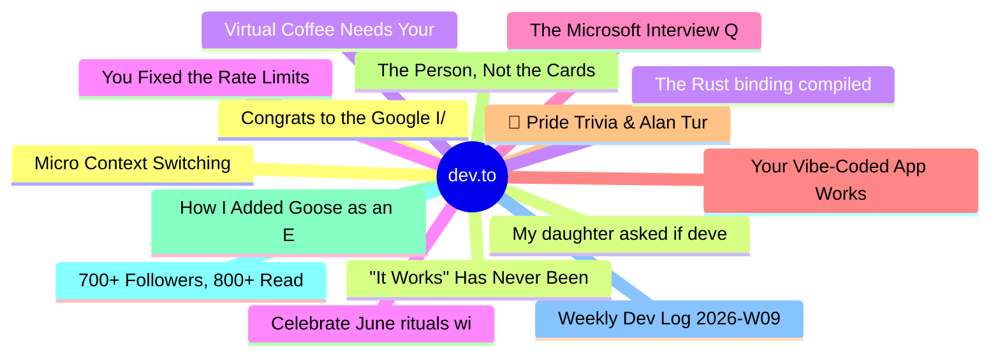

# dev.to Top 15 (2026-06-12)

## 思维导图

## 列表（15 条）

### 1. Congrats to the Google I/O 2026 Writing Challenge Winners!
- **链接**: [https://dev.to/devteam/congrats-to-the-google-io-writing-challenge-winners-1364](https://dev.to/devteam/congrats-to-the-google-io-writing-challenge-winners-1364)
- **作者**: Jess Lee | **阅读**: 2min
- **反应**: 86 | **评论**: 37
- **标签**: `devchallenge`, `googleiochallenge`
- **简介**: We are so excited to announce the winners of the Google I/O 2026 Writing Challenge!  We asked you to...

### 2. My daughter asked if developers used to write code by hand, but it was the follow-up question that surprised me.
- **链接**: [https://dev.to/googleai/my-daughter-asked-if-developers-used-to-write-code-by-hand-but-it-was-the-follow-up-question-that-1bh8](https://dev.to/googleai/my-daughter-asked-if-developers-used-to-write-code-by-hand-but-it-was-the-follow-up-question-that-1bh8)
- **作者**: Greg Baugues | **阅读**: 2min
- **反应**: 41 | **评论**: 4
- **标签**: `ai`, `webdev`, `discuss`, `career`
- **简介**: My daughter Emma is 11. She's been vibe coding lately, and honestly, she's pretty good at it.  The...

### 3. Virtual Coffee Needs Your Help
- **链接**: [https://dev.to/virtualcoffee/virtual-coffee-needs-your-help-46ih](https://dev.to/virtualcoffee/virtual-coffee-needs-your-help-46ih)
- **作者**: BekahHW | **阅读**: 2min
- **反应**: 19 | **评论**: 1
- **标签**: `community`, `discuss`
- **简介**: Virtual Coffee has always been a free, volunteer-led developer community supporting the tech...

### 4. Celebrate June rituals with Solstice Bingo!
- **链接**: [https://dev.to/klaudiagrz/celebrate-june-rituals-with-solstice-bingo-1al6](https://dev.to/klaudiagrz/celebrate-june-rituals-with-solstice-bingo-1al6)
- **作者**: Klaudia Grzondziel | **阅读**: 3min
- **反应**: 31 | **评论**: 9
- **标签**: `devchallenge`, `gamechallenge`, `gamedev`, `html`
- **简介**: This is a submission for the June Solstice Game Jam  Before we dive into technicalities, let me make...

### 5. The Microsoft Interview Question I Keep Thinking About
- **链接**: [https://dev.to/itsugo/the-microsoft-interview-question-i-keep-thinking-about-38gl](https://dev.to/itsugo/the-microsoft-interview-question-i-keep-thinking-about-38gl)
- **作者**: Aryan Choudhary | **阅读**: 4min
- **反应**: 19 | **评论**: 2
- **标签**: `career`, `interview`, `discuss`, `learning`
- **简介**: A few months ago, while interviewing for a Cloud Solutions Architect role at Microsoft, one of the...

### 6. Your Vibe-Coded App Works. Is It Any Good?
- **链接**: [https://dev.to/mlh/your-vibe-coded-app-works-is-it-any-good-28co](https://dev.to/mlh/your-vibe-coded-app-works-is-it-any-good-28co)
- **作者**: MLH Team | **阅读**: 8min
- **反应**: 7 | **评论**: 0
- **标签**: `vibecoding`, `ai`, `firstyearincode`
- **简介**: TL;DR - Getting an app to run is now the easy part. AI is very good at producing something that...

### 7. 🌈 Pride Trivia & Alan Turing Edition — A SwiftUI Game for June Solstice Game Jam
- **链接**: [https://dev.to/gamya_m/pride-trivia-alan-turing-edition-a-swiftui-game-for-june-solstice-game-jam-20j3](https://dev.to/gamya_m/pride-trivia-alan-turing-edition-a-swiftui-game-for-june-solstice-game-jam-20j3)
- **作者**: Gamya  | **阅读**: 3min
- **反应**: 18 | **评论**: 2
- **标签**: `gamechallenge`, `swift`, `devchallenge`, `gamedev`
- **简介**: Hey DEV community! 👋 I'm Gamya, an iOS developer and new here on DEV. So excited to be part of my...

### 8. The Person, Not the Cards
- **链接**: [https://dev.to/arthurpro/the-person-not-the-cards-58ep](https://dev.to/arthurpro/the-person-not-the-cards-58ep)
- **作者**: Arthur | **阅读**: 7min
- **反应**: 7 | **评论**: 0
- **标签**: `opensource`, `governance`, `llm`, `zig`
- **简介**: In December 2025, Anthropic acquired Bun, the JavaScript runtime written in Zig. In April 2026, the Bun team announced a 4× compile-time improvement on their fork of the Zig compiler — "parallel…

### 9. How I Added Goose as an External Agent to Entire
- **链接**: [https://dev.to/entire/how-i-added-goose-as-an-external-agent-to-entire-6gf](https://dev.to/entire/how-i-added-goose-as-an-external-agent-to-entire-6gf)
- **作者**: Rizèl Scarlett | **阅读**: 7min
- **反应**: 4 | **评论**: 1
- **标签**: `ai`, `agents`, `goose`, `entire`
- **简介**: I just opened a PR to add support for Goose to Entire. Goose is an open source coding agent under the...

### 10. 700+ Followers, 800+ Reads in 3 Months: Maybe "Old School" Engineering Still Resonates
- **链接**: [https://dev.to/bumbulik0/700-followers-800-reads-in-3-months-maybe-old-school-engineering-still-resonates-4jb5](https://dev.to/bumbulik0/700-followers-800-reads-in-3-months-maybe-old-school-engineering-still-resonates-4jb5)
- **作者**: Marco Sbragi | **阅读**: 3min
- **反应**: 4 | **评论**: 2
- **标签**: `community`, `learning`, `discuss`, `developers`
- **简介**: I was looking at my DEV dashboard recently, and I am genuinely moved. In the last three months, I’ve...

### 11. Weekly Dev Log 2026-W09
- **链接**: [https://dev.to/umitomo-lab/weekly-dev-log-2026-w09-55b6](https://dev.to/umitomo-lab/weekly-dev-log-2026-w09-55b6)
- **作者**: Umitomo | **阅读**: 5min
- **反应**: 2 | **评论**: 0
- **标签**: `beginners`, `devjournal`, `security`, `swift`
- **简介**: Weekly learning log of iOS, web development, and cybersecurity — 2026-W09

### 12. Micro Context Switching
- **链接**: [https://dev.to/tracygjg/micro-context-switching-5658](https://dev.to/tracygjg/micro-context-switching-5658)
- **作者**: Tracy Gilmore | **阅读**: 3min
- **反应**: 5 | **评论**: 3
- **标签**: `discuss`, `ai`, `softwaredevelopment`
- **简介**: NB, These are the mental rambling of an aged software engineer and AI-sceptic.  Writing computer code...

### 13. "It Works" Has Never Been Good Enough
- **链接**: [https://dev.to/linkbenjamin/it-works-has-never-been-good-enough-1hc0](https://dev.to/linkbenjamin/it-works-has-never-been-good-enough-1hc0)
- **作者**: Ben Link | **阅读**: 3min
- **反应**: 0 | **评论**: 0
- **标签**: `codequality`, `softwareengineering`, `careerdevelopment`, `oop`
- **简介**: It all started when the Senior Architect dropped by the daily standup.  The team lead had the backlog...

### 14. The Rust binding compiled fine. then it started segfaulting in prod
- **链接**: [https://dev.to/serhii_kalyna_730b636889c/the-rust-binding-compiled-fine-then-it-started-segfaulting-in-prod-1o94](https://dev.to/serhii_kalyna_730b636889c/the-rust-binding-compiled-fine-then-it-started-segfaulting-in-prod-1o94)
- **作者**: Serhii Kalyna | **阅读**: 4min
- **反应**: 7 | **评论**: 0
- **标签**: `backend`, `programming`, `rust`, `softwaredevelopment`
- **简介**: I run a free image converter, its built on rust + axum + libvips. it had been happily running for...

### 15. You Fixed the Rate Limits. Now Your Agent Fails Quietly.
- **链接**: [https://dev.to/p0rt/you-fixed-the-rate-limits-now-your-agent-fails-quietly-3keo](https://dev.to/p0rt/you-fixed-the-rate-limits-now-your-agent-fails-quietly-3keo)
- **作者**: Sergei Parfenov | **阅读**: 8min
- **反应**: 7 | **评论**: 1
- **标签**: `ai`, `llm`, `devops`, `machinelearning`
- **简介**: Every capacity fix - retries, fallbacks, caching - buys availability by acting on output it didn't freshly earn. Why uptime and correct uptime are different SLOs, and how to engineer the second one.
