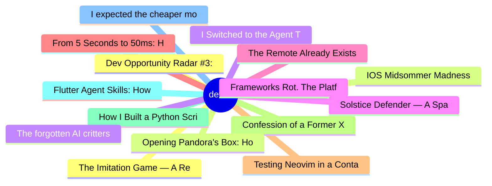

# dev.to Top 15 (2026-06-13)

## 思维导图

## 列表（15 条）

### 1. Dev Opportunity Radar #3: Neo Scholars, a $2M AI Challenge, and an $85K AI Fellowship
- **链接**: [https://dev.to/devengers/dev-opportunity-radar-3-neo-scholars-a-2m-ai-challenge-and-an-85k-ai-fellowship-cjf](https://dev.to/devengers/dev-opportunity-radar-3-neo-scholars-a-2m-ai-challenge-and-an-85k-ai-fellowship-cjf)
- **作者**: Hemapriya Kanagala | **阅读**: 8min
- **反应**: 37 | **评论**: 12
- **标签**: `discuss`, `community`, `opportunities`, `resources`
- **简介**: TL;DR  Welcome back to Dev Opportunity Radar.  This is a weekly series where I share opportunities,...

### 2. IOS Midsommer Madness
- **链接**: [https://dev.to/gde/ios-midsommer-madness-5h4](https://dev.to/gde/ios-midsommer-madness-5h4)
- **作者**: xbill | **阅读**: 8min
- **反应**: 10 | **评论**: 1
- **标签**: `antigravitycli`, `devchallenge`, `gamechallenge`, `gamedev`
- **简介**: This is a submission for the June Solstice Game Jam  Your Iphone can now celebrate the Solstace! When...

### 3. I Switched to the Agent Toolkit for AWS. Here's Why.
- **链接**: [https://dev.to/aws/i-switched-to-the-agent-toolkit-for-aws-heres-why-5hf](https://dev.to/aws/i-switched-to-the-agent-toolkit-for-aws-heres-why-5hf)
- **作者**: Rohini Gaonkar | **阅读**: 5min
- **反应**: 13 | **评论**: 5
- **标签**: `aws`, `mcp`, `ai`, `devtools`
- **简介**: A hands-on look at the official Agent Toolkit for AWS: what it is, why I switched from the old MCP server, and how to set it up.

### 4. Frameworks Rot. The Platform Doesn't.
- **链接**: [https://dev.to/sebs/frameworks-rot-the-platform-doesnt-58g0](https://dev.to/sebs/frameworks-rot-the-platform-doesnt-58g0)
- **作者**: Sebastian Schürmann | **阅读**: 11min
- **反应**: 2 | **评论**: 0
- **标签**: `ai`, `javascript`, `tco`, `webdev`
- **简介**: A decision memo for anyone staring at their package.json and wondering.   Most arguments for leaving...

### 5. The Remote Already Exists: What "Click" Got Right About Agentic AI
- **链接**: [https://dev.to/alexmercedcoder/the-remote-already-exists-what-click-got-right-about-agentic-ai-1d97](https://dev.to/alexmercedcoder/the-remote-already-exists-what-click-got-right-about-agentic-ai-1d97)
- **作者**: Alex Merced | **阅读**: 12min
- **反应**: 0 | **评论**: 4
- **标签**: `agents`, `ai`, `discuss`, `productivity`
- **简介**: I rewatched "Click" recently, the 2006 Adam Sandler movie that everyone remembers as a dumb comedy...

### 6. From 5 Seconds to 50ms: How I Stopped Nuking My Database Every Time I Deleted an Order
- **链接**: [https://dev.to/akashpattnaik/from-5-seconds-to-50ms-how-i-stopped-nuking-my-database-every-time-i-deleted-an-order-30l0](https://dev.to/akashpattnaik/from-5-seconds-to-50ms-how-i-stopped-nuking-my-database-every-time-i-deleted-an-order-30l0)
- **作者**: Akash Pattnaik | **阅读**: 7min
- **反应**: 0 | **评论**: 0
- **标签**: `nextjs`, `postgres`, `supabase`, `performance`
- **简介**: My Dessert Shop Dashboard Was Choking on Its Own Data — Here's the Architecture That Fixed...

### 7. Testing Neovim in a Container with Finch (like Docker)
- **链接**: [https://dev.to/aws/testing-neovim-in-a-container-with-finch-like-docker-31dj](https://dev.to/aws/testing-neovim-in-a-container-with-finch-like-docker-31dj)
- **作者**: Sean Boult | **阅读**: 2min
- **反应**: 8 | **评论**: 0
- **标签**: `neovim`, `containers`, `docker`, `ci`
- **简介**: So developers like CI... for everything! We do this because we like things to be automated....

### 8. Confession of a Former X User: How I Spent 6 Months Writing into the Void
- **链接**: [https://dev.to/toxy4ny/confession-of-a-former-x-user-how-i-spent-6-months-writing-into-the-void-1mc8](https://dev.to/toxy4ny/confession-of-a-former-x-user-how-i-spent-6-months-writing-into-the-void-1mc8)
- **作者**: KL3FT3Z | **阅读**: 4min
- **反应**: 5 | **评论**: 4
- **标签**: `webdev`, `twitter`, `cybersecurity`, `resources`
- **简介**: A certified red teamer. A published researcher. A ghost.     For six months I published red team...

### 9. How I Built a Python Script to Export and Analyze Your DEV.to Followers
- **链接**: [https://dev.to/thetylern/how-i-built-a-python-script-to-export-and-analyze-your-devto-followers-59p6](https://dev.to/thetylern/how-i-built-a-python-script-to-export-and-analyze-your-devto-followers-59p6)
- **作者**: Tyler N | **阅读**: 6min
- **反应**: 6 | **评论**: 1
- **标签**: `showdev`, `python`, `devto`, `opensource`
- **简介**: It was a Friday, and school was out for the weekend. I made a bit of a Spelling Bee page for my...

### 10. Flutter Agent Skills: How to Make Your AI Agent Actually Good at Flutter
- **链接**: [https://dev.to/sayed_ali_alkamel/flutter-agent-skills-how-to-make-your-ai-agent-actually-good-at-flutter-3831](https://dev.to/sayed_ali_alkamel/flutter-agent-skills-how-to-make-your-ai-agent-actually-good-at-flutter-3831)
- **作者**: Sayed Ali Alkamel | **阅读**: 11min
- **反应**: 5 | **评论**: 1
- **标签**: `flutter`, `dart`, `ai`, `programming`
- **简介**: TL;DR: Your AI coding assistant is a generalist. It writes Flutter that looks right but quietly...

### 11. I expected the cheaper model to be cheaper. It cost 8.6 more.
- **链接**: [https://dev.to/yogesh23012001/i-expected-the-cheaper-model-to-be-cheaper-it-cost-86x-more-5cph](https://dev.to/yogesh23012001/i-expected-the-cheaper-model-to-be-cheaper-it-cost-86x-more-5cph)
- **作者**: Yogesh23012001 | **阅读**: 3min
- **反应**: 6 | **评论**: 1
- **标签**: `ai`, `software`, `distributedsystems`, `llm`
- **简介**: I'd routed the same one-word prompt to Claude Haiku and to Gemini 2.5 Flash. Flash has the lower...

### 12. The Imitation Game — A Reverse Turing Test Set on June 21, 1952
- **链接**: [https://dev.to/dj29/the-imitation-game-a-reverse-turing-test-set-on-june-21-1952-4dl2](https://dev.to/dj29/the-imitation-game-a-reverse-turing-test-set-on-june-21-1952-4dl2)
- **作者**: Dhruv Jani | **阅读**: 6min
- **反应**: 2 | **评论**: 1
- **标签**: `devchallenge`, `gamechallenge`, `gamedev`, `showdev`
- **简介**: This is a submission for the June Solstice Game Jam   "I propose to consider the question: Can...

### 13. Opening Pandora's Box: How to Unlock Direct DOM Method Calls in Blazor, No External JS File Needed
- **链接**: [https://dev.to/j_sakamoto/opening-pandoras-box-how-to-unlock-direct-dom-method-calls-in-blazor-no-external-js-file-needed-5h5p](https://dev.to/j_sakamoto/opening-pandoras-box-how-to-unlock-direct-dom-method-calls-in-blazor-no-external-js-file-needed-5h5p)
- **作者**: jsakamoto | **阅读**: 5min
- **反应**: 0 | **评论**: 0
- **标签**: `webdev`, `blazor`, `dotnet`, `aspnet`
- **简介**: 🔰 Referencing and operating DOM elements in Blazor   In Blazor, you can reference a DOM...

### 14. The forgotten AI critters of the 1990s rediscovered most of what 2026 calls agents
- **链接**: [https://dev.to/arthurpro/the-forgotten-ai-critters-of-the-1990s-rediscovered-most-of-what-2026-calls-agents-14gl](https://dev.to/arthurpro/the-forgotten-ai-critters-of-the-1990s-rediscovered-most-of-what-2026-calls-agents-14gl)
- **作者**: Arthur | **阅读**: 8min
- **反应**: 3 | **评论**: 0
- **标签**: `aihistory`, `artificiallife`, `creatures`, `stevegrand`
- **简介**: In 1996, on a CRT monitor running Windows 3.1, you could watch a small fuzzy creature with floppy ears wander into a patch of poisonous berries, eat one, vomit, and remember not to eat that variety…

### 15. Solstice Defender — A Space Shooter Across Ada's Sky, Alan's Grid & Sol's Network
- **链接**: [https://dev.to/samempire/solstice-defender-a-space-shooter-across-adas-sky-alans-grid-sols-network-2o7l](https://dev.to/samempire/solstice-defender-a-space-shooter-across-adas-sky-alans-grid-sols-network-2o7l)
- **作者**: Isaac Sam | **阅读**: 5min
- **反应**: 2 | **评论**: 0
- **标签**: `devchallenge`, `gamechallenge`, `gamedev`
- **简介**: This is a submission for the June Solstice Game Jam  What I Built Solstice Defender is a...
