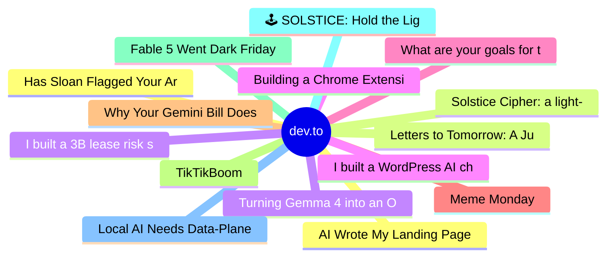

# dev.to Top 15 (2026-06-15)

## 思维导图

## 列表（15 条）

### 1. Has Sloan Flagged Your Article Lately?
- **链接**: [https://dev.to/dannwaneri/has-sloan-flagged-your-article-lately-1gmh](https://dev.to/dannwaneri/has-sloan-flagged-your-article-lately-1gmh)
- **作者**: Daniel Nwaneri | **阅读**: 1min
- **反应**: 11 | **评论**: 4
- **标签**: `discuss`, `ai`, `devto`, `meta`
- **简介**: Mine got flagged twice in one day.  Both essays generated more engagement than anything else I've...

### 2. Letters to Tomorrow: A June Solstice Game About the Things We Carry Into Tomorrow
- **链接**: [https://dev.to/hemapriya_kanagala/letters-to-tomorrow-a-june-solstice-game-about-the-things-we-carry-into-tomorrow-1lnf](https://dev.to/hemapriya_kanagala/letters-to-tomorrow-a-june-solstice-game-about-the-things-we-carry-into-tomorrow-1lnf)
- **作者**: Hemapriya Kanagala | **阅读**: 10min
- **反应**: 18 | **评论**: 3
- **标签**: `devchallenge`, `gamechallenge`, `gamedev`, `discuss`
- **简介**: This is a submission for the June Solstice Game Jam  🎮 Play the Game: Letters to Tomorrow  💻 Source...

### 3. Turning Gemma 4 into an Old Korean Translator
- **链接**: [https://dev.to/googleai/turning-gemma-4-into-an-old-korean-translator-hop](https://dev.to/googleai/turning-gemma-4-into-an-old-korean-translator-hop)
- **作者**: bebechien | **阅读**: 4min
- **反应**: 7 | **评论**: 1
- **标签**: `finetuning`, `gemma`, `ai`
- **简介**: There’s something uniquely beautiful about old books. The smell of weathered paper, the texture of...

### 4. Building a Chrome Extension to Make AI Use More Intentional
- **链接**: [https://dev.to/javz/building-a-chrome-extension-to-make-ai-use-more-intentional-20k0](https://dev.to/javz/building-a-chrome-extension-to-make-ai-use-more-intentional-20k0)
- **作者**: Julien Avezou | **阅读**: 3min
- **反应**: 5 | **评论**: 1
- **标签**: `ai`, `webdev`, `productivity`, `buildinpublic`
- **简介**: After posting several articles about the impact of AI on developers and sharing resources to help...

### 5. What are your goals for the week? #183
- **链接**: [https://dev.to/jarvisscript/what-are-your-goals-for-the-week-183-2hp3](https://dev.to/jarvisscript/what-are-your-goals-for-the-week-183-2hp3)
- **作者**: Chris Jarvis | **阅读**: 1min
- **反应**: 5 | **评论**: 1
- **标签**: `career`, `devjournal`, `discuss`, `productivity`
- **简介**: What are your goals for the week?    What are you building this week? What do you want to...

### 6. Meme Monday
- **链接**: [https://dev.to/ben/meme-monday-14pc](https://dev.to/ben/meme-monday-14pc)
- **作者**: Ben Halpern | **阅读**: 1min
- **反应**: 14 | **评论**: 11
- **标签**: `discuss`, `jokes`, `watercooler`
- **简介**: Meme Monday!  Today's cover image comes from the last thread.  DEV is an inclusive space! Humor in...

### 7. Why Your Gemini Bill Doesn't Match the Model Names
- **链接**: [https://dev.to/tessl-io/why-your-gemini-bill-doesnt-match-the-model-names-9nk](https://dev.to/tessl-io/why-your-gemini-bill-doesnt-match-the-model-names-9nk)
- **作者**: Tessl | **阅读**: 5min
- **反应**: 11 | **评论**: 0
- **标签**: `ai`, `agents`, `agentskills`, `productivity`
- **简介**: Why Your Gemini Bill Doesn't Match the Model Names   tl;dr - Across roughly 3,300 paired...

### 8. TikTikBoom
- **链接**: [https://dev.to/csm18/tiktikboom-2ij5](https://dev.to/csm18/tiktikboom-2ij5)
- **作者**: csm | **阅读**: 2min
- **反应**: 3 | **评论**: 2
- **标签**: `devchallenge`, `gamechallenge`, `gamedev`
- **简介**: This is a submission for the June Solstice Game Jam           What I Built   Turing's Enigma: The...

### 9. Fable 5 Went Dark Friday Night. I Ran My Critical Workflow on a Backup Saturday - Here's What Broke
- **链接**: [https://dev.to/itskondrat/fable-5-went-dark-friday-night-i-ran-my-critical-workflow-on-a-backup-saturday-heres-what-broke-349d](https://dev.to/itskondrat/fable-5-went-dark-friday-night-i-ran-my-critical-workflow-on-a-backup-saturday-heres-what-broke-349d)
- **作者**: Mykola Kondratiuk | **阅读**: 4min
- **反应**: 11 | **评论**: 5
- **标签**: `ai`, `discuss`, `devops`, `productivity`
- **简介**: On Friday afternoon a government order hit Anthropic, and by Saturday morning Fable 5 and Mythos 5...

### 10. 🕹️ SOLSTICE: Hold the Light Until Dawn - A 3D Browser Game for the June Solstice Jam
- **链接**: [https://dev.to/minhlong2605/solstice-hold-the-light-until-dawn-a-3d-browser-game-for-the-june-solstice-jam-3340](https://dev.to/minhlong2605/solstice-hold-the-light-until-dawn-a-3d-browser-game-for-the-june-solstice-jam-3340)
- **作者**: Minh Long | **阅读**: 5min
- **反应**: 6 | **评论**: 2
- **标签**: `devchallenge`, `gamechallenge`, `gamedev`
- **简介**: This is a submission for the June Solstice Game Jam    On the June solstice the sun stays up longer...

### 11. Local AI Needs Data-Plane Health Checks
- **链接**: [https://dev.to/newtorob/local-ai-needs-data-plane-health-checks-2ene](https://dev.to/newtorob/local-ai-needs-data-plane-health-checks-2ene)
- **作者**: Rob | **阅读**: 7min
- **反应**: 2 | **评论**: 1
- **标签**: `localai`, `wireguard`, `networking`, `debugging`
- **简介**: My local AI mesh said the peer was online while every inference packet was getting dropped by a VPN killswitch. The fix was not another heartbeat. It was a real data-plane probe.

### 12. AI Wrote My Landing Page 3 Weeks Ago. I Have No Idea What's In It.
- **链接**: [https://dev.to/backrun/ai-wrote-my-landing-page-3-weeks-ago-i-have-no-idea-whats-in-it-3eai](https://dev.to/backrun/ai-wrote-my-landing-page-3-weeks-ago-i-have-no-idea-whats-in-it-3eai)
- **作者**: Backrun | **阅读**: 4min
- **反应**: 7 | **评论**: 1
- **标签**: `ai`, `webdev`, `productivity`, `discuss`
- **简介**: Three weeks ago I asked Claude to build a landing page.  It took about a minute. The output was...

### 13. Solstice Cipher: a light-routing puzzle for the June Solstice Game Jam
- **链接**: [https://dev.to/alexshev/solstice-cipher-a-light-routing-puzzle-for-the-june-solstice-game-jam-57lo](https://dev.to/alexshev/solstice-cipher-a-light-routing-puzzle-for-the-june-solstice-game-jam-57lo)
- **作者**: Alex Shev | **阅读**: 2min
- **反应**: 8 | **评论**: 1
- **标签**: `devchallenge`, `gamechallenge`, `gamedev`, `javascript`
- **简介**: This is a submission for the June Solstice Game Jam.           What I Built   Solstice Cipher is a...

### 14. I built a 3B lease risk scanner that runs without an external LLM API
- **链接**: [https://dev.to/asynchronope/i-built-a-3b-lease-risk-scanner-that-runs-without-an-external-llm-api-170a](https://dev.to/asynchronope/i-built-a-3b-lease-risk-scanner-that-runs-without-an-external-llm-api-170a)
- **作者**: Adam | **阅读**: 5min
- **反应**: 1 | **评论**: 0
- **标签**: `ai`, `machinelearning`, `huggingface`, `opensource`
- **简介**: Lease Lens is a Hugging Face Build Small Hackathon project: a fine-tuned Llama 3.2 3B model for grounded lease risk review.

### 15. I built a WordPress AI chatbot where the free tier isn't a trial. Here's the design story.
- **链接**: [https://dev.to/rapls/i-built-a-wordpress-ai-chatbot-where-the-free-tier-isnt-a-trial-heres-the-design-story-2n25](https://dev.to/rapls/i-built-a-wordpress-ai-chatbot-where-the-free-tier-isnt-a-trial-heres-the-design-story-2n25)
- **作者**: Rapls | **阅读**: 6min
- **反应**: 3 | **评论**: 0
- **标签**: `showdev`, `wordpress`, `ai`, `php`
- **简介**: This is a design story about a plugin I built, not a review of it. I want to be upfront about that,...
