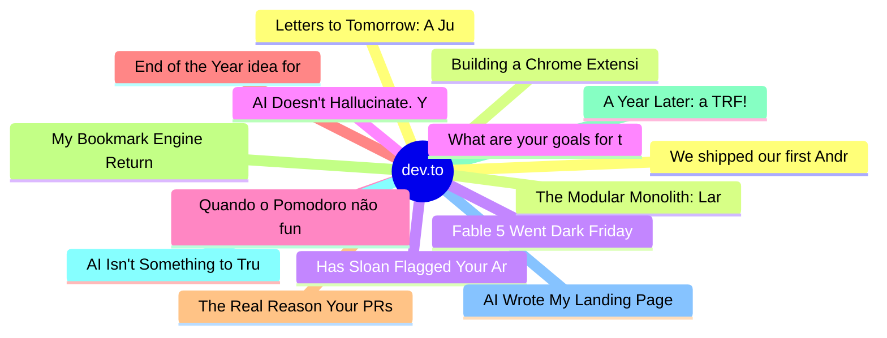

# dev.to Top 15 (2026-06-16)

## 思维导图

## 列表（15 条）

### 1. Letters to Tomorrow: A June Solstice Game About the Things We Carry Into Tomorrow
- **链接**: [https://dev.to/hemapriya_kanagala/letters-to-tomorrow-a-june-solstice-game-about-the-things-we-carry-into-tomorrow-1lnf](https://dev.to/hemapriya_kanagala/letters-to-tomorrow-a-june-solstice-game-about-the-things-we-carry-into-tomorrow-1lnf)
- **作者**: Hemapriya Kanagala | **阅读**: 10min
- **反应**: 42 | **评论**: 16
- **标签**: `devchallenge`, `gamechallenge`, `gamedev`, `discuss`
- **简介**: This is a submission for the June Solstice Game Jam  🎮 Play the Game: Letters to Tomorrow  💻 Source...

### 2. Building a Chrome Extension to Make AI Use More Intentional
- **链接**: [https://dev.to/javz/building-a-chrome-extension-to-make-ai-use-more-intentional-20k0](https://dev.to/javz/building-a-chrome-extension-to-make-ai-use-more-intentional-20k0)
- **作者**: Julien Avezou | **阅读**: 3min
- **反应**: 30 | **评论**: 6
- **标签**: `ai`, `webdev`, `productivity`, `buildinpublic`
- **简介**: After posting several articles about the impact of AI on developers and sharing resources to help...

### 3. Has Sloan Flagged Your Article Lately?
- **链接**: [https://dev.to/dannwaneri/has-sloan-flagged-your-article-lately-1gmh](https://dev.to/dannwaneri/has-sloan-flagged-your-article-lately-1gmh)
- **作者**: Daniel Nwaneri | **阅读**: 1min
- **反应**: 15 | **评论**: 11
- **标签**: `discuss`, `ai`, `devto`, `meta`
- **简介**: Mine got flagged twice in one day.  Both essays generated more engagement than anything else I've...

### 4. What are your goals for the week? #183
- **链接**: [https://dev.to/jarvisscript/what-are-your-goals-for-the-week-183-2hp3](https://dev.to/jarvisscript/what-are-your-goals-for-the-week-183-2hp3)
- **作者**: Chris Jarvis | **阅读**: 1min
- **反应**: 13 | **评论**: 7
- **标签**: `career`, `devjournal`, `discuss`, `productivity`
- **简介**: What are your goals for the week?    What are you building this week? What do you want to...

### 5. Quando o Pomodoro não funciona: organização realista para TDAH em burnout
- **链接**: [https://dev.to/pddesign/quando-o-pomodoro-nao-funciona-organizacao-realista-para-tdah-em-burnout-2a4c](https://dev.to/pddesign/quando-o-pomodoro-nao-funciona-organizacao-realista-para-tdah-em-burnout-2a4c)
- **作者**: vitoriazzp | **阅读**: 8min
- **反应**: 113 | **评论**: 1
- **标签**: `braziliandevs`, `productivity`, `mentalhealth`, `career`
- **简介**: Um relato honesto de alguém que trabalha com design, vive com TDAH e está cansada de dicas...

### 6. End of the Year idea for DEV?
- **链接**: [https://dev.to/devengers/end-of-the-year-idea-for-dev-f8p](https://dev.to/devengers/end-of-the-year-idea-for-dev-f8p)
- **作者**: FrancisTRᴅᴇᴠ (っ◔◡◔)っ | **阅读**: 1min
- **反应**: 18 | **评论**: 4
- **标签**: `discuss`, `community`, `watercooler`
- **简介**: Hey all!  I have this thought in mind that we should all come together as a community to celebrate...

### 7. The Real Reason Your PRs Get Big
- **链接**: [https://dev.to/pixel-wraith/the-real-reason-your-prs-get-big-5cm3](https://dev.to/pixel-wraith/the-real-reason-your-prs-get-big-5cm3)
- **作者**: Jake Lundberg | **阅读**: 5min
- **反应**: 2 | **评论**: 1
- **标签**: `engineeringmanagement`, `codereview`, `pullrequests`, `ai`
- **简介**: I once worked in an org that shipped massive pull requests as the default. Not occasionally...as a...

### 8. My Bookmark Engine Returned Chunks. I Added One Endpoint to Make It Answer.
- **链接**: [https://dev.to/dannwaneri/my-bookmark-engine-returned-chunks-i-added-one-endpoint-to-make-it-answer-317j](https://dev.to/dannwaneri/my-bookmark-engine-returned-chunks-i-added-one-endpoint-to-make-it-answer-317j)
- **作者**: Daniel Nwaneri | **阅读**: 3min
- **反应**: 8 | **评论**: 2
- **标签**: `ai`, `rag`, `cloudflare`, `gemma`
- **简介**: Search returns things you have to read. An answer engine reads them for you.  I built a search engine...

### 9. A Year Later: a TRF!
- **链接**: [https://dev.to/lizmat/a-year-later-a-trf-1lh0](https://dev.to/lizmat/a-year-later-a-trf-1lh0)
- **作者**: Elizabeth Mattijsen | **阅读**: 8min
- **反应**: 2 | **评论**: 0
- **标签**: `rakulang`, `foundation`, `programming`, `community`
- **简介**: Almost a year later to the day that I posted Towards a Raku Foundation I'm glad to announce there is...

### 10. AI Isn't Something to Trust — It's Something to Design (Series Final)
- **链接**: [https://dev.to/ryantsuji/ai-isnt-something-to-trust-its-something-to-design-series-final-30aa](https://dev.to/ryantsuji/ai-isnt-something-to-trust-its-something-to-design-series-final-30aa)
- **作者**: Ryosuke Tsuji | **阅读**: 20min
- **反应**: 15 | **评论**: 1
- **标签**: `ai`, `architecture`, `devops`, `engineering`
- **简介**: Series Final. The four mechanisms covered across this series — knowledge graph, Auto Review, Self-Healing, Recurrence Prevention — plus the non-engineer-PR application that sits on top of them, all ha

### 11. AI Wrote My Landing Page 3 Weeks Ago. I Have No Idea What's In It.
- **链接**: [https://dev.to/backrun/ai-wrote-my-landing-page-3-weeks-ago-i-have-no-idea-whats-in-it-3eai](https://dev.to/backrun/ai-wrote-my-landing-page-3-weeks-ago-i-have-no-idea-whats-in-it-3eai)
- **作者**: Backrun | **阅读**: 4min
- **反应**: 8 | **评论**: 2
- **标签**: `ai`, `webdev`, `productivity`, `discuss`
- **简介**: This post was written with AI assistance. The ideas, experiences, and product references are my own....

### 12. We shipped our first Android app
- **链接**: [https://dev.to/izyus/we-shipped-our-first-android-app-2n1g](https://dev.to/izyus/we-shipped-our-first-android-app-2n1g)
- **作者**: Yakov Levin | **阅读**: 1min
- **反应**: 0 | **评论**: 0
- **标签**: `android`, `mobile`, `showdev`, `feedback`
- **简介**: Hey dev community,  We're Tezion Studio — a small, young team from Israel (Haifa). We build websites,...

### 13. The Modular Monolith: Laravel Edition
- **链接**: [https://dev.to/insight105/the-modular-monolith-laravel-edition-jpc](https://dev.to/insight105/the-modular-monolith-laravel-edition-jpc)
- **作者**: Insight 105 | **阅读**: 8min
- **反应**: 0 | **评论**: 0
- **标签**: `laravel`, `architecture`, `api`, `programming`
- **简介**: Every architecture conversation starts the same way. Someone asks "what if we need to scale?" and...

### 14. Fable 5 Went Dark Friday Night. I Ran My Critical Workflow on a Backup Saturday - Here's What Broke
- **链接**: [https://dev.to/itskondrat/fable-5-went-dark-friday-night-i-ran-my-critical-workflow-on-a-backup-saturday-heres-what-broke-349d](https://dev.to/itskondrat/fable-5-went-dark-friday-night-i-ran-my-critical-workflow-on-a-backup-saturday-heres-what-broke-349d)
- **作者**: Mykola Kondratiuk | **阅读**: 4min
- **反应**: 13 | **评论**: 8
- **标签**: `ai`, `discuss`, `devops`, `productivity`
- **简介**: On Friday afternoon a government order hit Anthropic, and by Saturday morning Fable 5 and Mythos 5...

### 15. AI Doesn't Hallucinate. Your Architecture Does.
- **链接**: [https://dev.to/raphink/ai-doesnt-hallucinate-your-architecture-does-32pe](https://dev.to/raphink/ai-doesnt-hallucinate-your-architecture-does-32pe)
- **作者**: Raphaël Pinson | **阅读**: 3min
- **反应**: 4 | **评论**: 2
- **标签**: `ai`, `architecture`, `llm`, `discuss`
- **简介**: Hallucination isn't a bug in LLMs — it's the mechanism. The real problem is misallocating non-determinism, and why "SKILLS.md is enough" is exactly backwards.
