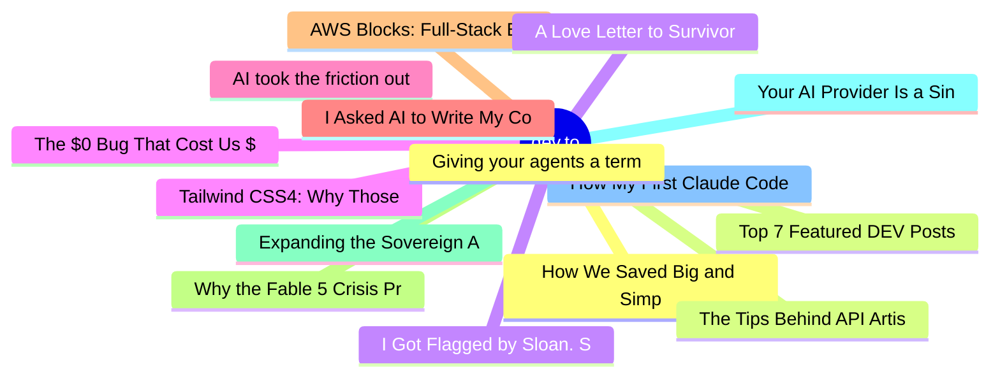

# dev.to Top 15 (2026-06-17)

## 思维导图

## 列表（15 条）

### 1. How We Saved Big and Simplified Our Image Pipeline: Adopting bunny.net on DEV
- **链接**: [https://dev.to/devteam/how-we-saved-big-and-simplified-our-image-pipeline-adopting-bunnynet-on-dev-3d53](https://dev.to/devteam/how-we-saved-big-and-simplified-our-image-pipeline-adopting-bunnynet-on-dev-3d53)
- **作者**: Ben Halpern | **阅读**: 9min
- **反应**: 48 | **评论**: 5
- **标签**: `performance`, `webdev`, `design`, `bunny`
- **简介**: Hey everyone, Ben here.  If you’ve been following the journey of DEV and our open source project...

### 2. Top 7 Featured DEV Posts of the Week
- **链接**: [https://dev.to/devteam/top-7-featured-dev-posts-of-the-week-1h65](https://dev.to/devteam/top-7-featured-dev-posts-of-the-week-1h65)
- **作者**: Jess Lee | **阅读**: 2min
- **反应**: 49 | **评论**: 16
- **标签**: `top7`, `discuss`
- **简介**: Welcome to this week's Top 7, where the DEV editorial team handpicks their favorite posts from the...

### 3. I Got Flagged by Sloan. Sloan Is a Guy I Know.
- **链接**: [https://dev.to/dannwaneri/i-got-flagged-by-sloan-sloan-is-a-guy-i-know-3d0e](https://dev.to/dannwaneri/i-got-flagged-by-sloan-sloan-is-a-guy-i-know-3d0e)
- **作者**: Daniel Nwaneri | **阅读**: 4min
- **反应**: 37 | **评论**: 31
- **标签**: `ai`, `discuss`, `meta`, `devto`
- **简介**: Two weeks ago I published a piece explaining exactly why AI detectors are unreliable. Then Sloan...

### 4. Tailwind CSS4: Why Those Inline Styles Are Actually More Scalable - A Senior CSS Developer's Guide
- **链接**: [https://dev.to/cathylai/tailwind-css4-why-those-inline-styles-are-actually-more-scalable-a-senior-css-developers-guide-hdj](https://dev.to/cathylai/tailwind-css4-why-those-inline-styles-are-actually-more-scalable-a-senior-css-developers-guide-hdj)
- **作者**: Cathy Lai | **阅读**: 2min
- **反应**: 24 | **评论**: 9
- **标签**: `tailwindcss`, `css`, `webdev`, `frontend`
- **简介**: So you have heard about the Tailwind CSS and want to incorporate into your new project. But those...

### 5. AI took the friction out of my work. Then I found out the friction was holding up two things: my ideas and my brakes. Twenty-five years in a confession.
- **链接**: [https://dev.to/sfrangulov/ai-took-the-friction-out-of-my-work-then-i-found-out-the-friction-was-holding-up-two-things-my-4971](https://dev.to/sfrangulov/ai-took-the-friction-out-of-my-work-then-i-found-out-the-friction-was-holding-up-two-things-my-4971)
- **作者**: Sergei Frangulov | **阅读**: 4min
- **反应**: 10 | **评论**: 0
- **标签**: `ai`, `productivity`, `career`, `discuss`
- **简介**: For a long time now the news and the roundups have all said the same thing. AI will take away the...

### 6. I Asked AI to Write My Commit Messages It Was Embarrassing.
- **链接**: [https://dev.to/harsh2644/i-asked-ai-to-write-my-commit-messages-it-was-embarrassing-a6i](https://dev.to/harsh2644/i-asked-ai-to-write-my-commit-messages-it-was-embarrassing-a6i)
- **作者**: Harsh  | **阅读**: 4min
- **反应**: 33 | **评论**: 12
- **标签**: `git`, `programming`, `humor`, `productivity`
- **简介**: I asked AI to write a commit message for me last week The code change was simple. A bug fix One line,...

### 7. AWS Blocks: Full-Stack Building Blocks That Run Locally Without an AWS Account
- **链接**: [https://dev.to/aws-heroes/aws-blocks-full-stack-building-blocks-that-run-locally-without-an-aws-account-346l](https://dev.to/aws-heroes/aws-blocks-full-stack-building-blocks-that-run-locally-without-an-aws-account-346l)
- **作者**: Vivek V. | **阅读**: 6min
- **反应**: 10 | **评论**: 0
- **标签**: `webdev`, `fullstack`, `developer`, `aws`
- **简介**: Why I built a Custom Kiro Power to ship faster with AWS Blocks   Every developer building on...

### 8. Why the Fable 5 Crisis Proves Your AI Context Layer Can't Live Inside the Model
- **链接**: [https://dev.to/jon_at_backboardio/why-the-fable-5-crisis-proves-your-ai-context-layer-cant-live-inside-the-model-2n6d](https://dev.to/jon_at_backboardio/why-the-fable-5-crisis-proves-your-ai-context-layer-cant-live-inside-the-model-2n6d)
- **作者**: Jonathan Murray | **阅读**: 3min
- **反应**: 13 | **评论**: 3
- **标签**: `ai`, `coding`, `programming`, `opensource`
- **简介**: Rent the Intelligence, Own the Memory   On Friday, a single government letter pulled a...

### 9. Expanding the Sovereign AI Stack: Moving the Specification from Gateway to Local Silicon
- **链接**: [https://dev.to/kenwalger/expanding-the-sovereign-ai-stack-moving-the-specification-from-gateway-to-local-silicon-23fp](https://dev.to/kenwalger/expanding-the-sovereign-ai-stack-moving-the-specification-from-gateway-to-local-silicon-23fp)
- **作者**: Ken W Alger | **阅读**: 5min
- **反应**: 4 | **评论**: 4
- **标签**: `python`, `ai`, `architecture`, `sqlite`
- **简介**: When I first introduced the Sovereign Systems Specification and released the initial foundation of...

### 10. Your AI Provider Is a Single Point of Failure
- **链接**: [https://dev.to/aws/your-ai-provider-is-a-single-point-of-failure-26i2](https://dev.to/aws/your-ai-provider-is-a-single-point-of-failure-26i2)
- **作者**: Maish Saidel-Keesing | **阅读**: 5min
- **反应**: 3 | **评论**: 2
- **标签**: `ai`, `devops`, `architecture`, `microservices`
- **简介**: Last Friday, the U.S. Commerce Department sent a letter to Anthropic. By that evening, Fable 5 and...

### 11. How My First Claude Code on AWS Bedrock Experiment Cost Me $8.43 in Just One Day
- **链接**: [https://dev.to/aws-builders/how-my-first-claude-code-on-aws-bedrock-experiment-cost-me-843-in-just-one-day-1835](https://dev.to/aws-builders/how-my-first-claude-code-on-aws-bedrock-experiment-cost-me-843-in-just-one-day-1835)
- **作者**: Venkatesh K | **阅读**: 7min
- **反应**: 6 | **评论**: 0
- **标签**: `aws`, `amazonbedrock`, `claudecode`, `awscommunity`
- **简介**: AWS Bedrock and Claude Code

### 12. Giving your agents a terminal: a first look at the tabstack CLI
- **链接**: [https://dev.to/juststevemcd/giving-your-agents-a-terminal-a-first-look-at-the-tabstack-cli-1fcb](https://dev.to/juststevemcd/giving-your-agents-a-terminal-a-first-look-at-the-tabstack-cli-1fcb)
- **作者**: Steve McDougall | **阅读**: 7min
- **反应**: 1 | **评论**: 0
- **标签**: `tabstack`, `go`, `cli`, `aiagents`
- **简介**: Every project I touch lately ends up needing the same awkward thing: a reliable way to pull the web...

### 13. The Tips Behind API Artisan: Building Laravel APIs Developers Actually Want to Use
- **链接**: [https://dev.to/juststevemcd/the-tips-behind-api-artisan-building-laravel-apis-developers-actually-want-to-use-eh5](https://dev.to/juststevemcd/the-tips-behind-api-artisan-building-laravel-apis-developers-actually-want-to-use-eh5)
- **作者**: Steve McDougall | **阅读**: 10min
- **反应**: 1 | **评论**: 0
- **标签**: `laravel`, `apidesign`, `restapis`, `php`
- **简介**: Practical tips for building Laravel APIs developers trust: contract-first design, versioning, RFC 9457 errors, idempotency and more. Free book inside.

### 14. A Love Letter to Survivorship Bias in Tech
- **链接**: [https://dev.to/towernter/a-love-letter-to-survivorship-bias-in-tech-kfa](https://dev.to/towernter/a-love-letter-to-survivorship-bias-in-tech-kfa)
- **作者**: Tawanda Nyahuye | **阅读**: 5min
- **反应**: 2 | **评论**: 0
- **标签**: `career`, `software`, `productivity`, `architecture`
- **简介**: How many times have you seen a picture of a plane with red dots posted on the internet without...

### 15. The $0 Bug That Cost Us $1,800 in API Calls
- **链接**: [https://dev.to/arpitstack/the-0-bug-that-cost-us-1800-in-api-calls-3add](https://dev.to/arpitstack/the-0-bug-that-cost-us-1800-in-api-calls-3add)
- **作者**: Arpit Gupta | **阅读**: 4min
- **反应**: 7 | **评论**: 2
- **标签**: `webdev`, `startup`, `ai`, `devops`
- **简介**: Last quarter our OpenAI bill went from $620 to $2,480 in 23 days.  No new features shipped. No...
