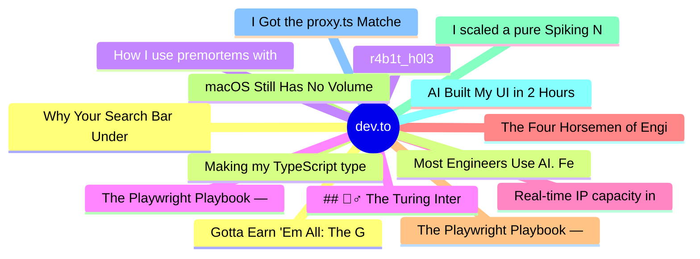

# dev.to Top 15 (2026-06-18)

## 思维导图

## 列表（15 条）

### 1. Gotta Earn 'Em All: The Gym Badges of Agentic Engineering (Part 1)
- **链接**: [https://dev.to/kaleman15/gotta-earn-em-all-the-gym-badges-of-agentic-engineering-part-1-5bff](https://dev.to/kaleman15/gotta-earn-em-all-the-gym-badges-of-agentic-engineering-part-1-5bff)
- **作者**: Kevin Alemán | **阅读**: 5min
- **反应**: 6 | **评论**: 0
- **标签**: `ai`, `agents`, `programming`, `career`
- **简介**: There's a guy who stands at the entrance to the Indigo Plateau and will not let you through. Level 80...

### 2. Making my TypeScript types 15.7x faster
- **链接**: [https://dev.to/dzakh/making-my-typescript-types-157x-faster-4gcg](https://dev.to/dzakh/making-my-typescript-types-157x-faster-4gcg)
- **作者**: Dmitry Zakharov | **阅读**: 4min
- **反应**: 5 | **评论**: 0
- **标签**: `typescript`, `performance`, `opensource`, `webdev`
- **简介**: What slows large TypeScript types down, how to measure it with @ark/attest, and the one-field match that made my schema library 15.7x cheaper to type-check.

### 3. r4b1t_h0l3
- **链接**: [https://dev.to/gnomeman4201/r4b1th0l3-5aa3](https://dev.to/gnomeman4201/r4b1th0l3-5aa3)
- **作者**: GnomeMan4201 | **阅读**: 3min
- **反应**: 2 | **评论**: 0
- **标签**: `osint`, `security`, `webdev`, `opensource`
- **简介**: → Try it: gnomeman4201.github.io/r4b1t  It's a curated random link generator for security and OSINT...

### 4. ## 🕵️‍♂️ The Turing Interrogation
- **链接**: [https://dev.to/gautam_prajapati/-the-turing-interrogation-f1e](https://dev.to/gautam_prajapati/-the-turing-interrogation-f1e)
- **作者**: gautam kumar | **阅读**: 2min
- **反应**: 3 | **评论**: 0
- **标签**: `devchallenge`, `gamechallenge`, `gamedev`
- **简介**: Welcome to The Turing Interrogation!  Set in the secret halls of Bletchley Park, your mission is...

### 5. Real-time IP capacity in Google Cloud subnets
- **链接**: [https://dev.to/googlecloud/real-time-ip-capacity-in-google-cloud-subnets-4m9j](https://dev.to/googlecloud/real-time-ip-capacity-in-google-cloud-subnets-4m9j)
- **作者**: Zach S. | **阅读**: 4min
- **反应**: 6 | **评论**: 0
- **标签**: `googlecloud`, `networking`
- **简介**: When managing Shared VPCs, most teams allocate dedicated IP subnets for each service project to keep...

### 6. The Four Horsemen of Engineer Communication.
- **链接**: [https://dev.to/kevin074/the-four-horsemen-of-engineer-communication-2104](https://dev.to/kevin074/the-four-horsemen-of-engineer-communication-2104)
- **作者**: kevin074 | **阅读**: 4min
- **反应**: 2 | **评论**: 0
- **标签**: `career`, `interview`, `discuss`, `writing`
- **简介**: Hello, I am a senior developer with 11 years of experience. Over my journey so far I have witnessed...

### 7. The Playwright Playbook — Part 3: Multi-User, Multi-Tab & Browser Context Testing
- **链接**: [https://dev.to/sshhfaiz/the-playwright-playbook-part-3-multi-user-multi-tab-browser-context-testing-1jii](https://dev.to/sshhfaiz/the-playwright-playbook-part-3-multi-user-multi-tab-browser-context-testing-1jii)
- **作者**: Faizal | **阅读**: 10min
- **反应**: 6 | **评论**: 1
- **标签**: `playwright`, `testing`, `typescript`, `automation`
- **简介**: Test real-time collaboration, role-based permissions, and multi-tab flows in Playwright. Two users. One test. The scenarios most frameworks simply can't handle.

### 8. macOS Still Has No Volume Mixer, So I Built One
- **链接**: [https://dev.to/thalesbmc/macos-still-has-no-volume-mixer-so-i-built-one-53lp](https://dev.to/thalesbmc/macos-still-has-no-volume-mixer-so-i-built-one-53lp)
- **作者**: Thales Brederodes | **阅读**: 4min
- **反应**: 0 | **评论**: 0
- **标签**: `swift`, `opensource`, `macos`, `audio`
- **简介**: macOS has never had a proper per-app volume mixer.  On Windows, this is basic. You can lower Spotify,...

### 9. I scaled a pure Spiking Neural Network (SNN) to 1.088B parameters from scratch. Ran out of budget, but here is what I found
- **链接**: [https://dev.to/gtausa197svg/i-scaled-a-pure-spiking-neural-network-snn-to-1088b-parameters-from-scratch-ran-out-of-budget-3pg7](https://dev.to/gtausa197svg/i-scaled-a-pure-spiking-neural-network-snn-to-1088b-parameters-from-scratch-ran-out-of-budget-3pg7)
- **作者**: zerdovzad | **阅读**: 2min
- **反应**: 3 | **评论**: 0
- **标签**: `ai`, `programming`, `software`, `productivity`
- **简介**: Hey everyone. I’m an 18yo indie dev, and I’ve been experimenting with Spiking Neural Networks (SNNs)...

### 10. AI Built My UI in 2 Hours. Then I Spent 3 Weeks Fixing It.
- **链接**: [https://dev.to/xu_xu_b2179aa8fc958d531d1/ai-built-my-ui-in-2-hours-then-i-spent-3-weeks-fixing-it-4n5f](https://dev.to/xu_xu_b2179aa8fc958d531d1/ai-built-my-ui-in-2-hours-then-i-spent-3-weeks-fixing-it-4n5f)
- **作者**: xu xu | **阅读**: 5min
- **反应**: 3 | **评论**: 1
- **标签**: `ai`, `programming`, `devrel`, `react`
- **简介**: The PR had 47 changed files. Three new React components, two API routes, a context provider, and what...

### 11. I Got the proxy.ts Matcher Wrong for Three Projects Before I Understood Why
- **链接**: [https://dev.to/shubhradev/i-got-the-proxyts-matcher-wrong-for-three-projects-before-i-understood-why-4e5c](https://dev.to/shubhradev/i-got-the-proxyts-matcher-wrong-for-three-projects-before-i-understood-why-4e5c)
- **作者**: Shubhra Pokhariya | **阅读**: 9min
- **反应**: 23 | **评论**: 9
- **标签**: `nextjs`, `javascript`, `webdev`, `security`
- **简介**: A few days ago I published a post about the three-layer auth model and the invoice incident that made...

### 12. Why Your Search Bar Understands You
- **链接**: [https://dev.to/lovestaco/why-your-search-bar-understands-you-179p](https://dev.to/lovestaco/why-your-search-bar-understands-you-179p)
- **作者**: Athreya aka Maneshwar | **阅读**: 7min
- **反应**: 11 | **评论**: 0
- **标签**: `webdev`, `programming`, `productivity`, `ai`
- **简介**: Hello, I'm Maneshwar. I'm building git-lrc, a Micro AI code reviewer that runs on every commit. It is...

### 13. Most Engineers Use AI. Few Engineer With It.
- **链接**: [https://dev.to/jeelvankhede/most-engineers-use-ai-few-engineer-with-it-3pd](https://dev.to/jeelvankhede/most-engineers-use-ai-few-engineer-with-it-3pd)
- **作者**: Jeel Vankhede | **阅读**: 4min
- **反应**: 1 | **评论**: 0
- **标签**: `ai`, `productivity`, `softwareengineering`, `programing`
- **简介**: Most software engineers I know use AI in some form now.  Maybe it is for debugging, boilerplate,...

### 14. How I use premortems with Claude and Codex
- **链接**: [https://dev.to/pablonax/how-i-use-premortems-with-claude-and-codex-46mm](https://dev.to/pablonax/how-i-use-premortems-with-claude-and-codex-46mm)
- **作者**: Pavel Kalo | **阅读**: 5min
- **反应**: 40 | **评论**: 2
- **标签**: `ai`, `claude`, `llm`, `tooling`
- **简介**: I started using premortems for a boring reason: I did not trust the default review question.  When I...

### 15. The Playwright Playbook — Part 4: API Testing — The Underrated Superpower
- **链接**: [https://dev.to/sshhfaiz/the-playwright-playbook-part-4-api-testing-the-underrated-superpower-4c64](https://dev.to/sshhfaiz/the-playwright-playbook-part-4-api-testing-the-underrated-superpower-4c64)
- **作者**: Faizal | **阅读**: 14min
- **反应**: 10 | **评论**: 1
- **标签**: `playwright`, `testing`, `typescript`, `automation`
- **简介**: Replace Postman with Playwright's request context. Schema validation, auth token flows, GraphQL testing, and chaining API setup with UI assertions — all in TypeScript.
