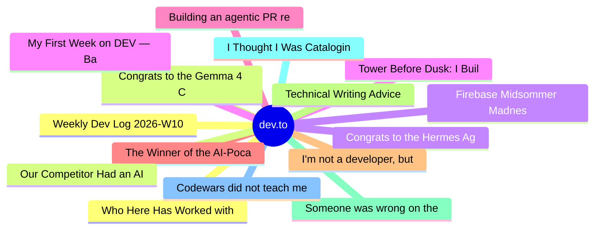

# dev.to Top 15 (2026-06-19)

## 思维导图

## 列表（15 条）

### 1. Who Here Has Worked with Legacy? The Longer You Wait, the Worse It Gets
- **链接**: [https://dev.to/sylwia-lask/who-here-has-worked-with-legacy-the-longer-you-wait-the-worse-it-gets-58bk](https://dev.to/sylwia-lask/who-here-has-worked-with-legacy-the-longer-you-wait-the-worse-it-gets-58bk)
- **作者**: Sylwia Laskowska | **阅读**: 9min
- **反应**: 55 | **评论**: 27
- **标签**: `javascript`, `webdev`, `programming`, `architecture`
- **简介**: I promised myself that starting this week I'd switch to lighter topics. But on Monday, my JSNation...

### 2. Congrats to the Gemma 4 Challenge Winners!
- **链接**: [https://dev.to/devteam/congrats-to-the-gemma-4-challenge-winners-4fgc](https://dev.to/devteam/congrats-to-the-gemma-4-challenge-winners-4fgc)
- **作者**: Jess Lee | **阅读**: 3min
- **反应**: 35 | **评论**: 9
- **标签**: `devchallenge`, `gemmachallenge`, `gemma`
- **简介**: We are so excited to announce the winners of the Gemma 4 Challenge!  This is officially our most...

### 3. Congrats to the Hermes Agent Challenge Winners!
- **链接**: [https://dev.to/devteam/congrats-to-the-hermes-agent-challenge-winners-3on0](https://dev.to/devteam/congrats-to-the-hermes-agent-challenge-winners-3on0)
- **作者**: Jess Lee | **阅读**: 3min
- **反应**: 13 | **评论**: 3
- **标签**: `hermesagentchallenge`, `devchallenge`, `agents`
- **简介**: We are thrilled to announce the winners of the Hermes Agent Challenge! Over the past few weeks, the...

### 4. Tower Before Dusk: I Built a Puzzle Game for Humans and AI
- **链接**: [https://dev.to/gramli/tower-before-dusk-i-built-a-puzzle-game-for-humans-and-ai-oao](https://dev.to/gramli/tower-before-dusk-i-built-a-puzzle-game-for-humans-and-ai-oao)
- **作者**: Daniel Balcarek | **阅读**: 7min
- **反应**: 39 | **评论**: 26
- **标签**: `devchallenge`, `gamechallenge`, `gamedev`, `ai`
- **简介**: This is a submission for the June Solstice Game Jam  It's interesting how the most exciting ideas...

### 5. Building an agentic PR reviewer with Antigravity SDK
- **链接**: [https://dev.to/googleai/building-an-agentic-pr-reviewer-with-antigravity-sdk-3b0i](https://dev.to/googleai/building-an-agentic-pr-reviewer-with-antigravity-sdk-3b0i)
- **作者**: Remigiusz Samborski | **阅读**: 6min
- **反应**: 10 | **评论**: 0
- **标签**: `antigravity`, `gemini`, `ai`, `programming`
- **简介**: As announced in this blog post on June 18, 2026, Gemini CLI and Gemini Code Assist IDE extensions...

### 6. The Winner of the AI-Pocalypse? The Full-Stack Generalist (But Probably Later Instead of Sooner)
- **链接**: [https://dev.to/linkbenjamin/the-winner-of-the-ai-pocalypse-the-full-stack-generalist-but-probably-later-instead-of-sooner-12n3](https://dev.to/linkbenjamin/the-winner-of-the-ai-pocalypse-the-full-stack-generalist-but-probably-later-instead-of-sooner-12n3)
- **作者**: Ben Link | **阅读**: 5min
- **反应**: 4 | **评论**: 10
- **标签**: `careerdevelopment`, `beginners`, `devops`, `ai`
- **简介**: We've been told since late 2022 that "within 6 months, we won't need software engineers anymore". I...

### 7. I'm not a developer, but I built a calendar app to fix my most annoying work task
- **链接**: [https://dev.to/googleai/im-not-a-developer-but-i-built-a-calendar-app-to-fix-my-most-annoying-work-task-dj4](https://dev.to/googleai/im-not-a-developer-but-i-built-a-calendar-app-to-fix-my-most-annoying-work-task-dj4)
- **作者**: Aria Heller | **阅读**: 2min
- **反应**: 9 | **评论**: 0
- **标签**: `ai`, `productivity`, `beginners`, `discuss`
- **简介**: I’m not a developer! I’ve never coded anything in my life. As far as I’m concerned, a Cloudtop is...

### 8. Technical Writing Advice
- **链接**: [https://dev.to/pauljlucas/technical-writing-advice-28a6](https://dev.to/pauljlucas/technical-writing-advice-28a6)
- **作者**: Paul J. Lucas | **阅读**: 6min
- **反应**: 13 | **评论**: 5
- **标签**: `documentation`, `technical`, `writing`
- **简介**: Some advice for writing technical material.

### 9. Someone was wrong on the internet, so I built a Temporal Docker extension
- **链接**: [https://dev.to/temporalio/someone-was-wrong-on-the-internet-so-i-built-a-temporal-docker-extension-55pp](https://dev.to/temporalio/someone-was-wrong-on-the-internet-so-i-built-a-temporal-docker-extension-55pp)
- **作者**: Shy Ruparel | **阅读**: 7min
- **反应**: 0 | **评论**: 0
- **标签**: `temporal`, `selfhosted`, `codesamples`, `durableexecution`
- **简介**: How Shy Ruparel built a Temporal Docker Desktop extension by identifying a gap and making it available for the community

### 10. I Thought I Was Cataloging Ways AI Agents Fail. I Was Describing Cross-Layer Coherence.
- **链接**: [https://dev.to/zep1997/i-thought-i-was-cataloging-ways-ai-agents-fail-i-was-describing-cross-layer-coherence-1bh1](https://dev.to/zep1997/i-thought-i-was-cataloging-ways-ai-agents-fail-i-was-describing-cross-layer-coherence-1bh1)
- **作者**: Self-Correcting Systems | **阅读**: 7min
- **反应**: 4 | **评论**: 4
- **标签**: `ai`, `agents`, `llm`, `architecture`
- **简介**: My uncle once left me on a basketball court with a sheet of drills and walked off. Before he did, he...

### 11. Codewars did not teach me JavaScript. My job did.
- **链接**: [https://dev.to/shannonianthe/codewars-did-not-teach-me-javascript-my-job-did-379k](https://dev.to/shannonianthe/codewars-did-not-teach-me-javascript-my-job-did-379k)
- **作者**: Shannon Mettry | **阅读**: 3min
- **反应**: 3 | **评论**: 3
- **标签**: `career`, `codenewbie`, `javascript`, `learning`
- **简介**: Why your brain learns faster by doing than by studying, and the neuroscience that explains...

### 12. Weekly Dev Log 2026-W10
- **链接**: [https://dev.to/umitomo-lab/weekly-dev-log-2026-w10-33a9](https://dev.to/umitomo-lab/weekly-dev-log-2026-w10-33a9)
- **作者**: Umitomo | **阅读**: 4min
- **反应**: 3 | **评论**: 0
- **标签**: `beginners`, `devjournal`, `security`, `swift`
- **简介**: Weekly learning log of iOS, web development, and cybersecurity — 2026-W10

### 13. Our Competitor Had an AI That Covered 97.2%. We Had a Spreadsheet and a Fake Quote. Guess Who Won.
- **链接**: [https://dev.to/xulingfeng/our-competitor-had-an-ai-that-covered-972-we-had-a-spreadsheet-and-a-fake-quote-guess-who-won-5cc3](https://dev.to/xulingfeng/our-competitor-had-an-ai-that-covered-972-we-had-a-spreadsheet-and-a-fake-quote-guess-who-won-5cc3)
- **作者**: xulingfeng | **阅读**: 20min
- **反应**: 20 | **评论**: 0
- **标签**: `ai`, `discuss`, `career`, `programming`
- **简介**: You walk into the RFP briefing. Your competitor has 200 people, 97% AI coverage, and a 4-day...

### 14. Firebase Midsommer Madnesss with Antigravity CLI
- **链接**: [https://dev.to/gde/firebase-midsommer-madnesss-with-antigravity-cli-3geb](https://dev.to/gde/firebase-midsommer-madnesss-with-antigravity-cli-3geb)
- **作者**: xbill | **阅读**: 11min
- **反应**: 1 | **评论**: 0
- **标签**: `midsommar`, `devchallenge`, `gamechallenge`, `gamedev`
- **简介**: This is a submission for the June Solstice Game Jam  This installment brings a Firebase build to...

### 15. My First Week on DEV — Badges, Game Jams, and Way More Than I Expected
- **链接**: [https://dev.to/gamya_m/my-first-week-on-dev-badges-game-jams-and-way-more-than-i-expected-3ec2](https://dev.to/gamya_m/my-first-week-on-dev-badges-game-jams-and-way-more-than-i-expected-3ec2)
- **作者**: Gamya  | **阅读**: 3min
- **反应**: 22 | **评论**: 4
- **标签**: `discuss`, `watercooler`, `beginners`, `devjournal`
- **简介**: I joined DEV at the start of January, but it's only really been in the past week or so that things...
