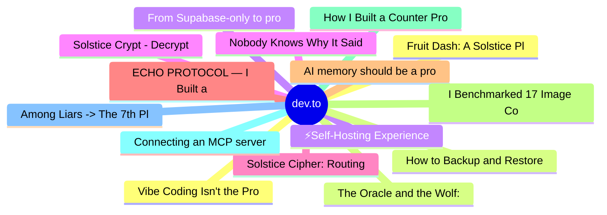

# dev.to Top 15 (2026-06-21)

## 思维导图

## 列表（15 条）

### 1. Fruit Dash: A Solstice Platformer with Binary Code Gates
- **链接**: [https://dev.to/agastya_khati_f72c89077c8/fruit-dash-a-solstice-platformer-with-binary-code-gates-2jmi](https://dev.to/agastya_khati_f72c89077c8/fruit-dash-a-solstice-platformer-with-binary-code-gates-2jmi)
- **作者**: Agastya Khati | **阅读**: 5min
- **反应**: 23 | **评论**: 3
- **标签**: `devchallenge`, `gamechallenge`, `gamedev`, `unity3d`
- **简介**: This is a submission for the June Solstice Game Jam           What I Built   I built Fruit Dash, a...

### 2. The Oracle and the Wolf: I Made Gemini Lose Like a Kid 🐺
- **链接**: [https://dev.to/anchildress1/the-oracle-and-the-wolf-i-made-gemini-lose-like-a-kid-3nk5](https://dev.to/anchildress1/the-oracle-and-the-wolf-i-made-gemini-lose-like-a-kid-3nk5)
- **作者**: Ashley Childress | **阅读**: 16min
- **反应**: 2 | **评论**: 0
- **标签**: `devchallenge`, `gamechallenge`, `gamedev`, `gemini`
- **简介**: How I used Gemini in Save the Sun: it reads players' plain-language questions and plays a Norse wolf tuned to lose like a kid—never to cheat. DEV June Game Jam 2026 entry.

### 3. ⚡️Self-Hosting Experience with Jetson Orin Nano and Ollama 🦙
- **链接**: [https://dev.to/annavi11arrea1/self-hosting-experience-with-jetson-orin-nano-and-ollama-5a9c](https://dev.to/annavi11arrea1/self-hosting-experience-with-jetson-orin-nano-and-ollama-5a9c)
- **作者**: Anna Villarreal | **阅读**: 8min
- **反应**: 0 | **评论**: 0
- **标签**: `ubuntu`, `nvidia`, `webdev`, `ai`
- **简介**: I don't know where to begin. This is a long story, but it all started when I saw that DEV was having...

### 4. Solstice Crypt - Decrypt the Light
- **链接**: [https://dev.to/kanyingidickson/solstice-crypt-decrypt-the-light-3id6](https://dev.to/kanyingidickson/solstice-crypt-decrypt-the-light-3id6)
- **作者**: Kanyingidickson.dev | **阅读**: 6min
- **反应**: 3 | **评论**: 0
- **标签**: `devchallenge`, `gamechallenge`, `gamedev`, `webdev`
- **简介**: This is a submission for the June Solstice Game Jam              What I Built    A grid-based laser...

### 5. Solstice Cipher: Routing Light to Crack Codes — A Puzzle Game for the June Solstice Game Jam
- **链接**: [https://dev.to/fanioz/solstice-cipher-routing-light-to-crack-codes-a-puzzle-game-for-the-june-solstice-game-jam-lcc](https://dev.to/fanioz/solstice-cipher-routing-light-to-crack-codes-a-puzzle-game-for-the-june-solstice-game-jam-lcc)
- **作者**: fanioz | **阅读**: 5min
- **反应**: 5 | **评论**: 1
- **标签**: `godot`, `gamedev`, `webdev`, `hackathon`
- **简介**: How I built a multi-tool optical puzzle game in Godot 4.6 with mirrors, prisms, color filters, portals, and a multi-pass 2D raycasting engine — all directed by Google's Gemini-powered Antigravity agen

### 6. ECHO PROTOCOL — I Built a Game Where You Play as Alan Turing's Last AI, Interrogated by a Live Gemini Model
- **链接**: [https://dev.to/_boweii/echo-protocol-i-built-a-game-where-you-play-as-alan-turings-last-ai-interrogated-by-a-live-f5n](https://dev.to/_boweii/echo-protocol-i-built-a-game-where-you-play-as-alan-turings-last-ai-interrogated-by-a-live-f5n)
- **作者**: Tombri Bowei | **阅读**: 8min
- **反应**: 3 | **评论**: 1
- **标签**: `devchallenge`, `gamechallenge`, `gamedev`
- **简介**: This is a submission for the June Solstice Game Jam                 "A dead man's code is the only...

### 7. AI memory should be a product state, not a prompt trick
- **链接**: [https://dev.to/woshiliyana/ai-memory-should-be-a-product-state-not-a-prompt-trick-4m20](https://dev.to/woshiliyana/ai-memory-should-be-a-product-state-not-a-prompt-trick-4m20)
- **作者**: Yana Li | **阅读**: 7min
- **反应**: 3 | **评论**: 2
- **标签**: `ai`, `webdev`, `architecture`, `privacy`
- **简介**: I ran into a memory problem while building a reflective AI product.  The easy version of AI memory is...

### 8. I Benchmarked 17 Image Conversions on My Production Server. Some Results Were Not What I Expected.
- **链接**: [https://dev.to/serhii_kalyna_730b636889c/i-benchmarked-17-image-conversions-on-my-production-server-some-results-were-not-what-i-expected-1j4f](https://dev.to/serhii_kalyna_730b636889c/i-benchmarked-17-image-conversions-on-my-production-server-some-results-were-not-what-i-expected-1j4f)
- **作者**: Serhii Kalyna | **阅读**: 2min
- **反应**: 7 | **评论**: 2
- **标签**: `webdev`, `img`, `performance`, `webperf`
- **简介**: I run Convertify, a free image converter built on Rust and libvips. Last week I decided to stop...

### 9. How I Built a Counter Program in Anchor and Learned to Trust My Tests
- **链接**: [https://dev.to/lymah/how-i-built-a-counter-program-in-anchor-and-learned-to-trust-my-tests-1akg](https://dev.to/lymah/how-i-built-a-counter-program-in-anchor-and-learned-to-trust-my-tests-1akg)
- **作者**: Lymah | **阅读**: 4min
- **反应**: 0 | **评论**: 0
- **标签**: `solana`, `rust`, `anchor`, `100daysofsolana`
- **简介**: I spent a week building a counter program in Anchor — the Rust framework for writing Solana programs....

### 10. Connecting an MCP server gives your agent hands. It also gives a stranger a way in.
- **链接**: [https://dev.to/rapls/connecting-an-mcp-server-gives-your-agent-hands-it-also-gives-a-stranger-a-way-in-3mgi](https://dev.to/rapls/connecting-an-mcp-server-gives-your-agent-hands-it-also-gives-a-stranger-a-way-in-3mgi)
- **作者**: Rapls | **阅读**: 5min
- **反应**: 1 | **评论**: 0
- **标签**: `ai`, `security`, `claudecode`, `mcp`
- **简介**: The moment you connect an MCP server, your coding agent stops being a thing that reads and writes in...

### 11. Among Liars -> The 7th Player Isn't Human
- **链接**: [https://dev.to/mirshah12/among-liars-the-7th-player-isnt-human-345h](https://dev.to/mirshah12/among-liars-the-7th-player-isnt-human-345h)
- **作者**: Mir Shah | **阅读**: 6min
- **反应**: 2 | **评论**: 2
- **标签**: `devchallenge`, `gamechallenge`, `gamedev`, `amongliars`
- **简介**: This is a submission for the June Solstice Game Jam.  I built Among Liars, a realtime multiplayer...

### 12. Vibe Coding Isn't the Problem. Not Understanding the Stack Is.
- **链接**: [https://dev.to/kkierii/vibe-coding-isnt-the-problem-not-understanding-the-stack-is-4kif](https://dev.to/kkierii/vibe-coding-isnt-the-problem-not-understanding-the-stack-is-4kif)
- **作者**: Kerry Kier | **阅读**: 5min
- **反应**: 0 | **评论**: 0
- **标签**: `ai`, `devops`, `security`, `programming`
- **简介**: Here is a config an AI coding tool handed me, barely changed:    DATABASE_URL =...

### 13. How to Backup and Restore Coolify in 12 Minutes (Before Your Server Dies on a Friday Night)
- **链接**: [https://dev.to/dev-arafat-alim/how-to-backup-and-restore-coolify-in-12-minutes-before-your-server-dies-on-a-friday-night-254p](https://dev.to/dev-arafat-alim/how-to-backup-and-restore-coolify-in-12-minutes-before-your-server-dies-on-a-friday-night-254p)
- **作者**: ARAFAT AMAN ALIM | **阅读**: 8min
- **反应**: 0 | **评论**: 0
- **标签**: `devops`, `webdev`, `security`, `opensource`
- **简介**: Last updated: June 2026 | Reading time: ~8 mins | Difficulty: Medium (agar Docker se darr nahi toh...

### 14. From Supabase-only to production Go: Month 1 of rebuilding Info Links
- **链接**: [https://dev.to/mohamadobeid9/from-supabase-only-to-production-go-month-1-of-rebuilding-info-links-3a4p](https://dev.to/mohamadobeid9/from-supabase-only-to-production-go-month-1-of-rebuilding-info-links-3a4p)
- **作者**: Mohamad Obeid | **阅读**: 5min
- **反应**: 2 | **评论**: 0
- **标签**: `go`, `webdev`, `career`, `showdev`
- **简介**: Two months ago I wrote about building Info Links — a free course resource platform for students at Le...

### 15. Nobody Knows Why It Said That
- **链接**: [https://dev.to/aditya_007/nobody-knows-why-it-said-that-3o8l](https://dev.to/aditya_007/nobody-knows-why-it-said-that-3o8l)
- **作者**: Aditya | **阅读**: 7min
- **反应**: 10 | **评论**: 2
- **标签**: `ai`, `machinelearning`, `discuss`, `beginners`
- **简介**: Inside the Black Box — Post 1 of 6       Series: Inside the Black Box — A developer's honest...
