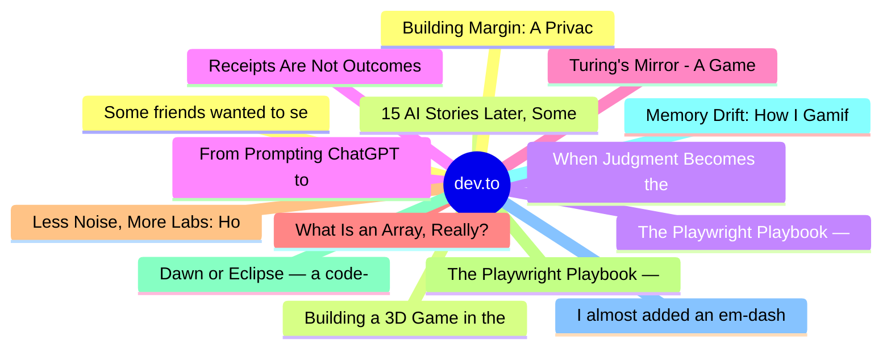

# dev.to Top 15 (2026-06-22)

## 思维导图

## 列表（15 条）

### 1. Some friends wanted to see how I use DigitalOcean. So I built them the smallest real app I could.
- **链接**: [https://dev.to/dimitrovk/some-friends-wanted-to-see-how-i-use-digitalocean-so-i-built-them-the-smallest-real-app-i-could-238l](https://dev.to/dimitrovk/some-friends-wanted-to-see-how-i-use-digitalocean-so-i-built-them-the-smallest-real-app-i-could-238l)
- **作者**: Kalin Dimitrov | **阅读**: 7min
- **反应**: 9 | **评论**: 0
- **标签**: `python`, `cloud`, `devops`, `digitalocean`
- **简介**: A couple of friends know I host most of my side projects on DigitalOcean, and lately they've been...

### 2. 15 AI Stories Later, Some Honest Words
- **链接**: [https://dev.to/xulingfeng/15-ai-stories-later-some-honest-words-o9j](https://dev.to/xulingfeng/15-ai-stories-later-some-honest-words-o9j)
- **作者**: xulingfeng | **阅读**: 8min
- **反应**: 26 | **评论**: 9
- **标签**: `ai`, `discuss`, `programming`, `career`
- **简介**: May 29 I wrote my first AI trainwreck story. June 18 I finished #15.  People keep asking if this was...

### 3. When Judgment Becomes the Bottleneck
- **链接**: [https://dev.to/gamya_m/when-judgment-becomes-the-bottleneck-973](https://dev.to/gamya_m/when-judgment-becomes-the-bottleneck-973)
- **作者**: Gamya  | **阅读**: 3min
- **反应**: 15 | **评论**: 6
- **标签**: `discuss`, `ai`, `watercooler`, `productivity`
- **简介**: A few days ago I published a lighthearted post about building a coding mascot generator with Google...

### 4. From Prompting ChatGPT to Orchestrating AI Agents: Two Years as an Ordinary Engineer
- **链接**: [https://dev.to/timetxt/from-prompting-chatgpt-to-orchestrating-ai-agents-two-years-as-an-ordinary-engineer-1li7](https://dev.to/timetxt/from-prompting-chatgpt-to-orchestrating-ai-agents-two-years-as-an-ordinary-engineer-1li7)
- **作者**: Jason Shen | **阅读**: 8min
- **反应**: 4 | **评论**: 2
- **标签**: `ai`, `programming`, `productivity`, `agents`
- **简介**: Two years ago, my interaction with AI was mostly limited to asking ChatGPT questions and checking its...

### 5. Turing's Mirror - A Game About the Question We Still Haven't Answered
- **链接**: [https://dev.to/tejas164321/turings-mirror-a-game-about-the-question-we-still-havent-answered-1e3o](https://dev.to/tejas164321/turings-mirror-a-game-about-the-question-we-still-havent-answered-1e3o)
- **作者**: Tejas Patil | **阅读**: 4min
- **反应**: 45 | **评论**: 14
- **标签**: `devchallenge`, `gamechallenge`, `gamedev`, `ai`
- **简介**: This is a submission for the June Solstice Game Jam           What I Built   Turing's Mirror is a...

### 6. What Is an Array, Really? I'm Writing a Book to Find Out
- **链接**: [https://dev.to/m__mdy__m/what-is-an-array-really-im-writing-a-book-to-find-out-pf1](https://dev.to/m__mdy__m/what-is-an-array-really-im-writing-a-book-to-find-out-pf1)
- **作者**: Genix | **阅读**: 4min
- **反应**: 5 | **评论**: 1
- **标签**: `opensource`, `computerscience`, `beginners`, `architecture`
- **简介**: I've written plenty of code that uses arrays. Looped over them, indexed into them, passed them...

### 7. Less Noise, More Labs: How I Actually Learned RF Hacking This Year
- **链接**: [https://dev.to/numbpill3d/less-noise-more-labs-how-i-actually-learned-rf-hacking-this-year-4e15](https://dev.to/numbpill3d/less-noise-more-labs-how-i-actually-learned-rf-hacking-this-year-4e15)
- **作者**: v. Splicer | **阅读**: 6min
- **反应**: 1 | **评论**: 0
- **标签**: `programming`, `opensource`, `security`, `software`
- **简介**: Let me be honest with you. If you spend more time reading about RF hacking than actually doing RF...

### 8. The Playwright Playbook — Part 7: The CI/CD Setup Nobody Shows You
- **链接**: [https://dev.to/sshhfaiz/the-playwright-playbook-part-7-the-cicd-setup-nobody-shows-you-516e](https://dev.to/sshhfaiz/the-playwright-playbook-part-7-the-cicd-setup-nobody-shows-you-516e)
- **作者**: Faizal | **阅读**: 12min
- **反应**: 8 | **评论**: 1
- **标签**: `playwright`, `testing`, `typescript`, `automation`
- **简介**: A production-ready Playwright CI/CD pipeline — GitHub Actions, test sharding across machines, browser matrix, Docker for consistent environments, Slack failure notifications, and published HTML report

### 9. Dawn or Eclipse — a code-breaking ode to Turing you can't outsource to the machine
- **链接**: [https://dev.to/tobethekey/dawn-or-eclipse-a-code-breaking-ode-to-turing-you-cant-outsource-to-the-machine-3o8a](https://dev.to/tobethekey/dawn-or-eclipse-a-code-breaking-ode-to-turing-you-cant-outsource-to-the-machine-3o8a)
- **作者**: Tobias Key | **阅读**: 4min
- **反应**: 2 | **评论**: 0
- **标签**: `devchallenge`, `gamechallenge`, `gamedev`
- **简介**: This is a submission for the June Solstice Game Jam  Play it live, no key and no install:...

### 10. Memory Drift: How I Gamified LLM Context Decay in Next.js
- **链接**: [https://dev.to/pvishalkeerthan/memory-drift-how-i-gamified-llm-context-decay-in-nextjs-4ilf](https://dev.to/pvishalkeerthan/memory-drift-how-i-gamified-llm-context-decay-in-nextjs-4ilf)
- **作者**: Vishal Keerthan | **阅读**: 8min
- **反应**: 1 | **评论**: 0
- **标签**: `devchallenge`, `gamechallenge`, `gamedev`, `webdev`
- **简介**: This is a submission for the June Solstice Game Jam.              What I Built    An AI assistant...

### 11. I almost added an em-dash remover to my LLM library. Then I tested whether local models even produce em-dashes.
- **链接**: [https://dev.to/tushar9802/i-almost-added-an-em-dash-remover-to-my-llm-library-then-i-tested-whether-local-models-even-3eln](https://dev.to/tushar9802/i-almost-added-an-em-dash-remover-to-my-llm-library-then-i-tested-whether-local-models-even-3eln)
- **作者**: Tushar Jaju | **阅读**: 5min
- **反应**: 3 | **评论**: 0
- **标签**: `python`, `ai`, `llm`, `opensource`
- **简介**: How a five-model local sweep reshaped llmclean 0.3.0 — and three things about LLM output that turned out to be the opposite of what I assumed.

### 12. Building Margin: A Privacy-First News Reader Inside Chrome's Side Panel
- **链接**: [https://dev.to/mohanvenkatakrishnan/building-margin-a-privacy-first-news-reader-inside-chromes-side-panel-32c](https://dev.to/mohanvenkatakrishnan/building-margin-a-privacy-first-news-reader-inside-chromes-side-panel-32c)
- **作者**: Mohan | **阅读**: 4min
- **反应**: 5 | **评论**: 2
- **标签**: `chromeextension`, `webdev`, `javascript`, `showdev`
- **简介**: I built a Chrome extension called Margin — a news reader that lives in the browser's side panel and...

### 13. Building a 3D Game in the Browser Humbled Me. Here's Everything That Fought Back.
- **链接**: [https://dev.to/arya_koste_5845807df94776/building-a-3d-game-in-the-browser-humbled-me-heres-everything-that-fought-back-4mmg](https://dev.to/arya_koste_5845807df94776/building-a-3d-game-in-the-browser-humbled-me-heres-everything-that-fought-back-4mmg)
- **作者**: Arya Koste | **阅读**: 13min
- **反应**: 1 | **评论**: 0
- **标签**: `devchallenge`, `gamechallenge`, `gamedev`
- **简介**: This is a submission for the June Solstice Game Jam  Coordinate systems. Rotated bounding boxes. A...

### 14. The Playwright Playbook — Bonus: Refactoring Schema Validation with Zod
- **链接**: [https://dev.to/sshhfaiz/the-playwright-playbook-bonus-refactoring-schema-validation-with-zod-3400](https://dev.to/sshhfaiz/the-playwright-playbook-bonus-refactoring-schema-validation-with-zod-3400)
- **作者**: Faizal | **阅读**: 5min
- **反应**: 2 | **评论**: 1
- **标签**: `playwright`, `testing`, `typescript`, `automation`
- **简介**: A reader asked for it — here's the hand-rolled schema validator from Part 4, refactored with Zod. Better error messages, free type inference, way less boilerplate.

### 15. Receipts Are Not Outcomes: What Happened When I Pointed My AI Gate at Trading
- **链接**: [https://dev.to/kenielzep97/receipts-are-not-outcomes-what-happened-when-i-pointed-my-ai-gate-at-trading-3409](https://dev.to/kenielzep97/receipts-are-not-outcomes-what-happened-when-i-pointed-my-ai-gate-at-trading-3409)
- **作者**: Self-Correcting Systems | **阅读**: 9min
- **反应**: 1 | **评论**: 0
- **标签**: `ai`, `agents`, `machinelearning`, `devjournal`
- **简介**: I have been writing here about one core idea:  AI agents do not only fail because they forget...
