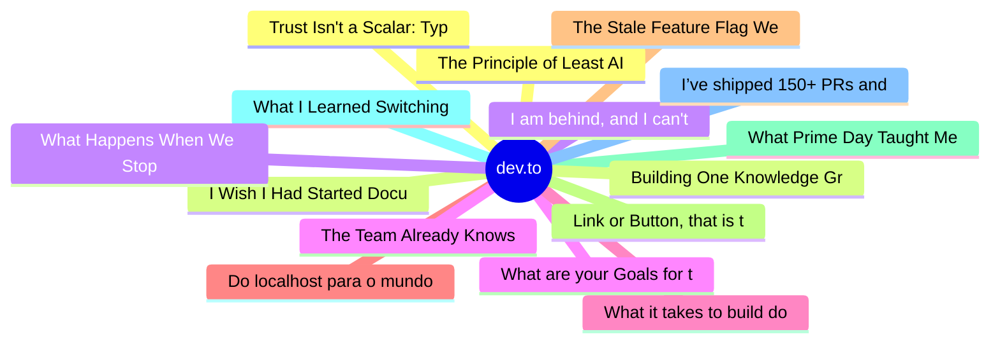

# dev.to Top 15 (2026-06-23)

## 思维导图

## 列表（15 条）

### 1. The Principle of Least AI
- **链接**: [https://dev.to/ingosteinke/the-principle-of-least-ai-4jc0](https://dev.to/ingosteinke/the-principle-of-least-ai-4jc0)
- **作者**: Ingo Steinke, web developer | **阅读**: 5min
- **反应**: 34 | **评论**: 6
- **标签**: `ai`, `productivity`, `watercooler`
- **简介**: Why AI Alternatives Matter   AI is prone to problems affecting its output: hallucinations,...

### 2. I Wish I Had Started Documenting My Tech Journey Earlier
- **链接**: [https://dev.to/hemapriya_kanagala/i-wish-i-had-started-documenting-my-tech-journey-earlier-5d7m](https://dev.to/hemapriya_kanagala/i-wish-i-had-started-documenting-my-tech-journey-earlier-5d7m)
- **作者**: Hemapriya Kanagala | **阅读**: 10min
- **反应**: 54 | **评论**: 21
- **标签**: `community`, `beginners`, `discuss`, `career`
- **简介**: TL;DR  For a long time, I told myself I would start documenting my journey later. I thought I needed...

### 3. I am behind, and I can't prove it but does it matter?
- **链接**: [https://dev.to/francistrdev/i-am-behind-and-i-cant-prove-it-but-does-it-matter-49a6](https://dev.to/francistrdev/i-am-behind-and-i-cant-prove-it-but-does-it-matter-49a6)
- **作者**: FrancisTRᴅᴇᴠ (っ◔◡◔)っ | **阅读**: 4min
- **反应**: 27 | **评论**: 8
- **标签**: `discuss`, `community`, `mentalhealth`, `career`
- **简介**: Let's be fair. The title of this post is confusing at first, but once you read it in full, I hope you...

### 4. What are your Goals for the week? #184
- **链接**: [https://dev.to/jarvisscript/what-are-your-goals-for-the-week-184-2kda](https://dev.to/jarvisscript/what-are-your-goals-for-the-week-184-2kda)
- **作者**: Chris Jarvis | **阅读**: 1min
- **反应**: 8 | **评论**: 4
- **标签**: `discuss`, `motivation`
- **简介**: It's a rainy Monday morning. Let's get ready for the week.           What are your goals for the...

### 5. What it takes to build docs worth reading
- **链接**: [https://dev.to/devsofmidnight/what-it-takes-to-build-docs-worth-reading-2290](https://dev.to/devsofmidnight/what-it-takes-to-build-docs-worth-reading-2290)
- **作者**: Lauren Lee | **阅读**: 4min
- **反应**: 8 | **评论**: 0
- **标签**: `documentation`, `developer`, `devrel`, `product`
- **简介**: From 476 to 1,900+ commits: See how the Midnight DevRel team treated documentation like a product and completely transformed the developer hub.

### 6. Do localhost para o mundo
- **链接**: [https://dev.to/he4rt/do-localhost-para-o-mundo-2o44](https://dev.to/he4rt/do-localhost-para-o-mundo-2o44)
- **作者**: Bruno Freschi | **阅读**: 3min
- **反应**: 32 | **评论**: 6
- **标签**: `braziliandevs`, `career`, `programming`, `softwaredevelopment`
- **简介**: Por muito tempo eu acreditei que programação e desenvolvimento de software como sinônimos. Na...

### 7. The Stale Feature Flag We Deleted That Turned a Feature Back On
- **链接**: [https://dev.to/pixel-wraith/the-stale-feature-flag-we-deleted-that-turned-a-feature-back-on-529m](https://dev.to/pixel-wraith/the-stale-feature-flag-we-deleted-that-turned-a-feature-back-on-529m)
- **作者**: Jake Lundberg | **阅读**: 4min
- **反应**: 4 | **评论**: 0
- **标签**: `softwareengineering`, `devops`, `programming`, `featureflags`
- **简介**: Someone on our team was cleaning up feature flags. It was good instinct...we had a pile of them, and...

### 8. Link or Button, that is the question.
- **链接**: [https://dev.to/micaavigliano/link-or-button-that-is-the-question-2n13](https://dev.to/micaavigliano/link-or-button-that-is-the-question-2n13)
- **作者**: Mica | **阅读**: 3min
- **反应**: 15 | **评论**: 3
- **标签**: `a11y`, `webdev`, `frontend`, `html`
- **简介**: What is a Link?            Definition   A link is an interactive element that redirects the...

### 9. What Prime Day Taught Me About Prompt Engineering
- **链接**: [https://dev.to/cseeman/what-prime-day-taught-me-about-prompt-engineering-3gek](https://dev.to/cseeman/what-prime-day-taught-me-about-prompt-engineering-3gek)
- **作者**: christine | **阅读**: 11min
- **反应**: 4 | **评论**: 1
- **标签**: `ai`, `promptengineering`, `llm`, `shopping`
- **简介**: I wanted to get better at prompt engineering. Not the trick-the-robot kind, the boring-but-useful...

### 10. What I Learned Switching Between Swift and AI Studio in the Same Week
- **链接**: [https://dev.to/gamya_m/what-i-learned-switching-between-swift-and-ai-studio-in-the-same-week-3jn6](https://dev.to/gamya_m/what-i-learned-switching-between-swift-and-ai-studio-in-the-same-week-3jn6)
- **作者**: Gamya  | **阅读**: 4min
- **反应**: 16 | **评论**: 2
- **标签**: `discuss`, `watercooler`, `ai`, `swift`
- **简介**: This past week I did two very different kinds of "building." On one side: continuing my Swift series,...

### 11. I’ve shipped 150+ PRs and built AI agents in a day - but I still can’t get a job
- **链接**: [https://dev.to/nehaaaa6/ive-shipped-150-prs-and-built-ai-agents-in-a-day-but-i-still-cant-get-a-job-12m2](https://dev.to/nehaaaa6/ive-shipped-150-prs-and-built-ai-agents-in-a-day-but-i-still-cant-get-a-job-12m2)
- **作者**: Neha Prasad | **阅读**: 3min
- **反应**: 11 | **评论**: 3
- **标签**: `opensource`, `ai`, `career`
- **简介**: I'm writing this because I don't know what else to do. This is Neha. I am a software engineer. I have...

### 12. Trust Isn't a Scalar: Typed Provenance for Agent Chains
- **链接**: [https://dev.to/p0rt/trust-isnt-a-scalar-typed-provenance-for-agent-chains-229p](https://dev.to/p0rt/trust-isnt-a-scalar-typed-provenance-for-agent-chains-229p)
- **作者**: Sergei Parfenov | **阅读**: 9min
- **反应**: 8 | **评论**: 4
- **标签**: `ai`, `llm`, `devops`, `machinelearning`
- **简介**: Two posts ago I gave you a boolean trust tag. A commenter took it apart, and he was right. Here's the better model: trust is a vector over axes, provenance is what propagates, and the consumer applies

### 13. Building One Knowledge Graph Across 46 Repositories With Static Analysis (Part 1)
- **链接**: [https://dev.to/ryantsuji/building-one-knowledge-graph-across-46-repositories-with-static-analysis-part-1-egm](https://dev.to/ryantsuji/building-one-knowledge-graph-across-46-repositories-with-static-analysis-part-1-egm)
- **作者**: Ryosuke Tsuji | **阅读**: 12min
- **反应**: 14 | **评论**: 0
- **标签**: `ai`, `knowledgegraph`, `staticanalysis`, `typescript`
- **简介**: A static-analysis approach to unifying 46 repositories (37 air-closet-side + 9 mall-side) of legacy production code into one knowledge graph. Why simply 'letting AI read the code' isn't enough, why I 

### 14. What Happens When We Stop Asking
- **链接**: [https://dev.to/eayurt/what-happens-when-we-stop-asking-37je](https://dev.to/eayurt/what-happens-when-we-stop-asking-37je)
- **作者**: Ender Ahmet Yurt | **阅读**: 5min
- **反应**: 0 | **评论**: 0
- **标签**: `ai`, `programming`, `productivity`
- **简介**: Stack Overflow peaked at 200,000 questions a month in 2014. In 2026 it barely reaches 3,000. AI is the main reason. But my worry is bigger than Stack Overflow.

### 15. The Team Already Knows
- **链接**: [https://dev.to/jonoherrington/the-team-already-knows-1cba](https://dev.to/jonoherrington/the-team-already-knows-1cba)
- **作者**: Jono Herrington | **阅读**: 5min
- **反应**: 0 | **评论**: 0
- **标签**: `leadership`, `webdev`, `management`
- **简介**: My first meeting at Converse was a 50-person standup. The scrum lead had every engineer type their...
