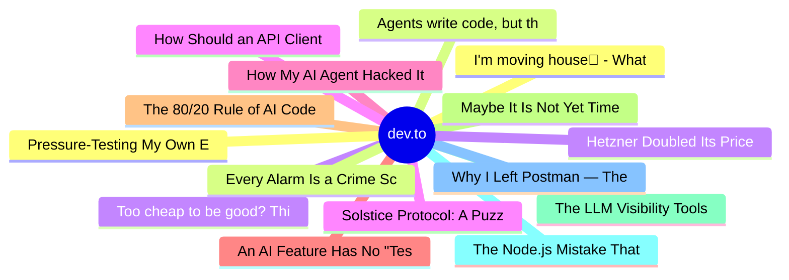

# dev.to Top 15 (2026-06-24)

## 思维导图

## 列表（15 条）

### 1. I'm moving house🏡 - What gadgets, furniture and whatnot do I need for The Ultimate Setup™? 🚀
- **链接**: [https://dev.to/thormeier/im-moving-house-what-gadgets-furniture-and-whatnot-do-i-need-for-the-ultimate-setup-5bp9](https://dev.to/thormeier/im-moving-house-what-gadgets-furniture-and-whatnot-do-i-need-for-the-ultimate-setup-5bp9)
- **作者**: Pascal Thormeier | **阅读**: 2min
- **反应**: 17 | **评论**: 13
- **标签**: `productivity`, `watercooler`, `discuss`, `tooling`
- **简介**: TL;DR: What gadgets, tools, furniture and whatnot do I need for an ideal desk setup for a...

### 2. Agents write code, but they don't remember
- **链接**: [https://dev.to/lizziepika/agents-write-code-but-they-dont-remember-4ob0](https://dev.to/lizziepika/agents-write-code-but-they-dont-remember-4ob0)
- **作者**: Lizzie Siegle | **阅读**: 3min
- **反应**: 12 | **评论**: 17
- **标签**: `ai`, `sdlc`, `llms`, `agents`
- **简介**: Code generation is solved, but memory isn't. Here's an argument for why the SDLC is inverting with intent becoming the spine and code becoming a layer you drill into, explaining what teams lose every 

### 3. Too cheap to be good? Think again.
- **链接**: [https://dev.to/pascal_cescato_692b7a8a20/too-cheap-to-be-good-think-again-4nj0](https://dev.to/pascal_cescato_692b7a8a20/too-cheap-to-be-good-think-again-4nj0)
- **作者**: Pascal CESCATO | **阅读**: 13min
- **反应**: 13 | **评论**: 16
- **标签**: `ai`, `benchmark`, `devops`, `webdev`
- **简介**: I replaced aaPanel/OpenLiteSpeed with Caddy and shell scripts and turned the process into a benchmark. Two phases (architecture then code), one external code review. The winning model? Not the one you

### 4. Solstice Protocol: A Puzzle Adventure to Save the Longest Day
- **链接**: [https://dev.to/kiranbasnal/solstice-protocol-a-puzzle-adventure-to-save-the-longest-day-1gcl](https://dev.to/kiranbasnal/solstice-protocol-a-puzzle-adventure-to-save-the-longest-day-1gcl)
- **作者**: kiran | **阅读**: 3min
- **反应**: 14 | **评论**: 0
- **标签**: `devchallenge`, `gamechallenge`, `gamedev`, `programming`
- **简介**: This is a submission for the June Solstice Game Jam  Solstice Protocol is a sci-fi puzzle adventure...

### 5. How My AI Agent Hacked Its Own Permissions (And What It Taught Me)
- **链接**: [https://dev.to/gdg/how-my-ai-agent-hacked-its-own-permissions-and-what-it-taught-me-34bm](https://dev.to/gdg/how-my-ai-agent-hacked-its-own-permissions-and-what-it-taught-me-34bm)
- **作者**: Alexander Tyutin | **阅读**: 2min
- **反应**: 11 | **评论**: 2
- **标签**: `ai`, `security`, `agents`, `automation`
- **简介**: Have you ever tried to build an automation that works so well it bypasses the very rules you set for...

### 6. An AI Feature Has No "Tests Pass" Moment. So I Write the Eval First.
- **链接**: [https://dev.to/mrviduus/an-ai-feature-has-no-tests-pass-moment-so-i-write-the-eval-first-1f7p](https://dev.to/mrviduus/an-ai-feature-has-no-tests-pass-moment-so-i-write-the-eval-first-1f7p)
- **作者**: Vasyl | **阅读**: 4min
- **反应**: 10 | **评论**: 12
- **标签**: `ai`, `dotnet`, `csharp`, `machinelearning`
- **简介**: I was building an "Ask This Book" feature: readers can ask questions about a book while they're...

### 7. The 80/20 Rule of AI Code — Why the Last 20% Takes 80% of Your Time
- **链接**: [https://dev.to/harsh2644/the-8020-rule-of-ai-code-why-the-last-20-takes-80-of-your-time-3pcg](https://dev.to/harsh2644/the-8020-rule-of-ai-code-why-the-last-20-takes-80-of-your-time-3pcg)
- **作者**: Harsh  | **阅读**: 6min
- **反应**: 23 | **评论**: 11
- **标签**: `ai`, `programming`, `productivity`, `softwareengineering`
- **简介**: AI wrote the first 80% of my feature in 10 minutes.  The code was clean. The logic made sense. The...

### 8. Maybe It Is Not Yet Time To Bring Every AI Demo To Production
- **链接**: [https://dev.to/marcosomma/maybe-it-is-not-yet-time-to-bring-every-ai-demo-to-production-o74](https://dev.to/marcosomma/maybe-it-is-not-yet-time-to-bring-every-ai-demo-to-production-o74)
- **作者**: marcosomma | **阅读**: 10min
- **反应**: 6 | **评论**: 3
- **标签**: `ai`, `programming`, `productivity`, `tutorial`
- **简介**: There is a sentence I keep hearing in AI engineering that sounds innocent, practical, and mature:...

### 9. The LLM Visibility Tools Cost $79/Month. Mine is Open Source.
- **链接**: [https://dev.to/dannwaneri/the-llm-visibility-tools-cost-79month-mine-is-open-source-29hb](https://dev.to/dannwaneri/the-llm-visibility-tools-cost-79month-mine-is-open-source-29hb)
- **作者**: Daniel Nwaneri | **阅读**: 4min
- **反应**: 14 | **评论**: 4
- **标签**: `ai`, `seo`, `python`, `opensource`
- **简介**: Tom Capper at a Search Engine Journal webinar last week:   "There's no Search Console equivalent for...

### 10. The Node.js Mistake That Cost My Client $3,000 in AWS Bills
- **链接**: [https://dev.to/manolito99/the-nodejs-mistake-that-cost-my-client-3000-in-aws-bills-30a5](https://dev.to/manolito99/the-nodejs-mistake-that-cost-my-client-3000-in-aws-bills-30a5)
- **作者**: Lolo | **阅读**: 2min
- **反应**: 16 | **评论**: 9
- **标签**: `node`, `javascript`, `aws`, `webdev`
- **简介**: Last year I was asked to investigate a startup's AWS bill.  It had jumped from roughly $200/month to...

### 11. Why I Left Postman — The Real Cost of a Cloud-First API Client
- **链接**: [https://dev.to/flutwiz/why-i-left-postman-the-real-cost-of-a-cloud-first-api-client-3gfd](https://dev.to/flutwiz/why-i-left-postman-the-real-cost-of-a-cloud-first-api-client-3gfd)
- **作者**: FlutWiz | **阅读**: 4min
- **反应**: 27 | **评论**: 2
- **标签**: `api`, `postman`, `opensource`, `devtools`
- **简介**: I used Postman for years. It was the first thing I installed on every new laptop, the default answer...

### 12. Pressure-Testing My Own Explanations — A Swift Writing Exercise
- **链接**: [https://dev.to/gamya_m/pressure-testing-my-own-explanations-a-swift-writing-exercise-58j3](https://dev.to/gamya_m/pressure-testing-my-own-explanations-a-swift-writing-exercise-58j3)
- **作者**: Gamya  | **阅读**: 3min
- **反应**: 22 | **评论**: 0
- **标签**: `ai`, `swift`, `programming`, `learning`
- **简介**: When you've worked with a concept long enough, there's a gap that can quietly open up between "I know...

### 13. Every Alarm Is a Crime Scene: Meet Poirot, the Read-Only Incident Detective
- **链接**: [https://dev.to/aws-builders/every-alarm-is-a-crime-scene-meet-poirot-the-read-only-incident-detective-58pa](https://dev.to/aws-builders/every-alarm-is-a-crime-scene-meet-poirot-the-read-only-incident-detective-58pa)
- **作者**: Marcos Henrique | **阅读**: 6min
- **反应**: 1 | **评论**: 0
- **标签**: `ai`, `aws`, `typescript`, `cdk`
- **简介**: What if the thing that gets paged at 2am wasn't a person, but a detective that investigates the...

### 14. Hetzner Doubled Its Prices Again. The AI Memory Crunch Is Why
- **链接**: [https://dev.to/devopsdaily/hetzner-doubled-its-prices-again-the-ai-memory-crunch-is-why-64b](https://dev.to/devopsdaily/hetzner-doubled-its-prices-again-the-ai-memory-crunch-is-why-64b)
- **作者**: DevOps Daily | **阅读**: 6min
- **反应**: 5 | **评论**: 0
- **标签**: `devops`, `linux`, `ai`, `opensource`
- **简介**: If you run anything on Hetzner, you have probably already seen the notice. As of 08:00 CEST on June...

### 15. How Should an API Client Look in 2026? A Comparison of the Field
- **链接**: [https://dev.to/nikolas_dimitroulakis_d23/how-should-an-api-client-look-in-2026-a-comparison-of-the-field-3pl9](https://dev.to/nikolas_dimitroulakis_d23/how-should-an-api-client-look-in-2026-a-comparison-of-the-field-3pl9)
- **作者**: Nikolas Dimitroulakis | **阅读**: 5min
- **反应**: 8 | **评论**: 1
- **标签**: `api`, `graphql`, `programming`, `testing`
- **简介**: API tooling is having a rough year, and that's actually the interesting part.  Postman killed free...
