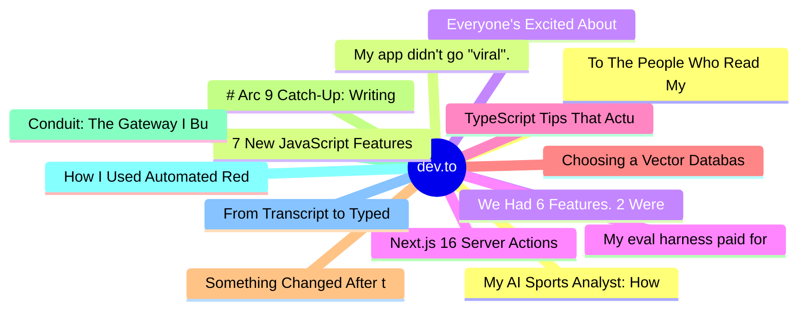

# dev.to Top 15 (2026-06-25)

## 思维导图

## 列表（15 条）

### 1. To The People Who Read My Weird Little Blogs
- **链接**: [https://dev.to/itsugo/to-the-people-who-read-my-weird-little-blogs-3icj](https://dev.to/itsugo/to-the-people-who-read-my-weird-little-blogs-3icj)
- **作者**: Aryan Choudhary | **阅读**: 4min
- **反应**: 44 | **评论**: 7
- **标签**: `writing`, `community`, `discuss`, `learning`
- **简介**: When I joined DEV, I had a very simple goal.  Learn in public. Maybe improve as a developer....

### 2. 7 New JavaScript Features (And 2 I'm Still Waiting For)
- **链接**: [https://dev.to/sylwia-lask/7-new-javascript-features-and-2-im-still-waiting-for-2ck8](https://dev.to/sylwia-lask/7-new-javascript-features-and-2-im-still-waiting-for-2ck8)
- **作者**: Sylwia Laskowska | **阅读**: 9min
- **反应**: 59 | **评论**: 20
- **标签**: `javascript`, `typescript`, `node`, `webdev`
- **简介**: Remember how I promised you (or rather myself) two weeks ago that from now on I'd only write light,...

### 3. Everyone's Excited About Claude Tag. Nobody's Built the Trust Layer.
- **链接**: [https://dev.to/dannwaneri/everyones-excited-about-claude-tag-nobodys-built-the-trust-layer-1ohp](https://dev.to/dannwaneri/everyones-excited-about-claude-tag-nobodys-built-the-trust-layer-1ohp)
- **作者**: Daniel Nwaneri | **阅读**: 3min
- **反应**: 18 | **评论**: 20
- **标签**: `ai`, `claude`, `agents`, `opensource`
- **简介**: Andrej Karpathy, OpenAI co-founder and former Tesla AI director, called Claude Tag the third major...

### 4. Next.js 16 Server Actions Security: The Auth Check Most Developers Miss
- **链接**: [https://dev.to/shubhradev/nextjs-16-server-actions-security-the-auth-check-most-developers-miss-1ei1](https://dev.to/shubhradev/nextjs-16-server-actions-security-the-auth-check-most-developers-miss-1ei1)
- **作者**: Shubhra Pokhariya | **阅读**: 8min
- **反应**: 10 | **评论**: 8
- **标签**: `nextjs`, `security`, `webdev`, `javascript`
- **简介**: I keep seeing it on code reviews. Proxy solid. Auth on every Server Component. Header direction...

### 5. TypeScript Tips That Actually Matter in Real Projects (including the satisfies operator)
- **链接**: [https://dev.to/gavincettolo/typescript-tips-that-actually-matter-in-real-projects-including-the-satisfies-operator-2cfg](https://dev.to/gavincettolo/typescript-tips-that-actually-matter-in-real-projects-including-the-satisfies-operator-2cfg)
- **作者**: Gavin Cettolo | **阅读**: 11min
- **反应**: 22 | **评论**: 9
- **标签**: `typescript`, `javascript`, `webdev`, `beginners`
- **简介**: Most TypeScript tutorials teach you the language.  This article teaches you how to use it.  There's a...

### 6. Choosing a Vector Database in 2026: pgvector vs. Pinecone vs. Qdrant vs. Weaviate vs. Milvus
- **链接**: [https://dev.to/arya_koste_5845807df94776/choosing-a-vector-database-in-2026-pgvector-vs-pinecone-vs-qdrant-vs-weaviate-vs-milvus-422k](https://dev.to/arya_koste_5845807df94776/choosing-a-vector-database-in-2026-pgvector-vs-pinecone-vs-qdrant-vs-weaviate-vs-milvus-422k)
- **作者**: Arya Koste | **阅读**: 9min
- **反应**: 1 | **评论**: 0
- **标签**: `ai`, `programming`, `database`, `machinelearning`
- **简介**: Every RAG tutorial pulls the same move. It walks you through embeddings, chunking, retrieval, and...

### 7. Something Changed After the Sloan Articles. I Can't Prove It.
- **链接**: [https://dev.to/dannwaneri/something-changed-after-the-sloan-articles-i-cant-prove-it-5009](https://dev.to/dannwaneri/something-changed-after-the-sloan-articles-i-cant-prove-it-5009)
- **作者**: Daniel Nwaneri | **阅读**: 6min
- **反应**: 23 | **评论**: 29
- **标签**: `ai`, `meta`, `devto`, `discuss`
- **简介**: This is the third piece in a sequence. The first asked whether Sloan had flagged anyone else — it...

### 8. # Arc 9 Catch-Up: Writing Your First Solana Program
- **链接**: [https://dev.to/100daysofsolana/-arc-9-catch-up-writing-your-first-solana-program-12nl](https://dev.to/100daysofsolana/-arc-9-catch-up-writing-your-first-solana-program-12nl)
- **作者**: Matthew Revell | **阅读**: 8min
- **反应**: 5 | **评论**: 1
- **标签**: `100daysofsolana`, `blockchain`, `web3`, `learning`
- **简介**: With Arc 9 of 100 Days of Solana, we enter the third big phase — or Epoch, as we call them — of the...

### 9. Conduit: The Gateway I Built to Forget About
- **链接**: [https://dev.to/adamthedeveloper/conduit-the-gateway-i-built-to-forget-about-2ann](https://dev.to/adamthedeveloper/conduit-the-gateway-i-built-to-forget-about-2ann)
- **作者**: Adam - The Developer | **阅读**: 9min
- **反应**: 16 | **评论**: 10
- **标签**: `programming`, `architecture`, `typescript`, `go`
- **简介**: I've been trying to keep my publishing schedule to one article a week, but this one felt too special...

### 10. How I Used Automated Red Teaming To Take My AI Agent from 6/9 Breaches to Zero
- **链接**: [https://dev.to/morganwilliscloud/red-team-your-ai-agents-before-someone-else-does-o4i](https://dev.to/morganwilliscloud/red-team-your-ai-agents-before-someone-else-does-o4i)
- **作者**: Morgan Willis | **阅读**: 10min
- **反应**: 10 | **评论**: 3
- **标签**: `agents`, `ai`, `security`, `aws`
- **简介**: I gave an AI agent the vended bash tool from Strands and asked it to read my AWS credentials file. At...

### 11. From Transcript to Typed Action Items: Three Parallel Agents in TypeScript
- **链接**: [https://dev.to/jackchenme/from-transcript-to-typed-action-items-three-parallel-agents-in-typescript-3oe](https://dev.to/jackchenme/from-transcript-to-typed-action-items-three-parallel-agents-in-typescript-3oe)
- **作者**: JackChen | **阅读**: 8min
- **反应**: 4 | **评论**: 2
- **标签**: `typescript`, `ai`, `agents`, `opensource`
- **简介**: Most meeting summarizers cram summary, action items, and sentiment into one LLM prompt. Here's a cleaner TypeScript shape: three specialist agents run in parallel, two return typed Zod output, and an 

### 12. My AI Sports Analyst: How I Wake Up to World Cup Insights Every Morning
- **链接**: [https://dev.to/aws/my-ai-sports-analyst-how-i-wake-up-to-world-cup-insights-every-morning-3ing](https://dev.to/aws/my-ai-sports-analyst-how-i-wake-up-to-world-cup-insights-every-morning-3ing)
- **作者**: Maish Saidel-Keesing | **阅读**: 10min
- **反应**: 5 | **评论**: 0
- **标签**: `ai`, `quick`, `worldcup`, `aws`
- **简介**: The FIFA World Cup 2026 kicked off on June 11th. And I had a problem.  Most of the matches are played...

### 13. My app didn't go "viral". My AWS bill did.
- **链接**: [https://dev.to/earlgreyhot1701d/my-app-didnt-go-viral-my-aws-bill-did-434h](https://dev.to/earlgreyhot1701d/my-app-didnt-go-viral-my-aws-bill-did-434h)
- **作者**: L. Cordero | **阅读**: 7min
- **反应**: 0 | **评论**: 0
- **标签**: `aws`, `ai`, `learning`, `infrastructure`
- **简介**: And by viral I mean from $0 to $31.   Umami told me Clew Directive got 14 visits last month. AWS told...

### 14. We Had 6 Features. 2 Were Eating Our Budget
- **链接**: [https://dev.to/arpitstack/we-had-6-features-2-were-eating-our-budget-2bph](https://dev.to/arpitstack/we-had-6-features-2-were-eating-our-budget-2bph)
- **作者**: Arpit Gupta | **阅读**: 4min
- **反应**: 7 | **评论**: 2
- **标签**: `ai`, `webdev`, `startup`, `infrastructure`
- **简介**: Twelve months ago we were burning $4,200/month on AI infrastructure and could not tell you which...

### 15. My eval harness paid for itself on the first run: 0.57 0.96, two bugs no unit test could catch
- **链接**: [https://dev.to/delmalih/my-eval-harness-paid-for-itself-on-the-first-run-057-096-two-bugs-no-unit-test-could-catch-55ip](https://dev.to/delmalih/my-eval-harness-paid-for-itself-on-the-first-run-057-096-two-bugs-no-unit-test-could-catch-55ip)
- **作者**: David El Malih | **阅读**: 5min
- **反应**: 2 | **评论**: 2
- **标签**: `ai`, `testing`, `rag`, `python`
- **简介**: I almost shipped a RAG pipeline that, on certain questions, cited exactly the right document — and...
