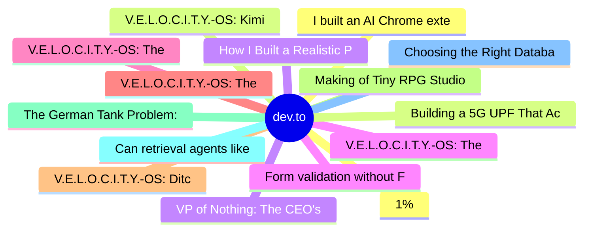

# dev.to Top 15 (2026-06-29)

## 思维导图

## 列表（15 条）

### 1. 1%
- **链接**: [https://dev.to/pascal_cescato_692b7a8a20/1-15n0](https://dev.to/pascal_cescato_692b7a8a20/1-15n0)
- **作者**: Pascal CESCATO | **阅读**: 5min
- **反应**: 33 | **评论**: 35
- **标签**: `ai`, `geopolitics`, `hardware`, `fiction`
- **简介**: Santa Clara, 2029. A speculative fiction about hegemony, sanctions, and the playbook nobody followed.

### 2. V.E.L.O.C.I.T.Y.-OS: Kimi K2.7 and the 'Safe-Room Security' Illusion (Part 1)
- **链接**: [https://dev.to/unitbuilds_cc/velocity-os-kimi-k27-and-the-safe-room-security-illusion-part-1-41oa](https://dev.to/unitbuilds_cc/velocity-os-kimi-k27-and-the-safe-room-security-illusion-part-1-41oa)
- **作者**: UnitBuilds | **阅读**: 4min
- **反应**: 8 | **评论**: 6
- **标签**: `showdev`, `coding`, `compilers`, `security`
- **简介**: How a casual comment thread about Cloudflare's Kimi K2.7 led to building a static credentials scanner gatekeeper.

### 3. VP of Nothing: The CEO's Nephew Took Over My AI Platform. The Client Walked Within a Month.
- **链接**: [https://dev.to/xulingfeng/vp-of-nothing-the-ceos-nephew-took-over-my-ai-platform-the-client-walked-within-a-month-5dla](https://dev.to/xulingfeng/vp-of-nothing-the-ceos-nephew-took-over-my-ai-platform-the-client-walked-within-a-month-5dla)
- **作者**: xulingfeng | **阅读**: 8min
- **反应**: 42 | **评论**: 36
- **标签**: `ai`, `discuss`, `career`, `programming`
- **简介**: Series: AI, Ego &amp; Regret — Bonus Chapter   Editor's Note: While compiling the old series for the...

### 4. V.E.L.O.C.I.T.Y.-OS: The Self-Healing Kernel & LLM Terminal Handover (Part 12)
- **链接**: [https://dev.to/unitbuilds_cc/velocity-os-the-self-healing-kernel-llm-terminal-handover-part-12-1f0i](https://dev.to/unitbuilds_cc/velocity-os-the-self-healing-kernel-llm-terminal-handover-part-12-1f0i)
- **作者**: UnitBuilds | **阅读**: 6min
- **反应**: 3 | **评论**: 1
- **标签**: `showdev`, `coding`, `compilers`, `systems`
- **简介**: How I finalized the self-healing loop, built a content-addressed P2P registry, and handed control to an interactive LLM Terminal.

### 5. V.E.L.O.C.I.T.Y.-OS: The JIT Compiler Core – From AST to Native Closures (Part 4)
- **链接**: [https://dev.to/unitbuilds_cc/velocity-os-the-jit-compiler-core-from-ast-to-native-closures-part-4-52f3](https://dev.to/unitbuilds_cc/velocity-os-the-jit-compiler-core-from-ast-to-native-closures-part-4-52f3)
- **作者**: UnitBuilds | **阅读**: 5min
- **反应**: 2 | **评论**: 1
- **标签**: `showdev`, `coding`, `compilers`, `rust`
- **简介**: How I built a two-tier closure JIT compiler in Rust and solved the lifetime reference problem using Higher-Ranked Trait Bounds (HRTBs).

### 6. V.E.L.O.C.I.T.Y.-OS: The Synaptic Canvas GUI & V-NCE GPU (Part 10)
- **链接**: [https://dev.to/unitbuilds_cc/velocity-os-the-synaptic-canvas-gui-v-nce-gpu-part-10-3om8](https://dev.to/unitbuilds_cc/velocity-os-the-synaptic-canvas-gui-v-nce-gpu-part-10-3om8)
- **作者**: UnitBuilds | **阅读**: 5min
- **反应**: 2 | **评论**: 1
- **标签**: `showdev`, `coding`, `compilers`, `graphics`
- **简介**: How I built a force-directed GUI based on LLM token embeddings and mapped GPU registers in Unified Memory (UMA) space.

### 7. V.E.L.O.C.I.T.Y.-OS: Ditching the Web Stack & The 30MB Standalone IDE (Part 3)
- **链接**: [https://dev.to/unitbuilds_cc/velocity-os-ditching-the-web-stack-the-30mb-standalone-ide-part-3-3ia2](https://dev.to/unitbuilds_cc/velocity-os-ditching-the-web-stack-the-30mb-standalone-ide-part-3-3ia2)
- **作者**: UnitBuilds | **阅读**: 6min
- **反应**: 2 | **评论**: 1
- **标签**: `showdev`, `coding`, `compilers`, `performance`
- **简介**: How I replaced TypeScript and Electron with a zero-allocation binary reader to build an IDE that cold-starts in 200ms.

### 8. Making of Tiny RPG Studio
- **链接**: [https://dev.to/andredarcie/making-of-tiny-rpg-studio-45oh](https://dev.to/andredarcie/making-of-tiny-rpg-studio-45oh)
- **作者**: André N. Darcie | **阅读**: 12min
- **反应**: 7 | **评论**: 3
- **标签**: `webdev`, `gamedev`, `rpg`, `programming`
- **简介**: This is the story of how I created Tiny RPG Studio: a small engine for simple RPGs, built to help...

### 9. The German Tank Problem: Why You Need UUIDs
- **链接**: [https://dev.to/towernter/the-german-tank-problem-why-you-need-uuids-85p](https://dev.to/towernter/the-german-tank-problem-why-you-need-uuids-85p)
- **作者**: Tawanda Nyahuye | **阅读**: 7min
- **反应**: 1 | **评论**: 1
- **标签**: `backend`, `api`, `webdev`, `programming`
- **简介**: In World War II, the Allies had a very expensive question and no good way to answer it: how many...

### 10. Can retrieval agents like ChatGPT and Perplexity read your website? Agentis Lux sees what they see.
- **链接**: [https://dev.to/earlgreyhot1701d/can-retrieval-agents-like-chatgpt-and-perplexity-read-your-website-agentis-lux-sees-what-they-see-5cac](https://dev.to/earlgreyhot1701d/can-retrieval-agents-like-chatgpt-and-perplexity-read-your-website-agentis-lux-sees-what-they-see-5cac)
- **作者**: L. Cordero | **阅读**: 7min
- **反应**: 4 | **评论**: 0
- **标签**: `ai`, `webdev`, `aws`, `showdev`
- **简介**: I created Agentis Lux for the purposes of entering H0 Hackathon (Vercel + AWS Databases)....

### 11. Choosing the Right Database Abstraction
- **链接**: [https://dev.to/davorg/choosing-the-right-database-abstraction-4ge2](https://dev.to/davorg/choosing-the-right-database-abstraction-4ge2)
- **作者**: Dave Cross | **阅读**: 7min
- **反应**: 0 | **评论**: 0
- **标签**: `database`, `dbi`, `dbixclass`
- **简介**: A question came up recently in the Perl community asking whether, in a Mojolicious application, it’s...

### 12. I built an AI Chrome extension with zero backend cost — here's the exact architecture
- **链接**: [https://dev.to/projekta2/i-built-an-ai-chrome-extension-with-zero-backend-cost-heres-the-exact-architecture-43j7](https://dev.to/projekta2/i-built-an-ai-chrome-extension-with-zero-backend-cost-heres-the-exact-architecture-43j7)
- **作者**: Projekta2 | **阅读**: 8min
- **反应**: 2 | **评论**: 3
- **标签**: `chrome`, `javascript`, `ai`, `webdev`
- **简介**: You want to add AI to your Chrome extension.  The obvious path: spin up a Node.js server, hold a...

### 13. Building a 5G UPF That Actually Saturates a 10G Link: VPP + DPDK + Open5GS in Production
- **链接**: [https://dev.to/jarvis8/building-a-5g-upf-that-actually-saturates-a-10g-link-vpp-dpdk-open5gs-in-production-1041](https://dev.to/jarvis8/building-a-5g-upf-that-actually-saturates-a-10g-link-vpp-dpdk-open5gs-in-production-1041)
- **作者**: Nalin Banga | **阅读**: 7min
- **反应**: 2 | **评论**: 0
- **标签**: `networking`, `linux`, `performance`, `5g`
- **简介**: Most writing about DPDK and VPP stays comfortably abstract. Libraries and drivers for fast packet...

### 14. How I Built a Realistic Page-Flip Engine in the Browser — and Wired It to an AI API
- **链接**: [https://dev.to/xin_tian_a0a3d6e12aff92d4/how-i-built-a-realistic-page-flip-engine-in-the-browser-and-wired-it-to-an-ai-api-mn2](https://dev.to/xin_tian_a0a3d6e12aff92d4/how-i-built-a-realistic-page-flip-engine-in-the-browser-and-wired-it-to-an-ai-api-mn2)
- **作者**: FlipRead | **阅读**: 9min
- **反应**: 2 | **评论**: 4
- **标签**: `ai`, `javascript`, `showdev`, `webdev`
- **简介**: A solo developer's technical deep-dive into rendering, multi-format document parsing, and AI...

### 15. Form validation without Formik or React Hook Form: treat your rules as domain logic
- **链接**: [https://dev.to/chacaponquin/form-validation-without-formik-or-react-hook-form-treat-your-rules-as-domain-logic-2j8e](https://dev.to/chacaponquin/form-validation-without-formik-or-react-hook-form-treat-your-rules-as-domain-logic-2j8e)
- **作者**: Hector Angel Gomez Robaina | **阅读**: 11min
- **反应**: 3 | **评论**: 0
- **标签**: `react`, `frontend`, `cleancode`, `typescript`
- **简介**: We've all been here. A new form shows up, you install React Hook Form, add Zod or Yup, and in ten...
