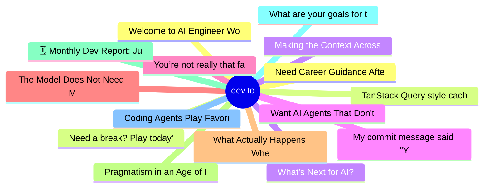

# dev.to Top 15 (2026-06-30)

## 思维导图

## 列表（15 条）

### 1. Welcome to AI Engineer World’s Fair 2026
- **链接**: [https://dev.to/dailycontext/welcome-to-ai-engineer-worlds-fair-2026-2o09](https://dev.to/dailycontext/welcome-to-ai-engineer-worlds-fair-2026-2o09)
- **作者**: swyx | **阅读**: 3min
- **反应**: 60 | **评论**: 6
- **标签**: `aie`, `ai`, `techtalks`, `softwareengineering`
- **简介**: Welcome to the first edition of the AI Engineer World’s Fair newspaper!  On behalf of the organizing...

### 2. Need a break? Play today's game from The Daily Context.
- **链接**: [https://dev.to/devteam/need-a-break-play-todays-game-from-the-daily-context-1fli](https://dev.to/devteam/need-a-break-play-todays-game-from-the-daily-context-1fli)
- **作者**: Jess Lee | **阅读**: 2min
- **反应**: 56 | **评论**: 14
- **标签**: `aie`, `gamedev`, `ai`, `gemini`
- **简介**: We (at DEV and MLH) are covering AI Engineer's World Fair by printing a physical newspaper called...

### 3. What's Next for AI?
- **链接**: [https://dev.to/sylwia-lask/whats-next-for-ai-219i](https://dev.to/sylwia-lask/whats-next-for-ai-219i)
- **作者**: Sylwia Laskowska | **阅读**: 5min
- **反应**: 86 | **评论**: 92
- **标签**: `ai`, `llm`, `webdev`
- **简介**: I have been writing about AI for quite a while now, but this is probably the first time I genuinely...

### 4. My commit message said "You've hit your session limit"
- **链接**: [https://dev.to/shyamala_u/my-commit-message-said-youve-hit-your-session-limit-2abn](https://dev.to/shyamala_u/my-commit-message-said-youve-hit-your-session-limit-2abn)
- **作者**: Shyamala | **阅读**: 8min
- **反应**: 35 | **评论**: 4
- **标签**: `genai`, `ollama`, `learning`, `llm`
- **简介**: How I ended up running a local LLM to generate my git commit messages

### 5. You’re not really that far behind.
- **链接**: [https://dev.to/dailycontext/youre-not-really-that-far-behind-h4d](https://dev.to/dailycontext/youre-not-really-that-far-behind-h4d)
- **作者**: Ryan Swift | **阅读**: 2min
- **反应**: 36 | **评论**: 2
- **标签**: `aie`, `ai`, `learning`
- **简介**: My non-tech friends still don’t get it. Despite what you’d believe from Twitter, most people still...

### 6. The Model Does Not Need Memory. The Situation Does.
- **链接**: [https://dev.to/marcosomma/the-model-does-not-need-memory-the-situation-does-196g](https://dev.to/marcosomma/the-model-does-not-need-memory-the-situation-does-196g)
- **作者**: marcosomma | **阅读**: 11min
- **反应**: 42 | **评论**: 12
- **标签**: `ai`, `rag`, `mcp`, `llm`
- **简介**: I think I was asking the wrong question.   For a while, the question was simple: does memory make...

### 7. What Actually Happens When You Call an LLM API
- **链接**: [https://dev.to/dannwaneri/what-actually-happens-when-you-call-an-llm-api-28l6](https://dev.to/dannwaneri/what-actually-happens-when-you-call-an-llm-api-28l6)
- **作者**: Daniel Nwaneri | **阅读**: 6min
- **反应**: 31 | **评论**: 31
- **标签**: `ai`, `webdev`, `beginners`, `discuss`
- **简介**: you've felt it.  you type a prompt, hit send, and the response starts streaming in under a second....

### 8. Pragmatism in an Age of Infinite Code and Unavoidable Bottlenecks
- **链接**: [https://dev.to/dailycontext/pragmatism-in-an-age-of-infinite-code-and-unavoidable-bottlenecks-1bkd](https://dev.to/dailycontext/pragmatism-in-an-age-of-infinite-code-and-unavoidable-bottlenecks-1bkd)
- **作者**: Ben Halpern | **阅读**: 6min
- **反应**: 31 | **评论**: 5
- **标签**: `ai`, `aie`, `productivity`, `leadership`
- **简介**: Leading into the AI Engineer event in San Francisco, I’m looking forward to having my mind blown....

### 9. 🗓️ Monthly Dev Report: June 2026
- **链接**: [https://dev.to/francistrdev/monthly-dev-report-june-2026-530a](https://dev.to/francistrdev/monthly-dev-report-june-2026-530a)
- **作者**: FrancisTRᴅᴇᴠ (っ◔◡◔)っ | **阅读**: 2min
- **反应**: 49 | **评论**: 5
- **标签**: `discuss`, `community`, `programming`, `devjournal`
- **简介**: Hey everyone! I bring you my development journey on what I have discovered, accomplishments for this...

### 10. What are your goals for the week? #185
- **链接**: [https://dev.to/jarvisscript/what-are-your-goals-for-the-week-185-471m](https://dev.to/jarvisscript/what-are-your-goals-for-the-week-185-471m)
- **作者**: Chris Jarvis | **阅读**: 2min
- **反应**: 10 | **评论**: 4
- **标签**: `discuss`, `motivation`
- **简介**: It's hot, 9am and the heat index is 89F/31.7C already. humidity at 75%. Cut my morning walk short...

### 11. Coding Agents Play Favorites With Your Dependencies
- **链接**: [https://dev.to/dailycontext/coding-agents-play-favorites-with-your-dependencies-2dl6](https://dev.to/dailycontext/coding-agents-play-favorites-with-your-dependencies-2dl6)
- **作者**: Adam DuVander | **阅读**: 5min
- **反应**: 29 | **评论**: 1
- **标签**: `agents`, `aie`, `tooling`
- **简介**: Deep into a coding session, you realize you want beta testers to try some new functionality first....

### 12. Need Career Guidance After Leaving My First Job – Feeling Lost
- **链接**: [https://dev.to/sarthak_pandey_e0f3a9326a/need-career-guidance-after-leaving-my-first-job-feeling-lost-58k](https://dev.to/sarthak_pandey_e0f3a9326a/need-career-guidance-after-leaving-my-first-job-feeling-lost-58k)
- **作者**: sarthak pandey | **阅读**: 2min
- **反应**: 6 | **评论**: 2
- **标签**: `career`, `anonymous`, `beginners`, `discuss`
- **简介**: Hi everyone,  I really need some career advice because I feel completely stuck.  I started my career...

### 13. TanStack Query style caching, the Angular-native way
- **链接**: [https://dev.to/dhutaryan/tanstack-query-style-caching-the-angular-native-way-4igc](https://dev.to/dhutaryan/tanstack-query-style-caching-the-angular-native-way-4igc)
- **作者**: Dzmitry Hutaryan | **阅读**: 5min
- **反应**: 27 | **评论**: 2
- **标签**: `angular`, `typescript`, `webdev`, `opensource`
- **简介**: Angular has signals now - and as of 19.2, even a signal-based way to fetch: httpResource, built on...

### 14. Making the Context Across 46 Repositories Semantically Searchable for AI (Part 2)
- **链接**: [https://dev.to/ryantsuji/making-the-context-across-46-repositories-semantically-searchable-for-ai-part-2-51d9](https://dev.to/ryantsuji/making-the-context-across-46-repositories-semantically-searchable-for-ai-part-2-51d9)
- **作者**: Ryosuke Tsuji | **阅读**: 12min
- **反应**: 12 | **评论**: 0
- **标签**: `ai`, `knowledgegraph`, `staticanalysis`, `typescript`
- **简介**: The biggest issue Part 1 left open was that AI couldn't reach the 46-repo codebase by natural-language query (the entry-point problem). This post is how I solved it — by reusing the pattern proven in 

### 15. Want AI Agents That Don't Spill Secrets? Don't Give Them Secrets
- **链接**: [https://dev.to/auth0/want-ai-agents-that-dont-spill-secrets-dont-give-them-secrets-35pg](https://dev.to/auth0/want-ai-agents-that-dont-spill-secrets-dont-give-them-secrets-35pg)
- **作者**: Andrea Chiarelli | **阅读**: 8min
- **反应**: 4 | **评论**: 1
- **标签**: `ai`, `secret`, `security`, `llm`
- **简介**: Some time ago, I reviewed an AI agent implementation and found an API key in the system prompt. The...
