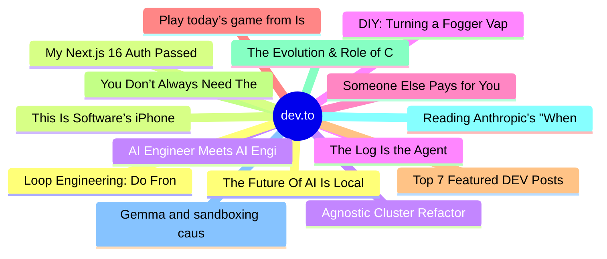

# dev.to Top 15 (2026-07-01)

## 思维导图

## 列表（15 条）

### 1. The Future Of AI Is Local And Open
- **链接**: [https://dev.to/dailycontext/the-future-of-ai-is-local-and-open-522c](https://dev.to/dailycontext/the-future-of-ai-is-local-and-open-522c)
- **作者**: Paige Bailey | **阅读**: 4min
- **反应**: 39 | **评论**: 3
- **标签**: `aie`, `gemma`, `ai`
- **简介**: There’s a specific moment that happens at every single hackathon. It’s usually around 2 or 3 a.m.,...

### 2. This Is Software’s iPhone Moment
- **链接**: [https://dev.to/dailycontext/this-is-softwares-iphone-moment-16d](https://dev.to/dailycontext/this-is-softwares-iphone-moment-16d)
- **作者**: Swift | **阅读**: 5min
- **反应**: 47 | **评论**: 5
- **标签**: `ai`, `aie`, `devrel`
- **简介**: In 2007, humans took roughly 85 billion photos a year. Photography was a specialized craft that...

### 3. AI Engineer Meets AI Engineer
- **链接**: [https://dev.to/dailycontext/ai-engineer-meets-ai-engineer-1klj](https://dev.to/dailycontext/ai-engineer-meets-ai-engineer-1klj)
- **作者**: Ben Halpern | **阅读**: 1min
- **反应**: 32 | **评论**: 2
- **标签**: `aie`, `ai`
- **简介**: I'm sitting through day one of AI Engineer World's Fair San Francisco, and I'm struck by how...

### 4. The Log Is the Agent
- **链接**: [https://dev.to/dailycontext/the-log-is-the-agent-5096](https://dev.to/dailycontext/the-log-is-the-agent-5096)
- **作者**: Ishaan Sehgal | **阅读**: 5min
- **反应**: 33 | **评论**: 2
- **标签**: `aie`, `agents`, `ai`
- **简介**: AI agents are hitting the same inflection point.  Most people think an agent is the model, the...

### 5. Someone Else Pays for Your AI Access
- **链接**: [https://dev.to/dannwaneri/someone-else-pays-for-your-ai-access-5149](https://dev.to/dannwaneri/someone-else-pays-for-your-ai-access-5149)
- **作者**: Daniel Nwaneri | **阅读**: 4min
- **反应**: 44 | **评论**: 40
- **标签**: `ai`, `webdev`, `security`, `discuss`
- **简介**: you probably didn't think about this when you signed up.  you entered your card details, verified...

### 6. Play today’s game from Issue #2 of The Daily Context!
- **链接**: [https://dev.to/devteam/play-todays-game-from-issue-2-of-the-daily-context-epf](https://dev.to/devteam/play-todays-game-from-issue-2-of-the-daily-context-epf)
- **作者**: Jess Lee | **阅读**: 1min
- **反应**: 15 | **评论**: 1
- **标签**: `aie`, `ai`, `gamedev`, `gemini`
- **简介**: Yesterday, we kicked off our physical newspaper, The Daily Context, at the AI Engineer World’s Fair...

### 7. Top 7 Featured DEV Posts of the Week
- **链接**: [https://dev.to/devteam/top-7-featured-dev-posts-of-the-week-18mk](https://dev.to/devteam/top-7-featured-dev-posts-of-the-week-18mk)
- **作者**: Jess Lee | **阅读**: 2min
- **反应**: 34 | **评论**: 6
- **标签**: `top7`, `discuss`
- **简介**: Welcome to this week's Top 7, where the DEV editorial team handpicks their favorite posts from the...

### 8. You Don’t Always Need The Frontier
- **链接**: [https://dev.to/dailycontext/you-dont-always-need-the-frontier-1k8o](https://dev.to/dailycontext/you-dont-always-need-the-frontier-1k8o)
- **作者**: Ryan Swift | **阅读**: 2min
- **反应**: 26 | **评论**: 6
- **标签**: `aie`, `ai`
- **简介**: Workshops at this year's AI Engineer World's Fair shifted noticeably away from RAG and prompt...

### 9. The Evolution & Role of Context Engineering in AI Today
- **链接**: [https://dev.to/dailycontext/the-evolution-role-of-context-engineering-in-ai-today-430f](https://dev.to/dailycontext/the-evolution-role-of-context-engineering-in-ai-today-430f)
- **作者**: Kara Silverman | **阅读**: 3min
- **反应**: 19 | **评论**: 0
- **标签**: `aie`, `ai`, `agents`
- **简介**: I was taking a break from the AIE Workshops on Monday and stepped out by the food stands to check out...

### 10. Reading Anthropic's "When AI Builds Itself" Changed How I Think About AI and Software Engineering
- **链接**: [https://dev.to/hemapriya_kanagala/reading-anthropics-when-ai-builds-itself-changed-how-i-think-about-ai-and-software-engineering-3eh](https://dev.to/hemapriya_kanagala/reading-anthropics-when-ai-builds-itself-changed-how-i-think-about-ai-and-software-engineering-3eh)
- **作者**: Hemapriya Kanagala | **阅读**: 13min
- **反应**: 24 | **评论**: 15
- **标签**: `discuss`, `ai`, `developers`, `softwareengineering`
- **简介**: TL;DR  Anthropic recently published When AI Builds Itself, an essay explaining how AI is...

### 11. Gemma and sandboxing cause a stir at the World's Fair
- **链接**: [https://dev.to/dailycontext/gemma-the-epstein-files-and-sandboxing-cause-a-stir-at-the-worlds-fair-2a7p](https://dev.to/dailycontext/gemma-the-epstein-files-and-sandboxing-cause-a-stir-at-the-worlds-fair-2a7p)
- **作者**: Iain Thomson | **阅读**: 4min
- **反应**: 30 | **评论**: 5
- **标签**: `aie`, `ai`, `database`, `gemma`
- **简介**: As the AI Engineer World’s Fair kicked off officially on Monday, the halls were filled for the...

### 12. Loop Engineering: Do Frontend and Fullstack Devs Actually Need It?
- **链接**: [https://dev.to/erikch/loop-engineering-do-frontend-and-fullstack-devs-actually-need-it-48eb](https://dev.to/erikch/loop-engineering-do-frontend-and-fullstack-devs-actually-need-it-48eb)
- **作者**: Erik Hanchett | **阅读**: 4min
- **反应**: 22 | **评论**: 3
- **标签**: `ai`, `webdev`, `productivity`, `programming`
- **简介**: Introduction   I keep hearing the term loop engineering. It's all over my feed, every AI...

### 13. My Next.js 16 Auth Passed Every Test. Five Bugs That Only Showed Up When I Wired It Together.
- **链接**: [https://dev.to/shubhradev/my-nextjs-16-auth-passed-every-test-five-bugs-that-only-showed-up-when-i-wired-it-together-bgh](https://dev.to/shubhradev/my-nextjs-16-auth-passed-every-test-five-bugs-that-only-showed-up-when-i-wired-it-together-bgh)
- **作者**: Shubhra Pokhariya | **阅读**: 9min
- **反应**: 22 | **评论**: 8
- **标签**: `nextjs`, `security`, `webdev`, `javascript`
- **简介**: The three-layer model works. Part 1 of this series is the invoice incident that proved it. Part 2 is...

### 14. Agnostic Cluster Refactor Skill for Antigrafity CLI: Building an AI Agent that Migrates Apps from AWS to GKE (Subagents, HITL Gate & Workload Identity)
- **链接**: [https://dev.to/gde/agnostic-cluster-refactor-skill-for-antigrafity-cli-building-an-ai-agent-that-migrates-apps-from-e0](https://dev.to/gde/agnostic-cluster-refactor-skill-for-antigrafity-cli-building-an-ai-agent-that-migrates-apps-from-e0)
- **作者**: Carlos Barbero | **阅读**: 13min
- **反应**: 7 | **评论**: 0
- **标签**: `kubernetes`, `googlecloud`, `ai`, `antigrafity`
- **简介**: How I built a skill for the Antigravity CLI that automates migrating AWS-coupled Python apps to GKE — parallel subagents, mandatory human oversight, and keyless auth.

### 15. DIY: Turning a Fogger Vape Dock Into a 3.7V Li‑ion Charger (And a Small Update About Confidence)
- **链接**: [https://dev.to/codebunny20/diy-turning-a-fogger-vape-dock-into-a-37v-li-ion-charger-and-a-small-update-about-confidence-idj](https://dev.to/codebunny20/diy-turning-a-fogger-vape-dock-into-a-37v-li-ion-charger-and-a-small-update-about-confidence-idj)
- **作者**: codebunny20 | **阅读**: 2min
- **反应**: 6 | **评论**: 1
- **标签**: `devpride`, `discuss`, `trans`, `lgbtq`
- **简介**: A couple months back, I made a post here on DEV asking for opinions about e‑waste and why people...
