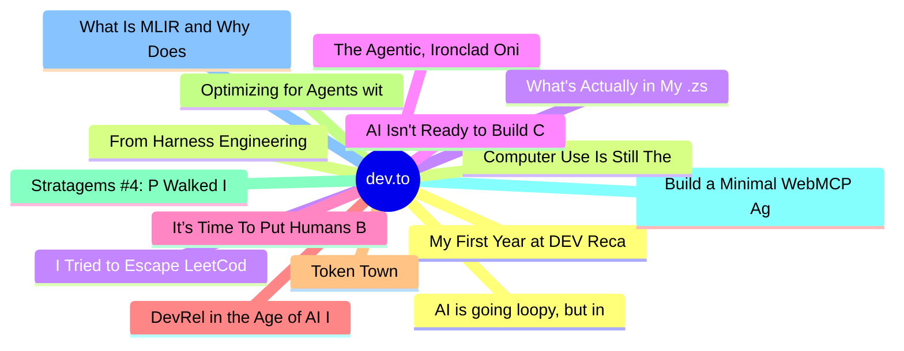

# dev.to Top 15 (2026-07-02)

## 思维导图

## 列表（15 条）

### 1. My First Year at DEV Recap
- **链接**: [https://dev.to/javz/my-first-year-at-dev-recap-3na2](https://dev.to/javz/my-first-year-at-dev-recap-3na2)
- **作者**: Julien Avezou | **阅读**: 4min
- **反应**: 45 | **评论**: 16
- **标签**: `community`, `learning`, `productivity`, `writing`
- **简介**: I heard about DEV a while back from a former colleague who was posting regularly back then. She won a...

### 2. From Harness Engineering to Evals: What’s Trending at AI Engineer
- **链接**: [https://dev.to/dailycontext/from-harness-engineering-to-evals-4212](https://dev.to/dailycontext/from-harness-engineering-to-evals-4212)
- **作者**: Ben Halpern | **阅读**: 5min
- **反应**: 38 | **评论**: 7
- **标签**: `aie`, `ai`, `agents`, `security`
- **简介**: I’m at the AI Engineer conference in San Francisco this week. The event has every major brand-name...

### 3. I Tried to Escape LeetCode for 2 Years (But Here We Are)
- **链接**: [https://dev.to/konark_13/i-tried-to-escape-leetcode-for-2-years-but-here-we-are-1k99](https://dev.to/konark_13/i-tried-to-escape-leetcode-for-2-years-but-here-we-are-1k99)
- **作者**: Konark Sharma | **阅读**: 5min
- **反应**: 28 | **评论**: 7
- **标签**: `webdev`, `beginners`, `dsa`, `coding`
- **简介**: Seriously, LeetCode in 2026? Everyone is saying HackerRank just killed LeetCode, and yet here I am,...

### 4. The Agentic, Ironclad Onion
- **链接**: [https://dev.to/dailycontext/the-agentic-ironclad-onion-2na9](https://dev.to/dailycontext/the-agentic-ironclad-onion-2na9)
- **作者**: Ryan Palo | **阅读**: 5min
- **反应**: 13 | **评论**: 1
- **标签**: `aie`, `security`, `promptengineering`, `agents`
- **简介**: As AI agents work under increasingly less human supervision, the need for a trustworthy, secure work...

### 5. It’s Time To Put Humans Back In The Software
- **链接**: [https://dev.to/dailycontext/its-time-to-put-humans-back-in-the-software-factories-3cjh](https://dev.to/dailycontext/its-time-to-put-humans-back-in-the-software-factories-3cjh)
- **作者**: Iain Thomson | **阅读**: 3min
- **反应**: 15 | **评论**: 3
- **标签**: `aie`, `software`, `ai`, `agents`
- **简介**: Software engineers have become overreliant on models to build applications, and it’s time to put...

### 6. DevRel in the Age of AI Is A Search for Meaning
- **链接**: [https://dev.to/dailycontext/devrel-in-the-age-of-ai-is-a-search-for-meaning-2j91](https://dev.to/dailycontext/devrel-in-the-age-of-ai-is-a-search-for-meaning-2j91)
- **作者**: Sam Bhagwat | **阅读**: 2min
- **反应**: 5 | **评论**: 1
- **标签**: `aie`, `ai`, `devrel`
- **简介**: When I was in college, I read an essay called "The Work of Art in the Age of Mechanical Reproduction"...

### 7. Token Town
- **链接**: [https://dev.to/dailycontext/token-town-1c45](https://dev.to/dailycontext/token-town-1c45)
- **作者**: Ryan Palo | **阅读**: 2min
- **反应**: 8 | **评论**: 4
- **标签**: `aie`, `ai`, `agents`
- **简介**: Many of the sessions from Tuesday, especially on the main stage, revolved around the idea of software...

### 8. Optimizing for Agents with llms.txt
- **链接**: [https://dev.to/dailycontext/optimizing-for-agents-with-llmstxt-14l0](https://dev.to/dailycontext/optimizing-for-agents-with-llmstxt-14l0)
- **作者**: Ryan Palo | **阅读**: 3min
- **反应**: 7 | **评论**: 4
- **标签**: `aie`, `agents`, `ai`, `machinelearning`
- **简介**: If you’ve spent any time poking around the AIE World’s Fair 2026 website, you may have come across...

### 9. Stratagems #4: P Walked Into an AI Monitoring POC. P Didn't Run a Single Test.
- **链接**: [https://dev.to/xulingfeng/stratagems-4-p-walked-into-an-ai-monitoring-poc-p-didnt-run-a-single-test-1ejk](https://dev.to/xulingfeng/stratagems-4-p-walked-into-an-ai-monitoring-poc-p-didnt-run-a-single-test-1ejk)
- **作者**: xulingfeng | **阅读**: 12min
- **反应**: 36 | **评论**: 21
- **标签**: `ai`, `discuss`, `career`, `programming`
- **简介**: Exhaust the enemy's strength without fighting. Weaken the strong by nurturing the soft. — The 36...

### 10. Build a Minimal WebMCP Agent with Playwright and Gemini
- **链接**: [https://dev.to/gramli/build-a-minimal-webmcp-agent-with-playwright-and-gemini-24fh](https://dev.to/gramli/build-a-minimal-webmcp-agent-with-playwright-and-gemini-24fh)
- **作者**: Daniel Balcarek | **阅读**: 9min
- **反应**: 31 | **评论**: 23
- **标签**: `ai`, `agents`, `tutorial`, `webdev`
- **简介**: WebMCP lets a web page expose tools that AI agents can discover and execute inside the browser. That...

### 11. What Is MLIR and Why Does It Exist?
- **链接**: [https://dev.to/frodo/what-is-mlir-and-why-does-it-exist-4d78](https://dev.to/frodo/what-is-mlir-and-why-does-it-exist-4d78)
- **作者**: Fedor Nikolaev | **阅读**: 10min
- **反应**: 8 | **评论**: 0
- **标签**: `mlir`, `compilers`, `machinelearning`, `programming`
- **简介**: If "MLIR" looks like alphabet soup, this is for you. A ground-up explanation of the problem it solves — with working Python examples.

### 12. AI is going loopy, but in a good way
- **链接**: [https://dev.to/dailycontext/ai-is-going-loopy-but-in-a-good-way-3mi](https://dev.to/dailycontext/ai-is-going-loopy-but-in-a-good-way-3mi)
- **作者**: Iain Thomson | **阅读**: 5min
- **反应**: 6 | **评论**: 2
- **标签**: `aie`, `ai`, `security`, `machinelearning`
- **简介**: As you’d expect, the opening keynote of the AI Engineer World’s Fair was kicked off by one of its...

### 13. Computer Use Is Still The Best Demo In AI. That’s A Problem.
- **链接**: [https://dev.to/dailycontext/computer-use-is-still-the-best-demo-in-ai-thats-a-problem-1bep](https://dev.to/dailycontext/computer-use-is-still-the-best-demo-in-ai-thats-a-problem-1bep)
- **作者**: Ryan Swift | **阅读**: 1min
- **反应**: 7 | **评论**: 2
- **标签**: `aie`, `ai`, `agents`
- **简介**: Computer use is still the most engaging demo in AI today. Typing a request in plain language and then...

### 14. What's Actually in My .zshrc (and Why)
- **链接**: [https://dev.to/mattstratton/whats-actually-in-my-zshrc-and-why-53oe](https://dev.to/mattstratton/whats-actually-in-my-zshrc-and-why-53oe)
- **作者**: Matty Stratton | **阅读**: 7min
- **反应**: 1 | **评论**: 0
- **标签**: `shell`, `zsh`, `dotfiles`, `productivity`
- **简介**: A guided tour through the parts of my shell config that are actually worth explaining, from a shell that now has two audiences to a Keychain-backed secrets setup.

### 15. AI Isn't Ready to Build Complex Software
- **链接**: [https://dev.to/dailycontext/ai-isnt-ready-to-build-complex-software-3jho](https://dev.to/dailycontext/ai-isnt-ready-to-build-complex-software-3jho)
- **作者**: Kara Silverman | **阅读**: 2min
- **反应**: 6 | **评论**: 3
- **标签**: `aie`, `agents`, `ai`, `computerscience`
- **简介**: In an industry currently swept up in the hype of AI coding agents, Micah Wylde, principal engineer at...
