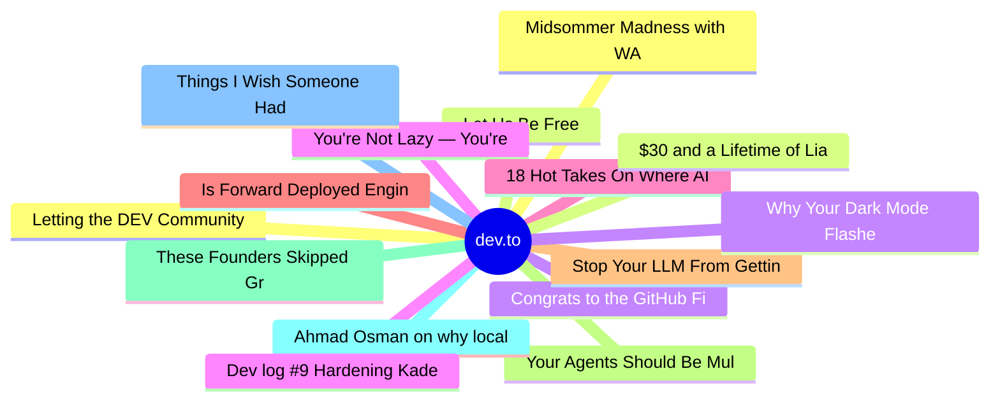

# dev.to Top 15 (2026-07-03)

## 思维导图

## 列表（15 条）

### 1. Letting the DEV Community Weigh in on the Topics of AIE
- **链接**: [https://dev.to/dailycontext/letting-the-dev-community-weigh-in-on-the-topics-of-aie-439l](https://dev.to/dailycontext/letting-the-dev-community-weigh-in-on-the-topics-of-aie-439l)
- **作者**: Ben Halpern | **阅读**: 3min
- **反应**: 53 | **评论**: 6
- **标签**: `aie`, `ai`, `discuss`
- **简介**: I’m at the AI Engineer World’s Fair in San Francisco, where the vibes are enthusiastic. However,...

### 2. Let Us Be Free
- **链接**: [https://dev.to/dailycontext/let-us-be-free-2ico](https://dev.to/dailycontext/let-us-be-free-2ico)
- **作者**: John McBride | **阅读**: 3min
- **反应**: 25 | **评论**: 0
- **标签**: `aie`, `ai`, `opensource`
- **简介**: Nearly half a century ago, the free software movement made a demand that was both technical and...

### 3. Congrats to the GitHub Finish-Up-A-Thon Challenge Winners!
- **链接**: [https://dev.to/devteam/congrats-to-the-github-finish-up-a-thon-challenge-winners-1k0h](https://dev.to/devteam/congrats-to-the-github-finish-up-a-thon-challenge-winners-1k0h)
- **作者**: Jess Lee | **阅读**: 3min
- **反应**: 40 | **评论**: 18
- **标签**: `githubchallenge`, `devchallenge`, `githubcopilot`, `ai`
- **简介**: We are so excited to finally announce the winners of the GitHub Finish-Up-A-Thon Challenge, our...

### 4. You're Not Lazy — You're Time Blind. Here's How Lock In Fixes It.
- **链接**: [https://dev.to/harsh2644/youre-not-lazy-youre-time-blind-heres-how-lock-in-fixes-it-57ej](https://dev.to/harsh2644/youre-not-lazy-youre-time-blind-heres-how-lock-in-fixes-it-57ej)
- **作者**: Harsh  | **阅读**: 5min
- **反应**: 31 | **评论**: 12
- **标签**: `productivity`, `discuss`, `career`, `beginners`
- **简介**: I sat down to work for 2 hours. I actually worked for 45 minutes.  Sound familiar?  You open your...

### 5. 18 Hot Takes On Where AI is Headed Next
- **链接**: [https://dev.to/dailycontext/18-hot-takes-on-where-ai-is-headed-next-10b9](https://dev.to/dailycontext/18-hot-takes-on-where-ai-is-headed-next-10b9)
- **作者**: dev.to staff | **阅读**: 6min
- **反应**: 25 | **评论**: 0
- **标签**: `aie`, `discuss`, `software`, `ai`
- **简介**: by Peter Yang, Behind the Craft  Today, I want to share 18 hot takes on where I think the AI market...

### 6. Is Forward Deployed Engineering Killing DevRel?
- **链接**: [https://dev.to/dailycontext/is-forward-deployed-engineering-killing-devrel-1833](https://dev.to/dailycontext/is-forward-deployed-engineering-killing-devrel-1833)
- **作者**: Swift | **阅读**: 3min
- **反应**: 18 | **评论**: 4
- **标签**: `aie`, `devrel`, `ai`
- **简介**: When Palantir invented Forward Deployed Engineering (FDE) in the 2010s, the industry mocked them as...

### 7. Stop Your LLM From Getting Owned
- **链接**: [https://dev.to/lovestaco/stop-your-llm-from-getting-owned-25b9](https://dev.to/lovestaco/stop-your-llm-from-getting-owned-25b9)
- **作者**: Athreya aka Maneshwar | **阅读**: 6min
- **反应**: 15 | **评论**: 0
- **标签**: `ai`, `webdev`, `programming`, `beginners`
- **简介**: Hello, I'm Maneshwar. I'm building git-lrc, a Micro AI code reviewer that runs on every commit. It is...

### 8. Your Agents Should Be Multiplayer
- **链接**: [https://dev.to/dailycontext/your-agents-should-be-multiplayer-18h0](https://dev.to/dailycontext/your-agents-should-be-multiplayer-18h0)
- **作者**: dev.to staff | **阅读**: 3min
- **反应**: 11 | **评论**: 1
- **标签**: `aie`, `agents`, `ai`
- **简介**: by Sergey Karayev, cofounder @ Superconductor  Recently, my wife and I sat down to plan an upcoming...

### 9. These Founders Skipped Graduation To Be Here
- **链接**: [https://dev.to/dailycontext/these-founders-skipped-graduation-to-be-here-1o3d](https://dev.to/dailycontext/these-founders-skipped-graduation-to-be-here-1o3d)
- **作者**: Rachael Berkey | **阅读**: 2min
- **反应**: 22 | **评论**: 3
- **标签**: `aie`, `ai`, `learning`
- **简介**: When we met James Yang and Anish Paleja on Monday morning, The Daily Context team simply thought,...

### 10. Ahmad Osman on why local AI is catching up
- **链接**: [https://dev.to/dailycontext/ahmad-osman-on-why-local-ai-is-catching-up-59ko](https://dev.to/dailycontext/ahmad-osman-on-why-local-ai-is-catching-up-59ko)
- **作者**: Richard MacManus | **阅读**: 6min
- **反应**: 14 | **评论**: 1
- **标签**: `aie`, `ai`
- **简介**: Ahmad Osman has been advocating for local AI — running models on your own computer, workstation or...

### 11. Things I Wish Someone Had Told Me Before Starting iOS Development
- **链接**: [https://dev.to/gamya_m/things-i-wish-someone-had-told-me-before-starting-ios-development-3o4b](https://dev.to/gamya_m/things-i-wish-someone-had-told-me-before-starting-ios-development-3o4b)
- **作者**: Gamya  | **阅读**: 2min
- **反应**: 27 | **评论**: 3
- **标签**: `ios`, `swift`, `discuss`, `beginners`
- **简介**: When I started learning iOS development, I thought the hardest part would be writing Swift code.  I...

### 12. Midsommer Madness with WASM, Rust, and Azure Container Apps
- **链接**: [https://dev.to/gde/midsommer-madness-with-wasm-rust-and-azure-container-apps-113b](https://dev.to/gde/midsommer-madness-with-wasm-rust-and-azure-container-apps-113b)
- **作者**: xbill | **阅读**: 14min
- **反应**: 0 | **评论**: 0
- **标签**: `webassembly`, `midsommer`, `azurecontainerapps`, `azure`
- **简介**: This article covers debugging and deploying a Rust backed WASM module with an Azure Container Apps...

### 13. $30 and a Lifetime of Liability
- **链接**: [https://dev.to/dannwaneri/30-and-a-lifetime-of-liability-19fl](https://dev.to/dannwaneri/30-and-a-lifetime-of-liability-19fl)
- **作者**: Daniel Nwaneri | **阅读**: 5min
- **反应**: 13 | **评论**: 16
- **标签**: `ai`, `webdev`, `discuss`, `security`
- **简介**: co-written with UnitBuilds, who built most of this out loud in the comments of my last piece.     I...

### 14. Why Your Dark Mode Flashes Before JavaScript Runs
- **链接**: [https://dev.to/hasansarwer/why-your-dark-mode-flashes-before-javascript-runs-2kkg](https://dev.to/hasansarwer/why-your-dark-mode-flashes-before-javascript-runs-2kkg)
- **作者**: Hasan Sarwer | **阅读**: 5min
- **反应**: 6 | **评论**: 1
- **标签**: `css`, `frontend`, `javascript`, `webdev`
- **简介**: You saved the user's dark mode preference.    localStorage.setItem('theme', 'dark');        Enter...

### 15. Dev log #9 Hardening Kademlia DHT and automating the Neovim grind
- **链接**: [https://dev.to/yashksaini/dev-log-9-hardening-kademlia-dht-and-automating-the-neovim-grind-43f3](https://dev.to/yashksaini/dev-log-9-hardening-kademlia-dht-and-automating-the-neovim-grind-43f3)
- **作者**: Yash Kumar Saini | **阅读**: 4min
- **反应**: 9 | **评论**: 0
- **标签**: `neovim`, `linux`, `network`, `opensource`
- **简介**: Seven days of flow. Fixed a peer identity binding issue in py-libp2p, automated my Neovim lockfile...
