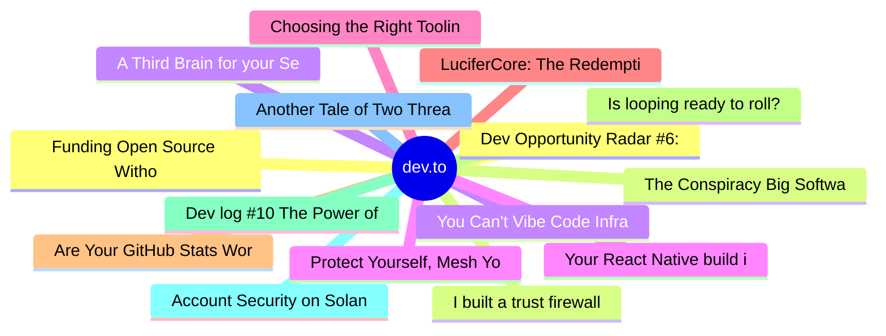

# dev.to Top 15 (2026-07-04)

## 思维导图

## 列表（15 条）

### 1. Dev Opportunity Radar #6: Y Combinator Startup School, Open Source AI Grants, and a $60K APAC Hackathon
- **链接**: [https://dev.to/devengers/dev-opportunity-radar-6-y-combinator-startup-school-open-source-ai-grants-and-a-60k-apac-4nlp](https://dev.to/devengers/dev-opportunity-radar-6-y-combinator-startup-school-open-source-ai-grants-and-a-60k-apac-4nlp)
- **作者**: Hemapriya Kanagala | **阅读**: 9min
- **反应**: 43 | **评论**: 6
- **标签**: `discuss`, `community`, `opportunities`, `resources`
- **简介**: TL;DR  Welcome back to Dev Opportunity Radar.  This is a weekly series where I share opportunities,...

### 2. The Conspiracy Big Software Engineering Doesn't Want You to Know
- **链接**: [https://dev.to/dailycontext/the-conspiracy-big-software-engineering-doesnt-want-you-to-know-5299](https://dev.to/dailycontext/the-conspiracy-big-software-engineering-doesnt-want-you-to-know-5299)
- **作者**: Ryan Palo | **阅读**: 3min
- **反应**: 7 | **评论**: 3
- **标签**: `aie`, `ai`, `agentskills`, `satire`
- **简介**: Buckle up, gang — it's conspiracy theory time.  I've had this theory percolating in the back of my...

### 3. A Third Brain for your Second Brain
- **链接**: [https://dev.to/dailycontext/a-third-brain-for-your-second-brain-38b4](https://dev.to/dailycontext/a-third-brain-for-your-second-brain-38b4)
- **作者**: Ryan Palo | **阅读**: 3min
- **反应**: 7 | **评论**: 1
- **标签**: `aie`, `ai`, `techtalks`, `memory`
- **简介**: The concept of the "second brain"/"knowledge base" is one of my absolute favorite nerd snipes of all...

### 4. Protect Yourself, Mesh Yourself
- **链接**: [https://dev.to/eschmechel/protect-yourself-mesh-yourself-3fkn](https://dev.to/eschmechel/protect-yourself-mesh-yourself-3fkn)
- **作者**: Elliott | **阅读**: 5min
- **反应**: 7 | **评论**: 0
- **标签**: `tutorial`, `productivity`, `opensource`, `devops`
- **简介**: In my last post, my SSH keys moved off disk and into 1Password. This one is about the network those...

### 5. Choosing the Right Tooling Layer for Your Agent
- **链接**: [https://dev.to/dailycontext/choosing-the-right-tooling-layer-for-your-agent-1eg2](https://dev.to/dailycontext/choosing-the-right-tooling-layer-for-your-agent-1eg2)
- **作者**: Ryan Palo | **阅读**: 3min
- **反应**: 7 | **评论**: 3
- **标签**: `aie`, `ai`, `agents`
- **简介**: Selecting the right abstraction layer is not a new problem in software. It's common to have some...

### 6. LuciferCore: The Redemption Arc — From a Naive Prototype to a Battle-Tested .NET Framework
- **链接**: [https://dev.to/thuangf45/lucifercore-the-redemption-arc-from-a-naive-prototype-to-a-battle-tested-net-framework-4l7f](https://dev.to/thuangf45/lucifercore-the-redemption-arc-from-a-naive-prototype-to-a-battle-tested-net-framework-4l7f)
- **作者**: Thuangf45 | **阅读**: 3min
- **反应**: 33 | **评论**: 10
- **标签**: `dotnet`, `performance`, `architecture`, `showdev`
- **简介**: Every software engineer has that one project.  The project that keeps you up at 3 AM.  The project...

### 7. Are Your GitHub Stats Worthy of a FIFA Card?
- **链接**: [https://dev.to/konark_13/are-your-github-stats-worthy-of-a-fifa-card-3p1p](https://dev.to/konark_13/are-your-github-stats-worthy-of-a-fifa-card-3p1p)
- **作者**: Konark Sharma | **阅读**: 4min
- **反应**: 7 | **评论**: 1
- **标签**: `webdev`, `githunt`, `opensource`, `discuss`
- **简介**: Are you a football fan? Since the FIFA hype is at its absolute peak at this moment, it is hard to...

### 8. Is looping ready to roll? Experts split on the future of coding
- **链接**: [https://dev.to/dailycontext/is-looping-ready-to-roll-experts-split-on-the-future-of-coding-2g7p](https://dev.to/dailycontext/is-looping-ready-to-roll-experts-split-on-the-future-of-coding-2g7p)
- **作者**: Iain Thomson | **阅读**: 2min
- **反应**: 9 | **评论**: 4
- **标签**: `aie`, `ai`, `techtalks`
- **简介**: On the closing day of the AI Engineer World's Fair, industry leaders debated whether loops are ready...

### 9. Dev log #10 The Power of the Zero-Commit Week: Stepping Back to Move Faster
- **链接**: [https://dev.to/yashksaini/dev-log-10-the-power-of-the-zero-commit-week-stepping-back-to-move-faster-1e5h](https://dev.to/yashksaini/dev-log-10-the-power-of-the-zero-commit-week-stepping-back-to-move-faster-1e5h)
- **作者**: Yash Kumar Saini | **阅读**: 4min
- **反应**: 14 | **评论**: 0
- **标签**: `devjournal`, `travel`
- **简介**: A rare week of total radio silence on GitHub—no commits, no PRs, and zero green squares. Sometimes...

### 10. Account Security on Solana, Made Simple
- **链接**: [https://dev.to/100daysofsolana/account-security-on-solana-made-simple-154d](https://dev.to/100daysofsolana/account-security-on-solana-made-simple-154d)
- **作者**: Vincent Jande | **阅读**: 6min
- **反应**: 0 | **评论**: 0
- **标签**: `100daysofsolana`, `blockchain`, `web3`, `learning`
- **简介**: When you write a normal backend, you mostly trust your own database. A row you wrote is a row you can...

### 11. Another Tale of Two Threads (C or C++ vs. Python)
- **链接**: [https://dev.to/pauljlucas/another-tale-of-two-threads-c-or-c-vs-python-hhl](https://dev.to/pauljlucas/another-tale-of-two-threads-c-or-c-vs-python-hhl)
- **作者**: Paul J. Lucas | **阅读**: 3min
- **反应**: 0 | **评论**: 0
- **标签**: `c`, `cpp`, `python`
- **简介**: A significant difference between writing multithreaded code in C or C++ vs. Python.

### 12. Funding Open Source Without The Bait And Switch: Analytics, Native Maps, TV And More
- **链接**: [https://dev.to/codenameone/funding-open-source-without-the-bait-and-switch-analytics-native-maps-tv-and-more-1h1j](https://dev.to/codenameone/funding-open-source-without-the-bait-and-switch-analytics-native-maps-tv-and-more-1h1j)
- **作者**: Shai Almog | **阅读**: 9min
- **反应**: 0 | **评论**: 1
- **标签**: `java`, `mobile`, `android`, `ios`
- **简介**: This week adds a privacy-first analytics API, a pure-vector map engine with pluggable native providers, Apple TV and Android TV support with CSS @media for form factors, rich text and code editors, an

### 13. I built a trust firewall for my AI agent's memory — on Cognee's four verbs
- **链接**: [https://dev.to/himanshu_748/i-built-a-trust-firewall-for-my-ai-agents-memory-on-cognees-four-verbs-29g2](https://dev.to/himanshu_748/i-built-a-trust-firewall-for-my-ai-agents-memory-on-cognees-four-verbs-29g2)
- **作者**: Himanshu Kumar | **阅读**: 6min
- **反应**: 10 | **评论**: 1
- **标签**: `ai`, `mcp`, `cognee`, `opensource`
- **简介**: Built for the WeMakeDevs × Cognee hackathon — "The Hangover Part AI: Where's My Context?"   AI...

### 14. You Can't Vibe Code Infrastructure. The Job Market Agrees.
- **链接**: [https://dev.to/remoet/you-cant-vibe-code-infrastructure-the-job-market-agrees-15oh](https://dev.to/remoet/you-cant-vibe-code-infrastructure-the-job-market-agrees-15oh)
- **作者**: Carl-W | **阅读**: 7min
- **反应**: 6 | **评论**: 0
- **标签**: `career`, `devops`, `ai`, `webdev`
- **简介**: Every roadmap for breaking into tech tells you to pick a language. Learn Python, learn JavaScript,...

### 15. Your React Native build is done. Now your whole team can test it in the browser.
- **链接**: [https://dev.to/joduchan/your-react-native-build-is-done-now-your-whole-team-can-test-it-in-the-browser-1jpo](https://dev.to/joduchan/your-react-native-build-is-done-now-your-whole-team-can-test-it-in-the-browser-1jpo)
- **作者**: Duchan | **阅读**: 5min
- **反应**: 8 | **评论**: 2
- **标签**: `reactnative`, `testing`, `opensource`, `webdev`
- **简介**: If your team ships a React Native app, you already know the build is the easy part. The friction...
