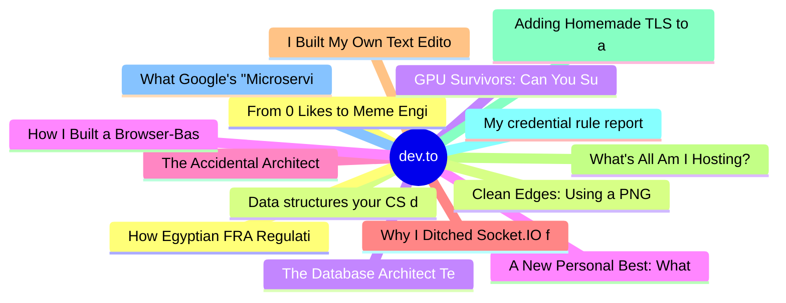

# dev.to Top 15 (2026-07-05)

## 思维导图

## 列表（15 条）

### 1. From 0 Likes to Meme Engineer
- **链接**: [https://dev.to/konark_13/from-0-likes-to-meme-engineer-2p8l](https://dev.to/konark_13/from-0-likes-to-meme-engineer-2p8l)
- **作者**: Konark Sharma | **阅读**: 8min
- **反应**: 9 | **评论**: 3
- **标签**: `webdev`, `ai`, `javascript`, `discuss`
- **简介**: We have all been there. You are sitting at your desk late at night, your code is throwing errors that...

### 2. Data structures your CS degree kind of glossed over
- **链接**: [https://dev.to/lovestaco/data-structures-your-cs-degree-kind-of-glossed-over-29dh](https://dev.to/lovestaco/data-structures-your-cs-degree-kind-of-glossed-over-29dh)
- **作者**: Athreya aka Maneshwar | **阅读**: 6min
- **反应**: 11 | **评论**: 1
- **标签**: `ai`, `webdev`, `programming`, `beginners`
- **简介**: Hello, I'm Maneshwar. I'm building git-lrc, a Micro AI code reviewer that runs on every commit. It is...

### 3. GPU Survivors: Can You Survive a 1T Parameter Inference Run?
- **链接**: [https://dev.to/unitbuilds_cc/gpu-survivors-can-you-survive-a-1t-parameter-inference-run-476d](https://dev.to/unitbuilds_cc/gpu-survivors-can-you-survive-a-1t-parameter-inference-run-476d)
- **作者**: UnitBuilds | **阅读**: 5min
- **反应**: 10 | **评论**: 6
- **标签**: `ai`, `games`, `machinelearning`, `discuss`
- **简介**: Survive endless waves of OOD data, prompt injections, and adversarial token splits inside a GPU Core while scaling your model architecture to 1T parameters.

### 4. A New Personal Best: What Six Months of Locking In Can Do
- **链接**: [https://dev.to/georgekobaidze/a-new-personal-best-what-six-months-of-locking-in-can-do-p3k](https://dev.to/georgekobaidze/a-new-personal-best-what-six-months-of-locking-in-can-do-p3k)
- **作者**: Giorgi Kobaidze | **阅读**: 7min
- **反应**: 10 | **评论**: 13
- **标签**: `productivity`, `career`, `showdev`, `community`
- **简介**: Table of Contents    Setting a New Benchmark for Myself My Most Productive Six Months Yet  2...

### 5. The Accidental Architect
- **链接**: [https://dev.to/claireg/the-accidental-architect-2jeh](https://dev.to/claireg/the-accidental-architect-2jeh)
- **作者**: Claire Goldbeg | **阅读**: 2min
- **反应**: 5 | **评论**: 2
- **标签**: `architecture`, `career`, `learning`, `systemdesign`
- **简介**: I didn’t set out to become a systems architect. In fact, I didn’t even know that’s what I was...

### 6. Why I Ditched Socket.IO for Raw WebSockets (And What I Learned)
- **链接**: [https://dev.to/nikhilsharma6/why-i-ditched-socketio-for-raw-websockets-and-what-i-learned-55i6](https://dev.to/nikhilsharma6/why-i-ditched-socketio-for-raw-websockets-and-what-i-learned-55i6)
- **作者**: Nikhil Sharma | **阅读**: 4min
- **反应**: 7 | **评论**: 5
- **标签**: `beginners`, `react`, `javascript`, `webdev`
- **简介**: When you google "how to build a chat app in Node.js," the very first result will almost certainly...

### 7. I Built My Own Text Editor
- **链接**: [https://dev.to/m__mdy__m/i-built-my-own-text-editor-1203](https://dev.to/m__mdy__m/i-built-my-own-text-editor-1203)
- **作者**: Genix | **阅读**: 2min
- **反应**: 6 | **评论**: 5
- **标签**: `discuss`, `programming`, `opensource`, `career`
- **简介**: I’ve wanted to build a text editor for a long time. Not because I thought the world needed another...

### 8. What's All Am I Hosting? Full Infrastructure Breakdown
- **链接**: [https://dev.to/shubham399/whats-all-am-i-hosting-full-infrastructure-breakdown-53b8](https://dev.to/shubham399/whats-all-am-i-hosting-full-infrastructure-breakdown-53b8)
- **作者**: Shubham | **阅读**: 6min
- **反应**: 3 | **评论**: 0
- **标签**: `infrastructure`, `architecture`, `webdev`, `devops`
- **简介**: How I run my entire online presence — main site, APIs, email, monitoring, URL shortener — for $0/month using free tiers and self-hosted infrastructure.

### 9. Adding Homemade TLS to a Homemade Web Server
- **链接**: [https://dev.to/dmytro_huz/adding-homemade-tls-to-a-homemade-web-server-1a6d](https://dev.to/dmytro_huz/adding-homemade-tls-to-a-homemade-web-server-1a6d)
- **作者**: Dmytro Huz | **阅读**: 9min
- **反应**: 0 | **评论**: 0
- **标签**: `networking`, `security`, `tutorial`, `webdev`
- **简介**: Original series: Building Your Own Web Server + Rebuilding TLS from Scratch  This article connects...

### 10. My credential rule reported 842 secrets in vercel/ai. The real count was 0.
- **链接**: [https://dev.to/ofri-peretz/my-credential-rule-reported-842-secrets-in-vercelai-the-real-count-was-0-249p](https://dev.to/ofri-peretz/my-credential-rule-reported-842-secrets-in-vercelai-the-real-count-was-0-249p)
- **作者**: Ofri Peretz | **阅读**: 9min
- **反应**: 4 | **评论**: 1
- **标签**: `security`, `eslint`, `ai`, `node`
- **简介**: Our no-hardcoded-credentials rule fired 842 times on vercel/ai. The peer plugin fired 380. I assumed we had better recall — until I sampled. 807 of the 'extra' findings were TypeScript union-type lite

### 11. What Google's "Microservices Are Dead" Paper Actually Said (And What It Missed About AI)
- **链接**: [https://dev.to/zxpmail/what-googles-microservices-are-dead-paper-actually-said-and-what-it-missed-about-ai-2oma](https://dev.to/zxpmail/what-googles-microservices-are-dead-paper-actually-said-and-what-it-missed-about-ai-2oma)
- **作者**: zxpmail | **阅读**: 8min
- **反应**: 2 | **评论**: 0
- **标签**: `ai`, `architecture`, `microservices`, `reflection`
- **简介**: A 2023 HotOS paper by Sanjay Ghemawat (MapReduce/Bigtable co-author) and Amin Vahdat (Google Fellow)...

### 12. How Egyptian FRA Regulations Built Better FinTech Architecture
- **链接**: [https://dev.to/khalidelokiely/how-egyptian-fra-regulations-built-better-fintech-architecture-4no0](https://dev.to/khalidelokiely/how-egyptian-fra-regulations-built-better-fintech-architecture-4no0)
- **作者**: Khalid Elokiely | **阅读**: 7min
- **反应**: 5 | **评论**: 2
- **标签**: `fintech`, `security`, `architecture`, `softwareengineering`
- **简介**: When our team started building the backend for a licensed NBFI under Egyptian financial regulations,...

### 13. Clean Edges: Using a PNG Alpha Mask on AI-Generated Animations
- **链接**: [https://dev.to/raphink/clean-edges-using-a-png-alpha-mask-on-ai-generated-animations-ifb](https://dev.to/raphink/clean-edges-using-a-png-alpha-mask-on-ai-generated-animations-ifb)
- **作者**: Raphaël Pinson | **阅读**: 4min
- **反应**: 2 | **评论**: 1
- **标签**: `webdev`, `ai`, `animation`, `tooling`
- **简介**: How I solved the background removal problem for AI-generated animated WebP tiles, and why color detection and chroma key both fail.

### 14. The Database Architect Teaches His Nephew: Where the Real Interview Happens
- **链接**: [https://dev.to/surajrkhonde/the-database-architect-teaches-his-nephew-where-the-real-interview-happens-2go7](https://dev.to/surajrkhonde/the-database-architect-teaches-his-nephew-where-the-real-interview-happens-2go7)
- **作者**: surajrkhonde | **阅读**: 20min
- **反应**: 2 | **评论**: 0
- **标签**: `database`, `sql`, `nosql`, `interview`
- **简介**: Same uncle, this time in "Database Architect" mode. Same nephew, this time asking the question every...

### 15. How I Built a Browser-Based Video to PowerPoint Converter
- **链接**: [https://dev.to/larryxue/how-i-built-a-browser-based-video-to-powerpoint-converter-ag0](https://dev.to/larryxue/how-i-built-a-browser-based-video-to-powerpoint-converter-ag0)
- **作者**: larry | **阅读**: 5min
- **反应**: 3 | **评论**: 1
- **标签**: `javascript`, `webdev`, `video`, `opensource`
- **简介**: Long lecture recordings are a strange format.  The useful part is often not the video itself. It is...
