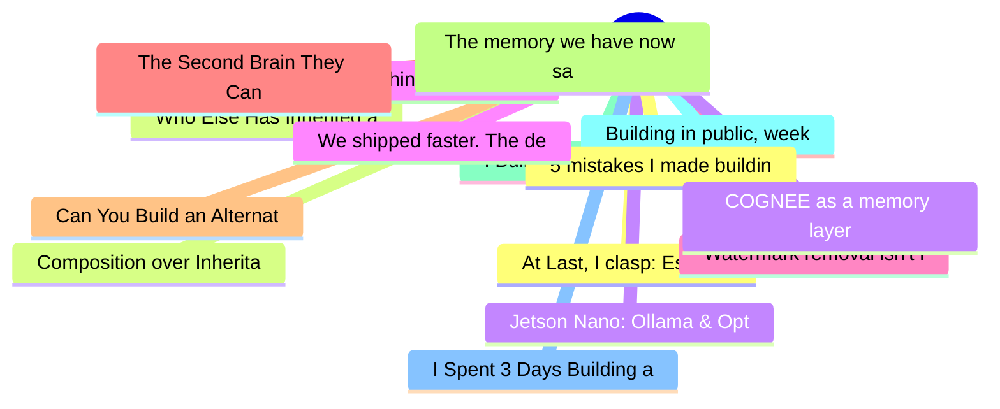

# dev.to Top 15 (2026-07-06)

## 思维导图

## 列表（15 条）

### 1. At Last, I clasp: Escaping the G's Apps Script Copy-Paste Gauntlet
- **链接**: [https://dev.to/lovestaco/at-last-i-clasp-escaping-the-gs-apps-script-copy-paste-gauntlet-23jd](https://dev.to/lovestaco/at-last-i-clasp-escaping-the-gs-apps-script-copy-paste-gauntlet-23jd)
- **作者**: Athreya aka Maneshwar | **阅读**: 5min
- **反应**: 26 | **评论**: 2
- **标签**: `webdev`, `programming`, `productivity`, `javascript`
- **简介**: Hello, I'm Maneshwar. I'm building git-lrc, a Micro AI code reviewer that runs on every commit. It is...

### 2. Who Else Has Inherited a Codebase With Zero Comments and a Prayer?
- **链接**: [https://dev.to/gamya_m/who-else-has-inherited-a-codebase-with-zero-comments-and-a-prayer-84h](https://dev.to/gamya_m/who-else-has-inherited-a-codebase-with-zero-comments-and-a-prayer-84h)
- **作者**: Gamya  | **阅读**: 5min
- **反应**: 20 | **评论**: 1
- **标签**: `discuss`, `programming`, `career`, `development`
- **简介**: Okay so. Story time. Grab a coffee; this one's got a body count.  A few months back I got assigned a...

### 3. Jetson Nano: Ollama & Optimal Quantization
- **链接**: [https://dev.to/annavi11arrea1/jetson-nano-ollama-optimal-quantization-2de8](https://dev.to/annavi11arrea1/jetson-nano-ollama-optimal-quantization-2de8)
- **作者**: Anna Villarreal | **阅读**: 5min
- **反应**: 6 | **评论**: 3
- **标签**: `ai`, `webdev`, `productivity`, `learning`
- **简介**: I am delighted to announce that a user reported dysfunction so that I could go down the rabbit hole...

### 4. How to Shine as an Introvert in a Loud Tech World
- **链接**: [https://dev.to/konark_13/how-to-shine-as-an-introvert-in-a-loud-tech-world-4ipb](https://dev.to/konark_13/how-to-shine-as-an-introvert-in-a-loud-tech-world-4ipb)
- **作者**: Konark Sharma | **阅读**: 11min
- **反应**: 9 | **评论**: 1
- **标签**: `webdev`, `learning`, `career`, `discuss`
- **简介**: We have all been there. You walk into a room full of tech enthusiasts, the ambient noise is humming...

### 5. Watermark removal isn't lossy — you've been using the wrong tool
- **链接**: [https://dev.to/katyswift/watermark-removal-isnt-lossy-youve-been-using-the-wrong-tool-1hpg](https://dev.to/katyswift/watermark-removal-isnt-lossy-youve-been-using-the-wrong-tool-1hpg)
- **作者**: KatySwift | **阅读**: 6min
- **反应**: 5 | **评论**: 5
- **标签**: `javascript`, `webdev`, `imageprocessing`, `ai`
- **简介**: Ask anyone who has tried to remove a watermark from an image and they'll tell you the same thing: you...

### 6. The Second Brain They Can’t Subpoena: Local RAG on a Pi 5
- **链接**: [https://dev.to/numbpill3d/the-second-brain-they-cant-subpoena-local-rag-on-a-pi-5-3374](https://dev.to/numbpill3d/the-second-brain-they-cant-subpoena-local-rag-on-a-pi-5-3374)
- **作者**: v. Splicer | **阅读**: 9min
- **反应**: 3 | **评论**: 0
- **标签**: `raspberrypi`, `privacy`, `programming`, `rag`
- **简介**: If your memory is hosted, your thoughts are leased.  We did not just move our files to the cloud. We...

### 7. Can You Build an Alternative to LLMs? 8 Months, ~200 Failed Experiments, One Wall. 2
- **链接**: [https://dev.to/teolex2020/can-you-build-an-alternative-to-llms-8-months-200-failed-experiments-one-wall-2-3776](https://dev.to/teolex2020/can-you-build-an-alternative-to-llms-8-months-200-failed-experiments-one-wall-2-3776)
- **作者**: Oleksander | **阅读**: 9min
- **反应**: 7 | **评论**: 4
- **标签**: `ai`, `machinelearning`, `llm`, `rust`
- **简介**: This is part 2 of a research series documenting an attempt to build something adjacent to — and in...

### 8. The memory we have now save the summary and Casual links to a certain extend, what about the reasoning behind it the cause and effect? So i built one myself
- **链接**: [https://dev.to/cappybara/the-memory-we-have-now-save-the-summary-and-links-to-a-certain-extend-but-what-about-the-reasoning-1g5h](https://dev.to/cappybara/the-memory-we-have-now-save-the-summary-and-links-to-a-certain-extend-but-what-about-the-reasoning-1g5h)
- **作者**: CappyBara  | **阅读**: 2min
- **反应**: 6 | **评论**: 2
- **标签**: `ai`, `agents`
- **简介**: The thing that finally broke me wasn't my agent forgetting stuff. Forgetting is annoying but it...

### 9. I Built a Sync Engine for a 0-Dep Client-Side Database, Here's What I Learned
- **链接**: [https://dev.to/ctrotech/i-built-a-sync-engine-for-a-0-dep-client-side-database-heres-what-i-learned-b29](https://dev.to/ctrotech/i-built-a-sync-engine-for-a-0-dep-client-side-database-heres-what-i-learned-b29)
- **作者**: Odejobi Abiola Samuel  | **阅读**: 5min
- **反应**: 5 | **评论**: 1
- **标签**: `typescript`, `database`, `opensource`, `webdev`
- **简介**: What it took to add offline sync to a zero-dependency browser database: change tracking, conflict resolution, transport design, and the mistakes I made along the way.

### 10. Building in public, week 17: turning one feature into a page cluster (and the internal-linking layer nobody sees)
- **链接**: [https://dev.to/serhii_kalyna_730b636889c/building-in-public-week-17-turning-one-feature-into-a-page-cluster-and-the-internal-linking-2nap](https://dev.to/serhii_kalyna_730b636889c/building-in-public-week-17-turning-one-feature-into-a-page-cluster-and-the-internal-linking-2nap)
- **作者**: Serhii Kalyna | **阅读**: 4min
- **反应**: 5 | **评论**: 0
- **标签**: `webdev`, `seo`, `nextjs`, `rust`
- **简介**: Week 16 shipped the AI background remover: Rust-native, ort + ISNet + libvips, no Python. That was...

### 11. I Spent 3 Days Building a CLI for an Open Source Project. Here’s What Actually Happened.
- **链接**: [https://dev.to/nitinkumaryadav1307/i-spent-3-days-building-a-cli-for-an-open-source-project-heres-what-actually-happened-29ao](https://dev.to/nitinkumaryadav1307/i-spent-3-days-building-a-cli-for-an-open-source-project-heres-what-actually-happened-29ao)
- **作者**: Nitin Kumar Yadav | **阅读**: 7min
- **反应**: 3 | **评论**: 4
- **标签**: `cli`, `opensource`, `github`, `javascript`
- **简介**: I'm a second-year IT engineering student. What I do have is GitHub, a laptop that overheats, and a...

### 12. 5 mistakes I made building an AI Chrome extension — and the readers who caught them
- **链接**: [https://dev.to/projekta2/i-built-a-chrome-extension-used-daily-for-pr-review-5-decisions-id-make-differently-4o64](https://dev.to/projekta2/i-built-a-chrome-extension-used-daily-for-pr-review-5-decisions-id-make-differently-4o64)
- **作者**: Projekta2 | **阅读**: 9min
- **反应**: 3 | **评论**: 3
- **标签**: `chrome`, `javascript`, `webdev`, `productivity`
- **简介**: I've been reviewing pull requests for most of my career.  At some point the queue got bad enough that...

### 13. Composition over Inheritance
- **链接**: [https://dev.to/atharvesting/composition-over-inheritance-56kd](https://dev.to/atharvesting/composition-over-inheritance-56kd)
- **作者**: Atharv Rawat | **阅读**: 8min
- **反应**: 1 | **评论**: 0
- **标签**: `cpp`, `oop`, `designpatterns`, `inheritance`
- **简介**: C++ has a lot of double-edged swords. These features abstract the process of turning the sharp edge...

### 14. COGNEE as a memory layer
- **链接**: [https://dev.to/himanshu_develops/cognee-as-a-memory-layer-1gn5](https://dev.to/himanshu_develops/cognee-as-a-memory-layer-1gn5)
- **作者**: Himanshu Negi | **阅读**: 6min
- **反应**: 1 | **评论**: 2
- **标签**: `ai`, `mobile`, `rag`, `showdev`
- **简介**: Building Memoir: a health app that's actually supposed to know you  I didn't set out to build a...

### 15. We shipped faster. The debt did too.
- **链接**: [https://dev.to/jeelvankhede/we-shipped-faster-the-debt-did-too-49a4](https://dev.to/jeelvankhede/we-shipped-faster-the-debt-did-too-49a4)
- **作者**: Jeel Vankhede | **阅读**: 5min
- **反应**: 2 | **评论**: 0
- **标签**: `ai`, `technicaldebt`, `softwareengineering`, `developertools`
- **简介**: AI sped up how fast I ship code. It never sped up how fast I understand it. Six months in, the debt caught up.
