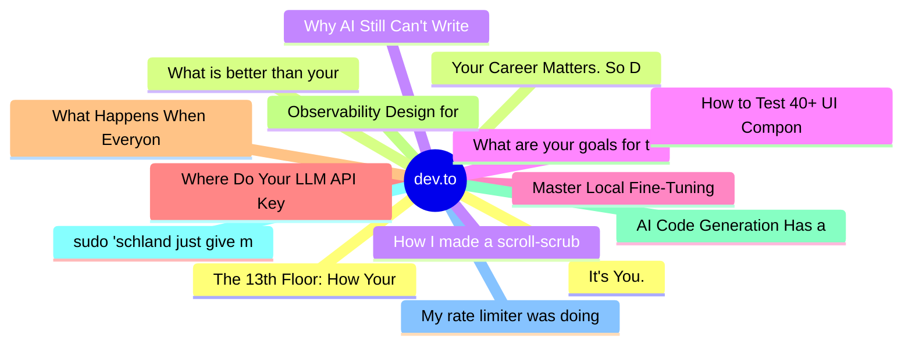

# dev.to Top 15 (2026-07-07)

## 思维导图

## 列表（15 条）

### 1. It's You.
- **链接**: [https://dev.to/francistrdev/its-you-29k0](https://dev.to/francistrdev/its-you-29k0)
- **作者**: FrancisTRᴅᴇᴠ (っ◔◡◔)っ | **阅读**: 6min
- **反应**: 51 | **评论**: 14
- **标签**: `discuss`, `community`, `productivity`, `mentalhealth`
- **简介**: To start off, I appreciate the community support I have received on the post about being behind.     ...

### 2. Your Career Matters. So Does the Person Building It.
- **链接**: [https://dev.to/hemapriya_kanagala/your-career-matters-so-does-the-person-building-it-2jle](https://dev.to/hemapriya_kanagala/your-career-matters-so-does-the-person-building-it-2jle)
- **作者**: Hemapriya Kanagala | **阅读**: 14min
- **反应**: 47 | **评论**: 14
- **标签**: `discuss`, `career`, `productivity`, `mentalhealth`
- **简介**: TL;DR  Tech has taught me many things over the years. It taught me how to learn new technologies,...

### 3. Why AI Still Can't Write Well and Which Half of That Problem Is Actually Yours
- **链接**: [https://dev.to/dannwaneri/why-ai-still-cant-write-well-and-which-half-of-that-problem-is-actually-yours-kh4](https://dev.to/dannwaneri/why-ai-still-cant-write-well-and-which-half-of-that-problem-is-actually-yours-kh4)
- **作者**: Daniel Nwaneri | **阅读**: 5min
- **反应**: 36 | **评论**: 19
- **标签**: `ai`, `discuss`, `machinelearning`, `writing`
- **简介**: I built a 36-pattern checklist to catch AI writing tells in my own drafts, calibrated against...

### 4. What are your goals for the week? #186
- **链接**: [https://dev.to/jarvisscript/what-are-your-goals-for-the-week-158-1clo](https://dev.to/jarvisscript/what-are-your-goals-for-the-week-158-1clo)
- **作者**: Chris Jarvis | **阅读**: 1min
- **反应**: 14 | **评论**: 12
- **标签**: `discuss`, `motivation`
- **简介**: After stumbling by on an old machine for too long I finally got a new Macbook. I am now on current...

### 5. Master Local Fine-Tuning with "gemma-trainer"
- **链接**: [https://dev.to/googleai/master-local-fine-tuning-with-gemma-trainer-3ipp](https://dev.to/googleai/master-local-fine-tuning-with-gemma-trainer-3ipp)
- **作者**: bebechien | **阅读**: 3min
- **反应**: 5 | **评论**: 0
- **标签**: `gemma`, `finetuning`, `ai`, `agents`
- **简介**: Take control of your AI models with our newest skill, designed to make local fine-tuning efficient.

### 6. Where Do Your LLM API Keys Actually Live?
- **链接**: [https://dev.to/hadil/where-do-your-llm-api-keys-actually-live-2cjm](https://dev.to/hadil/where-do-your-llm-api-keys-actually-live-2cjm)
- **作者**: Hadil Ben Abdallah | **阅读**: 13min
- **反应**: 34 | **评论**: 13
- **标签**: `ai`, `llm`, `api`, `python`
- **简介**: If someone compromised one of your project's dependencies today, would they be able to steal your...

### 7. What Happens When Everyone Can Build Apps But Nobody Understands Them?
- **链接**: [https://dev.to/gamya_m/what-happens-when-everyone-can-build-apps-but-nobody-understands-them-5aa6](https://dev.to/gamya_m/what-happens-when-everyone-can-build-apps-but-nobody-understands-them-5aa6)
- **作者**: Gamya  | **阅读**: 4min
- **反应**: 17 | **评论**: 1
- **标签**: `discuss`, `programming`, `developers`, `coding`
- **简介**: Alright, real talk moment. Last week I watched someone with zero coding background build a fully...

### 8. Observability Design for the AI Era — Application / Infrastructure / CI / LLM, Each in Its Own Shape (Part 1)
- **链接**: [https://dev.to/ryantsuji/observability-design-for-the-ai-era-application-infrastructure-ci-llm-each-in-its-own-56eg](https://dev.to/ryantsuji/observability-design-for-the-ai-era-application-infrastructure-ci-llm-each-in-its-own-56eg)
- **作者**: Ryosuke Tsuji | **阅读**: 10min
- **反应**: 13 | **评论**: 6
- **标签**: `ai`, `mcp`, `observability`, `typescript`
- **简介**: The previous code-graph series was about reshaping a static analysis graph so AI could query it. The same kind of reshaping is needed on the observability side. This post walks through four axes — app

### 9. AI Code Generation Has a Social Media Problem
- **链接**: [https://dev.to/pixel-wraith/ai-code-generation-has-a-social-media-problem-1fmk](https://dev.to/pixel-wraith/ai-code-generation-has-a-social-media-problem-1fmk)
- **作者**: Jake Lundberg | **阅读**: 5min
- **反应**: 0 | **评论**: 2
- **标签**: `ai`, `codereview`, `codequality`, `programming`
- **简介**: The morning I announced what I'd been building, a comment showed up on the post. It was friendly. It...

### 10. sudo 'schland just give me my data
- **链接**: [https://dev.to/sebs/sudo-schland-just-give-me-my-data-4ga7](https://dev.to/sebs/sudo-schland-just-give-me-my-data-4ga7)
- **作者**: Sebastian Schürmann | **阅读**: 7min
- **反应**: 0 | **评论**: 0
- **标签**: `opendata`, `ai`, `darkfactory`
- **简介**: There's an old xkcd. Guy says "make me a sandwich." Gets refused. Says "sudo make me a sandwich."...

### 11. My rate limiter was doing exactly what I told it to do. That was the problem.
- **链接**: [https://dev.to/manolito99/my-rate-limiter-was-doing-exactly-what-i-told-it-to-do-that-was-the-problem-463b](https://dev.to/manolito99/my-rate-limiter-was-doing-exactly-what-i-told-it-to-do-that-was-the-problem-463b)
- **作者**: Lolo | **阅读**: 3min
- **反应**: 16 | **评论**: 1
- **标签**: `node`, `api`, `backend`, `webdev`
- **简介**: I had a /image endpoint capped at 3 requests per minute. Simple express-rate-limit, keyed by IP,...

### 12. The 13th Floor: How Your Computer Really Works
- **链接**: [https://dev.to/surajrkhonde/the-13th-floor-how-your-computer-really-works-4e33](https://dev.to/surajrkhonde/the-13th-floor-how-your-computer-really-works-4e33)
- **作者**: surajrkhonde | **阅读**: 25min
- **反应**: 8 | **评论**: 0
- **标签**: `webdev`, `programming`, `productivity`, `software`
- **简介**: Nephew is a developer. He writes code every day, ships features, fixes bugs — but somewhere along the...

### 13. What is better than your AI loop?
- **链接**: [https://dev.to/peter_truchly_4fce0874fd5/what-is-better-than-your-ai-loop-456b](https://dev.to/peter_truchly_4fce0874fd5/what-is-better-than-your-ai-loop-456b)
- **作者**: Peter Truchly | **阅读**: 7min
- **反应**: 2 | **评论**: 0
- **标签**: `architecture`, `systemdesign`, `ai`, `softwareengineering`
- **简介**: A blackboard architecture, modernized with event sourcing, content-addressed knowledge source (KS)...

### 14. How I made a scroll-scrubbed video portfolio fast (Next.js 15 + GSAP + canvas)
- **链接**: [https://dev.to/pratham7711/how-i-made-a-scroll-scrubbed-video-portfolio-fast-nextjs-15-gsap-canvas-1mj6](https://dev.to/pratham7711/how-i-made-a-scroll-scrubbed-video-portfolio-fast-nextjs-15-gsap-canvas-1mj6)
- **作者**: Pratham Sharma | **阅读**: 3min
- **反应**: 10 | **评论**: 1
- **标签**: `webdev`, `nextjs`, `performance`, `javascript`
- **简介**: How do you ship a portfolio that plays 45 seconds of video, scrubbed by scroll, without shipping 12...

### 15. How to Test 40+ UI Components in Under a Minute: Speeding Up Screenshot Tests
- **链接**: [https://dev.to/aatrishin/how-to-test-40-ui-components-in-under-a-minute-speeding-up-screenshot-tests-35p8](https://dev.to/aatrishin/how-to-test-40-ui-components-in-under-a-minute-speeding-up-screenshot-tests-35p8)
- **作者**: Anton Trishin | **阅读**: 6min
- **反应**: 5 | **评论**: 2
- **标签**: `playwright`, `storybook`, `react`, `javascript`
- **简介**: Hey DEV! My name is Anton, and I am a frontend developer. Our team is responsible for the "Product...
