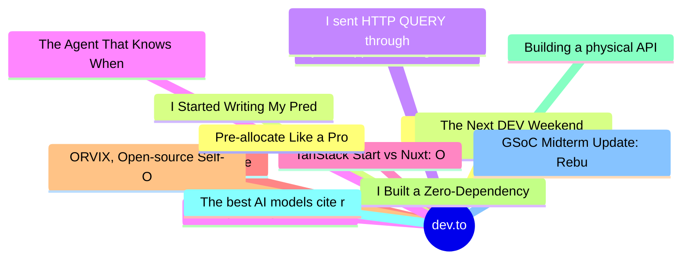

# dev.to Top 15 (2026-07-08)

## 思维导图

## 列表（15 条）

### 1. Top 7 Featured DEV Posts of the Week
- **链接**: [https://dev.to/devteam/top-7-featured-dev-posts-of-the-week-144b](https://dev.to/devteam/top-7-featured-dev-posts-of-the-week-144b)
- **作者**: Jess Lee | **阅读**: 3min
- **反应**: 45 | **评论**: 26
- **标签**: `top7`, `discuss`
- **简介**: Welcome to this week's Top 7, where the DEV editorial team handpicks their favorite posts from the...

### 2. The Next DEV Weekend Challenge Launches on July 9 - 13. Mark Your Calendar!
- **链接**: [https://dev.to/devteam/the-next-dev-weekend-challenge-launches-on-july-9-13-mark-your-calendar-2fcb](https://dev.to/devteam/the-next-dev-weekend-challenge-launches-on-july-9-13-mark-your-calendar-2fcb)
- **作者**: Jess Lee | **阅读**: 2min
- **反应**: 33 | **评论**: 4
- **标签**: `weekendchallenge`, `devchallenge`, `hackathon`, `programming`
- **简介**: We're back with another installment of the DEV Weekend Challenge!  If you missed the earlier...

### 3. you stopped reading the docs. now you don't understand the systems.
- **链接**: [https://dev.to/dannwaneri/you-stopped-reading-the-docs-now-you-dont-understand-the-systems-go1](https://dev.to/dannwaneri/you-stopped-reading-the-docs-now-you-dont-understand-the-systems-go1)
- **作者**: Daniel Nwaneri | **阅读**: 5min
- **反应**: 33 | **评论**: 39
- **标签**: `ai`, `beginners`, `productivity`, `career`
- **简介**: I didn't go to a university for computer science. I have a B.Tech in Geophysics.  What I know about...

### 4. Being an engineer in the AI era
- **链接**: [https://dev.to/ale3oula/being-an-engineer-in-the-ai-era-277p](https://dev.to/ale3oula/being-an-engineer-in-the-ai-era-277p)
- **作者**: Alexandra | **阅读**: 3min
- **反应**: 20 | **评论**: 9
- **标签**: `ai`, `discuss`, `productivity`, `softwareengineering`
- **简介**: I hesitated to write this.  Not because I don’t have an opinion about AI in software engineering, but...

### 5. TanStack Start vs Nuxt: One Framework to rule them all?
- **链接**: [https://dev.to/erikch/tanstack-vs-nuxt-one-framework-to-rule-them-all-4acl](https://dev.to/erikch/tanstack-vs-nuxt-one-framework-to-rule-them-all-4acl)
- **作者**: Erik Hanchett | **阅读**: 6min
- **反应**: 12 | **评论**: 3
- **标签**: `nuxt`, `tanstack`, `vue`, `react`
- **简介**: I love Nuxt and I really like TanStack Start. But which one is better? Or are they about the...

### 6. The AI Bill Grows in the Agent Loop
- **链接**: [https://dev.to/maximsaplin/the-ai-bill-grows-in-the-agent-loop-87n](https://dev.to/maximsaplin/the-ai-bill-grows-in-the-agent-loop-87n)
- **作者**: Maxim Saplin | **阅读**: 16min
- **反应**: 11 | **评论**: 2
- **标签**: `ai`, `agents`, `productivity`, `finops`
- **简介**: mcp2cli -&gt; Save 96–99% of the tokens wasted on tool schemas every turn; caveman -&gt; laude Code...

### 7. ORVIX, Open-source Self-Organizing AI Engineering Company
- **链接**: [https://dev.to/mirshah12/orvix-open-source-self-organizing-ai-engineering-company-4cd1](https://dev.to/mirshah12/orvix-open-source-self-organizing-ai-engineering-company-4cd1)
- **作者**: Mir Shah | **阅读**: 2min
- **反应**: 8 | **评论**: 3
- **标签**: `discuss`, `opensource`, `showdev`, `ai`
- **简介**: I Built an Open-Source AI Engineering Company Instead of Another AI Agent   For the past...

### 8. I Built a Zero-Dependency Env Validator with Full TypeScript Inference - Here's Why
- **链接**: [https://dev.to/gavincettolo/i-built-a-zero-dependency-env-validator-with-full-typescript-inference-heres-why-2f4n](https://dev.to/gavincettolo/i-built-a-zero-dependency-env-validator-with-full-typescript-inference-heres-why-2f4n)
- **作者**: Gavin Cettolo | **阅读**: 7min
- **反应**: 12 | **评论**: 3
- **标签**: `javascript`, `node`, `showdev`, `typescript`
- **简介**: Every Node.js project I've ever worked on has the same invisible vulnerability.  Somewhere in the...

### 9. Building a physical API
- **链接**: [https://dev.to/infoslack/building-a-physical-api-3488](https://dev.to/infoslack/building-a-physical-api-3488)
- **作者**: Daniel Romero | **阅读**: 10min
- **反应**: 11 | **评论**: 1
- **标签**: `robotics`, `ai`, `python`, `fastapi`
- **简介**: Now my journey on building a physical API for the robot. It goes through sentinel, a Rust daemon that listens to the CAN bus and turns the robot's own traffic into telemetry, the API and time series d

### 10. The best AI models cite retracted papers, and they cannot know it
- **链接**: [https://dev.to/mikeeus/the-best-ai-models-cite-retracted-papers-and-they-cannot-know-it-5acj](https://dev.to/mikeeus/the-best-ai-models-cite-retracted-papers-and-they-cannot-know-it-5acj)
- **作者**: Mikias Abera | **阅读**: 4min
- **反应**: 1 | **评论**: 0
- **标签**: `ai`, `machinelearning`, `opensource`, `science`
- **简介**: Frontier models confidently cite prominent papers that were retracted after their training cutoff, with no idea. I measured it: they flag the famous old retractions they learned, and miss the recent o

### 11. GSoC Midterm Update: Rebuilding BLT for a Cloudflare-First Future
- **链接**: [https://dev.to/mdkaifansari04/gsoc-midterm-update-rebuilding-blt-for-a-cloudflare-first-future-14h](https://dev.to/mdkaifansari04/gsoc-midterm-update-rebuilding-blt-for-a-cloudflare-first-future-14h)
- **作者**: Md Kaif Ansari | **阅读**: 4min
- **反应**: 15 | **评论**: 0
- **标签**: `software`
- **简介**: The first half of my GSoC work has been less about one single feature and more about a bigger...

### 12. Pre-allocate Like a Pro
- **链接**: [https://dev.to/ssukhpinder/day-2-pre-allocate-like-a-pro-121l](https://dev.to/ssukhpinder/day-2-pre-allocate-like-a-pro-121l)
- **作者**: Sukhpinder Singh | **阅读**: 2min
- **反应**: 7 | **评论**: 1
- **标签**: `dotnet`, `csharp`, `programming`, `webdev`
- **简介**: I’ve been playing with C# 15 quite a bit this week, and after yesterday’s post about the new with()...

### 13. I Started Writing My Prediction Before Reading the AI's Answer. Here's What Happened.
- **链接**: [https://dev.to/gamya_m/i-started-writing-my-prediction-before-reading-the-ais-answer-heres-what-happened-9c5](https://dev.to/gamya_m/i-started-writing-my-prediction-before-reading-the-ais-answer-heres-what-happened-9c5)
- **作者**: Gamya  | **阅读**: 4min
- **反应**: 6 | **评论**: 0
- **标签**: `discuss`, `ai`, `programming`
- **简介**: So a few days ago I was in a comment thread arguing about whether AI is quietly ruining junior...

### 14. I sent HTTP QUERY through the real internet. The smarter the layer, the harder it broke.
- **链接**: [https://dev.to/arvavit/i-sent-http-query-through-the-real-internet-the-smarter-the-layer-the-harder-it-broke-586b](https://dev.to/arvavit/i-sent-http-query-through-the-real-internet-the-smarter-the-layer-the-harder-it-broke-586b)
- **作者**: Vadym Arnaut | **阅读**: 7min
- **反应**: 3 | **评论**: 0
- **标签**: `webdev`, `http`, `security`, `backend`
- **简介**: TL;DR. HTTP got a new method in June: QUERY (RFC 10008), a GET that carries a body. Everyone wrote...

### 15. The Agent That Knows When Not to Act — Building NeuroScale Autopilot on Qwen Cloud
- **链接**: [https://dev.to/sodiqjimoh/the-agent-that-knows-when-not-to-act-building-neuroscale-autopilot-on-qwen-cloud-1lld](https://dev.to/sodiqjimoh/the-agent-that-knows-when-not-to-act-building-neuroscale-autopilot-on-qwen-cloud-1lld)
- **作者**: Sodiq Jimoh | **阅读**: 5min
- **反应**: 4 | **评论**: 5
- **标签**: `qwencloud`, `alibabacloud`, `kubernetes`, `aiagents`
- **简介**: Everyone building an autonomous agent right now is optimizing for the same thing: how fast can it...
