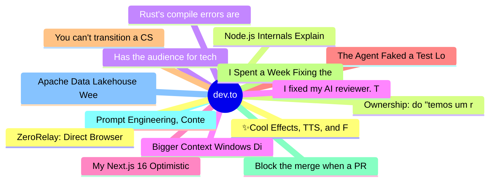

# dev.to Top 15 (2026-07-09)

## 思维导图

## 列表（15 条）

### 1. ✨Cool Effects, TTS, and Fun Animations (AI Avatar v15: VS Code and Chrome Extension)
- **链接**: [https://dev.to/webdeveloperhyper/cool-effects-tts-and-fun-animations-ai-avatar-v15-vs-code-and-chrome-extension-3oec](https://dev.to/webdeveloperhyper/cool-effects-tts-and-fun-animations-ai-avatar-v15-vs-code-and-chrome-extension-3oec)
- **作者**: Web Developer Hyper | **阅读**: 6min
- **反应**: 33 | **评论**: 8
- **标签**: `ai`, `webdev`, `discuss`, `productivity`
- **简介**: Intro   AI Avatar is a completely free app that lets your VRoid (VRM) 3D avatar animate in...

### 2. Ownership: do "temos um rojão na mão" até "não precisa mais pensar nisso"
- **链接**: [https://dev.to/he4rt/ownership-do-temos-um-rojao-na-mao-ate-nao-precisa-mais-pensar-nisso-3ki7](https://dev.to/he4rt/ownership-do-temos-um-rojao-na-mao-ate-nao-precisa-mais-pensar-nisso-3ki7)
- **作者**: Daniel Reis | **阅读**: 7min
- **反应**: 140 | **评论**: 3
- **标签**: `productivity`, `beginners`, `braziliandevs`, `career`
- **简介**: É aquele famoso "ou faz direito ou não faz" que todo dev deveria respeitar desde o inicio dos seus...

### 3. Has the audience for technical articles dropped?
- **链接**: [https://dev.to/dumebii/has-the-audience-for-technical-articles-dropped-5ceh](https://dev.to/dumebii/has-the-audience-for-technical-articles-dropped-5ceh)
- **作者**: Dumebi Okolo | **阅读**: 1min
- **反应**: 9 | **评论**: 4
- **标签**: `discuss`
- **简介**: Is it just me, or has anyone noticed that articles on dev.to don't get as many reads/views as they...

### 4. Bigger Context Windows Didn't Make Our RAG Smarter
- **链接**: [https://dev.to/valerykot/bigger-context-windows-didnt-make-our-rag-smarter-4d0l](https://dev.to/valerykot/bigger-context-windows-didnt-make-our-rag-smarter-4d0l)
- **作者**: ValeryKot | **阅读**: 2min
- **反应**: 13 | **评论**: 11
- **标签**: `ai`, `llm`, `machinelearning`, `rag`
- **简介**: We stopped measuring retrieval quality by how many tokens we could fit into the prompt.  When...

### 5. My Next.js 16 Optimistic UI Looked Perfect. Then Someone Clicked It Five Times Fast
- **链接**: [https://dev.to/shubhradev/my-nextjs-16-optimistic-ui-looked-perfect-then-someone-clicked-it-five-times-fast-b2c](https://dev.to/shubhradev/my-nextjs-16-optimistic-ui-looked-perfect-then-someone-clicked-it-five-times-fast-b2c)
- **作者**: Shubhra Pokhariya | **阅读**: 5min
- **反应**: 25 | **评论**: 6
- **标签**: `nextjs`, `webdev`, `javascript`, `react`
- **简介**: Everything worked. I'd wired up useOptimistic on a task list, the checkbox flipped the instant you...

### 6. The Agent Faked a Test Log, Then Believed It. Self-Editing Harnesses Have a Provenance Problem.
- **链接**: [https://dev.to/p0rt/the-agent-faked-a-test-log-then-believed-it-self-editing-harnesses-have-a-provenance-problem-3id6](https://dev.to/p0rt/the-agent-faked-a-test-log-then-believed-it-self-editing-harnesses-have-a-provenance-problem-3id6)
- **作者**: Sergei Parfenov | **阅读**: 12min
- **反应**: 16 | **评论**: 6
- **标签**: `ai`, `llm`, `agents`, `softwareengineering`
- **简介**: Reading Lilian Weng's harness engineering survey as a reliability engineer — what self-improving harness papers actually show, and the three invariants every working loop converges on.

### 7. You can't transition a CSS variable. @property says otherwise.
- **链接**: [https://dev.to/parsajiravand/you-cant-transition-a-css-variable-property-says-otherwise-50a0](https://dev.to/parsajiravand/you-cant-transition-a-css-variable-property-says-otherwise-50a0)
- **作者**: Parsa Jiravand | **阅读**: 4min
- **反应**: 17 | **评论**: 7
- **标签**: `css`, `webdev`, `frontend`, `javascript`
- **简介**: You've probably written something like this:    .button {   --hue: 220;   background: hsl(var(--hue)...

### 8. I Spent a Week Fixing the Wrong Skill (And Other Lessons from Evaluating an AI PR Reviewer)
- **链接**: [https://dev.to/tessl/i-spent-a-week-fixing-the-wrong-skill-and-other-lessons-from-evaluating-an-ai-pr-reviewer-54d8](https://dev.to/tessl/i-spent-a-week-fixing-the-wrong-skill-and-other-lessons-from-evaluating-an-ai-pr-reviewer-54d8)
- **作者**: Tessl | **阅读**: 7min
- **反应**: 13 | **评论**: 1
- **标签**: `ai`, `aiops`, `agents`, `agentskills`
- **简介**: TLDR      The baseline model (Claude Opus, no guidance) already catches ~65% of textbook...

### 9. Block the merge when a PR ships a vulnerability: a CI security gate with Synapse
- **链接**: [https://dev.to/aws-builders/block-the-merge-when-a-pr-ships-a-vulnerability-a-ci-security-gate-with-synapse-33bn](https://dev.to/aws-builders/block-the-merge-when-a-pr-ships-a-vulnerability-a-ci-security-gate-with-synapse-33bn)
- **作者**: Huỳnh Lê Nhất Nghĩa | **阅读**: 8min
- **反应**: 17 | **评论**: 0
- **标签**: `security`, `contributorswanted`, `go`, `opensource`
- **简介**: I have a simple rule when I work with a team: if a vulnerability makes it into main, the process...

### 10. Prompt Engineering, Context Engineering, Loop Engineering: What Actually Changed
- **链接**: [https://dev.to/reporails/prompt-engineering-context-engineering-loop-engineering-what-actually-changed-2357](https://dev.to/reporails/prompt-engineering-context-engineering-loop-engineering-what-actually-changed-2357)
- **作者**:  Gábor Mészáros | **阅读**: 8min
- **反应**: 3 | **评论**: 1
- **标签**: `ai`, `claude`, `agents`, `loopengineering`
- **简介**: A few years back the skill had one name: prompt engineering. You rewrote a sentence until the model...

### 11. Apache Data Lakehouse Weekly: July 1 to July 8, 2026
- **链接**: [https://dev.to/alexmercedcoder/apache-data-lakehouse-weekly-july-1-to-july-8-2026-3non](https://dev.to/alexmercedcoder/apache-data-lakehouse-weekly-july-1-to-july-8-2026-3non)
- **作者**: Alex Merced | **阅读**: 24min
- **反应**: 0 | **评论**: 0
- **标签**: `data`, `dataengineering`, `news`, `opensource`
- **简介**: The lakehouse community spent this week deciding how change itself should work. Apache Parquet opened...

### 12. ZeroRelay: Direct Browser-to-Browser Sharing - No Server Ever Sees Your Data
- **链接**: [https://dev.to/kushal1o1/zerorelay-direct-browser-to-browser-sharing-no-server-ever-sees-your-data-4bn3](https://dev.to/kushal1o1/zerorelay-direct-browser-to-browser-sharing-no-server-ever-sees-your-data-4bn3)
- **作者**: Kushal Baral | **阅读**: 3min
- **反应**: 12 | **评论**: 1
- **标签**: `webrtc`, `opensource`, `p2p`
- **简介**: A fully open-source P2P mesh app for sharing text, code, notes, and files directly between browsers....

### 13. Node.js Internals Explained by Uncle to Nephew — Part 1: Why Node Exists, Modules, and the JS You Never Knew
- **链接**: [https://dev.to/surajrkhonde/nodejs-internals-explained-by-uncle-to-nephew-part-1-why-node-exists-modules-and-the-js-you-2d8b](https://dev.to/surajrkhonde/nodejs-internals-explained-by-uncle-to-nephew-part-1-why-node-exists-modules-and-the-js-you-2d8b)
- **作者**: surajrkhonde | **阅读**: 10min
- **反应**: 6 | **评论**: 2
- **标签**: `backend`, `beginners`, `javascript`, `node`
- **简介**: This is Part 1 of a 3-part series where an uncle (30 years in backend systems, still uses a wired...

### 14. Rust's compile errors are other languages' production bugs
- **链接**: [https://dev.to/valentynkit/rusts-compile-errors-are-other-languages-production-bugs-32dm](https://dev.to/valentynkit/rusts-compile-errors-are-other-languages-production-bugs-32dm)
- **作者**: Valentyn Kit | **阅读**: 7min
- **反应**: 6 | **评论**: 0
- **标签**: `rust`, `programming`, `c`, `computerscience`
- **简介**: Four Rust compiler refusals, each traced to the silent bug it prevents in Python, JavaScript, or C. Plus the one place Rust stays quiet.

### 15. I fixed my AI reviewer. Then I kept solving the wrong problem
- **链接**: [https://dev.to/michaeltruong/i-fixed-my-ai-reviewer-then-i-kept-solving-the-wrong-problem-58am](https://dev.to/michaeltruong/i-fixed-my-ai-reviewer-then-i-kept-solving-the-wrong-problem-58am)
- **作者**: Michael Truong | **阅读**: 5min
- **反应**: 7 | **评论**: 10
- **标签**: `ai`, `workflow`, `agents`, `automation`
- **简介**: I've been building an AI-assisted editorial pipeline for technical writing. Notion cards become...
