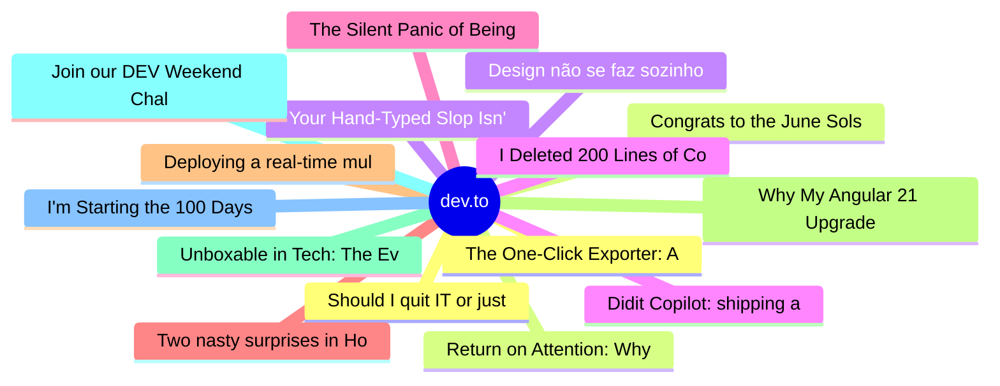

# dev.to Top 15 (2026-07-10)

## 思维导图

## 列表（15 条）

### 1. Should I quit IT or just live through the burnout?
- **链接**: [https://dev.to/klaudiagrz/should-i-quit-it-or-just-live-through-the-burnout-1gng](https://dev.to/klaudiagrz/should-i-quit-it-or-just-live-through-the-burnout-1gng)
- **作者**: Klaudia Grzondziel | **阅读**: 3min
- **反应**: 51 | **评论**: 23
- **标签**: `mentalhealth`, `career`, `productivity`, `discuss`
- **简介**: Some of you may have noticed I disappeared a bit from the community over the last couple of weeks....

### 2. Congrats to the June Solstice Game Jam Winners!
- **链接**: [https://dev.to/devteam/congrats-to-the-june-solstice-game-jam-winners-46c0](https://dev.to/devteam/congrats-to-the-june-solstice-game-jam-winners-46c0)
- **作者**: Jess Lee | **阅读**: 2min
- **反应**: 25 | **评论**: 6
- **标签**: `devchallenge`, `gamechallenge`, `gamedev`
- **简介**: We are so excited to announce the winners of the June Solstice Game Jam, our celebration of the...

### 3. Your Hand-Typed Slop Isn't Honest. It's Just Slower.
- **链接**: [https://dev.to/dannwaneri/your-hand-typed-slop-isnt-honest-its-just-slower-36ei](https://dev.to/dannwaneri/your-hand-typed-slop-isnt-honest-its-just-slower-36ei)
- **作者**: Daniel Nwaneri | **阅读**: 2min
- **反应**: 41 | **评论**: 36
- **标签**: `ai`, `watercooler`, `discuss`
- **简介**: A post on X last week:   "The fact that people can't even reply to posts without AI anymore says a...

### 4. I Deleted 200 Lines of Code I Didn't Write and Learned More Than When I Wrote It...
- **链接**: [https://dev.to/gamya_m/i-deleted-200-lines-of-code-i-didnt-write-and-learned-more-than-when-i-wrote-it-18dd](https://dev.to/gamya_m/i-deleted-200-lines-of-code-i-didnt-write-and-learned-more-than-when-i-wrote-it-18dd)
- **作者**: Gamya  | **阅读**: 5min
- **反应**: 32 | **评论**: 6
- **标签**: `devops`, `programming`, `ai`, `career`
- **简介**: Quick note before we dive in — I know I've been off track from the iOS/Swift series lately. I just...

### 5. The Silent Panic of Being Asked "Can You Just Quickly Fix This?"
- **链接**: [https://dev.to/_boweii/the-silent-panic-of-being-asked-can-you-just-quickly-fix-this-16no](https://dev.to/_boweii/the-silent-panic-of-being-asked-can-you-just-quickly-fix-this-16no)
- **作者**: Tombri Bowei | **阅读**: 3min
- **反应**: 13 | **评论**: 4
- **标签**: `watercooler`, `career`, `discuss`, `productivity`
- **简介**: There are four words in the English language that can instantly raise a developer's heart rate faster...

### 6. Two nasty surprises in Home Assistant's config
- **链接**: [https://dev.to/nfrankel/two-nasty-surprises-in-home-assistants-config-562e](https://dev.to/nfrankel/two-nasty-surprises-in-home-assistants-config-562e)
- **作者**: Nicolas Fränkel | **阅读**: 3min
- **反应**: 5 | **评论**: 0
- **标签**: `homeassistant`, `bug`, `locale`, `config`
- **简介**: Last year, I motorized the rolling shutters on the southern façade of my apartment. My idea was to...

### 7. Deploying a real-time multiplayer game on Railway
- **链接**: [https://dev.to/arjen_/deploying-a-real-time-multiplayer-game-on-railway-2d11](https://dev.to/arjen_/deploying-a-real-time-multiplayer-game-on-railway-2d11)
- **作者**: Arjen | **阅读**: 3min
- **反应**: 11 | **评论**: 2
- **标签**: `railway`, `node`, `websocket`, `webdev`
- **简介**: This post contains Railway referral links. If you sign up through one I get a bit of credit.     I...

### 8. Why My Angular 21 Upgrade Failed 👀
- **链接**: [https://dev.to/glnurltn/why-my-angular-21-upgrade-failed-mef](https://dev.to/glnurltn/why-my-angular-21-upgrade-failed-mef)
- **作者**: gulnur | **阅读**: 2min
- **反应**: 11 | **评论**: 11
- **标签**: `angular`, `upgrade`, `webdev`
- **简介**: I believe Angular upgrades have become much smoother these days. Most of the time, a simple ng...

### 9. Unboxable in Tech: The Evidence Locker
- **链接**: [https://dev.to/pascal_cescato_692b7a8a20/unboxable-in-tech-the-evidence-locker-20n4](https://dev.to/pascal_cescato_692b7a8a20/unboxable-in-tech-the-evidence-locker-20n4)
- **作者**: Pascal CESCATO | **阅读**: 9min
- **反应**: 24 | **评论**: 12
- **标签**: `career`, `discuss`, `webdev`, `showdev`
- **简介**: Eleven exhibits, last time. A career that kept refusing to fit inside a single box — trainer,...

### 10. Join our DEV Weekend Challenge: Passion Edition — $1,000 in Prizes Across FIVE Winners! Submissions Due July 13 at 6:59 AM UTC.
- **链接**: [https://dev.to/devteam/join-our-dev-weekend-challenge-passion-edition-1000-in-prizes-across-five-winners-submissions-10j5](https://dev.to/devteam/join-our-dev-weekend-challenge-passion-edition-1000-in-prizes-across-five-winners-submissions-10j5)
- **作者**: Jess Lee | **阅读**: 4min
- **反应**: 26 | **评论**: 1
- **标签**: `weekendchallenge`, `devchallenge`
- **简介**: Hello! We're kicking off another DEV Weekend Challenge, a short bite-sized challenge planned to fit...

### 11. I'm Starting the 100 Days of Cloud Challenge and I Don't Want to Do It Alone
- **链接**: [https://dev.to/itsaalaa7/im-starting-the-100-days-of-cloud-challenge-and-i-dont-want-to-do-it-alone-bkp](https://dev.to/itsaalaa7/im-starting-the-100-days-of-cloud-challenge-and-i-dont-want-to-do-it-alone-bkp)
- **作者**: Aalaa Fahiem  | **阅读**: 2min
- **反应**: 8 | **评论**: 1
- **标签**: `aws`, `cloud`, `beginners`, `career`
- **简介**: Let me be honest with you. I'm an Android engineer. Kotlin is my home. Jetpack Compose is where I...

### 12. The One-Click Exporter: AI Studio Antigravity, Probed to Its Limits
- **链接**: [https://dev.to/gde/the-one-click-exporter-ai-studio-antigravity-probed-to-its-limits-171e](https://dev.to/gde/the-one-click-exporter-ai-studio-antigravity-probed-to-its-limits-171e)
- **作者**: leslysandra | **阅读**: 5min
- **反应**: 1 | **评论**: 0
- **标签**: `agents`, `ai`, `agenticarchitect`, `googleantigravity`
- **简介**: What nobody tells you about exporting your multi-agent prototype to a local workspace.  Every...

### 13. Return on Attention: Why AI Code Reviews Are Wearing Us Out
- **链接**: [https://dev.to/cseeman/return-on-attention-why-ai-code-reviews-are-wearing-us-out-2hh0](https://dev.to/cseeman/return-on-attention-why-ai-code-reviews-are-wearing-us-out-2hh0)
- **作者**: christine | **阅读**: 5min
- **反应**: 3 | **评论**: 1
- **标签**: `ai`, `codereview`, `productivity`, `softwareengineering`
- **简介**: PR volume went up, ticket quality didn't, and the gap got filled with LLMs on both sides of the review: bots reviewing, bots replying, bots occasionally arguing with bots about priorities that only ex

### 14. Design não se faz sozinho: Friends of Figma mudou como eu vejo design
- **链接**: [https://dev.to/pddesign/design-nao-se-faz-sozinho-friends-of-figma-mudou-como-eu-vejo-design-4gn7](https://dev.to/pddesign/design-nao-se-faz-sozinho-friends-of-figma-mudou-como-eu-vejo-design-4gn7)
- **作者**: vitoriazzp | **阅读**: 3min
- **反应**: 27 | **评论**: 0
- **标签**: `career`, `ux`, `design`, `community`
- **简介**: Abertura   Eu sempre participei de comunidades de tecnologia: grupos de estudo do Google,...

### 15. Didit Copilot: shipping an AI agent that lives inside the app
- **链接**: [https://dev.to/aralroca/didit-copilot-shipping-an-ai-agent-that-lives-inside-the-app-51b2](https://dev.to/aralroca/didit-copilot-shipping-an-ai-agent-that-lives-inside-the-app-51b2)
- **作者**: Aral Roca | **阅读**: 6min
- **反应**: 0 | **评论**: 1
- **标签**: `ai`, `webdev`, `programming`, `productivity`
- **简介**: A few months ago I wrote that AI agents shouldn't control your apps; they should be the app. That...
