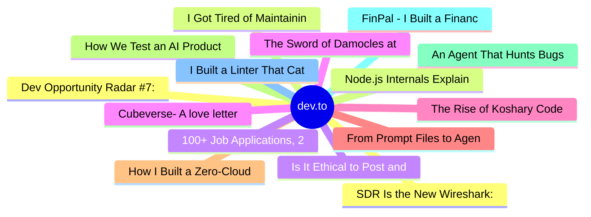

# dev.to Top 15 (2026-07-11)

## 思维导图

## 列表（15 条）

### 1. Dev Opportunity Radar #7: $1,000 Solo Grants, Free Claude Max for Open Source Contributors, and an MLH Hackathon
- **链接**: [https://dev.to/devengers/dev-opportunity-radar-7-1000-solo-grants-free-claude-max-for-open-source-contributors-and-an-3i12](https://dev.to/devengers/dev-opportunity-radar-7-1000-solo-grants-free-claude-max-for-open-source-contributors-and-an-3i12)
- **作者**: Hemapriya Kanagala | **阅读**: 9min
- **反应**: 43 | **评论**: 14
- **标签**: `discuss`, `community`, `opportunities`, `resources`
- **简介**: TL;DR  Welcome back to Dev Opportunity Radar.  This is a weekly series where I share opportunities,...

### 2. I Got Tired of Maintaining Frontend Code. So I Built a Declarative UI Runtime.
- **链接**: [https://dev.to/thuangf45/i-got-tired-of-maintaining-frontend-code-so-i-built-a-declarative-ui-runtime-5dbl](https://dev.to/thuangf45/i-got-tired-of-maintaining-frontend-code-so-i-built-a-declarative-ui-runtime-5dbl)
- **作者**: Thuangf45 | **阅读**: 16min
- **反应**: 50 | **评论**: 22
- **标签**: `javascript`, `webdev`, `showdev`, `architecture`
- **简介**: Here is a question that sounds simple until you've actually shipped a UI: how many files does it take...

### 3. Is It Ethical to Post and Ask About Circuits on Dev.to?
- **链接**: [https://dev.to/codebunny20/is-it-ethical-to-post-and-ask-about-circuits-on-devto-34fg](https://dev.to/codebunny20/is-it-ethical-to-post-and-ask-about-circuits-on-devto-34fg)
- **作者**: codebunny20 | **阅读**: 1min
- **反应**: 10 | **评论**: 3
- **标签**: `discuss`, `devpride`, `trans`, `help`
- **简介**: I’ve been thinking about sharing some electronic circuit posts on Dev.to — small circuits, DIY...

### 4. The Sword of Damocles at Work: The Human Cost of Delayed Layoffs
- **链接**: [https://dev.to/alvaromontoro/the-sword-of-damocles-at-work-the-human-cost-of-delayed-layoffs-2gon](https://dev.to/alvaromontoro/the-sword-of-damocles-at-work-the-human-cost-of-delayed-layoffs-2gon)
- **作者**: Alvaro Montoro | **阅读**: 3min
- **反应**: 5 | **评论**: 2
- **标签**: `career`, `leadership`, `news`, `watercooler`
- **简介**: Over a decade ago, my employer announced layoffs that would happen in waves. Every few months another round arrived. Nobody knew the criteria, who would be affected next, or when. The uncertainty was 

### 5. The Rise of Koshary Code
- **链接**: [https://dev.to/ismail9k/the-rise-of-koshary-code-4a89](https://dev.to/ismail9k/the-rise-of-koshary-code-4a89)
- **作者**: Abdelrahman Ismail | **阅读**: 5min
- **反应**: 3 | **评论**: 1
- **标签**: `ai`, `vibecoding`, `softwareengineering`
- **简介**: If you've ever visited Egypt, you've probably heard of Koshary.  It's one of the country's most...

### 6. From Prompt Files to Agent Skills: How I Unified My Content Automation
- **链接**: [https://dev.to/debs_obrien/from-prompt-files-to-agent-skills-how-i-unified-my-content-automation-3h9k](https://dev.to/debs_obrien/from-prompt-files-to-agent-skills-how-i-unified-my-content-automation-3h9k)
- **作者**: Debbie O'Brien | **阅读**: 7min
- **反应**: 3 | **评论**: 1
- **标签**: `ai`, `agents`, `skills`, `playwright`
- **简介**: A few weeks ago I wrote about how I use AI agents and MCP to automate my website's content. That post...

### 7. How I Built a Zero-Cloud AI Memory OS for Android 📱🧠
- **链接**: [https://dev.to/0xlawrence/how-i-built-a-zero-cloud-ai-memory-os-for-android-4c54](https://dev.to/0xlawrence/how-i-built-a-zero-cloud-ai-memory-os-for-android-4c54)
- **作者**: Ralph Pecayo | **阅读**: 3min
- **反应**: 0 | **评论**: 2
- **标签**: `ai`, `productivity`, `ocr`, `privacy`
- **简介**: We’ve all been there: you saw a link, a funny quote, or an important address on your screen a few...

### 8. How We Test an AI Product Without Burning Credit
- **链接**: [https://dev.to/debs_obrien/how-we-test-an-ai-product-without-burning-credit-4c5p](https://dev.to/debs_obrien/how-we-test-an-ai-product-without-burning-credit-4c5p)
- **作者**: Debbie O'Brien | **阅读**: 6min
- **反应**: 2 | **评论**: 0
- **标签**: `ai`, `testing`, `playwright`, `agents`
- **简介**: Most tests are cheap. You click a button, you assert something changed, you run it a thousand times...

### 9. An Agent That Hunts Bugs in My App While I Sleep
- **链接**: [https://dev.to/debs_obrien/an-agent-that-hunts-bugs-in-my-app-while-i-sleep-2fe0](https://dev.to/debs_obrien/an-agent-that-hunts-bugs-in-my-app-while-i-sleep-2fe0)
- **作者**: Debbie O'Brien | **阅读**: 5min
- **反应**: 1 | **评论**: 0
- **标签**: `ai`, `playwright`, `testing`, `agents`
- **简介**: I have a teammate who never sleeps, never gets bored, and spends every hour poking at our app trying...

### 10. FinPal - I Built a Finance App You Can Actually Ask Questions To
- **链接**: [https://dev.to/tejas164321/finpal-i-built-a-finance-app-you-can-actually-ask-questions-to-5dlb](https://dev.to/tejas164321/finpal-i-built-a-finance-app-you-can-actually-ask-questions-to-5dlb)
- **作者**: Tejas Patil | **阅读**: 4min
- **反应**: 16 | **评论**: 2
- **标签**: `devchallenge`, `weekendchallenge`
- **简介**: This is a submission for Weekend Challenge: Passion Edition           What I Built   India runs on...

### 11. I Built a Linter That Catches the Security Bugs AI Assistants Keep Writing
- **链接**: [https://dev.to/ri5hu/i-built-a-linter-that-catches-the-security-bugs-ai-assistants-keep-writing-58m8](https://dev.to/ri5hu/i-built-a-linter-that-catches-the-security-bugs-ai-assistants-keep-writing-58m8)
- **作者**: Rishu | **阅读**: 5min
- **反应**: 10 | **评论**: 4
- **标签**: `ai`, `opensource`, `security`, `programming`
- **简介**: I've been writing code with AI assistants for a while now. Copilot, Claude, ChatGPT — I've used them...

### 12. SDR Is the New Wireshark: Sniffing the Sub-GHz Spectrum from Your Desk
- **链接**: [https://dev.to/numbpill3d/sdr-is-the-new-wireshark-sniffing-the-sub-ghz-spectrum-from-your-desk-2bjm](https://dev.to/numbpill3d/sdr-is-the-new-wireshark-sniffing-the-sub-ghz-spectrum-from-your-desk-2bjm)
- **作者**: v. Splicer | **阅读**: 8min
- **反应**: 1 | **评论**: 0
- **标签**: `softwaredefinedradio`, `programming`, `tutorial`, `opensource`
- **简介**: The modern security engineer is effectively blind. We spend our lives staring into the comforting,...

### 13. Node.js Internals Explained by Uncle to Nephew — Part 4: Express Plumbing, Error Handling & The Full Roadmap
- **链接**: [https://dev.to/surajrkhonde/nodejs-internals-explained-by-uncle-to-nephew-part-4-express-plumbing-error-handling-the-4c3n](https://dev.to/surajrkhonde/nodejs-internals-explained-by-uncle-to-nephew-part-4-express-plumbing-error-handling-the-4c3n)
- **作者**: surajrkhonde | **阅读**: 9min
- **反应**: 9 | **评论**: 1
- **标签**: `node`, `javascript`, `express`, `webdev`
- **简介**: Bonus round. Parts 1–3 covered why Node exists, what's happening inside it, and the full request...

### 14. 100+ Job Applications, 2 Months, Zero Offers — Why I Started Riding an Uber Delivery Bike
- **链接**: [https://dev.to/kushang_tailor/100-job-applications-2-months-zero-offers-why-i-started-riding-an-uber-delivery-bike-h1a](https://dev.to/kushang_tailor/100-job-applications-2-months-zero-offers-why-i-started-riding-an-uber-delivery-bike-h1a)
- **作者**: Kushang Tailor | **阅读**: 9min
- **反应**: 2 | **评论**: 0
- **标签**: `career`, `wordpress`, `jobsearch`, `reallife`
- **简介**: Never break when your time is tough — just stay calm, stay active, and keep moving.              🎯...

### 15. Cubeverse- A love letter for the passion of cubing
- **链接**: [https://dev.to/adish_100/cubeverse-a-love-letter-for-the-passion-of-cubing-1j09](https://dev.to/adish_100/cubeverse-a-love-letter-for-the-passion-of-cubing-1j09)
- **作者**: Adrija Chowdhury | **阅读**: 4min
- **反应**: 9 | **评论**: 5
- **标签**: `devchallenge`, `weekendchallenge`
- **简介**: *This is a submission for Weekend Challenge: Passion Edition*           Cubeverse — A Digital...
